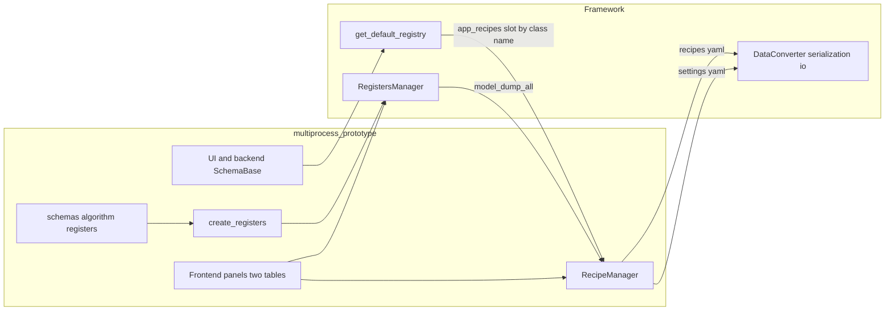

# Целевая архитектура: `recipes.yaml` / `settings_recipes.yaml`, `schemas/`, фреймворк

Документ фиксирует **решения по рефакторингу** прототипа [`Inspector_prototype/multiprocess_prototype/`](../Inspector_prototype/multiprocess_prototype/) после согласования с модулями фреймворка. Дополняет [recipe_manager_architecture.md](recipe_manager_architecture.md) (двойные рецепты, ADR-080).

---

## 0. Два файла YAML: один принцип (слоты), разные данные и таблицы

Механизм один и тот же: **версия**, **индекс текущего слота**, **словарь слотов → снимок**. Но **файлы и домены разделены** — в UI это **две независимые таблицы**.

| Файл | Секция слотов | Что хранится | Модели (источник истины) | Рантайм | Таблица в UI |
|------|----------------|--------------|---------------------------|---------|----------------|
| **`recipes.yaml`** | `register_recipes` | Снимки **`RegistersManager`** (`model_dump_all`) — камера, пайплайн, процессор и т.д. | [`multiprocess_prototype/schemas/`](../Inspector_prototype/multiprocess_prototype/schemas/) — классы регистров алгоритма (`SchemaBase`) | [`RegistersManager`](../Inspector_prototype/multiprocess_framework/modules/registers_module/manager.py) на процессе | Параметры / регистры |
| **`settings_recipes.yaml`** | `app_recipes` | Снимки **приложения**: прежде всего **UI-конфиги** (`SchemaBase`); при необходимости — **фрагменты конфигов бэкенда**, тоже оформленные как `SchemaBase` и лежащие в том же агрегате по имени класса | Отдельные классы из `frontend/.../schemas.py` и/или общие схемы в `schemas/`, зарегистрированные в реестре для слота | Не внутри `RegistersManager` (агрегат dict имя схемы → поля) | Настройки / приложение (и при необходимости отдельные строки для backend-ориентированных схем) |

**Инвариант:** не смешивать в одном файле два домена; не подменять таблицу «регистры» таблицей «приложение» — только общий UX паттерн (слот, загрузить/сохранить).

Фабрика **`create_registers()`** (пакет `registers` или аналог) собирает экземпляры **только** из доменных классов, описанных под **`multiprocess_prototype/schemas/`** для алгоритма.

---

## 1. Структура пакетов: `schemas/` (регистры алгоритма) и фабрика `registers`

**Решение:** **канонические модели регистров алгоритма** (камера, пайплайн, процессинг, …) живут в **[`multiprocess_prototype/schemas/`](../Inspector_prototype/multiprocess_prototype/schemas/)**. Отдельный пакет **`registers/`** при необходимости содержит только **фабрику** `create_registers`, карту имён, привязку к командной маршрутизации — **не** дублирует те же классы.

**Связь с `RegistersManager`:**

- `create_registers()` создаёт **`{имя_регистра: экземпляр}`**, типы — из **`multiprocess_prototype/schemas/`**.
- Слот в **`recipes.yaml`** — только **`model_dump_all()` / `model_validate_all()`** по этим экземплярам.

**Принцип:** один контур данных для алгоритма (`schemas/` + `RegistersManager` + `recipes.yaml`); второй контур — UI/backend-ориентированные `SchemaBase` в **`settings_recipes.yaml`**, тот же паттерн слотов, **другие** классы и **другая** таблица.

---

## 2. Один механизм преобразования данных (YAML / JSON / dict)

### 2.1 Опорный слой: `data_schema_module`

Все переходы **файл ↔ dict ↔ модели** для рецептов и регистров должны опираться на **один** набор API:

| Задача | API (фреймворк) |
|--------|-----------------|
| Dict / JSON / YAML строки | [`DataConverter`](Inspector_prototype/multiprocess_framework/modules/data_schema_module/serialization/converter.py), `FormatType` |
| Снимки регистров (вложенный dict) | [`registers_to_yaml` / `registers_from_yaml`](Inspector_prototype/multiprocess_framework/modules/data_schema_module/serialization/io.py), при необходимости `registers_to_dict` / `registers_from_dict` |
| Плоский вид (legacy / Excel) | `registers_to_flat_dict` / `registers_from_flat_dict` — только если реально нужен |
| Реестр классов по имени | `register_schema`, `get_default_registry()`, опционально **автодискавери** (ниже) |
| Контейнер с save/load на диск | `RegistersContainer` + `FileStorage` — если унифицируем «один процесс — один файл»; для **многослотовых рецептов** может быть избыточен, но **тот же** `DataConverter` / `io` для записи секций |

**Запрещено:** дублировать `yaml.safe_load` / `yaml.dump` в прототипе без обёртки в `DataConverter` или функций из `serialization/io`.

### 2.2 Роль `config_module`

Контракт [`IConfig`](Inspector_prototype/multiprocess_framework/modules/config_module/interfaces.py) **намеренно** не включает `load`/`save` файлов — работа с файлами **делегируется** конвертеру данных (`DataConverter`).

- **`config_module`** использовать для **runtime-конфигурации** (дерево параметров, `ConfigManager`, подписки), а также [`ConfigSchemaAdapter`](Inspector_prototype/multiprocess_framework/modules/config_module/adapters/schema_adapter.py), когда нужно представить `SchemaBase` как дерево параметров.
- **Персистенция файлов рецептов** — не «второй парсер YAML» в `RecipeManager`, а вызовы из **`data_schema_module`** (см. §3).

Так достигается **одна точка правды** для сериализации: `data_schema_module`; `config_module` — для структурированного runtime-конфига и адаптации схем к UI параметров, а не для дублирования YAML.

### 2.3 Роль `registers_module`

- [`RegistersManager`](Inspector_prototype/multiprocess_framework/modules/registers_module/manager.py) остаётся **единственным** хранилищем экземпляров регистров в процессе.
- Протокол [`IRegistersConverter`](Inspector_prototype/multiprocess_framework/modules/registers_module/interfaces.py) описывает dict/flat; **реализация** должна сводиться к использованию **`serialization/io`** (или тонкой обёртке), без копирования логики.

Миграции **legacy-снимков** по-прежнему остаются **на границе приложения** (докстринг менеджера), но реализуются **одним** модулем (например `registers/migrate.py`), без размазанных `_apply_*` по всему коду.

---

## 3. Менеджер рецептов и снимки

Один код ([`RecipeManager`](../Inspector_prototype/multiprocess_prototype/managers/recipe_manager.py)) обслуживает **оба** файла из §0; различаются только секции и семантика слота.

**Решение:**

- **`recipes.yaml` / `register_recipes`** — снимки **`RegistersManager`** (ADR-080); загрузка слота = `model_validate_all` по моделям из **`multiprocess_prototype/schemas/`**.
- **`settings_recipes.yaml` / `app_recipes`** — dict **имя класса `SchemaBase` → поля** для UI и при необходимости бэкенда; восстановление через реестр (`model_validate` по имени); **не** проходит через `RegistersManager`.

**Связь с `config_module`:** если нужен «единый» UX с остальным конфигом, **метаданные** (пути, `current_*`) могут жить в `FrontendConfig` / `IConfig`, но **запись тел слотов** — через **`DataConverter`** и единый формат файла (один YAML с секциями или два файла — как в [recipe_manager_architecture.md](recipe_manager_architecture.md), §5). Не смешивать: «RecipeManager сам пишет YAML руками» и «ConfigManager пишет тот же файл другим кодом».

**Цель:** один класс **`RecipeManager`** (или переименованный **`RecipeSnapshotStore`**) в прототипе/или вынесенный во фреймворк позже — с **внутренним** использованием только `data_schema_module` для чтения/записи файлов и валидации структуры верхнего уровня (version, keys).

**Про размещение во фреймворке:** если несколько приложений повторят тот же сценарий «слоты + два вида снимков», имеет смысл вынести **обобщённый** слой в `registers_module` или отдельный небольшой модуль рядом с `data_schema_module`, **после** стабилизации формата в прототипе. До этого — прототип + строгое использование API фреймворка без дублирования IO.

---

## 4. Автоматический список схем (без ручного перечисления)

**Решение:** убрать паттерн «две схемы захардкожены в `app_recipe_aggregate`».

Использовать возможности `data_schema_module`:

- **`register_package_schemas` / `discover_registers_from_package`** для пакета, где лежат **app-схемы** (например подпакет `registers/schemas/app/` или маркер в метаданных класса).
- Или единый список **`REGISTER_MODELS` / `APP_RECIPE_SCHEMA_CLASSES`** в **одном** модуле-реестре прототипа, заполняемый декораторами `register_schema` при импорте пакета.

**Итог:** агрегат app-рецепта строится **итерацией по реестру**, без отдельных функций `build_default_app_aggregate` с ручным перечислением классов — только если останется минимальный bootstrap-импорт пакета для side-effect регистрации.

---

## 5. Координаторы — убрать

**Решение:** каталог [`frontend/coordinators/`](Inspector_prototype/multiprocess_prototype/frontend/coordinators/) ликвидировать как отдельный слой.

- Логику **`logical_cameras`** перенести ближе к потребителю: модуль рядом с вкладкой ROI/постобработки, или **private-методы** презентера / фабрики вкладок, с импортами из **`multiprocess_prototype/schemas`** (мост pipeline), без отдельного «координатора».
- Чистые функции вроде **`parse_clamped_recipe_slot_text`** — либо **локальные** в виджете панели рецептов, либо один небольшой **`recipe_ui_utils.py`** без статуса «архитектурного слоя».

---

## 6. Документация

Обновить после реализации контуров:

- [`docs/RECIPES_SYSTEM.md`](../Inspector_prototype/multiprocess_prototype/docs/RECIPES_SYSTEM.md), [`docs/ARCHITECTURE.md`](../Inspector_prototype/multiprocess_prototype/docs/ARCHITECTURE.md), [`docs/SCHEMA_REGISTERS_UI_INIT.md`](../Inspector_prototype/multiprocess_prototype/docs/SCHEMA_REGISTERS_UI_INIT.md) — явно: `recipes.yaml` ↔ `schemas/` + регистры; `settings_recipes.yaml` ↔ UI/бэкенд `SchemaBase`; отсутствие `coordinators/`; единый IO через `data_schema_module`.
- [`DECISIONS.md`](../Inspector_prototype/multiprocess_framework/DECISIONS.md) — ADR: структура пакета, отказ от дублирования YAML, автoreестр app-схем.

---

## 7. Сводная диаграмма целевого потока

---

## 8. Порядок работ (кратко)

1. Зафиксировать **[`schemas/`](../Inspector_prototype/multiprocess_prototype/schemas/)** как источник классов для **`RegistersManager`**; восстановить/упростить пакет **`registers/`** (фабрика, карта имён) без дублирования моделей.
2. Явно перечислить классы, попадающие в **`settings_recipes`** (UI + опционально бэкенд), и подключить **реестр** для автосписка.
3. Переписать **`RecipeManager`** на **`DataConverter` / `serialization/io`**; убрать legacy-форматы YAML.
4. Обновить **две таблицы** в UI под два файла и два домена.
5. Удалить **`coordinators/`**, перенести код.
6. Обновить **документацию** и **`scripts/validate.py`**.

---

*Этот файл — целевая архитектура по согласованию от 2026-03-27; детали кода фиксируются в PR и `DECISIONS.md`.*
