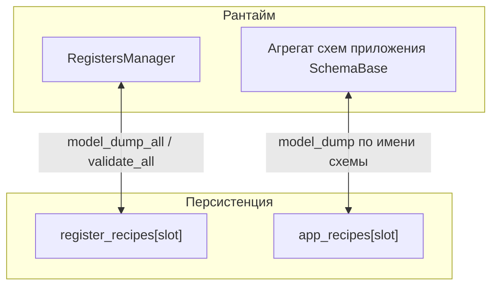

# План: двойные рецепты (регистры + приложение), архитектура и этапы внедрения

Документ объединяет целевую архитектуру, опору на модули фреймворка и **пошаговое выполнение** без привязки к конкретной дате релиза. Согласован с **ADR-080** (снимок регистров = `model_dump_all`) и правилами **Dict at Boundary**.

---

## 1. Цели и границы

**Цели**

- Две **независимые** линии рецептов: **параметры алгоритма (регистры)** и **настройки приложения / UI / при необходимости фрагменты бэкенд-конфига**, оформленные как `SchemaBase`.
- В UI — **две таблицы**, в каждой — полноценные **слоты рецептов** (загрузить / сохранить / текущий слот), без смешения доменов в одной таблице.
- Один **источник истины для регистров** в рантайме — **`RegistersManager`**; файлы — только снимки.
- Гибкие **уровни доступа** + отдельный **личный режим** (обход `readonly` / показ `hidden`) без поломки ролей на производстве.
- По возможности использовать **готовые** `data_schema_module.serialization.io` и `DataConverter`, не дублировать YAML/плоский формат.

**Вне скоупа (пока)**

- Excel как единственный источник истины (только опциональный экспорт/импорт).
- Полная автоматическая миграция legacy без явного маппинга имён.

---

## 2. Архитектура (кратко)



- **Таблица «Параметры»** читает/пишет через мост к **`RegistersManager`**; слот = снимок `model_dump_all()`.
- **Таблица «Приложение»** читает/пишет **агрегат схем** (словарь имя схемы → dict полей); источник истины — текущие объекты конфигурации фронта (или отдельный holder), не регистры процесса.

---

## 3. Единый реестр регистров

| Понятие | Смысл |
|--------|--------|
| Единый реестр | Один экземпляр **`RegistersManager`** на процесс/контекст: все регистры алгоритма в одном месте. |
| Рецепт параметров | **Копия состояния** `model_dump_all()`, не отдельная модель полей. |
| Уже есть в коде | [`RecipeManager`](Inspector_prototype/multiprocess_prototype/managers/recipe_manager.py), ADR-080. |

---

## 4. Два вида рецептов и две таблицы

| Таблица | Содержимое строк | Слот рецепта хранит | Рантайм |
|--------|------------------|---------------------|---------|
| **1. Регистры (параметры)** | Поля регистров (камера, обработка, …) | Вложенный dict как `model_dump_all()` | `RegistersManager` |
| **2. Приложение (UI / конфиги)** | Поля зарегистрированных схем приложения | `{ "RecipesTabConfig": {...}, "ProcessingTabUiConfig": {...}, ... }` | Агрегат `SchemaBase`, **не** внутри `RegistersManager` |

У каждой линии — **свой** индекс текущего слота (`current_register_recipe`, `current_app_recipe`). Опционально позже: синхронизировать номера слотов (сорт N ↔ пресет UI N) — отдельное продуктовое решение.

---

## 5. Формат файла (один YAML или два файла)

**Рекомендация:** один YAML, две верхнеуровневые секции (проще бэкап и диффы):

```yaml
version: 1
current_register_recipe: 0
current_app_recipe: 0
register_recipes:
  "0": { ... model_dump_all ... }
app_recipes:
  "0":
    RecipesTabConfig: { ... }
    ProcessingTabUiConfig: { ... }
```

Альтернатива — два файла, если нужно разграничить права на уровне ОС.

---

## 6. Готовые модули конвертации (не изобретать заново)

| Задача | Модуль / API |
|--------|----------------|
| Вложенный снимок регистров, JSON/YAML строки | [`data_schema_module/serialization/io.py`](Inspector_prototype/multiprocess_framework/refactored/modules/data_schema_module/serialization/io.py): `registers_to_dict`, `registers_to_yaml`, … |
| Плоский вид `register.field → value` | Там же: `registers_to_flat_dict`, `registers_from_flat_dict` (legacy, Excel) |
| Pydantic-модели ↔ файлы | `DataConverter` из `data_schema_module` |
| Контракт конвертера | [`IRegistersConverter`](Inspector_prototype/multiprocess_framework/refactored/modules/registers_module/interfaces.py) — реализация по сути в функциях `serialization/io`, а не обязательно отдельный класс |

Вложенный формат для рецептов регистров — **по умолчанию** (ADR-080). Плоский — только там, где нужна совместимость или экспорт.

---

## 7. Доступ: роли и личный режим

- Обычные пользователи: **`access_level`** сессии vs **`FieldMeta.access_level`**, плюс **`readonly`** / **`hidden`**.
- Важно: [`FieldMeta.can_modify`](Inspector_prototype/multiprocess_framework/refactored/modules/data_schema_module/core/field_meta.py) сейчас требует `not self.readonly` — **высокий числовой уровень не открывает `readonly`**.
- **Личный / dev-режим:** отдельный контекст, например **`AccessContext`**: `level`, **`bypass_readonly`**, опционально **`show_hidden`**. Редактируемость и запись согласовать с этим флагом (только доверенная локальная сессия).

---

## 8. Документация решений

После утверждения формата файла и границ менеджеров — запись **ADR** в [`DECISIONS.md`](Inspector_prototype/multiprocess_framework/refactored/DECISIONS.md): `app_recipes`, два `current_*`, политика доступа, связь с ADR-080.

---

## 9. Этапы выполнения

### Этап A — Спецификация и контракт данных (без UI)

1. Зафиксировать точную структуру YAML (`version`, ключи слотов, имена секций).
2. Список схем, входящих в **`app_recipes`** (минимум: `RecipesTabConfig`, `ProcessingTabUiConfig`, … — по мере готовности).
3. Описать, где в приложении живёт **агрегат** app-схем применения слота (один объект-holder vs частичное обновление `FrontendConfig`).

**Критерий готовности:** можно вручную собрать валидный YAML и описать, как он мапится на объекты.

---

### Этап B — Хранилище рецептов приложения

1. Ввести **`AppRecipeStore`** (или расширить существующий файл-менеджер): загрузка/сохранение секции `app_recipes`, слоты, `current_app_recipe`.
2. Сериализация через **`DataConverter`** / `model_validate` по имени схемы из реестра (`register_schema`).
3. Согласовать путь к файлу с [`FrontendConfig.recipes_path`](Inspector_prototype/multiprocess_prototype/frontend/configs/frontend_config.py) или отдельным ключом `app_recipes_path` / объединённый путь (решение на этапе A).

**Критерий:** unit-тесты round-trip для одного-двух слотов app-рецепта.

---

### Этап C — Регистровые рецепты (выравнивание с фреймворком)

1. Оставить семантику ADR-080 для **`register_recipes`**.
2. Опционально: внутри [`RecipeManager`](Inspector_prototype/multiprocess_prototype/managers/recipe_manager.py) использовать `registers_to_yaml` / чтение из `serialization/io` для единообразия (без смены формата на диске).

**Критерий:** регрессия существующих сценариев вкладки рецептов регистров.

---

### Этап D — UI: две таблицы, два набора слотов

1. Разделить вкладку «Рецепты» на **две таблицы** (или подвкладки): параметры регистров / приложение.
2. Для регистров: [`build_recipe_rows`](Inspector_prototype/multiprocess_prototype/frontend/widgets/tabs_setting/recipes_tab/recipe_rows.py) + учёт **`AccessContext`** и `can_modify_field` / обход для dev.
3. Для приложения: **`build_app_recipe_rows`** (обход списка схем агрегата, те же колонки по возможности).
4. Кнопки слота: загрузить / сохранить / по умолчанию — **независимо** для каждой линии (или связка слотов — если принято на этапе A).

**Критерий:** ручной сценарий «сохранить слот → перезапуск / смена слота → значения восстановились» для обоих доменов.

---

### Этап E — Доступ и личный режим

1. Ввести **`AccessContext`** (или прокинуть флаги из конфига запуска только для dev).
2. В строках таблиц выставлять **`_value_editable`** с учётом `bypass_readonly` / `show_hidden`.
3. При записи в регистр — не обходить **`validate_field_value`** без необходимости; для dev — явная ветка.

**Критерий:** под обычным уровнем `readonly` закрыт; с `bypass_readonly` — открыт.

---

### Этап F — Legacy и экспорт (опционально)

1. Миграция / импорт плоского [`value_settings.yaml`](Inspector_prototype/App/Data/Recipes/value_settings.yaml): маппинг ключей → `registers_from_flat_dict` или ручная таблица.
2. Экспорт в Excel из плоского представления регистров.

---

### Этап G — Закрытие

1. Запись **ADR** в `DECISIONS.md`, при необходимости обновить **STATUS.md** затронутых модулей.
2. Запуск **`python scripts/validate.py`** из корня проекта (по правилам репозитория).

---

## 10. Риски и смягчение

| Риск | Смягчение |
|------|-----------|
| Расхождение имён полей legacy и регистров | Явный маппинг, отдельный скрипт импорта |
| Два `current_*` путают оператора | Подписи в UI, опционально синхронизация слотов позже |
| Обход `readonly` на проде | Включать `bypass_readonly` только из защищённого конфига / сборки |

---

## 11. Краткий чеклист «сделано / не сделано»

- [ ] YAML-спека и список app-схем  
- [ ] `AppRecipeStore` + тесты  
- [ ] UI: две таблицы, два слота  
- [ ] `AccessContext` + редактируемость  
- [ ] ADR + `validate.py`  
- [ ] (Опц.) legacy import, Excel export  

---

*Этот файл — единая точка входа по теме «двойные рецепты»; детали реализации кода по мере внедрения дополняются в коде и в `DECISIONS.md`.*
