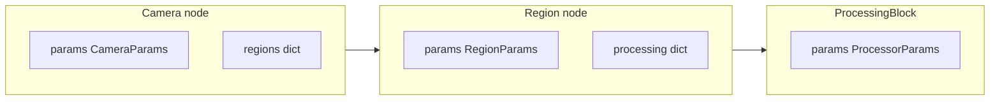

# План: пайплайн schemas_v2 — вложенность + схемы параметров на каждом уровне

## Цель

Иерархия **словарь камер → словарь регионов → словарь обработок**, причём **на каждом из трёх уровней** есть своя **схема параметров настройки** (Pydantic `SchemaBase` + при необходимости `FieldMeta` / routing), а не только у обработок.

Разделение смыслов:

- **Узлы дерева** (камера / регион / обработка) — структура и ссылки (`enabled`, вложенные `dict`, идентификаторы).
- **Параметры уровня** — отдельные модели полей настройки, расширяемые через **дискриминируемый union** по полю `type` (как у обработок), чтобы добавлять новые варианты без ломания старых конфигов.

Регистры «железа» камеры из [`schemas_v2/camera.py`](Inspector_prototype/multiprocess_prototype/registers/schemas_v2/camera.py) (`StandardCameraRegisters` и т.д.) остаются **отдельным** контрактом процесса `camera`; параметры **узла пайплайна** «логическая камера» описываются своей схемой (см. ниже), при необходимости можно позже связать по `camera_id` / ссылке, не смешивая модели в одном классе.

## Целевая форма моделей

| Уровень | Контейнер | Поля структуры | Параметры настройки |
|--------|-----------|----------------|---------------------|
| Корень | `PipelineConfig` | `cameras: Dict[str, Camera]` | — |
| Камера | `Camera` | `enabled`, `regions: Dict[str, Region]` | `params: CameraParams` (union по `type`) |
| Регион | `Region` | `rect`, флаги активности/UI, `processing: Dict[str, ProcessingBlock]` | `params: RegionParams` (union по `type`) |
| Обработка | `ProcessingBlock` | `enabled` | `params: ProcessorParams` (union по `type`) — уже заложено |

Геометрия ROI остаётся на `Region` (`rect` + при необходимости порядок/sort); **дополнительные** настройки региона (пороги, режимы, привязка к линии и т.д.) — в `RegionParams`, а не размазаны по произвольным полям без схемы.

## Реализация (файлы)

1. **`pipeline_camera.py`** — класс `Camera`: `enabled`, `regions`, `params: CameraParams` с default-фабрикой на один «базовый» вариант (например `StandardCameraParams` с `type: Literal["standard"]` и минимальным набором полей под UI/рецепт).

2. **`camera_params.py`** (рядом с pipeline или в подпакете `pipeline_config/`) — `CameraParams = Annotated[Union[StandardCameraParams, ...], Field(discriminator="type")]`, каждый вариант — `@register_schema` при необходимости экспорта в реестр.

3. **`region_params.py`** — аналогично `RegionParams` union; первый вариант — `StandardRegionParams` с `type: Literal["standard"]` (можно перенести часть «настроек ROI» из текущих голых полей `Region` в `params`, **или** оставить устойчивые поля (`rect`, `enabled`, …) на `Region`, а в `RegionParams` только расширяемые алгоритм-специфичные поля — зафиксировать один стиль в код-ревью).

4. **`processings/processing_params.py`** — дописать импорты, `BlobDetectionParams`, `ProcessorParams` union (как в v1 [`schemas/pipeline/processing_params.py`](Inspector_prototype/multiprocess_prototype/registers/schemas/pipeline/processing_params.py)).

5. **`region.py`** — добавить поле `params: RegionParams`; привести импорты `ProcessingBlock` к относительным; не ломать существующие ключи в JSON без миграции — для новых полей использовать default_factory.

6. **`pipeline.py`** — только `cameras`; опционально `model_validator` с `migrate_legacy_pipeline_root`.

7. **Миграция** — при появлении новых обязательных `params` на камере/регионе: в `migration.py` или validator подставлять дефолтные dict для старых сохранений.

8. **Тест** — round-trip nested dict с заполненными `params` на камере, регионе и обработке.

## Итог для формулировки «у всех своя схема»

- **Камера** — не только контейнер регионов, а **`Camera` + `CameraParams`**.
- **Регион** — не только `rect` + словарь обработок, а **`Region` + `RegionParams`**.
- **Обработка** — **`ProcessingBlock` + `ProcessorParams`** (уже по плану).

Так все три уровня симметричны с точки зрения расширяемых настроек через типизированные схемы.
