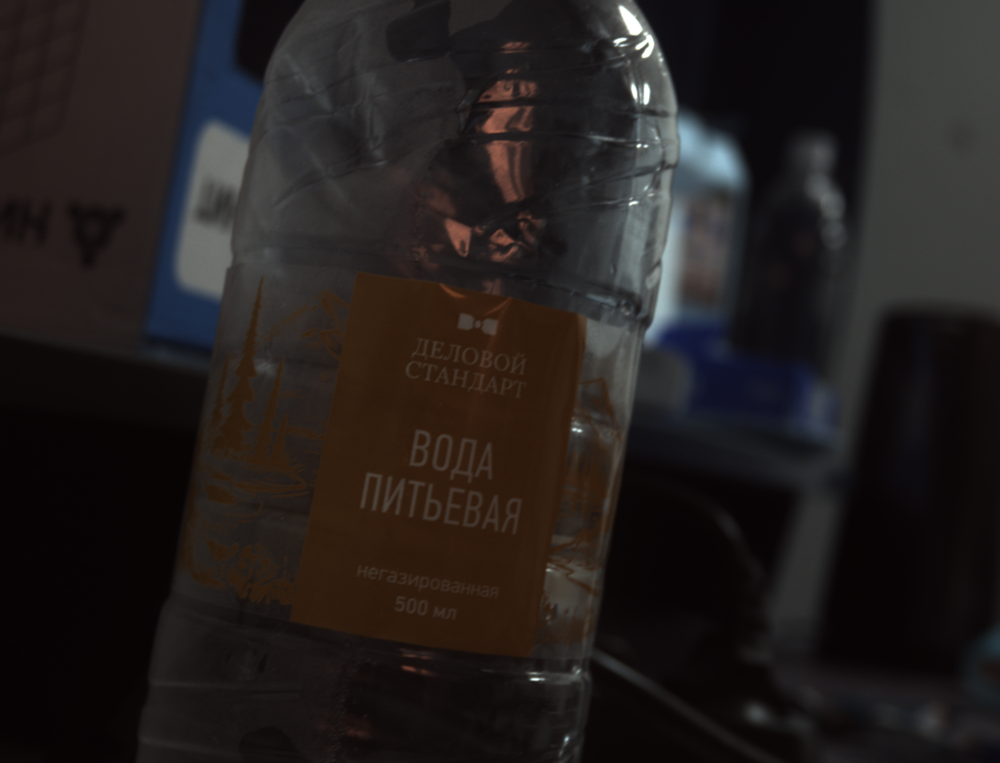
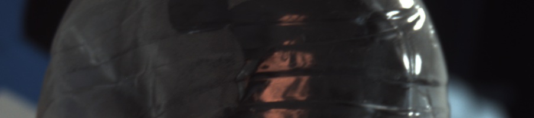
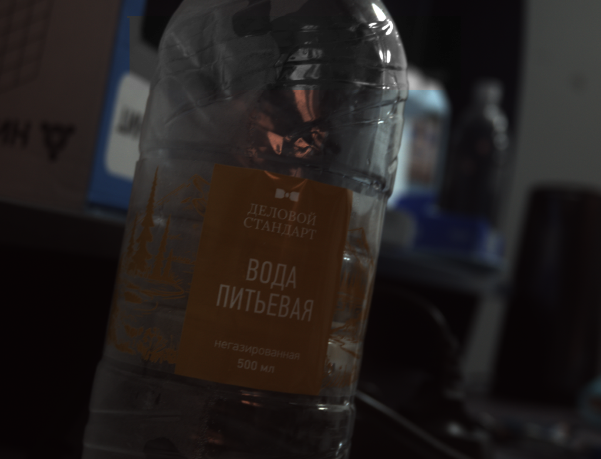
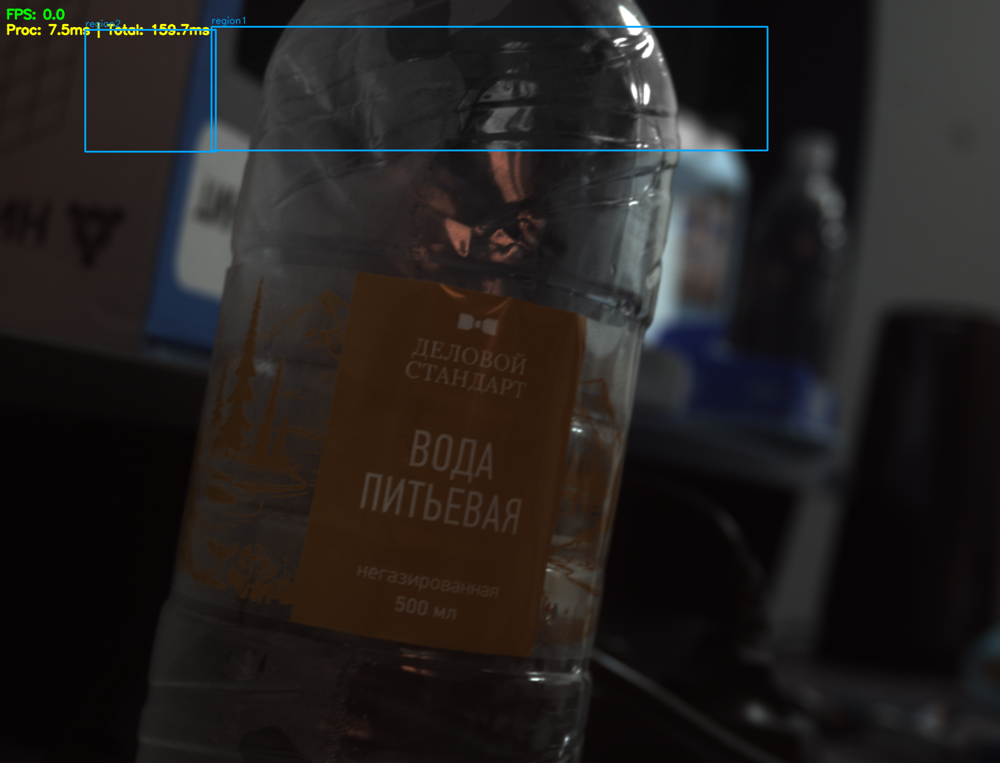

# Отчет обработки изображения

**Frame ID:** current_frame
**Дата создания:** 2026-02-17 12:08:46

## Этап 1: process_processing

**Время:** 12:08:41.914
**Описание:** Оригинальный кадр из камеры

### Метаданные
- **id_memory:** 0
- **frame_id:** 108
- **image_height:** 1240
- **image_width:** 1624
- **capture_time:** 1771319321.8340552

### Изображение
**Этап:** original

---

**Время:** 12:08:41.978
**Описание:** Обрезанный кадр

### Метаданные
- **crop_top:** 0
- **crop_bottom:** 1240
- **crop_left:** 0
- **crop_right:** 1624
- **cropped_size:** 1240x1624
- **enable_processing:** False

### Изображение
**Этап:** cropped

---

## Этап 2: process_region_processor_1

**Время:** 12:08:42.009
**Описание:** Вырезанный регион region1

### Метаданные
- **region_id:** region1
- **processor_id:** 1
- **region_coords:** `{'x1': 1246, 'y1': 43, 'x2': 343, 'y2': 244}`
- **region_size:** 201x903
- **enable_processing:** False

### Изображение
**Этап:** region_extracted

---

**Время:** 12:08:42.030
**Описание:** Обработанный регион region1

### Метаданные
- **region_id:** region1
- **processor_id:** 1
- **region_processor_type:** None
- **enable_processing:** False
- **show_mask:** False
- **processing_time:** 0.022446155548095703
- **region_memory_index:** 0

### Изображение
**Этап:** region_processed

---

## Этап 3: process_region_processor_2

**Время:** 12:08:42.004
**Описание:** Вырезанный регион region2

### Метаданные
- **region_id:** region2
- **processor_id:** 2
- **region_coords:** `{'x1': 138, 'y1': 48, 'x2': 350, 'y2': 246}`
- **region_size:** 198x212
- **enable_processing:** False

### Изображение
**Этап:** region_extracted

---

**Время:** 12:08:42.020
**Описание:** Обработанный регион region2

### Метаданные
- **region_id:** region2
- **processor_id:** 2
- **region_processor_type:** None
- **enable_processing:** False
- **show_mask:** False
- **processing_time:** 0.01590585708618164
- **region_memory_index:** 8

### Изображение
**Этап:** region_processed

---

## Этап 4: process_region_merger

**Время:** 12:08:42.044
**Описание:** Начало объединения 2 регионов

### Метаданные
- **regions_count:** 2
- **regions_info:** `[{'region_id': 'region2', 'processor_id': 2}, {'region_id': 'region1', 'processor_id': 1}]`

---

**Время:** 12:08:42.045
**Описание:** Вставлен регион region2

### Метаданные
- **region_id:** region2
- **processor_id:** 2
- **region_coords:** `{'x1': 138, 'y1': 48, 'x2': 350, 'y2': 246}`
- **region_size:** 198x212

---

**Время:** 12:08:42.046
**Описание:** Вставлен регион region1

### Метаданные
- **region_id:** region1
- **processor_id:** 1
- **region_coords:** `{'x1': 1246, 'y1': 43, 'x2': 343, 'y2': 244}`
- **region_size:** 201x903

---

**Время:** 12:08:42.127
**Описание:** Объединенный кадр со всеми регионами

### Метаданные
- **regions_count:** 2
- **total_processing_time:** 0.038352012634277344
- **merge_time:** 1771319322.0469482
- **total_time_from_capture:** 0.21289300918579102

### Изображение
**Этап:** merged

---

## Этап 5: process_overlay

**Время:** 12:08:42.090
**Описание:** Кадр до наложения overlay

### Метаданные
- **fps:** 0.0
- **processing_time_ms:** 7.527351379394531
- **total_time_ms:** 159.67822074890137
- **regions_count:** 2

### Изображение
**Этап:** before_overlay

---

**Время:** 12:08:42.174
**Описание:** Кадр после наложения overlay

### Метаданные
- **enable_overlay:** True
- **draw:** True
- **show_fps:** True
- **show_regions:** True
- **show_region_names:** True
- **fps:** 0.0
- **processing_time_ms:** 7.527351379394531
- **total_time_ms:** 159.67822074890137
- **regions_count:** 2
- **selected_region_idx:** -1

### Изображение
**Этап:** after_overlay

---
