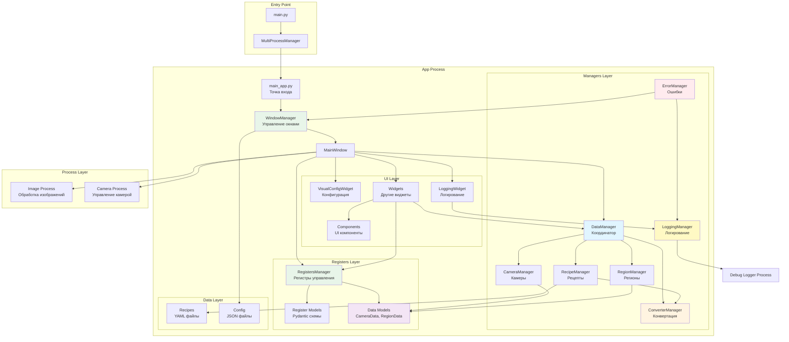
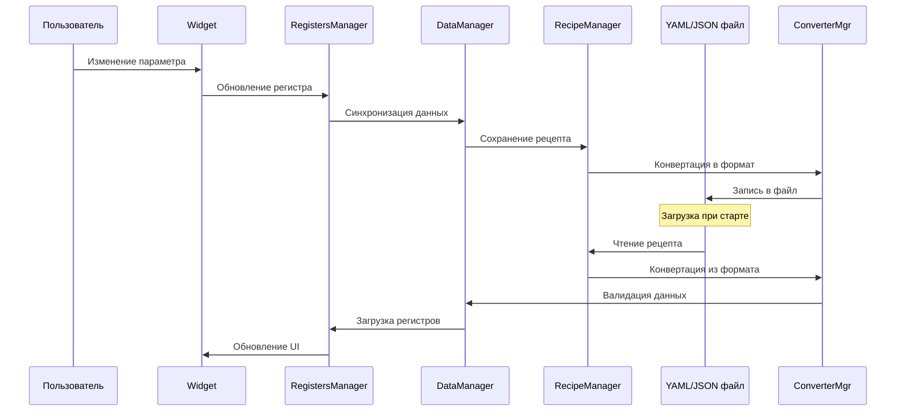

# Архитектура App Inspector

## Обзор

App Inspector - это PyQt5 приложение для инспекции бутылок с использованием компьютерного зрения. Приложение использует мультипроцессную архитектуру для обработки изображений и управления камерами.

## Структура проекта

```
Inspector_prototype/
├── App/                          # Основное приложение
│   ├── Components/              # Переиспользуемые компоненты UI
│   ├── Managers/                # Менеджеры (данные, логирование, ошибки, окна)
│   │   ├── data_manager.py      # Координатор данных
│   │   ├── logging_manager.py   # Логирование
│   │   ├── error_manager.py     # Обработка ошибок
│   │   └── window_manager.py    # Управление окнами
│   ├── Registers/               # Регистры управления (Pydantic модели)
│   ├── Widget/                  # Виджеты для различных функций
│   │   ├── Visual_config_widget/ # Конфигурация визуальных настроек
│   │   └── Logging_widget/       # Управление логированием
│   ├── Windows/                 # Окна приложения
│   ├── Threads/                 # Рабочие потоки
│   ├── Data/                    # Данные приложения (рецепты, конфиги, логи)
│   └── docs/                    # Документация
├── Multiproccesing/             # Мультипроцессная обработка
└── Services/                    # Сервисы (камеры Hikvision)
```

## Архитектурная диаграмма



## Поток данных



## Компоненты системы

### 1. Entry Point (`main.py`)

**Ответственность**: Точка входа приложения, запуск мультипроцессного менеджера.

**Ключевые классы**:
- `MultiProcessManager` - управление процессами

**Взаимодействие**:
- Запускает процессы App, Image Processing, Camera
- Управляет жизненным циклом процессов

---

### 2. App Process

#### 2.1 Entry Point (`App/main_app.py`)

**Ответственность**: Точка входа для процесса App. Создаёт и запускает приложение.

**Ключевые функции**:
- `create_app()` - создание и запуск приложения через WindowManager

---

#### 2.2 WindowManager (`App/Managers/window_manager.py`)

**Ответственность**: Управление всеми окнами приложения.

**Ключевые методы**:
- `create_all_windows()` - создание всех окон (MainWindow, LoadingWindow, NeurounWindow)
- `create_thread()` - создание рабочих потоков
- `set_fullscreen()` - управление режимом fullscreen
- `show_main_winodw()`, `show_neuroun_winodw()` - управление видимостью окон
- `show_message()` - показ сообщений пользователю

**Взаимодействие**:
- Создаёт `MainWindow` с `DataManager` и `RegistersManager`
- Управляет потоками: `UpdateImage`, `Loading`, `BotThread`
- Получает данные из очередей (`queue_manager`)
- Управляет конфигурацией приложения через `AppConfigManager`

---

### 3. Managers Layer (`App/Managers/`)

#### 3.1 DataManager (`data_manager.py`)

**Ответственность**: Координатор всех менеджеров данных. Единая точка доступа для виджетов.

**Ключевые методы**:
- `get_cameras()`, `get_camera()`, `add_camera()` - работа с камерами
- `get_regions()`, `get_region()`, `add_region()` - работа с регионами
- `get_chains()`, `add_chain_step()` - работа с цепочками обработки
- `save_to_recipe()` - сохранение данных в рецепт

**Взаимодействие**:
- Использует `CameraManager`, `RegionManager`, `RecipeManager`
- Предоставляет обратную совместимость со старым API
- Эмитирует сигналы Qt для уведомления об изменениях

**Зависимости**:
- `CameraManager` - управление камерами
- `RegionManager` - управление регионами
- `RecipeManager` - работа с рецептами
- `ConverterManager` - конвертация данных

---

#### 3.2 ConverterManager (`converter_manager.py`)

**Ответственность**: Универсальная конвертация данных между форматами.

**Ключевые методы**:
- `to_json()`, `from_json()` - конвертация в/из JSON
- `to_yaml()`, `from_yaml()` - конвертация в/из YAML
- `to_dict()`, `to_flat_dict()` - конвертация в словари
- `validate()` - валидация через Pydantic модели

**Использование**:
- Используется всеми менеджерами для сериализации/десериализации
- Поддерживает Pydantic модели и обычные словари
- Обрабатывает вложенные структуры данных

**Зависимости**: Нет (базовый утилитный класс)

---

#### 3.3 RecipeManager (`recipe_manager.py`)

**Ответственность**: Управление рецептами (сортами) - сохранение/загрузка слепков настроек.

**Ключевые методы**:
- `get_recipe()`, `set_recipe()` - работа с рецептами
- `save_structured_recipe()` - сохранение структурированных данных
- `load_structured_recipe()` - загрузка структурированных данных
- `get_current_recipe_number()`, `set_current_recipe_number()` - управление текущим рецептом

**Формат данных**:
- YAML файл: `App/Data/Recipes/value_settings.yaml`
- Структура: `current_recipe`, `parameter_info`, `recipes` (0-21, default_value, real_value)

**Взаимодействие**:
- Использует `ConverterManager` для конвертации
- Сохраняет данные камер и регистров в плоском формате для совместимости
- Загружает данные при старте приложения

**Зависимости**:
- `ConverterManager` - конвертация данных

---

#### 3.4 CameraManager (`camera_manager.py`)

**Ответственность**: Управление камерами с типизацией через `CameraData`.

**Ключевые методы**:
- `add_camera()`, `get_camera()`, `remove_camera()` - CRUD операции
- `set_hikvision_params()`, `get_hikvision_params()` - параметры камеры
- `set_current_camera()`, `get_current_camera()` - текущая камера
- `model_dump_all()`, `model_validate_all()` - экспорт/импорт

**Модель данных**: `CameraData` (Pydantic)
- `name` - название камеры
- `hikvision_params` - параметры камеры Hikvision
- `region_order` - порядок регионов
- `regions` - словарь регионов (`RegionData`)

**Взаимодействие**:
- Используется `RegionManager` для работы с регионами камеры
- Эмитирует сигналы Qt: `camera_changed`, `camera_added`, `camera_removed`
- Использует `ConverterManager` для сериализации

**Зависимости**:
- `CameraData` (модель данных)
- `ConverterManager` - конвертация

---

#### 3.5 RegionManager (`region_manager.py`)

**Ответственность**: Управление регионами камер с типизацией через `RegionData`.

**Ключевые методы**:
- `add_region()`, `get_region()`, `delete_region()` - CRUD операции
- `update_region()` - обновление параметров региона
- `move_region()` - изменение порядка регионов
- `copy_region()` - копирование региона между камерами
- `get_chains()`, `add_chain_step()` - работа с цепочками обработки

**Модель данных**: `RegionData` (Pydantic)
- `x1`, `y1`, `x2`, `y2` - координаты региона
- `enabled` - включен ли регион
- `is_main` - является ли основным изображением
- `processing_enabled` - включена ли обработка
- `chains` - список цепочек обработки (`ChainStepData`)

**Взаимодействие**:
- Работает через `CameraManager` для доступа к камерам
- Эмитирует сигналы Qt: `region_changed`, `region_added`, `region_removed`
- Использует `ConverterManager` для сериализации

**Зависимости**:
- `CameraManager` - доступ к камерам
- `RegionData`, `ChainStepData` (модели данных)
- `ConverterManager` - конвертация

---

#### 3.6 LoggingManager (`logging_manager.py`)

**Ответственность**: Централизованное управление логированием и генерацией отчетов.

**Ключевые методы**:
- `debug()`, `info()`, `warning()`, `error()`, `critical()` - логирование на разных уровнях
- `generate_debug_report()` - генерация debug отчета через процесс debug_logger
- `check_report_status()` - проверка статуса генерации отчета
- `set_log_level()` - установка уровня логирования
- `open_logs_directory()`, `open_debug_logs_directory()` - открытие папок с логами

**Интеграция**:
- Использует стандартный модуль `logging` для структурированного логирования
- Интегрируется с процессом `debug_logger` через очередь `control_debug_logger`
- Ротация логов для предотвращения переполнения
- Эмитирует сигналы Qt для уведомления о событиях

**Зависимости**:
- `QueueManager` - для интеграции с процессом debug_logger

---

#### 3.7 ErrorManager (`error_manager.py`)

**Ответственность**: Централизованная обработка ошибок и исключений.

**Ключевые методы**:
- `handle_error()` - обработка ошибки с логированием и уведомлением пользователя
- `handle_errors()` - декоратор для автоматической обработки ошибок в функциях
- `get_error_statistics()` - получение статистики ошибок
- `clear_statistics()` - очистка статистики

**Интеграция**:
- Использует `LoggingManager` для логирования ошибок
- Интегрируется с `WindowManager` для показа сообщений пользователю
- Ведёт историю ошибок (последние 100)
- Поддерживает разные уровни ошибок (error, critical)

**Зависимости**:
- `LoggingManager` - для логирования ошибок
- `WindowManager` - для показа сообщений пользователю

---

### 4. Registers Layer (`App/Registers/`)

#### 4.1 RegistersManager (`manager.py`)

**Ответственность**: Менеджер всех регистров управления приложением.

**Регистры**:
- `camera` - настройки камеры (источник, путь к изображению)
- `processing` - параметры обработки изображений
- `post_processing` - постобработка
- `visual` - визуальные настройки
- `draw` - настройки отрисовки
- `robot` - настройки робота
- `conveyor` - настройки конвейера
- `neuroun` - настройки нейросети
- `hikvision` - настройки камеры Hikvision
- `frame_process` - настройки обработки кадров

**Ключевые методы**:
- `model_dump_all()` - экспорт всех регистров в словарь
- `model_validate_all()` - загрузка регистров из словаря
- `get_register()` - получение регистра по имени
- `validate_data()` - валидация данных по схеме
- `get_data_schema()` - получение схемы данных

**Взаимодействие**:
- Используется виджетами для получения/установки параметров
- Интегрируется с `RecipeManager` для сохранения рецептов
- Предоставляет схемы данных для валидации

**Зависимости**:
- Все модели регистров (`CameraRegisters`, `ProcessingRegisters`, и т.д.)
- Модели данных (`CameraData`, `RegionData`, `ChainStepData`)

---

#### 4.2 Register Models (`models/*.py`)

**Ответственность**: Pydantic модели для регистров управления.

**Примеры моделей**:
- `ProcessingRegisters` - параметры обработки (crop, resize, HSV, и т.д.)
- `CameraRegisters` - источник камеры, путь к изображению
- `HikvisionRegisters` - параметры камеры Hikvision

**Особенности**:
- Все модели наследуются от `pydantic.BaseModel`
- Автоматическая валидация типов
- Значения по умолчанию через `Field()`
- Описания полей для документации

---

#### 4.3 Data Models (`models/data/*.py`)

**Ответственность**: Pydantic модели для структур данных (камеры, регионы, цепочки).

**Модели**:
- `CameraData` - структура данных камеры
- `RegionData` - структура данных региона
- `ChainStepData` - шаг цепочки обработки

**Отличие от Register Models**:
- Register Models - настройки управления (что делать)
- Data Models - структуры данных (как организованы данные)

---

### 5. UI Layer

#### 5.1 Windows (`App/Windows/`)

**MainWindow** (`main_window.py`):
- Главное окно приложения
- Создаёт и управляет всеми виджетами
- Интегрирует `DataManager`, `RegistersManager`, `ParamsManager`, `LoggingManager`
- Обрабатывает обновления данных из очередей

**Другие окна**:
- `LoadingWindow` - окно загрузки
- `NeurounWindow` - окно нейросети
- `MessageWindow` - окно сообщений

---

#### 5.2 Widgets (`App/Widget/`)

**Ответственность**: Виджеты для различных функций приложения.

**Основные виджеты**:
- `ProcessingWidget` - настройки обработки изображений
- `PostProcessingWidget` - постобработка
- `HikvisionWidget` - управление камерой Hikvision
- `SortWidget` - управление рецептами (сортами)
- `VisualConfigWidget` - конфигурация визуальных настроек (масштаб, fullscreen limits)
- `LoggingWidget` - управление логированием и генерация debug отчетов
- `RobotWidget` - настройки робота
- `NeurounWidget` - настройки нейросети

**Взаимодействие**:
- Получают данные через `controls_*` словари (обратная совместимость)
- Используют `DataManager` для работы с камерами/регионами
- Используют `RegistersManager` для параметров управления
- Используют `LoggingManager` для логирования и генерации отчетов
- Обновляют данные через callback функции

---

#### 5.3 Components (`App/Components/`)

**Ответственность**: Переиспользуемые UI компоненты.

**Компоненты**:
- `SliderControl` - слайдер с меткой
- `CheckboxControl` - чекбокс
- `HeaderWidget` - заголовок окна
- `Keyboard` - виртуальная клавиатура
- `TableWithToolbar` - таблица с панелью инструментов

---

### 6. Data Layer (`App/Data/`)

#### 6.1 Recipes (`Data/Recipes/value_settings.yaml`)

**Формат**: YAML файл

**Структура**:
```yaml
current_recipe: 0
parameter_info:
  param_name: "Описание параметра"
recipes:
  default_value:
    param1: value1
    param2: value2
  real_value:
    param1: value1
  "0": { ... }
  "1": { ... }
  ...
  "21": { ... }
```

**Управление**: `RecipeManager`

---

#### 6.2 Config (`Data/app_config.json`)

**Формат**: JSON файл

**Структура**:
```json
{
  "fullscreen_limit_width": 1920,
  "fullscreen_limit_height": 1080,
  "limit_fullhd": false
}
```

**Управление**: `AppConfigManager`

---

## Потоки данных

### 1. Загрузка при старте

```
1. AppConfigManager загружает app_config.json
2. RecipeManager загружает value_settings.yaml
3. DataManager загружает данные камер из рецепта
4. RegistersManager инициализируется значениями по умолчанию
5. MainWindow создаёт виджеты с данными
```

### 2. Изменение параметра пользователем

```
1. Widget изменяет controls_* словарь
2. MainWindow.update_controls_*() вызывается
3. RegistersManager обновляется из словаря
4. Данные отправляются в очередь (queue_manager)
5. Процесс обработки получает данные из очереди
```

### 3. Сохранение рецепта

```
1. ParamsManager собирает все параметры из виджетов
2. RegistersManager.model_dump_all() экспортирует регистры
3. DataManager.model_dump_all() экспортирует данные камер
4. RecipeManager.save_structured_recipe() сохраняет в YAML
5. ConverterManager конвертирует в плоский формат для совместимости
```

### 4. Загрузка рецепта

```
1. RecipeManager.load_structured_recipe() загружает из YAML
2. ConverterManager конвертирует из плоского формата
3. RegistersManager.model_validate_all() валидирует и загружает регистры
4. DataManager.model_validate_all() валидирует и загружает данные камер
5. Widgets обновляются через controls_* словари
```

## Межпроцессное взаимодействие

### Очереди (QueueManager)

**Типы очередей**:
- `control_processing` - управление обработкой
- `control_camera` - управление камерой
- `control_hikvision` - управление Hikvision
- `image_queue` - очередь изображений
- `result_queue` - результаты обработки

**Формат данных**: Словари Python (сериализуются через pickle)

**Использование**:
- MainWindow отправляет команды в процессы
- Процессы отправляют результаты обратно
- Синхронизация через Events

---

## База данных

**Текущее состояние**: Файловая система (YAML, JSON)

**Структура данных**:
- Рецепты: `App/Data/Recipes/value_settings.yaml`
- Конфигурация: `App/Data/app_config.json`
- Логи: `App/Data/debug_logs/` (если используется)

**Планы на будущее**:
- Контракты через Pydantic модели готовы для интеграции с БД
- `ConverterManager` поддерживает различные форматы сериализации
- Структурированные модели данных готовы для ORM (SQLAlchemy, Tortoise)

**Рекомендации**:
- Использовать SQLite для локального хранения
- PostgreSQL для серверной версии
- Миграции через Alembic
- Кэширование через Redis (опционально)

---

## Типизация и валидация

### Pydantic 2

**Использование**:
- Все регистры управления - Pydantic модели
- Все структуры данных - Pydantic модели
- Автоматическая валидация типов
- Значения по умолчанию
- Сериализация/десериализация

**Преимущества**:
- Типобезопасность
- Автодополнение в IDE
- Валидация данных
- Документация через Field descriptions

---

## Обратная совместимость

**Стратегия**:
- Старые виджеты работают через `controls_*` словари
- `DataManager` предоставляет методы старого API
- `App.Components.data_manager` перенаправляет на новый `DataManager`
- Постепенная миграция виджетов на новые менеджеры

---

## Расширяемость

**Добавление нового регистра**:
1. Создать модель в `App/Registers/models/new_register.py`
2. Добавить в `RegistersManager.__init__()`
3. Экспортировать в `App/Registers/__init__.py`
4. Использовать в виджетах

**Добавление нового менеджера**:
1. Создать класс в `App/Managers/new_manager.py`
2. Использовать `ConverterManager` для конвертации
3. Интегрировать в `DataManager` если нужно
4. Экспортировать в `App/Managers/__init__.py`

---

## Тестирование

**Рекомендации**:
- Unit тесты для менеджеров (pytest)
- Интеграционные тесты для потоков данных
- Тесты валидации Pydantic моделей
- Моки для файловой системы и очередей

---

## Производительность

**Оптимизации**:
- Ленивая загрузка данных
- Кэширование рецептов
- Асинхронная загрузка больших файлов (если нужно)
- Мультипроцессная обработка изображений

---

## Безопасность

**Рекомендации**:
- Валидация всех входных данных через Pydantic
- Санитизация путей к файлам
- Ограничение доступа к файловой системе
- Шифрование чувствительных данных (если нужно)
