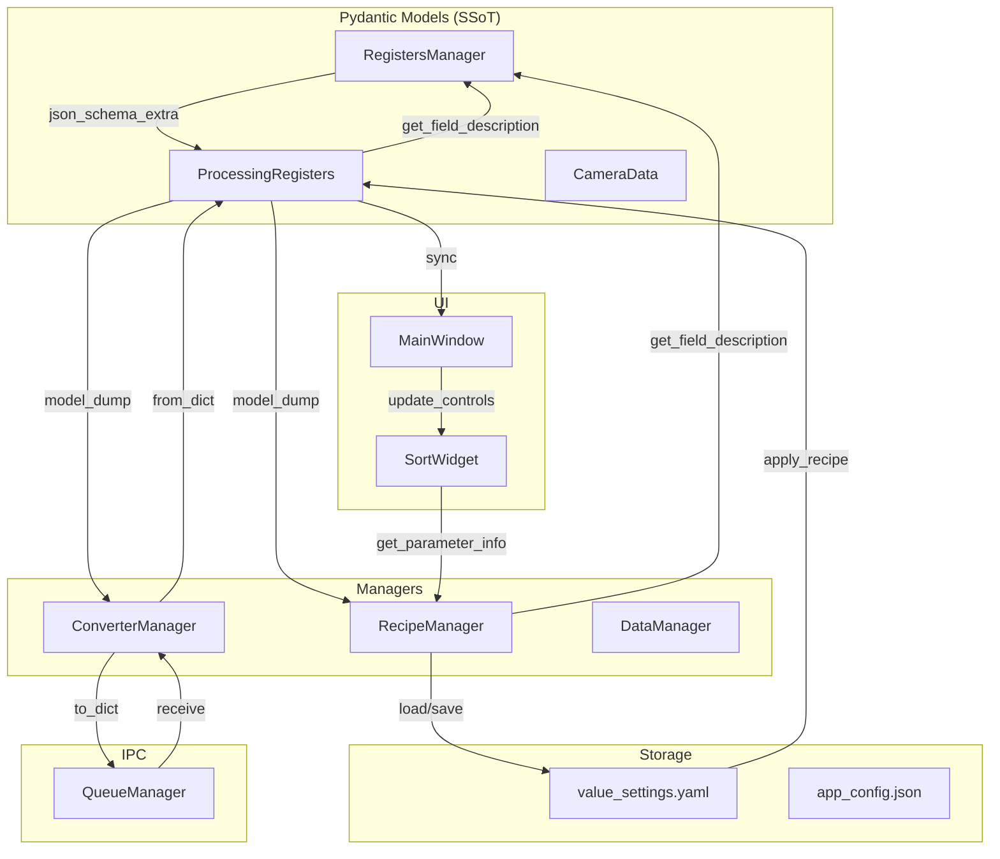

# Архитектура данных App Inspector

## Принцип единого источника истины (Single Source of Truth)

Вся архитектура данных приложения построена на принципе **единого источника истины** (Single Source of Truth), где Pydantic модели являются центральным источником определения структуры, валидации и документации данных.

## Иерархия данных

```
┌─────────────────────────────────────────────────────────────┐
│                    Pydantic Models                          │
│              (Единый источник истины)                       │
├─────────────────────────────────────────────────────────────┤
│                                                             │
│  ┌──────────────────┐  ┌──────────────────┐               │
│  │   Registers      │  │   Data Models    │               │
│  │  (Конфигурация)  │  │  (Структуры)     │               │
│  └──────────────────┘  └──────────────────┘               │
│           │                      │                          │
│           │                      │                          │
│           ▼                      ▼                          │
│  ┌──────────────────────────────────────────┐              │
│  │      Recipes (Рецепты)                   │              │
│  │  (Значения параметров для сортов)        │              │
│  └──────────────────────────────────────────┘              │
│           │                                                 │
│           ▼                                                 │
│  ┌──────────────────────────────────────────┐              │
│  │      Queues (Очереди IPC)               │              │
│  │  (Межпроцессное взаимодействие)         │              │
│  └──────────────────────────────────────────┘              │
│                                                             │
└─────────────────────────────────────────────────────────────┘
```

## 1. Registers (Регистры)

### Назначение
Регистры определяют **конфигурационные параметры** приложения и компонентов. Это глобальные и локальные настройки, которые управляют поведением системы.

### Структура
- **Глобальные регистры**: `CameraRegisters`, `ProcessingRegisters`, `VisualRegisters`, и т.д.
- **Локальные регистры**: Могут быть определены для конкретных виджетов/компонентов

### Расположение
```
App/Registers/
├── models/
│   ├── camera.py          # CameraRegisters
│   ├── processing.py      # ProcessingRegisters
│   ├── visual.py         # VisualRegisters
│   └── ...
├── manager.py             # RegistersManager
└── converters.py          # RegistersConverter
```

### Пример модели регистра
```python
from pydantic import BaseModel, Field

class ProcessingRegisters(BaseModel):
    """Регистры обработки изображений."""
    
    crop_top: int = Field(
        default=0,
        description="Верхняя граница обрезки",
        json_schema_extra={
            'info': 'Координата верхней границы области обрезки изображения в пикселях. Используется для выделения рабочей области.',
            'unit': 'px',
            'range': '0-10000',
            'examples': [0, 100, 500]
        }
    )
    
    crop_bottom: int = Field(
        default=1000,
        description="Нижняя граница обрезки",
        json_schema_extra={
            'info': 'Координата нижней границы области обрезки изображения в пикселях.',
            'unit': 'px',
            'range': '0-10000'
        }
    )
```

### Документация полей
**Принцип**: Вся документация полей хранится непосредственно в Pydantic модели через `Field(json_schema_extra={'info': '...'})`.

**Приоритет получения описания**:
1. `json_schema_extra['info']` - детальное описание (единый источник истины)
2. `description` - краткое описание поля
3. Fallback на сохранённые значения в YAML (для пользовательских переопределений)

**Методы RegistersManager для работы с документацией**:
- `get_field_description(register_name, field_name)` - получить описание поля
- `get_field_descriptions(separator='.')` - получить все описания
- `get_field_metadata(register_name, field_name)` - получить все метаданные (info, unit, range, examples, default)

## 2. Data Models (Модели данных)

### Назначение
Модели данных определяют **структуры данных**, которые передаются между процессами и компонентами (например, данные камеры, регионов, шагов цепочки обработки).

### Структура
- `CameraData` - данные камеры и её регионов
- `RegionData` - данные региона обработки
- `ChainStepData` - данные шага цепочки обработки

### Расположение
```
App/Registers/models/data/
├── __init__.py
├── camera.py      # CameraData
├── region.py      # RegionData
└── chain.py       # ChainStepData
```

### Пример модели данных
```python
from pydantic import BaseModel, Field
from typing import Dict, List

class RegionData(BaseModel):
    """Данные региона обработки."""
    
    name: str = Field(
        default="",
        description="Имя региона",
        json_schema_extra={
            'info': 'Уникальное имя региона обработки изображения. Используется для идентификации региона в цепочке обработки.',
            'examples': ['region_1', 'neck', 'body']
        }
    )
    
    enabled: bool = Field(
        default=True,
        description="Включен ли регион",
        json_schema_extra={
            'info': 'Флаг активности региона. Если False, регион не обрабатывается.',
            'examples': [True, False]
        }
    )
    
    chain_steps: List['ChainStepData'] = Field(
        default_factory=list,
        description="Шаги цепочки обработки",
        json_schema_extra={
            'info': 'Список шагов обработки изображения в данном регионе. Порядок шагов определяет последовательность обработки.',
            'examples': []
        }
    )
```

## 3. Recipes (Рецепты)

### Назначение
Рецепты хранят **значения параметров** для различных сортов (recipes). Это наборы значений, которые применяются к регистрам для конкретной конфигурации сорта.

### Структура
- Рецепты хранятся в YAML файлах: `App/Data/Recipes/value_settings.yaml`
- Каждый рецепт - это словарь значений параметров
- Параметры ссылаются на поля регистров (например, `crop_top`, `processing.crop_top`)

### Расположение
```
App/Data/Recipes/
└── value_settings.yaml    # Файл с рецептами
```

### Формат рецепта
```yaml
recipe_1:
  crop_top: 100
  crop_bottom: 900
  processing.crop_left: 50
  processing.crop_right: 950
  parameter_info:  # Опционально: пользовательские описания (переопределяют модель)
    crop_top: "Пользовательское описание"
```

### RecipeManager
- Управляет загрузкой/сохранением рецептов
- Использует `ConverterManager` для конвертации данных
- При получении описания параметра (`get_parameter_info`) **приоритетно** использует `RegistersManager` (единый источник истины), затем fallback на сохранённые в YAML

### Связь с регистрами
Рецепты **не дублируют** структуру регистров, а хранят только **значения** параметров. Структура и документация определяются в Pydantic моделях регистров.

## 4. Queues (Очереди IPC)

### Назначение
Очереди используются для **межпроцессного взаимодействия** (IPC) между процессами приложения (App, ImageSource, DebugLogger, и т.д.).

### Формат данных в очередях
Данные в очередях передаются как **словари** (dict), которые могут быть:
- Сериализованы из Pydantic моделей через `model_dump()` или `ConverterManager.to_dict()`
- Валидированы обратно в Pydantic модели через `model_validate()` или `ConverterManager.validate_and_convert()`

### Пример передачи данных через очередь
```python
# Отправка (из Pydantic модели в очередь)
registers_dict = registers_manager.processing.model_dump()
queue_manager.send('config', {'processing': registers_dict})

# Приём (из очереди в Pydantic модель)
data = queue_manager.receive('config')
processing_data = ProcessingRegisters.model_validate(data['processing'])
```

### Конвертация
`ConverterManager` предоставляет универсальные методы для конвертации:
- `to_dict()` - Pydantic → dict
- `from_dict()` - dict → Pydantic
- `to_json()` / `from_json()` - JSON сериализация
- `to_yaml()` / `from_yaml()` - YAML сериализация
- `to_flat_dict()` / `from_flat_dict()` - плоский словарь (для простых очередей)

## 5. Хранение данных

### Файловая структура
```
App/Data/
├── app_config.json           # Глобальная конфигурация приложения
├── Recipes/
│   └── value_settings.yaml   # Рецепты (значения параметров)
└── Logs/                     # Логи приложения
    └── ...
```

### Формат хранения
- **JSON**: Для простых структур (`app_config.json`)
- **YAML**: Для рецептов (удобнее для редактирования человеком)
- **Pydantic модели**: В памяти приложения (единый источник истины)

## 6. Валидация данных

### Принцип
Все данные валидируются через Pydantic модели перед использованием:
- При загрузке из файлов
- При получении из очередей
- При изменении через UI

### Валидация в менеджерах
- `RegistersManager.validate_all()` - валидация всех регистров
- `RegistersManager.validate_data()` - валидация данных по схеме
- `ConverterManager.validate()` - валидация произвольных данных
- `ConverterManager.validate_and_convert()` - валидация с автоматической конвертацией

## 7. Консистентность данных

### Правила
1. **Структура определяется в Pydantic моделях** - единый источник истины
2. **Рецепты хранят только значения** - не дублируют структуру
3. **Очереди передают словари** - конвертируются из/в модели
4. **Документация в моделях** - через `json_schema_extra`
5. **Валидация на всех этапах** - при загрузке, изменении, передаче

### Синхронизация
- UI компоненты синхронизируются с Pydantic моделями через явные методы (`update_controls_*`)
- Рецепты применяются к регистрам через `RecipeManager.apply_recipe()`
- Изменения регистров отправляются в очереди через `QueueManager`

## 8. Готовность к интеграции с Backend

### Контракты данных
Pydantic модели служат **контрактами** для будущей интеграции с Backend:
- Модели можно автоматически экспортировать в OpenAPI/Swagger схемы
- JSON Schema генерируется автоматически из моделей
- Валидация на стороне Backend может использовать те же модели

### API совместимость
- Данные передаются в формате JSON (стандарт для REST API)
- Структура данных определена в Pydantic моделях
- Валидация выполняется на обеих сторонах (App и Backend)

### Пример будущего API
```python
# Backend может использовать те же модели
from App.Registers.models import ProcessingRegisters

# Валидация запроса
data = request.json()
registers = ProcessingRegisters.model_validate(data)

# Ответ с валидацией
response_data = registers.model_dump()
return jsonify(response_data)
```

## 9. Диаграмма потока данных



## 10. Рекомендации по использованию

### ✅ Правильно
- Использовать Pydantic модели как единый источник истины
- Хранить документацию в `json_schema_extra['info']`
- Использовать `ConverterManager` для всех конвертаций
- Валидировать данные при загрузке из файлов/очередей
- Использовать `RegistersManager.get_field_description()` для получения описаний

### ❌ Неправильно
- Дублировать структуру данных в рецептах
- Хранить документацию отдельно от моделей
- Использовать прямые преобразования dict ↔ model без валидации
- Игнорировать валидацию при получении данных из очередей
- Создавать отдельные словари для документации параметров

## Заключение

Архитектура данных App Inspector построена на принципе **единого источника истины**, где Pydantic модели определяют структуру, валидацию и документацию всех данных. Это обеспечивает:
- **Консистентность** - одна структура для всех компонентов
- **Валидацию** - автоматическая проверка данных на всех этапах
- **Документацию** - встроенная в модели через `json_schema_extra`
- **Готовность к Backend** - модели служат контрактами для API
- **Поддерживаемость** - изменения в одном месте отражаются везде
