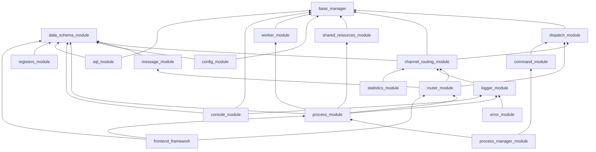

 # Multiprocess Framework — Architecture

> **Статус документа:** §1–§6.15 заполнены (19 пакетов в `modules/`). §6.16–§6.18, §7, §8 — TODO. **Mermaid-сводка:** [docs/DIAGRAMS.md](./docs/DIAGRAMS.md).
> **Обновлено:** 2026-04-10 (после рефакторинга `process_manager_module`, milestone M1 ready).
> **Принцип документа:** один входной документ на весь фреймворк. После Фазы 1 этот файл заменяет `README.md` (root), `STRUCTURE.md`, `DOCUMENTATION_INDEX.md`, `MODULES_STATUS.md`, `PROBLEMS.md`, `docs/FRAMEWORK_OVERVIEW.md`, `docs/ARCHITECTURE_REFERENCE.md`.

---

## 1. Идея фреймворка (конструктор)

**`multiprocess_framework` — это конструктор многопроцессных приложений на Python.**

Основа идеи — **конструктор процессов**: фреймворк прячет под капот всю многопроцессорную боль Python (spawn/fork, pickle-safe сериализацию под Windows, жизненный цикл, health-check, graceful shutdown, IPC, маршрутизацию, наблюдаемость, интеграцию с внешними системами) и даёт разработчику приложения набор готовых «деталей», которые собираются друг в друга через явные интерфейсы. Дополнительный бонус — **C++-уровень возможностей на скорости разработки Python**: Python перестаёт быть узким местом для системной интеграции и многопроцессорности, сохраняя при этом скорость итераций.

Ключевая **часть механизма построения** — **регистр-ориентированная модель**. Регистр — это `SchemaBase`-наследник, у которого каждое поле описано через `FieldMeta` с `FieldRouting(channel=..., process_targets=...)`. Одна декларация поля даёт: тип, валидацию, UI-метаданные, дефолт, маршрут между процессами. Регистры — это **единый источник истины** для бэкенда и фронтенда, а `RouterManager` по `FieldRouting` знает, в какой процесс и канал отправить изменение.

### Что фреймворк прячет под капот

- создание процессов (spawn/fork, pickle-safe, Windows/Linux);
- контроль жизненного цикла (старт, health-check, graceful shutdown, рестарт при падении);
- взаимодействие между процессами (очереди, shared memory, Router-каналы);
- передачу данных (Dict at Boundary, `model_dump()` на границе);
- маршрутизацию сообщений (имя процесса + канал Router);
- наблюдаемость (logger / error / statistics, упакованные в единый `Message` и отправленные в Router по каналам);
- взаимодействие с внешними объектами — БД, нейросети, контроллеры, камеры, устройства — через стандартизованные менеджеры и воркеры.

### Что остаётся разработчику приложения

1. **Построить регистры** — наследники `SchemaBase` с `FieldMeta` + `FieldRouting`, описывающие параметры приложения и их адресацию.
2. **Описать схемы конфигов** — для каждого процесса, менеджера, воркера.
3. **Наполнить процессы воркерами со своей логикой** — опрос камеры, обработка кадров, Modbus, инференс нейросети, PyQt-интерфейс и т. п.
4. **Подключить функциональные модули-детали** — sql, logger, statistics, console и прочие готовые «детали» конструктора.

### Миссия в одной фразе

> Расширить возможности Python до уровня C++ в части многопроцессорности и системной интеграции, при этом **ускорив** разработку приложений, а не замедлив её — за счёт конструктора «деталей» и регистр-ориентированной модели как единого источника истины.

Эта формулировка — ось всего рефакторинга. Каждое архитектурное решение проверяется вопросом: *«упрощает ли это жизнь разработчику приложения, или просто добавляет ещё одну абстракцию внутрь фреймворка?»*

---

## 2. Слои

Модули сгруппированы по слоям снизу вверх (от листьев к корням графа зависимостей). Внутри слоя модули независимы или зависят только от нижележащих слоёв.

| Слой | Модули | Роль |
|------|--------|------|
| **Foundation** | `base_manager`, `data_schema_module` | Базовые примитивы: `ObservableMixin`, `SchemaBase`, `FieldMeta`, `FieldRouting`, `SchemaRegistry`. Сердце фреймворка. |
| **Routing primitives** | `dispatch_module`, `channel_routing_module` | Примитивы маршрутизации: регистрация ключ→handler, стратегии (exact/pattern/fallback/chain), CRM как базовый класс менеджеров с каналами. |
| **Messaging** | `message_module`, `router_module` | Единый `Message` (dict at boundary) и `RouterManager` поверх CRM: отделяет имя процесса (`targets`) от канала Router (`FieldRouting.channel`). |
| **Observability** | `logger_module`, `error_module`, `statistics_module` | Наследники CRM с каналами (файл, терминал, prometheus, UI). Разные входы (log record / error+traceback / metric point), одинаковая выходная дорожка через `Message` → Router. |
| **Resources & Config** | `shared_resources_module`, `config_module` | Pickle-safe SRM и `ConfigStore` (dict на границе, Pydantic внутри). |
| **Command & Work** | `command_module`, `worker_module` | `CommandManager` (семантика «команда» поверх dispatch) и `WorkerManager` (жизненный цикл воркеров внутри процесса). |
| **Process** | `process_module`, `process_manager_module`, `console_module` | `ProcessModule` — база дочернего процесса; `ProcessManagerProcess` — оркестрация; `console_module` — кросс-платформенный интерактив для регистров. |
| **Storage** | `sql_module` | SQL-воркер с dict-at-boundary для запросов. |
| **Application kit** | `registers_module` | Runtime вокруг экземпляров регистров: pub/sub, `set_field_value` + dispatch, routing map; хранение через `RegistersContainer` (`data_schema_module`). Схемы — в прикладном коде. |
| **External (Фаза 2)** | `frontend_framework` (вынесен из фреймворка) | PyQt-приложение как отдельный процесс, связь через `ProcessModule` + `RouterManager` + `FieldRouting`. |

---

## 3. Граф зависимостей

Направление стрелок — «зависит от». От листьев (низ) к корням (верх).



Порядок рефакторинга идёт от листьев к корням — сначала `base_manager` / `data_schema_module`, в конце `process_manager_module` / `console_module` / `frontend_framework`. Полный порядок и обоснование — в `plans/refactoring/00_overview.md`.

---

## 4. Сквозные принципы

Эти принципы действуют во всех модулях. Отклонения фиксируются как ADR в `DECISIONS.md`.

1. **Dict at Boundary (ADR-008).** Между процессами передаются только `dict`. На границе — `schema.model_dump()`, внутри процесса — Pydantic v2. Никаких кастомных сериализаторов, `model_dump()` один на всех.
2. **`SchemaBase` + `FieldMeta` + `FieldRouting` — единая модель конфигов и регистров.** Одна декларация поля даёт тип, валидацию, UI-метаданные, дефолт и маршрут между процессами. У каждого модуля есть свой дефолтный конфиг-наследник `SchemaBase` (`LoggerManagerConfig`, `RouterManagerConfig`, ...). Регистры создаются в прикладном коде как те же `SchemaBase`-наследники, но с `FieldRouting` на каждом поле.
3. **`ObservableMixin` — единый способ подключить logger / stats / error.** Два уровня сложности (после рефакторинга): приватные методы (`_log_*`, `_record_*`, `_track_*`) + опциональный `auto_proxy`. Никаких `PluginRegistry`, `ObservableDecorators`, `simple_mode`.
4. **`interfaces.py` — единственный публичный контракт модуля.** Потребитель зависит от Protocol/ABC, а не от конкретных реализаций. Это держит DI и моки.
5. **Pickle-safe для Windows spawn.** Любой объект, уходящий в `RouterManager`/`Queue`/`shared_resources_module`, проверен на сериализуемость под `spawn`. Проверка — тестом.
6. **Channel vs target.** Имя процесса (`targets` в `send_message`) и канал Router (`FieldRouting.channel`, `msg["channel"]`) — это разные вещи. Смешение запрещено, проверяется `ipc-routing-checker`. См. `docs/ROUTING_GLOSSARY.md`.
7. **Один публичный API на модуль — `interfaces.py` + `__init__.py`.** Из `__init__.py` экспортируется только то, что нужно внешнему потребителю.
8. **Логирование через `ObservableMixin`**, не через `print`, не через `logging` напрямую. Пути логов — из env (`MULTIPROCESS_LOG_DIR` / `INSPECTOR_LOG_DIR`), не хардкод от cwd.
9. **Никакого `sys.path.insert`** — только корректные пакеты и `PYTHONPATH`, как описано в `README.md` модуля.
10. **Backward compatibility удаляется без жалости.** Решение автора для текущего рефакторинга: алиасы и методы-преобразования не держим, потребители мигрируются синхронно.
11. **Регистры — в прикладном коде, не во фреймворке.** Фреймворк предоставляет примитивы (`SchemaBase` + `FieldMeta` + `FieldRouting` + `RouterManager`), приложение собирает регистры как наследники. Это отражает философию конструктора.
12. **Документация по мере рефакторинга (Tier 1).** Во время Фазы 1, по мере готовности модулей, пополняются файлы высокого приоритета:
    - **Шаг Фазы 0.5** (модуль #1): создать `QUICK_REFERENCE.md`, добавить оглавление в `DECISIONS.md`, создать `ARCHITECTURE_MAP.md` (текстовая диаграмма).
    - **Каждый модуль** (Фаза 1, Шаг 5 per-module плана): после заполнения §6.X в этом файле обновить Tier 1 файлы, если архитектура изменилась.

Полный перечень ADR — `DECISIONS.md`.

---

## 4.1. Документация высокого приоритета (Tier 1) — создание и поддержка

**Фаза 0.5** — один раз в начале Фазы 1, при рефакторинге модуля:

| Файл | Назначение | Объём | Когда создаётся |
|------|-----------|-------|-----------------|
| [`QUICK_REFERENCE.md`](QUICK_REFERENCE.md) | Таблица с якорями на ключевые файлы, интерфейсы, скрипты | ~50 строк | Фаза 0.5 (модуль #1) |
| [`ARCHITECTURE_MAP.md`](ARCHITECTURE_MAP.md) | ASCII диаграмма модулей, потоков данных, IPC-точек | ~100 строк | Фаза 0.5 (модуль #1) |
| [`DECISIONS.md`](DECISIONS.md) оглавление | Раздел «Содержание» с якорями на все ADR (глобальные + модульные) | ~50 строк | Фаза 0.5 (модуль #1) |
| [`CONTEXT_HINTS.md`](CONTEXT_HINTS.md) (`.claude/`) | Типичные ошибки, паттерны, gotchas для агентов | ~100 строк | Фаза 0.5 (модуль #1, опционально) |
| Каждый модуль: `modules/X/DECISIONS.md` | Локальные архитектурные решения (ADR-140+) | ~200 строк | Фаза 1, Шаг 5 per-module плана |

**Фаза 1 и далее** — по мере готовности модулей, Шаг 5 (Документация) per-module плана:
- Заполняется подсекция §6.X (роль модуля, диаграмма, ссылки).
- Обновляются Tier 1 файлы, если архитектура модуля привнесла новые интерфейсы или паттерны.

**Цель:** Эти файлы экономят 10–15K токенов на проект, снижают ошибки на 50%, ускоряют ориентацию в коде в 2x раза.

---

## 5. Жизненный цикл приложения

Три фазы: **Запуск → Работа → Завершение**. Каждый компонент — отдельное устройство с чётким входом/выходом.

### 5.1 Запуск (Startup)

```
App main.py
    │
    ├─ SystemLauncher()                         [Пульт управления]
    │   └─ .add_process("camera", proc_dict)    Вход: (name, dict)
    │   └─ .add_process("processor", proc_dict)
    │   └─ .run()
    │       │
    │       ▼
    │   ProcessSpawner                          [Стартер]
    │       ├─ SharedResourcesManager()         Создаёт общую память
    │       ├─ Process(ProcessManagerProcess)    Запускает оркестратор
    │       └─ signal(SIGINT/SIGTERM)            Ловит Ctrl+C
    │           │
    │           ▼
    │       [OS Process: ProcessManager]         [Генеральный директор]
    │       ProcessManagerProcess(ProcessModule)
    │           ├─ RouterManager.initialize()    Коммуникация
    │           ├─ CommandManager.initialize()   Команды (process.start/stop/restart)
    │           ├─ WorkerManager.initialize()    Потоки (state_monitor)
    │           ├─ LoggerManager.initialize()    Логирование
    │           │
    │           ├─ Phase 1: register_process() для всех → очереди в SRM
    │           └─ Phase 2: для каждого процесса:
    │               ├─ ProcessRegistry.create_and_register()
    │               │   ├─ stop_event = Event()     Индивидуальный!
    │               │   ├─ bundle = build_bundle()  Pickle-safe dict
    │               │   └─ Process(run_process_function, bundle)
    │               ├─ process.start()
    │               └─ ProcessPriority.apply()
    │                   │
    │                   ▼
    │               [OS Process: camera]            [Дочерний процесс]
    │               run_process_function()
    │                   ├─ _load_process_class()     Динамическая загрузка
    │                   ├─ _build_shared_resources()  SRM из bundle
    │                   ├─ CameraProcess(ProcessModule)
    │                   │   ├─ RouterManager         Коммуникация
    │                   │   ├─ CommandManager         Приём команд
    │                   │   ├─ WorkerManager          Потоки (capture_loop)
    │                   │   └─ LoggerManager          Логирование
    │                   └─ process.run()              Основной цикл
```

### 5.2 Работа (Runtime)

```
camera                   ProcessManager              processor
  │                           │                          │
  ├─ capture frame            │                          │
  ├─ msg.data(targets=        │                          │
  │    ["processor"],         │                          │
  │    data_type="frame")     │                          │
  │   │                       │                          │
  │   └─ RouterManager ─────────────────────────────────→│
  │     msg.to_dict()         │                     msg.from_dict()
  │     AsyncSender           │                     AsyncReceiver
  │     Queue.put()           │                     Queue.get()
  │                           │                          │
  │                           ├─ Monitor polls           ├─ process frame
  │                           │  is_alive()? ✓           │
  │                           │  state changed? ─→ broadcast
  │                           │                          │
  │   ←─────────── msg.command("set_fps", fps=60) ──────┤
  │   CommandManager                                     │
  │   handler(fps=60)                                    │
```

### 5.3 Завершение (Graceful Shutdown)

```
Ctrl+C (SIGINT)
    │
    ▼
ProcessSpawner._signal_handler()            [Main process]
    └─ stop()
        ├─ _stop_event.set()                Сигнал оркестратору
        ├─ process.join(3s)                 Ждём
        ├─ if alive: terminate → kill       Принудительно
        └─ shared_resources.shutdown()
             │
             ▼
ProcessManagerProcess.shutdown()            [Оркестратор]
    ├─ 1. ProcessMonitor.stop()             Остановить наблюдение
    ├─ 2. ProcessRegistry.stop_all()        Остановить ВСЕ дочерние
    │       ├─ for each: stop_event[name].set()   Per-process!
    │       ├─ join_all(5s)                 Ждём graceful
    │       ├─ for alive: terminate         SIGTERM
    │       └─ for alive: kill              SIGKILL
    ├─ 3. ConsoleManager.shutdown()
    └─ 4. super().shutdown()                Workers, Router, Logger
             │
             ▼
Каждый дочерний процесс:                    [Дочерний]
    (stop_event.is_set() → выход из run())
    ├─ process.shutdown()
    │   ├─ WorkerManager.stop_all()
    │   ├─ RouterManager.shutdown()
    │   └─ LoggerManager.flush()
    └─ exit(0)

Итог: все процессы завершены, SharedMemory освобождена, логи сброшены.
```

### 5.4 Остановка/рестарт отдельного процесса

```
ProcessManagerProcess.stop_process("camera")
    └─ ProcessRegistry.stop_one("camera")
        ├─ stop_events["camera"].set()      Только camera!
        ├─ camera.join(5s)
        └─ if alive: terminate → kill
    Остальные процессы продолжают работать.

ProcessManagerProcess.restart_process("camera")
    ├─ stop_process("camera")               Остановить
    ├─ registry.remove_process("camera")    Убрать из реестра
    ├─ create_and_register("camera", ...)   Новый процесс + новый Event
    ├─ process.start()                      Запустить
    └─ priority.apply()                     Приоритет
```

---

## 6. Модули

> **Процесс заполнения (Фаза 1, Шаг 5 per-module плана):**
> 1. Заполняется подсекция 6.X (роль, диаграмма, ссылка на README).
> 2. **Одновременно обновляются Tier 1 документы:**
>    - `QUICK_REFERENCE.md` — если появился новый ключевой файл или интерфейс.
>    - `ARCHITECTURE_MAP.md` — если изменилась связь модуля с другими.
>    - `DECISIONS.md` оглавление — если добавились новые ADR.
> 3. Объём подсекции — ≤ 100 строк: роль, mermaid-диаграмма локальных связей, ссылка на `README.md` модуля.

### 6.1 `base_manager` — фундамент менеджеров

**Роль:** Предоставляет две независимые строительные блоки, из которых собираются все менеджеры фреймворка.

**`BaseManager`** — абстрактный класс с жизненным циклом (`initialize()`, `shutdown()`), управлением адаптерами (`attach_adapter()`, `get_adapter()`) и диагностикой (`get_debug_info()`).

**`ObservableMixin`** — примесь для наблюдаемости: менеджер говорит `self._log_info("msg")`, и mixin сам найдёт `logger_manager` и вызовет его метод. Два режима: приватные методы (по умолчанию, pickle-safe) и опциональные публичные прокси-методы (`auto_proxy=True`). После unpickle в multiprocessing гарантирует, что `_log_*` возвращают `None` без исключений, пока менеджеры не перерегистрированы.

**`BaseAdapter`** — базовый класс адаптеров, инкапсулирующих интеграцию с процессом или внешним ресурсом.

```
BaseManager (жизненный цикл, адаптеры)
    ├── attach_adapter / get_adapter / detach_adapter
    └── initialize / shutdown (abstract)

ObservableMixin (наблюдаемость)
    ├── _log_* / _record_* / _track_*  (приватные методы, всегда pickle-safe)
    ├── [auto_proxy] log_*/record_*/track_*  (опциональные публичные)
    └── ManagerRegistry (реестр сервисов — logger, stats, error, ...)

Все менеджеры: class M(BaseManager, ObservableMixin)
```

Ключевые решения (ADR-040…043):
- Удалена плагинная система (дублировала приватные методы).
- Удалены декораторы `@logged`/`@timed`/`@monitored` (4-й способ делать одно и то же).
- Удалена magic `BaseManager.__getattr__` для адаптеров (используйте `get_adapter(name)`).
- Удалены события `on_event`/`emit_event` (дублируют dispatch_module/router_module).

📖 Подробнее: [`modules/base_manager/README.md`](modules/base_manager/README.md) · [`modules/base_manager/docs/OBSERVABLE_ARCHITECTURE.md`](modules/base_manager/docs/OBSERVABLE_ARCHITECTURE.md)
### 6.2 `data_schema_module` — ядро данных

**Роль:** Независимое ядро для описания структур данных на базе Pydantic v2. Нулевые зависимости от других модулей фреймворка.

**`SchemaBase`** (`RegisterBase`) — базовый класс для регистров. Наследник Pydantic `BaseModel` с дополнительными возможностями: `FieldMeta` (UI-метаданные, валидация, ограничения), `FieldRouting` (канал Router, process_targets), `RegisterDispatchMeta` (цели доставки для всего регистра).

**`SchemaMixin`** (`RegisterMixin`) — ключевые методы для работы с полями: `build()` → `(manager_name, model_dump())` для Dict at Boundary.

```
SchemaBase (Pydantic v2 BaseModel)
    ├── FieldMeta            — дескриптор поля (min/max, UI-подсказки)
    ├── FieldRouting         — канал Router + process_targets
    └── RegisterDispatchMeta — цели доставки для регистра

SchemaRegistry              — реестр схем (без Singleton)
DataConverter / FileStorage — сериализация: dict/JSON/YAML
RegistersContainer          — контейнер состояния регистров
```

Ключевые решения (ADR-120…123):

- Удалён `_compat.py` (0 внешних потребителей).
- Удалены shim-директории (`fields/`, `utils/` re-exports).
- `extensions/` — только явный импорт, не входит в top-level API.

📖 Подробнее: [`modules/data_schema_module/README.md`](modules/data_schema_module/README.md)

### 6.3 `dispatch_module` — маршрутизация внутри процесса

**Роль:** Сопоставление входящего сообщения (`dict`) с обработчиком по ключу и стратегии: exact / pattern / fallback / chain (сценарии). Зависит только от `base_manager` (`BaseManager` + `ObservableMixin`).

**`Dispatcher`** — фасад: регистрация обработчиков, `dispatch()`, сценарии через композицию **`ScenarioManager`** (`core/scenarios.py`). Стратегии — отдельные классы в `strategies/`. **`BaseDispatcher`** — облегчённый вариант только с `EXACT_MATCH`, без наблюдаемости.

```
Dispatcher
    ├── strategies/*     — Exact / Pattern / Fallback / Chain
    ├── ScenarioManager  — CRUD сценариев + dispatch_scenario
    ├── types/types      — DispatchStrategy, HandlerInfo, Scenario
    └── builders/        — ScenarioBuilder (fluent API)
```

Ключевые решения (ADR-130…132):

- Сценарии вынесены в `ScenarioManager`; публичные методы на `Dispatcher` остаются тонкими делегатами.
- Удалён legacy-конструктор (`logger_manager=` и т.д.); подключение сервисов — через `managers` / `config`.
- Удалён alias `AdvancedDispatcher`.

📖 Подробнее: [`modules/dispatch_module/README.md`](modules/dispatch_module/README.md) · [`modules/dispatch_module/DECISIONS.md`](modules/dispatch_module/DECISIONS.md)
### 6.4 `channel_routing_module` — паттерн CRM

**Роль:** Базовый класс для всех менеджеров с канальной маршрутизацией. Устраняет дублирование между Logger, Error, Router, Stats — все наследуют `ChannelRoutingManager`.

**`ChannelRoutingManager`** (`BaseManager` + `ObservableMixin`) — фасад, объединяющий:

- `ChannelRegistry` — потокобезопасный реестр каналов (`IChannel`)
- `Dispatcher` — маршрутизация ключ → канал (из `dispatch_module`)
- `IBufferStrategy` — опциональная буферизация (Direct / Batch / AsyncSender)
- `normalize_config()` — Dict at Boundary для конфигов

```
ChannelRoutingManager (BaseManager + ObservableMixin)
    ├── ChannelRegistry    — register/get/unregister каналов
    ├── Dispatcher         — key → handler (dispatch_module)
    ├── IBufferStrategy    — Direct / Batch / AsyncSender
    └── normalize_config() — dict ← None | dict | SchemaBase

Наследники:
    ├── LoggerManager   (BatchBuffer, scope/level → ILogChannel)
    │       └── ErrorManager   (severity → channel)
    └── RouterManager   (AsyncSender, IMessageChannel)
```

Ключевые решения (ADR-013…016, ADR-108):

- CRM-паттерн как единая основа канальных менеджеров.
- Три буфера для разных сценариев (sync/batch/async).
- Две роли конфигов: runtime (для наследования) и flat (для реестра/UI).

📖 Подробнее: [`modules/channel_routing_module/README.md`](modules/channel_routing_module/README.md) · [`modules/channel_routing_module/DECISIONS.md`](modules/channel_routing_module/DECISIONS.md)
### 6.5 `logger_module` — первый CRM-наследник

**Роль:** Логирование со scope-based маршрутизацией (SYSTEM / BUSINESS / PERFORMANCE / AUDIT / SECURITY). Первый реальный наследник CRM-паттерна.

**`LoggerManager`** (`ChannelRoutingManager`) — scope + level → каналы (FileChannel / ConsoleChannel / HttpChannel). Использует `BatchBuffer` из CRM для пакетной записи. Поддержка per-module файлов, thread-local контекста, динамического should_log().

```
LoggerManager (ChannelRoutingManager)
    ├── _channel_registry  — FileChannel / ConsoleChannel / HttpChannel
    ├── _buffer (BatchBuffer) — batch flush по size/interval
    ├── _dispatcher (Dispatcher) — scope/level → handler
    ├── LogRecord (core/log_types.py) — dataclass записи
    └── LoggerAdapter — обёртка для multiprocess

Наследник: ErrorManager (severity routing: WARNING/ERROR/CRITICAL → отдельные файлы)
```

Ключевые решения (ADR-140…142):

- Удалён LogDispatcher (дублировал CRM's Dispatcher).
- Удалён BatchManager (дублировал CRM's BatchBuffer).
- LogRecord — отдельный тип в `core/log_types.py`.

📖 Подробнее: [`modules/logger_module/README.md`](modules/logger_module/README.md) · [`modules/logger_module/DECISIONS.md`](modules/logger_module/DECISIONS.md)
### 6.6 `config_module` — конфигурационное хранилище

**Роль:** Runtime-доступ к конфигурациям со scope-based подписками.

**Config** (~160 LOC) — простой контейнер (dict + dot-notation + RLock), без валидации и файлового I/O.  
**ConfigManager** (~215 LOC) — коллекция объектов `Config` с синхронизацией через ConfigStore (Dict at Boundary).

```
Config (dict + RLock + подписки)
    ├── dot-notation: get("database.host")
    ├── подписки: subscribe(callback, key="*")
    ├── ConfigSection — view на подсекцию
    └── env-fallback (опционально, через env_prefix)

ConfigManager
    ├── _configs: Dict[str, Config]
    ├── ConfigStore (SRM): dict на границе для cross-process синхронизации
    ├── create_config(), get_config(), remove_config()
    ├── sync_config() → ConfigStore (config.data как dict)
    └── load_config_from_storage() ← ConfigStore (dict → Config)
```

Ключевые решения: **ADR-023** (global) — тонкая обёртка над `data_schema_module`; **ADR-143…146** (локально в модуле) — Dict at Boundary для ConfigStore, отсутствие I/O в модуле, пять компонентов, опциональный env-fallback. **Pydantic / SchemaBase** — только у **`ConfigManagerConfig`** и в адаптере схем; payload в ConfigStore остаётся plain dict.

📖 Подробнее: [`modules/config_module/README.md`](modules/config_module/README.md) · [`modules/config_module/DECISIONS.md`](modules/config_module/DECISIONS.md) · [`modules/config_module/docs/ARCHITECTURE.md`](modules/config_module/docs/ARCHITECTURE.md)

### 6.7 `message_module` — IPC-примитив

**Роль:** Value object для межпроцессного взаимодействия. Leaf-зависимость (только `data_schema_module`).

**Message** (`SchemaBase`, ~485 LOC) — typed IPC container: поля Pydantic + `FieldMeta`, fluent API, Dict at Boundary.  
**MessageAdapter** (~327 LOC) — контекстная фабрика (один на процесс, фиксированный sender).

```
Message (SchemaBase / value object)
    ├── create(type, sender, targets, ...) — основной метод
    ├── model_dump() / to_dict() / from_dict() — Dict at Boundary
    ├── fluent API: set_priority(), set_targets(), set_channel()
    └── optional строгая схема: CommandMessageSchema, LogMessageSchema (extra='forbid')
        (BaseMessageSchema — алиас на Message для обратной совместимости импорта)

MessageAdapter(sender=name)
    ├── .command(targets, command, args)
    ├── .log(level, message, module)
    ├── .system(targets, action)
    ├── .broadcast(content)
    ├── .data(targets, data_type, data)
    ├── .request(targets, request_type)
    ├── .response(targets, request_id, result)
    └── .event(event_type, targets, data)
```

Ключевые решения (ADR-147…152):
- **Dict at Boundary:** только `msg.to_dict()` пересекает границу.
- **`schema=None` — нормальный путь,** отдельная Pydantic-схема (`CommandMessageSchema` / …) — опциональное усиление.
- **Message = SchemaBase** — единый источник полей; **IMessage** — `Protocol` (**ADR-152**).
- **MessageAdapter** — рекомендованный способ в процессах.
- **Поле `routers`:** RouterManager'ы внутри процесса.

📖 [`modules/message_module/README.md`](modules/message_module/README.md) · [`modules/message_module/DECISIONS.md`](modules/message_module/DECISIONS.md)

### 6.8 `shared_resources_module` — межпроцессные ресурсы

**Роль:** Централизованный pickle-safe реестр всех разделяемых ресурсов (очереди, события, SharedMemory). Разделяет статическую конфигурацию (ConfigStore) от динамического состояния (ProcessStateRegistry). Зависит только от #1 `base_manager`.

**SharedResourcesManager** (~408 LOC) — фасад-делегатор: оркестрирует 5 внутренних менеджеров.
**ProcessStateRegistry** (~230 LOC) — единственный источник истины для Queue/Event/status.
**ProcessHandle** (~226 LOC) — chainable Handle API для доступа к ресурсам процесса.
**MemoryManager** (~414 LOC) — жизненный цикл SharedMemory (owner create/unlink, consumer open/close).

```
SharedResourcesManager (facade)
    ├── register_process(name, config) — единая точка регистрации (ADR-018)
    ├── for_process(name) → ProcessHandle — Handle API (ADR-SRM-002)
    │   ├── .queue("system").send(msg)     — QueueHandle
    │   ├── .event("stop").set()           — EventHandle
    │   └── .memory("frames").write(data)  — MemoryHandle
    ├── ConfigStore — dict-хранилище (pickle-safe, статика)
    ├── ProcessStateRegistry — Dict[str, ProcessData] (динамика)
    │   └── ProcessData: status, queues (Proxy), events (Proxy), metadata
    ├── QueueRegistry — делегирует хранение в PSR (ADR-SRM-003)
    ├── EventManager — системные события + подписки + router-интеграция
    └── MemoryManager — SharedMemory + MemoryAccessStatus enum (ADR-SRM-004)
```

Ключевые решения (ADR-SRM-001…008):
- **Handle API:** `for_process()` → QueueHandle/EventHandle/MemoryHandle — единый chainable доступ (**ADR-SRM-002**).
- **PSR — single source of truth:** QueueRegistry не кеширует очереди, делегирует в PSR (**ADR-SRM-003**).
- **Pickle-safe:** ConfigStore = dict, Queue/Event — нативно. `reinitialize_in_child()` восстанавливает EventManager._event_queue и MemoryManager.handles (**ADR-020**, **ADR-021**).
- **MemoryAccessStatus enum** вместо bool — диагностические причины отказа (**ADR-SRM-004**).

📖 [`modules/shared_resources_module/README.md`](modules/shared_resources_module/README.md) · [`modules/shared_resources_module/DECISIONS.md`](modules/shared_resources_module/DECISIONS.md)

### 6.9 `router_module` — маршрутизация сообщений

**Роль:** Масштабируемая маршрутизация IPC-сообщений между процессами. CRM-наследник (#4), использует Message (#7), Dispatcher (#3).

**RouterManager** (CRM-наследник) — фасад: AsyncSender (outgoing pipeline), AsyncReceiver (incoming poll), два dispatcher'а.  
**RouterAdapter** — тонкая обёртка для ProcessModule (контекст отправителя, `send_to_channel`).  
**RouterSchemaAdapter** — FieldRouting → карта каналов для регистрации.

```
RouterManager(ChannelRoutingManager)
    ├── send() / send_async() → _send_mw → _resolve_channels → channel.send()
    ├── receive() → _poll_all_channels → _recv_mw → message_dispatcher
    ├── channel_dispatcher (= CRM._dispatcher) — исходящие (handlers возвращают имя канала)
    ├── message_dispatcher — входящие обработчики
    ├── AsyncSender — PriorityQueue + фоновый поток
    └── AsyncReceiver — poll thread + callbacks
```

Ключевые решения (ADR-153…158):
- **CRM inheritance:** `_channel_registry`, `_dispatcher` из CRM; AsyncSender — отдельный pipeline (**ADR-153**, **ADR-015**).
- **Name-returning handlers:** dispatch возвращает имя канала, не результат записи (**ADR-154**).
- **Thread-safe _stats:** счётчики под `threading.Lock` (**ADR-156**).

📖 [`modules/router_module/README.md`](modules/router_module/README.md) · [`modules/router_module/DECISIONS.md`](modules/router_module/DECISIONS.md)

### 6.10 `worker_module` — управление потоками-воркерами

**Роль:** Централизованное управление жизненным циклом потоков внутри ProcessModule: создание, запуск, остановка, пауза, мониторинг, перезапуск. Зависит только от base_manager (#1).

**WorkerManager** (BaseManager + ObservableMixin, ~231 LOC) — фасад: делегирует WorkerRegistry (хранение) и WorkerLifecycle (создание/запуск/остановка потоков).
**WorkerAdapter** (~138 LOC) — тонкая обёртка для ProcessModule.
**WorkerSchemaAdapter** (~94 LOC) — извлечение настроек потока из SchemaBase-конфигов.

```
WorkerManager(BaseManager, ObservableMixin, IWorkerManager)
    ├── create_worker() / start / stop / restart / pause / resume
    ├── _worker_registry: WorkerRegistry (threading.Lock, Dict[str, WorkerInfo])
    ├── _lifecycle: WorkerLifecycle (create thread, start, stop, auto-restart)
    ├── ThreadConfig (runtime) — to_dict/from_dict (Dict at Boundary)
    └── ThreadWorkerConfig(SchemaBase) — декларативный конфиг (Pydantic)
```

Два режима выполнения:
- **LOOP** — бесконечный цикл, stop_event для остановки. Финальный статус: STOPPED.
- **TASK** — одноразовое выполнение. Финальный статус: COMPLETED.

Два типа воркеров: **SYSTEM** (фреймворк, e.g. message_processor), **APPLICATION** (пользовательский).

Ключевые решения (ADR-159…162):
- **Нет зависимости от dispatch_module:** WorkerManager — lifecycle manager, не message router (ADR-159).
- **Dual config:** ThreadConfig (runtime) + ThreadWorkerConfig (SchemaBase) — осознанное разделение (ADR-160).

📖 [`modules/worker_module/README.md`](modules/worker_module/README.md) · [`modules/worker_module/DECISIONS.md`](modules/worker_module/DECISIONS.md)

### 6.11 `process_module` — базовый класс процесса

**Роль:** Сборка worker, router, logger, command, config, statistics, console, shared resources в единый `ProcessModule` — базовый класс для прикладных процессов. Зависит от #2 `data_schema_module`, #5 `logger_module`, #8 `shared_resources_module`, #9 `router_module`, #10 `worker_module`.

**ProcessModule** (BaseManager + ObservableMixin + IProcessModule) — фасад: делегирует подсистемам без изменения публичного контракта для 19+ наследников.

```
ProcessModule
    ├── ProcessLifecycle — initialize/shutdown; конфиг/очереди: тело в ProcessLifecycle, вызов через `process._init_configuration` / `_init_queues` (делегаты → lifecycle, см. ADR-166a)
    ├── ProcessManagers — pipeline: _create_*_manager → register → attach adapters → event_manager.set_router_manager
    ├── ProcessCommunication — send_message / broadcast / receive_message; send / receive (расширенный API)
    ├── ProcessState — регистрация и обновление состояния в PSR (через shared_resources)
    └── SystemThreads — системные потоки (например message_processor)
```

Два API коммуникации (ADR-163):
- **`send_message(target, message)`** → `bool`
- **`send(message)`** → `Dict` со статусом

**ISharedResources** (Protocol) — DI без жёсткой связи на конкретный SRM (ADR-164).

Ключевые решения (ADR-163…167, ADR-166a):
- **Dual comm API** и **ISharedResources** — см. выше.
- **Удалён shim** `process_module/state/process_state_registry.py`; `ProcessStateRegistry` только из `shared_resources_module` (ADR-165).
- **ProcessManagers** — декомпозиция `initialize()` на подметоды (ADR-166).
- **Конфиг/очереди** — реализация в `ProcessLifecycle`, вызов через `ProcessModule._init_*` (делегаты, ADR-166a).
- **Воркеры из конфига** — `importlib.import_module` (ADR-167).

📖 [`modules/process_module/README.md`](modules/process_module/README.md) · [`modules/process_module/DECISIONS.md`](modules/process_module/DECISIONS.md)

### 6.12 `command_module` — фасад для обработки команд

**Роль:** Тонкий фасад над `dispatch_module` с семантикой «команда». Предоставляет `register_command(name, handler)` / `handle_command(msg)` вместо низкоуровневых `register_handler` / `dispatch`. Зависит от `dispatch_module` (#3) и `base_manager` (#1).

**CommandManager** (BaseManager + ObservableMixin + ICommandManager, ~360 LOC) — фасад: внутренний `Dispatcher` для маршрутизации `msg["command"]` → handler.  
**BaseCommandManager** (~55 LOC) — lightweight конкретный класс для тестов и простых случаев. Только EXACT_MATCH, без ObservableMixin.  
**CommandAdapter** (~109 LOC) — тонкая обёртка для ProcessModule, добавляет `execute_via_message()`.  
**CommandManagerConfig** (SchemaBase) — плоская схема для реестра и UI.

```
CommandManager(BaseManager, ObservableMixin, ICommandManager)
    ├── register_command(name, handler) → dispatcher.register_handler()
    ├── handle_command(msg) → dispatcher.dispatch(msg, key="command")
    ├── get_commands() / get_command_info() / get_commands_by_tag()
    ├── overwrite_command() / update_command_metadata() / update_command_tags()
    └── dispatcher: Dispatcher (composition, all 4 strategies available)
```

**Не путать с CRM:** CommandManager маршрутизирует команды **к функциям**. CRM маршрутизирует данные **в каналы** (файлы, очереди). Общее — оба используют Dispatcher через композицию (ADR-172).

**Синхронный by design (ADR-172).** Async-буферизация обеспечена выше — RouterManager (AsyncSender + message_processor thread). CommandManager работает внутри потока message_processor. Команды — быстрые управляющие сигналы (set_fps, start_capture). Тройной dispatch path: `message_dispatcher → CommandManager → Dispatcher` — O(1) × 3, не bottleneck. Тяжёлые handlers → worker thread, не async command.

Интеграция: `ProcessLifecycle._register_commands_with_router()` мостит команды в `router.message_dispatcher`, чтобы IPC-сообщения (из GUI) доходили до command handlers. `message_dispatcher` — встроенный generic аналог, CommandManager добавляет семантику (tags, metadata, timing stats).

Ключевые решения (ADR-168…172):
- **ICommandManager подключён** к CommandManager (ADR-168)
- **Нет наследования от CRM, синхронный by design** — разные паттерны (ADR-172)
- **Legacy kwargs удалены** — единственный caller использует новый API (ADR-169)

📖 [`modules/command_module/README.md`](modules/command_module/README.md) · [`modules/command_module/DECISIONS.md`](modules/command_module/DECISIONS.md)

### 6.13 `process_manager_module` — оркестратор (Генеральный директор)

**Роль:** Запуск, мониторинг, управление и завершение всех процессов системы. Верхний слой фреймворка — соединяет все модули в единый работающий организм. Сам является `ProcessModule` с собственными workers, router, logger, commands.

**Три уровня абстракции:**

| Компонент | Входы (что принимает) | Выходы (что отдаёт) | Использует |
|---|---|---|---|
| **SystemLauncher** (фасад) | `add_process(name, dict)` — Dict at Boundary | `run()`, `stop()`, `get_status()` → dict | ProcessSpawner |
| **ProcessSpawner** (стартер) | processes_config dict | OS Process с ProcessManagerProcess | SRM, _ProcessLogger, signal |
| **ProcessManagerProcess** (оркестратор) | config dict через bundle | IPC-команды, broadcast, monitoring | ProcessRegistry, ProcessMonitor, ProcessPriority, ProcessStatus |

```
SystemLauncher                              [Пульт управления]
    │  Вход: .add_process(name, dict)
    │  Выход: .run() / .stop() / .get_status()
    │
    └─ ProcessSpawner                       [Стартер]
        │  Создаёт: SRM, _ProcessLogger
        │  Запускает: OS Process → ProcessManagerProcess
        │  Ловит: SIGINT / SIGTERM → stop()
        │
        └─ ProcessManagerProcess            [Генеральный директор]
            │  Наследник: ProcessModule (workers, router, logger, commands)
            │
            ├─ ProcessRegistry              [Отдел кадров]
            │   ├─ _stop_events: Dict[name, Event]  — per-process!
            │   ├─ create_and_register(name, class_path, config, priority)
            │   ├─ stop_one(name, timeout)  — остановить одного
            │   ├─ stop_all(timeout)        — остановить всех
            │   └─ remove_process(name)     — удалить из реестра
            │
            ├─ ProcessMonitor               [Служба безопасности]
            │   ├─ _monitoring_loop (worker thread)
            │   ├─ State polling: ProcessStateRegistry
            │   ├─ Heartbeat: process.is_alive() → crash detection
            │   └─ Broadcast: status changes → все процессы
            │
            ├─ ProcessPriority              [HR: приоритеты]
            │   └─ register / apply / get / set priority
            │
            ├─ ProcessStatus                [Отчётность]
            │   └─ get_process_status / get_all_status / get_stats
            │
            └─ Built-in commands (CommandManager):
                ├─ process.list     → список всех процессов
                ├─ process.start    → запустить по имени
                ├─ process.stop     → остановить по имени
                ├─ process.restart  → перезапустить по имени
                ├─ process.status   → статус по имени
                ├─ system.shutdown  → завершить систему
                └─ system.stats     → статистика
```

**Runner (запуск дочернего процесса):**

```
run_process_function(class_path, name, stop_event, bundle)  [Top-level, pickle-safe]
    │
    ├─ class_loader._load_process_class()     Динамическая загрузка класса
    ├─ bundle_builder._build_shared_resources_from_bundle()  SRM из dict
    ├─ console_redirect._setup_console_redirect()  stdout/stderr → queue
    ├─ _attach_stop_event_to_process_data()   stop_event → custom
    ├─ ProcessClass(name, shared_resources, config)
    ├─ process.initialize()
    ├─ _run_lifecycle(process, stop_event)    run() + wait stop_event
    └─ process.shutdown()                     cleanup
```

**Bundle Contract** (`core/bundle_contract.py`):
- `build_bundle(queues, config, custom, routing_map)` → pickle-safe dict
- `validate_bundle(bundle)` → bool
- Создаётся в ProcessRegistry, распаковывается в bundle_builder

**Ключевые решения (ADR-PM-001…006):**
- **ADR-PM-001:** Per-process stop events — каждый процесс получает свой `Event()`. Остановка одного не затрагивает другие.
- **ADR-PM-002:** Минималистичный ProcessSpawner — только SRM + _ProcessLogger, без ConfigManager/LoggerManager/ErrorManager.
- **ADR-PM-003:** Bundle Contract — формальная спецификация pickle-safe dict для дочернего процесса.
- **ADR-PM-004:** Heartbeat monitoring — `process.is_alive()` для обнаружения crashed процессов.
- **ADR-PM-005:** Runner split — process_runner.py (447→185 LOC) + 3 focused файла.
- **ADR-PM-006:** stop_event оркестратора — передаётся аргументом, присоединяется к ProcessData через `_attach_stop_event_to_process_data`.

📖 [`modules/process_manager_module/README.md`](modules/process_manager_module/README.md) · [`modules/process_manager_module/DECISIONS.md`](modules/process_manager_module/DECISIONS.md) · [`modules/process_manager_module/docs/CONFIG_CONTRACT.md`](modules/process_manager_module/docs/CONFIG_CONTRACT.md)
### 6.14 `error_module` — severity-based channel routing

**Роль:** Специализированный менеджер ошибок — наследник `LoggerManager` с level-based routing. WARNING/ERROR/CRITICAL направляются в отдельные файлы; DEBUG/INFO — через scope-based routing родителя.

**`ErrorManager`** (`LoggerManager`) — severity routing через `_level_to_channel` dict. Использует CRM-инфраструктуру (ChannelRegistry, BatchBuffer) через наследование. Добавляет `log_exception()` с traceback и `track_error()` для ObservableMixin.

```
ErrorManager (LoggerManager → ChannelRoutingManager)
    ├── _level_to_channel  — {CRITICAL→critical_file, ERROR→errors_file, WARNING→warnings_file}
    ├── log() override     — severity routing для WARNING+, scope fallback для DEBUG/INFO
    ├── log_exception()    — traceback + self.error()
    ├── track_error()      — интеграция с ObservableMixin._track_error()
    └── ErrorManagerConfig (SchemaBase) → expand_error_manager_config → LoggerManagerConfig
```

Ключевые решения (ADR-EM-001…006):

- ErrorManager — наследник LoggerManager, не композиция и не слияние.
- `_level_to_channel` — O(1) dict lookup, не через Dispatcher.
- `_level_to_channel = {}` до `super().__init__()` — защита от AttributeError.
- `error_module.core`: `ErrorManager` в `__all__`, подгрузка через `__getattr__` (не ломать ленивый импорт `expand_error_manager_config`).

📖 [`modules/error_module/README.md`](modules/error_module/README.md) · [`modules/error_module/DECISIONS.md`](modules/error_module/DECISIONS.md)

### 6.15 `statistics_module` — метрики и агрегация

**Роль:** Менеджер статистики и метрик — прямой наследник `ChannelRoutingManager` (ADR-022). Агрегирует counter/gauge/timing/histogram, периодически сбрасывает снапшоты в каналы. Все менеджеры с `ObservableMixin` маршрутизируют метрики сюда через `_record_metric()` / `_record_timing()`.

**`StatsManager`** (`ChannelRoutingManager`, `IStatsManager`) — dual-layer: live-dict для `get_metric()` + `AggregationWindow` для flush. Sentinel `_STATS_SENTINEL` предотвращает N-кратный счёт при N каналах.

```
StatsManager (ChannelRoutingManager)
    ├── _metrics (Dict)        — live-state для get_metric() / get_all_metrics()
    ├── AggregationWindow      — IBufferStrategy с агрегацией (counter sum, gauge last, timing p95)
    ├── _do_flush()            — broadcast snapshot во ВСЕ каналы
    ├── LogStatsChannel        — IChannel → LoggerManager.performance()
    ├── FileStatsChannel       — IChannel → JSON/CSV файл
    ├── StatsAdapter           — BaseAdapter → CommandManager (5 команд)
    └── StatsManagerConfig     — ChannelRoutingConfig + aggregation/flush/tags
```

Ключевые решения (ADR-SM-001…006):

- Прямой наследник CRM, не LoggerManager (scope/level избыточны).
- Dual-layer storage: live-dict + AggregationWindow.
- Sentinel-паттерн: enqueue один раз, flush во все каналы.
- `_metric_key` дупликация — намеренная изоляция слоёв.

📖 [`modules/statistics_module/README.md`](modules/statistics_module/README.md) · [`modules/statistics_module/DECISIONS.md`](modules/statistics_module/DECISIONS.md)

### 6.16 `sql_module` — универсальный SQL-инструментарий

**Роль:** Управление БД с опорой на SchemaBase: DDL-генерация, QuerySet-запросы (Django-style), типизированные репозитории, Unit of Work, экспорт данных, команды. Dict at Boundary для IPC.

**`SQLManager`** (BaseManager, ObservableMixin) — точка входа: `execute()`, `query()`, `create_tables()`, `objects()` (QuerySet), `get_repository()`, `uow()` / `uow_async()`, `execute_command()`. Ленивое создание async-адаптера при первом вызове.

```
SQLManager (BaseManager + ObservableMixin)
    ├── _adapter (ISyncEngineAdapter)           — синхронный (SQLite/PostgreSQL/MySQL)
    ├── _async_adapter (IAsyncEngineAdapter)    — асинхронный (ленивое создание)
    ├── _schema_mapper (ISchemaMapper)          — SchemaBase → SQL metadata
    ├── _repositories (Dict[Type, GenericRepository])
    ├── execute(sql, params) → int              — DML (INSERT/UPDATE/DELETE)
    ├── query(sql, params) → List[Dict]         — SELECT (Dict at Boundary)
    ├── create_tables(schema_classes, dialect)  — DDL из SchemaBase
    ├── objects(schema_class) → QuerySet        — Django-style builder
    ├── get_repository(schema_class) → IRepository  — типизированный CRUD
    ├── uow() → IUnitOfWork                     — транзакции (sync)
    ├── uow_async() → IAsyncUnitOfWork          — транзакции (async)
    └── execute_command(cmd: Dict) → Dict       — Dict at Boundary (БУД)
```

**Компоненты:**

- **`DDLBuilder`** — генерация CREATE TABLE, INDEX из `schema_to_table_meta()` + FieldMeta + SQLMeta для SQLite/PostgreSQL/MySQL.
- **`QuerySet[T]`** — Django-style immutable builder: `filter()`, `exclude()`, `order_by()`, `limit()` → parameterized SQL. Каждый вызов — новый QuerySet.
- **`GenericRepository[T, ID]`** — типизированный CRUD (find_by_id, insert, update, delete, bulk ops). Readonly-защита для конкретных полей.
- **`SchemaBaseMapper`** (ISchemaMapper) — маппинг SchemaBase ↔ SQL: FieldMeta → CHECK/VARCHAR/DEFAULT, entity_to_row/row_to_entity через model_dump/model_validate.
- **`SQLMeta`** — декларативный ClassVar (table_name, indexes, unique_together). Pydantic игнорирует — чисто для SQL.
- **Адаптеры:** ISyncEngineAdapter / IAsyncEngineAdapter (Strategy pattern, фабрика `create_sync/async_adapter()`).
- **`UnitOfWork` / `AsyncUnitOfWork`** — контекстные менеджеры для транзакций.
- **`TableExporter`** — экспорт List[Dict] в TXT (readable/table), CSV, XLSX.
- **Typed commands:** `DBQueryCommand`, `DBExecuteCommand`, `DBInsertCommand` (Pydantic на границе).

**Ключевые решения (ADR-SQL-001…011):**

- Dict at Boundary: `execute()`, `query()`, `execute_command()` работают с dict. SchemaBase только внутри процесса.
- QuerySet — immutable builder, никаких побочных эффектов кэширования.
- Адаптеры — Strategy: sync и async разделены, фабрика выбирает по конфигу.
- Fork-safety: NullPool когда `INSPECTOR_MULTIPROCESS=1` или `config.fork_safe=True`.

**Зависимости:** `#1` base_manager, `#2` data_schema_module (SchemaBase, FieldMeta).

📖 [`modules/sql_module/README.md`](modules/sql_module/README.md) · [`modules/sql_module/DECISIONS.md`](modules/sql_module/DECISIONS.md)

### 6.17 `registers_module`

**Роль:** runtime вокруг именованных регистров (экземпляры прикладных схем): **pub/sub**, **`set_field_value`** с fan-out **`register_update`**, **`build_routing_map`** / **`send_register_message`**, **`build_connection_map_from_registers`**.

**Граница с `data_schema_module`:** `RegistersManager` **композирует** `RegistersContainer` — хранение, `get_field_metadata`, `validate_field`, `model_dump_all` / `model_validate_all` не дублируются (ADR-RM-001). Логика выбора целей доставки — **`core/dispatch.py`** (`resolve_dispatch_targets`).

```
RegistersManager
    ├── RegistersContainer (data_schema)  — экземпляры, metadata, dump/validate
    ├── observers (field + global)
    ├── connection_map + send_callback
    └── resolve_dispatch_targets()  ← core/dispatch.py
```

📖 [`modules/registers_module/README.md`](modules/registers_module/README.md) · [`modules/registers_module/DECISIONS.md`](modules/registers_module/DECISIONS.md)
### 6.18 `console_module` — *TODO (после модуля #18, milestone M2)*

---

## 7. Внешние пакеты

### 7.1 `frontend_framework` — *TODO (Фаза 2, после модуля #19, milestone M3)*

PyQt-приложение, вынесенное из `multiprocess_framework/` в отдельный пакет. Связь с фреймворком — только через стандартные механизмы: `ProcessModule`, `RouterManager`, `Message`, `FieldRouting`. Внутри фреймворка PyQt-кода и импортов не остаётся.

---

## 8. ADR

Полный список — в [`DECISIONS.md`](DECISIONS.md). Ключевые:

- **ADR-008** — Dict at Boundary.
- *ADR-040…ADR-0NN — добавляются в Фазе 1 по мере принятия решений в рамках рефакторинга.*
