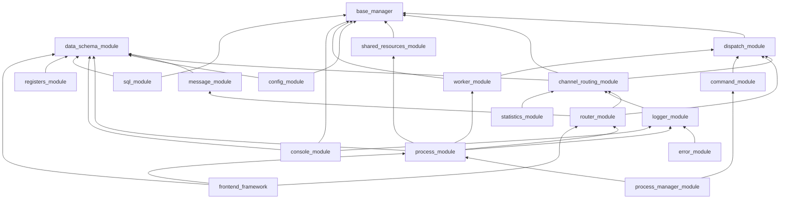

# Multiprocess Framework — Architecture

> **Статус документа:** каркас (Фаза 0 рефакторинга v4.1).
> §1–§4 заполнены. §5 «Жизненный цикл», §6 «Модули», §7 «Внешние пакеты», §8 «ADR» — заголовки-заглушки, наполняются по одной секции после каждого модуля Фазы 1.
> **Принцип документа:** один входной документ на весь фреймворк. После Фазы 1 этот файл заменяет `README.md` (root), `STRUCTURE.md`, `DOCUMENTATION_INDEX.md`, `MODULES_STATUS.md`, `PROBLEMS.md`, `docs/FRAMEWORK_OVERVIEW.md`, `docs/ARCHITECTURE_REFERENCE.md`.

---

## 1. Идея фреймворка (конструктор)

**`multiprocess_framework` — это конструктор многопроцессных приложений на Python.**

Основа идеи — **конструктор процессов**: фреймворк прячет под капот всю многопроцессорную боль Python (spawn/fork, pickle-safe сериализацию под Windows, жизненный цикл, health-check, graceful shutdown, IPC, маршрутизацию, наблюдаемость, интеграцию с внешними системами) и даёт разработчику приложения набор готовых «деталей», которые собираются друг в друга через явные интерфейсы. Дополнительный бонус — **C++-уровень возможностей на скорости разработки Python**: Python перестаёт быть узким местом для системной интеграции и многопроцессорности, сохраняя при этом скорость итераций.

Ключевая **часть механизма построения** — **регистр-ориентированная модель**. Регистр — это `SchemaBase`-наследник, у которого каждое поле описано через `FieldMeta` с `FieldRouting(channel=..., process_targets=...)`. Одна декларация поля даёт: тип, валидацию, UI-метаданные, дефолт, маршрут между процессами. Регистры — это **единый источник истины** для бэкенда и фронтенда, а `RouterManager` по `FieldRouting` знает, в какой процесс и канал отправить изменение.

### Что фреймворк прячет под капот

- создание процессов (spawn/fork, pickle-safe, Windows/Linux);
- контроль жизненного цикла (старт, health-check, graceful shutdown, рестарт при падении);
- взаимодействие между процессами (очереди, shared memory, Router-каналы);
- передачу данных (Dict at Boundary, `model_dump()` на границе);
- маршрутизацию сообщений (имя процесса + канал Router);
- наблюдаемость (logger / error / statistics, упакованные в единый `Message` и отправленные в Router по каналам);
- взаимодействие с внешними объектами — БД, нейросети, контроллеры, камеры, устройства — через стандартизованные менеджеры и воркеры.

### Что остаётся разработчику приложения

1. **Построить регистры** — наследники `SchemaBase` с `FieldMeta` + `FieldRouting`, описывающие параметры приложения и их адресацию.
2. **Описать схемы конфигов** — для каждого процесса, менеджера, воркера.
3. **Наполнить процессы воркерами со своей логикой** — опрос камеры, обработка кадров, Modbus, инференс нейросети, PyQt-интерфейс и т. п.
4. **Подключить функциональные модули-детали** — sql, logger, statistics, console и прочие готовые «детали» конструктора.

### Миссия в одной фразе

> Расширить возможности Python до уровня C++ в части многопроцессорности и системной интеграции, при этом **ускорив** разработку приложений, а не замедлив её — за счёт конструктора «деталей» и регистр-ориентированной модели как единого источника истины.

Эта формулировка — ось всего рефакторинга. Каждое архитектурное решение проверяется вопросом: *«упрощает ли это жизнь разработчику приложения, или просто добавляет ещё одну абстракцию внутрь фреймворка?»*

---

## 2. Слои

Модули сгруппированы по слоям снизу вверх (от листьев к корням графа зависимостей). Внутри слоя модули независимы или зависят только от нижележащих слоёв.

| Слой | Модули | Роль |
|------|--------|------|
| **Foundation** | `base_manager`, `data_schema_module` | Базовые примитивы: `ObservableMixin`, `SchemaBase`, `FieldMeta`, `FieldRouting`, `SchemaRegistry`. Сердце фреймворка. |
| **Routing primitives** | `dispatch_module`, `channel_routing_module` | Примитивы маршрутизации: регистрация ключ→handler, стратегии (exact/pattern/fallback/chain), CRM как базовый класс менеджеров с каналами. |
| **Messaging** | `message_module`, `router_module` | Единый `Message` (dict at boundary) и `RouterManager` поверх CRM: отделяет имя процесса (`targets`) от канала Router (`FieldRouting.channel`). |
| **Observability** | `logger_module`, `error_module`, `statistics_module` | Наследники CRM с каналами (файл, терминал, prometheus, UI). Разные входы (log record / error+traceback / metric point), одинаковая выходная дорожка через `Message` → Router. |
| **Resources & Config** | `shared_resources_module`, `config_module` | Pickle-safe SRM и `ConfigStore` (dict на границе, Pydantic внутри). |
| **Command & Work** | `command_module`, `worker_module` | `CommandManager` (семантика «команда» поверх dispatch) и `WorkerManager` (жизненный цикл воркеров внутри процесса). |
| **Process** | `process_module`, `process_manager_module`, `console_module` | `ProcessModule` — база дочернего процесса; `ProcessManagerProcess` — оркестрация; `console_module` — кросс-платформенный интерактив для регистров. |
| **Storage** | `sql_module` | SQL-воркер с dict-at-boundary для запросов. |
| **Application kit** | `registers_module` | Инфраструктура для регистров (process_registry, discovery, RegistersMeta). Сами регистры создаются в прикладном коде. |
| **External (Фаза 2)** | `frontend_framework` (вынесен из фреймворка) | PyQt-приложение как отдельный процесс, связь через `ProcessModule` + `RouterManager` + `FieldRouting`. |

---

## 3. Граф зависимостей

Направление стрелок — «зависит от». От листьев (низ) к корням (верх).



Порядок рефакторинга идёт от листьев к корням — сначала `base_manager` / `data_schema_module`, в конце `process_manager_module` / `console_module` / `frontend_framework`. Полный порядок и обоснование — в `plans/refactoring/00_overview.md`.

---

## 4. Сквозные принципы

Эти принципы действуют во всех модулях. Отклонения фиксируются как ADR в `DECISIONS.md`.

1. **Dict at Boundary (ADR-008).** Между процессами передаются только `dict`. На границе — `schema.model_dump()`, внутри процесса — Pydantic v2. Никаких кастомных сериализаторов, `model_dump()` один на всех.
2. **`SchemaBase` + `FieldMeta` + `FieldRouting` — единая модель конфигов и регистров.** Одна декларация поля даёт тип, валидацию, UI-метаданные, дефолт и маршрут между процессами. У каждого модуля есть свой дефолтный конфиг-наследник `SchemaBase` (`LoggerManagerConfig`, `RouterManagerConfig`, ...). Регистры создаются в прикладном коде как те же `SchemaBase`-наследники, но с `FieldRouting` на каждом поле.
3. **`ObservableMixin` — единый способ подключить logger / stats / error.** Два уровня сложности (после рефакторинга): приватные методы (`_log_*`, `_record_*`, `_track_*`) + опциональный `auto_proxy`. Никаких `PluginRegistry`, `ObservableDecorators`, `simple_mode`.
4. **`interfaces.py` — единственный публичный контракт модуля.** Потребитель зависит от Protocol/ABC, а не от конкретных реализаций. Это держит DI и моки.
5. **Pickle-safe для Windows spawn.** Любой объект, уходящий в `RouterManager`/`Queue`/`shared_resources_module`, проверен на сериализуемость под `spawn`. Проверка — тестом.
6. **Channel vs target.** Имя процесса (`targets` в `send_message`) и канал Router (`FieldRouting.channel`, `msg["channel"]`) — это разные вещи. Смешение запрещено, проверяется `ipc-routing-checker`. См. `docs/ROUTING_GLOSSARY.md`.
7. **Один публичный API на модуль — `interfaces.py` + `__init__.py`.** Из `__init__.py` экспортируется только то, что нужно внешнему потребителю.
8. **Логирование через `ObservableMixin`**, не через `print`, не через `logging` напрямую. Пути логов — из env (`MULTIPROCESS_LOG_DIR` / `INSPECTOR_LOG_DIR`), не хардкод от cwd.
9. **Никакого `sys.path.insert`** — только корректные пакеты и `PYTHONPATH`, как описано в `README.md` модуля.
10. **Backward compatibility удаляется без жалости.** Решение автора для текущего рефакторинга: алиасы и методы-преобразования не держим, потребители мигрируются синхронно.
11. **Регистры — в прикладном коде, не во фреймворке.** Фреймворк предоставляет примитивы (`SchemaBase` + `FieldMeta` + `FieldRouting` + `RouterManager`), приложение собирает регистры как наследники. Это отражает философию конструктора.

Полный перечень ADR — `DECISIONS.md`.

---

## 5. Жизненный цикл приложения

> **TODO (Фаза 1).** Здесь появится sequence-диаграмма `SystemLauncher → ProcessManagerProcess → дочерние процессы → runtime-сообщения → graceful shutdown`. Заполняется после рефакторинга `process_manager_module` (модуль #13, milestone M1).

---

## 6. Модули

> Каждая подсекция заполняется Haiku после рефакторинга соответствующего модуля (Фаза 1, Шаг 5). Объём одной подсекции — ≤ 100 строк: роль, mermaid-диаграмма локальных связей, ссылка на `README.md` модуля.

### 6.1 `base_manager` — фундамент менеджеров

**Роль:** Предоставляет две независимые строительные блоки, из которых собираются все менеджеры фреймворка.

**`BaseManager`** — абстрактный класс с жизненным циклом (`initialize()`, `shutdown()`), управлением адаптерами (`attach_adapter()`, `get_adapter()`) и диагностикой (`get_debug_info()`).

**`ObservableMixin`** — примесь для наблюдаемости: менеджер говорит `self._log_info("msg")`, и mixin сам найдёт `logger_manager` и вызовет его метод. Два режима: приватные методы (по умолчанию, pickle-safe) и опциональные публичные прокси-методы (`auto_proxy=True`). После unpickle в multiprocessing гарантирует, что `_log_*` возвращают `None` без исключений, пока менеджеры не перерегистрированы.

**`BaseAdapter`** — базовый класс адаптеров, инкапсулирующих интеграцию с процессом или внешним ресурсом.

```
BaseManager (жизненный цикл, адаптеры)
    ├── attach_adapter / get_adapter / detach_adapter
    └── initialize / shutdown (abstract)

ObservableMixin (наблюдаемость)
    ├── _log_* / _record_* / _track_*  (приватные методы, всегда pickle-safe)
    ├── [auto_proxy] log_*/record_*/track_*  (опциональные публичные)
    └── ManagerRegistry (реестр сервисов — logger, stats, error, ...)

Все менеджеры: class M(BaseManager, ObservableMixin)
```

Ключевые решения (ADR-040…043):
- Удалена плагинная система (дублировала приватные методы).
- Удалены декораторы `@logged`/`@timed`/`@monitored` (4-й способ делать одно и то же).
- Удалена magic `BaseManager.__getattr__` для адаптеров (используйте `get_adapter(name)`).
- Удалены события `on_event`/`emit_event` (дублируют dispatch_module/router_module).

📖 Подробнее: [`modules/base_manager/README.md`](modules/base_manager/README.md) · [`modules/base_manager/docs/OBSERVABLE_ARCHITECTURE.md`](modules/base_manager/docs/OBSERVABLE_ARCHITECTURE.md)
### 6.2 `data_schema_module` — *TODO (после модуля #2)*
### 6.3 `dispatch_module` — *TODO (после модуля #3)*
### 6.4 `channel_routing_module` — *TODO (после модуля #4)*
### 6.5 `logger_module` — *TODO (после модуля #5)*
### 6.6 `config_module` — *TODO (после модуля #6)*
### 6.7 `message_module` — *TODO (после модуля #7)*
### 6.8 `shared_resources_module` — *TODO (после модуля #8)*
### 6.9 `router_module` — *TODO (после модуля #9)*
### 6.10 `worker_module` — *TODO (после модуля #10)*
### 6.11 `process_module` — *TODO (после модуля #11)*
### 6.12 `command_module` — *TODO (после модуля #12)*
### 6.13 `process_manager_module` — *TODO (после модуля #13, milestone M1)*
### 6.14 `error_module` — *TODO (после модуля #14)*
### 6.15 `statistics_module` — *TODO (после модуля #15)*
### 6.16 `sql_module` — *TODO (после модуля #16)*
### 6.17 `registers_module` — *TODO (после модуля #17)*
### 6.18 `console_module` — *TODO (после модуля #18, milestone M2)*

---

## 7. Внешние пакеты

### 7.1 `frontend_framework` — *TODO (Фаза 2, после модуля #19, milestone M3)*

PyQt-приложение, вынесенное из `multiprocess_framework/` в отдельный пакет. Связь с фреймворком — только через стандартные механизмы: `ProcessModule`, `RouterManager`, `Message`, `FieldRouting`. Внутри фреймворка PyQt-кода и импортов не остаётся.

---

## 8. ADR

Полный список — в [`DECISIONS.md`](DECISIONS.md). Ключевые:

- **ADR-008** — Dict at Boundary.
- *ADR-040…ADR-0NN — добавляются в Фазе 1 по мере принятия решений в рамках рефакторинга.*
