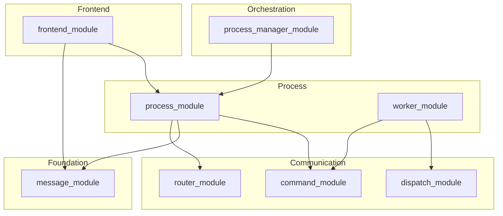

# Каталог модулей: фреймворк + прототип

**Назначение:** единая точка для людей и агентов — что где лежит, зачем, с чем связано. Отсюда удобно строить **C4 / Mermaid / зависимости** без чтения всего кода.

**Правило импортов фреймворка:** между модулями — только из чужого `interfaces.py` (см. правила репозитория).

**Обновление:** при добавлении подпакета — одна строка в таблицу раздела прототипа или уточнение в README модуля.

---

## Часть A — Multiprocess Framework (`multiprocess_framework/modules/`)

### A.1 Пакеты (19 под `modules/`)

| Модуль | Слой | Назначение (1 строка) | Публичный вход | Типичные потребители |
|--------|------|------------------------|----------------|----------------------|
| **base_manager** | Foundation | Базовый менеджер, ObservableMixin, адаптеры | `interfaces.py`, `BaseManager` | почти все менеджеры |
| **data_schema_module** | Foundation | Схемы Pydantic, `process()`, регистрация схем | `interfaces.py`, `SchemaBase`, `process` | config, registers, приложения |
| **message_module** | Foundation | Сообщения, `MessageAdapter`, Dict at Boundary | `interfaces.py`, `Message`, `MessageAdapter` | process, router, frontend |
| **channel_routing_module** | Routing | CRM, каналы, буферы, базовый класс менеджеров | `ChannelRoutingManager`, README | logger, error, stats, router |
| **dispatch_module** | Communication | Диспетчеризация по ключу **внутри** обработчика | `interfaces.py`, `IDispatcher` | worker после parse сообщения |
| **router_module** | Communication | RouterManager, каналы, send/receive | `interfaces.py`, `IRouterManager` | process_module |
| **command_module** | Communication | CommandManager, **CommandAdapter** (внутри процесса) | `interfaces.py` | process_module, workers |
| **logger_module** | Infra | Логирование, каналы | README / пакет | все процессы |
| **error_module** | Infra | Ошибки, маршрутизация severity | README / пакет | logger, процессы |
| **statistics_module** | Infra | Метрики, CRM-наследник | README, `StatsManager` | процессы, команды |
| **config_module** | Infra | Конфиг из схем, hot-reload опции | README / пакет | frontend_module, приложения |
| **console_module** | Infra | Терминальные окна (если используются) | README | опционально |
| **shared_resources_module** | Infra | SHM, очереди, события | `interfaces.py`, SRM | process, camera, processor |
| **registers_module** | Infra | RegistersManager, connection_map builder | `interfaces.py` | frontend_module, приложение (схемы снаружи) |
| **sql_module** | Storage | SQL-менеджер, запросы через сообщения | README | опциональный DB-процесс |
| **worker_module** | Process | Воркеры, жизненный цикл задач | README | process_module |
| **process_module** | Process | ProcessModule, интеграция менеджеров | README, `core/process_module.py` | приложения, launcher |
| **process_manager_module** | Orchestration | SystemLauncher, оркестрация процессов | README | main.py приложений |
| **frontend_module** | Frontend | FrontendManager, WindowManager, **RoutedCommandSender** (outbound COMMAND), мост регистров, UI | `interfaces.py` (`IRouterLike`, `SupportsCommandMessage`), README | GUI-процесс |

### A.2 Рёбра «кто кого трогает» (для диаграмм)

Упрощённый граф **сообщений и команд** (не все импорты):

**Легенда для агентов:**

- **GUI → другой процесс:** `MessageAdapter.command` → `ProcessModule.send_message` → очередь (см. `IRouterLike` во `frontend_module.interfaces`).
- **Сообщение пришло в процесс:** разбор dict → при необходимости `CommandManager.handle_command` → внутри может быть `dispatch_module`.

---

## Часть B — Прототип (`multiprocess_prototype/`)

### B.1 Пакеты верхнего уровня

| Путь | Назначение | Ключевые файлы | Зависит от (фреймворк) |
|------|------------|----------------|-------------------------|
| **main.py** | Точка входа, SystemLauncher | `main.py` | process_manager, data_schema |
| **backend/** | Процессы, домен camera/processor/renderer, БД | `processes/*`, `modules/*`, `gui_process_mixin.py` | process, message, worker, shared_resources |
| **frontend/** | Qt UI: лаунчер, окна, вкладки, команды GUI | `launcher.py`, `windows/`, `widgets/`, `commands/` | frontend_module, message (через процесс) |
| **registers/** | Схемы регистров приложения, factory, routing команд | `schemas/`, `factory.py`, `command_routing.py`, `gui_command_catalog.py` | data_schema, registers_module |
| **persistence/** | Данные на диске, user_prefs | `paths.py`, `user_prefs.py` | — |
| **utils/** | Генератор кадров, webcam, shm utils | `*.py` | numpy, opencv опционально |
| **tests/** | pytest | `test_*.py` | всё выше |

### B.2 Шаблон масштабирования UI (много окон и виджетов)

| Правило | Смысл |
|---------|--------|
| **Одна фича — одна папка** | `frontend/widgets/<feature>/`: `widget.py`, `config.py`, опционально `ui_config.py` (подписи без register_update). |
| **Окно — то же** | `frontend/windows/<name>/`: окно + `config.py`. |
| **Регистрация окон** | Только через **`window_registry`** в конфиге + фабрики в одном месте (лаунчер / будущий `FrontendAppLauncher`). Не создавать окна «в обход» WindowManager. |
| **Команды vs регистры** | Изменяемые поля алгоритма — **registers** + `set_field_value`; разовые действия — **command_id** + `RoutedCommandSender` / handler. |
| **Переиспользование** | Новые контролы по возможности из **`frontend_module.components`**; доменная логика отображения — в прототипе. |

### B.3 Точки расширения без новых слоёв

1. Новая вкладка → папка виджета + запись в `tabs` / `tab_factory`, без дублирования лаунчера.
2. Новое окно → запись в `window_registry` + фабрика `wm.register(name, factory)`.
3. Новая команда GUI → `command_routing.py` + `gui_command_catalog.py` (+ обработчик в целевом процессе).
4. Новое поле регистра → `schemas/<feature>/` + boot + `register_sync` в backend (см. `registers/CHECKLIST.md`).

---

## Часть C — Связь каталога с дорожной картой

| Задача из roadmap | Затрагиваемые строки каталога |
|-------------------|-------------------------------|
| RoutedCommandSender | **frontend_module** (+ использование **message_module**, контракт **IRouterLike** = **process_module**) |
| Убрать дубль mixin/handler | **frontend** (`commands/`, `backend/gui_process_mixin`) |
| Каркас лаунчера | **frontend_module** + **frontend/launcher.py** |
| Приём команды в worker | **command_module**, опционально **dispatch_module** |

---

## Часть D — Как использовать для диаграмм

1. **Контекстная диаграмма:** узлы = строки таблицы A.1 или B.1; рёбра = «импортирует interfaces» или «шлёт сообщения».
2. **Последовательность GUI-команды:** Widget → Sender → MessageAdapter → send_message → Queue → Target Process → CommandManager.
3. **Регистр → процесс:** Widget → RegistersManager → FrontendRegistersBridge → router → `register_update`.

Дополнительно: [ROUTING_GLOSSARY.md](./ROUTING_GLOSSARY.md), [FRONTEND_COMMAND_LAUNCHER_ROADMAP.md](./FRONTEND_COMMAND_LAUNCHER_ROADMAP.md).
