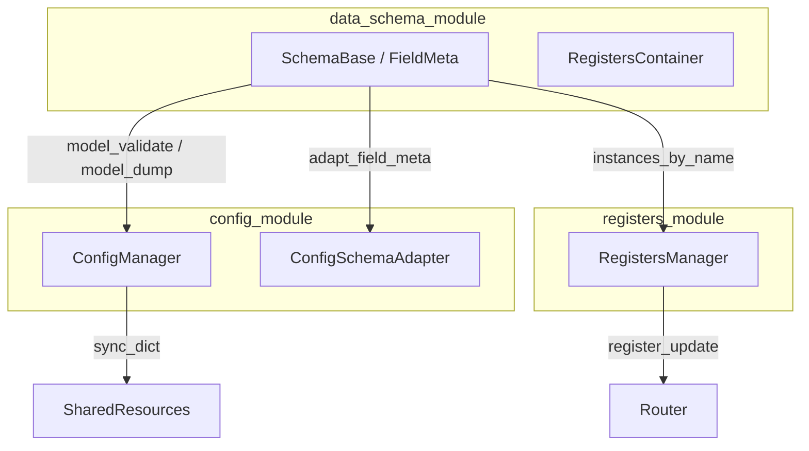

# Руководство по конфигурации (единый контур)

**Заменяет** для повседневного чтения три раздельных документа (полные тексты в [archive/](./archive/)):

- [archive/CONFIG_SCHEMA_REGISTERS.md](./archive/CONFIG_SCHEMA_REGISTERS.md) — три слоя и публичный API
- [archive/CONFIG_SCHEMA_DATA_FLOW.md](./archive/CONFIG_SCHEMA_DATA_FLOW.md) — потоки по модулям
- [archive/CONFIG_PATHS.md](./archive/CONFIG_PATHS.md) — ветки доставки и антипаттерны

**Глобальные ADR:** [DECISIONS.md](../DECISIONS.md) — ADR-008 (Dict at Boundary), ADR-023, ADR-102, ADR-112.

---

## 1. Три слоя

| Слой | Модуль | Вопрос |
|------|--------|--------|
| **Форма данных** | `data_schema_module` | Какие поля, типы, `FieldMeta` / `FieldRouting`, сериализация? |
| **Рантайм-конфиг** | `config_module` | Как хранить дерево настроек (dot-keys, подписки), описание для UI? |
| **Регистры процесса** | `registers_module` | Именованные экземпляры регистров, снимки, карты доставки `register_update`? |

**Не путать:** `RegistersContainer` (`data_schema_module`) — файлы и пакеты; `RegistersManager` (`registers_module`) — живое состояние в процессе.

---

## 2. Schema → dict → процессы

1. На границе IPC/файлов — **`dict`** (`model_dump()`, агрегаты `registers_*`).
2. **`build()`** / **`process()`** (`data_schema_module`) собирают `(name, proc_dict)` для `SystemLauncher.add_process`.
3. После старта OS-процесса **bundle** (`queues`, `config`, `custom`, …) восстанавливает `SharedResourcesManager` и `ProcessModule`; `ProcessConfigHandler` связывает конфиг с `ConfigManager` при необходимости.

Контракт полей: [modules/process_manager_module/docs/CONFIG_CONTRACT.md](../modules/process_manager_module/docs/CONFIG_CONTRACT.md).

---

## 3. Ветки доставки (после dict)

| Ветка | Артефакт | Кто пишет | Кто читает |
|-------|-----------|-----------|------------|
| Launcher | `proc_dict` | приложение / `process()` | `SystemLauncher`, `merge_with_defaults` |
| Child runtime | `bundle` | оркестратор / spawner | `process_runner` → SRM → `ProcessModule` |
| Регистры / рецепты | снимок dict | GUI / рецепты | `model_validate_all`, YAML |
| ConfigStore | dict по имени процесса | `register_process` (родитель) | `get_process_config`, синхронизация с `config_module` |

В дочернем процессе после регистрации `ProcessData` выполняется **`config_store.store(process_name, slice)`** с pickle-safe срезом конфигурации (см. `process_runner`).

---

## 4. Фасад чтения конфига в процессе

- Используйте **`IProcessModule.get_config` / `update_config`** и **`process.config_handler`** после `initialize()`.
- Не разбирайте `bundle` вручную в прикладном коде.

---

## 5. Антипаттерны

- Собирать «третий» формат dict в обход `build()` / `process()` / `model_dump()`.
- Писать произвольные partial dict для регистров вместо `model_dump_all` / `model_validate_all`.
- В прикладном коде процесса читать только `bundle["config"]`, игнорируя `ProcessModule`.

---

## 6. См. также

- [QUICK_START.md](./QUICK_START.md) — минимальный запуск
- [ADR_REGISTRY.md](./ADR_REGISTRY.md) — модульные ADR (CFG, DS, RM, …)
- [FRAMEWORK_OVERVIEW.md](./FRAMEWORK_OVERVIEW.md)
