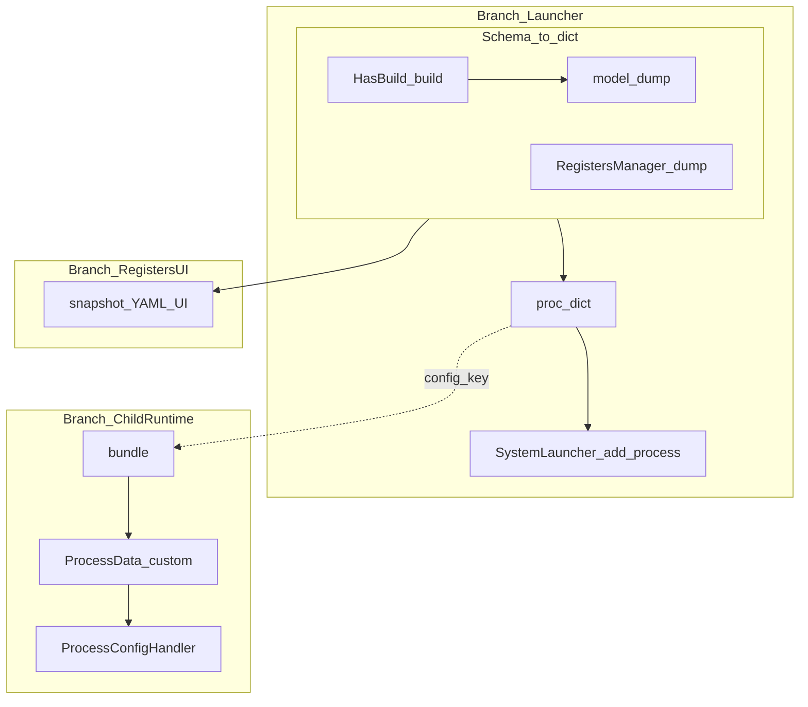

# multiprocess_framework\docs\CONFIG_PATHS.md

# Слой преобразования и ветки доставки dict

Документ задаёт **единую ментальную модель**: сначала типизированные схемы приложения становятся **`dict`** через **канонические** точки; затем **разные ветки** только передают этот dict потребителям (launcher, bundle/runtime, регистры). Дополняет [CONFIG_SCHEMA_DATA_FLOW.md](./CONFIG_SCHEMA_DATA_FLOW.md), [DECISIONS.md](../DECISIONS.md) (ADR-008, ADR-023, **ADR-102**).

---

## 1. Слой преобразования: schema → dict

Использовать **одно семейство** приёмов, не собирать «третий» формат вручную.

| Механизм | Где | Назначение |
|----------|-----|------------|
| **`HasBuild.build()`** | Приложение, модели с `build()` | Возврат `(name, proc_dict)`; внутри — обычно `model_dump()` в `proc_dict["config"]`. |
| **`config_to_dict` / `process()`** | `data_schema_module` | Сборка из объектов с `build()` в структуру для launcher. |
| **`model_dump()` / `model_validate()`** | `SchemaBase`, Pydantic-модели регистров | Сериализация / загрузка снимков. |
| **`RegistersManager.model_dump_all()` / `model_validate_all()`** | `registers_module` | Экспорт/импорт всех регистров одним dict. |
| **`ConfigSchemaAdapter.adapt_instance`** | `config_module` | Дерево параметров из экземпляра схемы через `model_dump()`. |

**Правило:** перевод «схема → dict для launcher» делается в **`build()`** (или через `data_schema_module.process`), а не размазанным ручным dict по коду приложения.

---

## 2. Ветки доставки (после dict)

Ветка отвечает на вопрос **«куда передали dict»**, а не «как получили dict».

| Ветка | Артефакт | Кто пишет | Кто читает |
|-------|-----------|-----------|------------|
| Launcher | `proc_dict` (+ `config`) | Приложение / `data_schema.process` | `SystemLauncher`, `merge_with_defaults` |
| Child runtime | `bundle` (`queues`, `config`, `custom`, `routing_map`) | Оркестратор / spawner | `process_runner` → SRM → `ProcessModule` |
| Регистры / рецепты | Снимок dict | GUI / `RecipeManager` | `model_validate_all`, сохранение YAML |
| ConfigStore | `dict` по имени процесса | `SharedResourcesManager.register_process` (родитель); в child после bundle — см. ниже | `get_process_config`, синхронизация с `config_module` при наличии |

---

## 3. Child-процесс и ConfigStore (политика B2)

В родителе полный **`proc_dict`** попадает в **ConfigStore** через `SharedResourcesManager.register_process`.

В дочернем процессе SRM поднимается из **bundle** (`_build_shared_resources_from_bundle`). Чтобы **`get_process_config(name)`** не был пустым без причины, после регистрации `ProcessData` в child выполняется **`config_store.store(process_name, slice)`**, где `slice` — pickle-safe логический срез: `{"process": bundle_config, "managers": ...}` (см. `process_runner`). Это **не** полная копия `proc_dict` (нет объектов очередей), а согласованный runtime-срез для доступа через SRM.

Если код читает конфиг **внутри** процесса, предпочтительнее **`IProcessModule.get_config` / `config_handler`** (фасад), а не прямой разбор bundle.

---

## 4. Фасад чтения конфига в процессе

- **Единая точка для прикладного кода процесса:** [IProcessModule.get_config / update_config](../modules/process_module/interfaces.py) и `process.config_handler` после `initialize()`.
- Не ходить в SRM/ConfigStore/`bundle` вручную в типовом коде вкладок и воркеров.

Опциональный отдельный тип **`ProcessConfigView` (Protocol)** не введён: текущего контракта `IProcessModule` достаточно; при необходимости см. ADR-102.

---

## 5. Антипаттерны

- Собирать **`proc_dict`** вручную из полей регистров **в обход** `build()` / `process()`.
- Вводить **несовместимый** «секретный» формат dict для регистров вместо `model_dump` / `model_validate_all`.
- В прикладном коде процесса читать **сырой** `bundle["config"]`, если уже есть **`ProcessModule`**.

---

## 6. Аудит прототипа (ручные dict)

Проверка **`multiprocess_prototype`** и **`multiprocess_prototype_v2`**: точки входа [`multiprocess_prototype/main.py`](../../multiprocess_prototype/main.py), [`multiprocess_prototype_v2/main.py`](../../multiprocess_prototype_v2/main.py) и тесты используют **`process(...)`** из `data_schema_module` и `add_process(*process(...))` — **обхода `build()`/`process()` нет**. Риск на будущее: новые процессы с большим литералом `proc_dict` без `HasBuild`. Рекомендация при ревью — опираться на раздел «Слой преобразования» выше.

---

## 7. Связанные документы

| Документ | Содержание |
|----------|------------|
| [CONFIG_SCHEMA_DATA_FLOW.md](./CONFIG_SCHEMA_DATA_FLOW.md) | Пошаговые потоки по модулям |
| [modules/process_manager_module/docs/CONFIG_CONTRACT.md](../modules/process_manager_module/docs/CONFIG_CONTRACT.md) | Поля `proc_dict` |
| [modules/process_module/docs/examples/process_config_canonical_examples.py](../modules/process_module/docs/examples/process_config_canonical_examples.py) | Формы dict в процессе |
| [DECISIONS.md](../DECISIONS.md) | ADR-008, ADR-023, ADR-102 |

---

*При смене контрактов обновляйте этот файл, CONFIG_SCHEMA_DATA_FLOW и ADR.*
