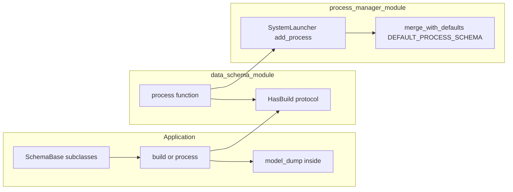
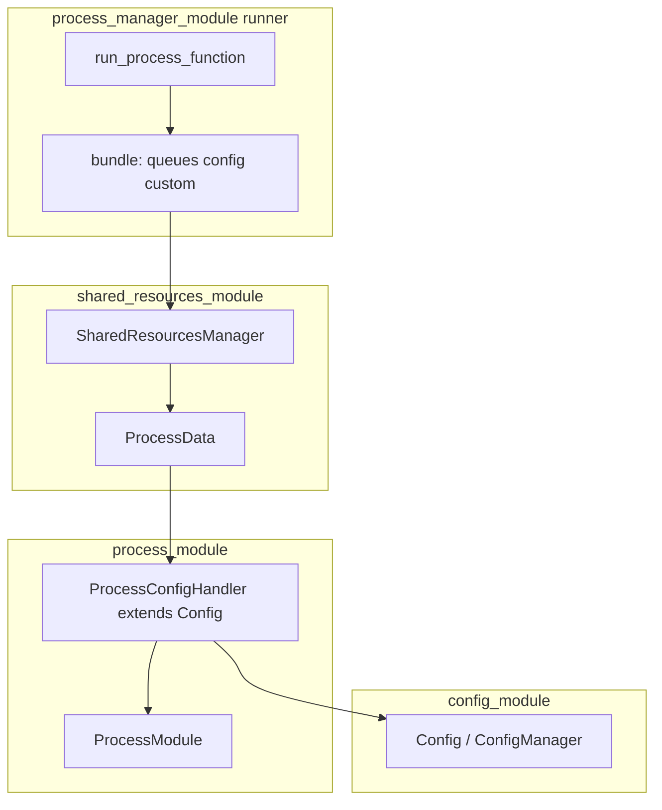

# multiprocess_framework\docs\CONFIG_SCHEMA_DATA_FLOW.md

# Цепочка данных: SchemaBase, dict, Config и процессы

Сводный документ: **кто за что отвечает** и **как связаны** `data_schema_module`, `config_module`, `process_module`, `process_manager_module`, `registers_module`, `shared_resources_module`. Дополняет [FRAMEWORK_OVERVIEW.md](./FRAMEWORK_OVERVIEW.md) и [DECISIONS.md](../DECISIONS.md) (ADR-008 Dict at Boundary, ADR-023 config_module).

**Ментальная модель «один слой schema→dict, разные ветки доставки»:** [CONFIG_PATHS.md](./CONFIG_PATHS.md) (канонические API, ветки launcher/bundle/регистры, фасад `get_config`, антипаттерны).

---

## 1. Принцип: Dict at Boundary

На границах процессов и публичных API фреймворка передаются **только `dict`**, не экземпляры Pydantic. Схемы (`SchemaBase`) живут в приложении или в слоях подготовки данных; сериализация в dict — обычно **`model_dump()`** (Pydantic v2) или результат **`build()`** (протокол `HasBuild`).

---

## 2. Поток «приложение → лаунчер»

| Шаг | Модуль | Что происходит |
|-----|--------|----------------|
| 1 | Приложение | Классы конфигов наследуют `SchemaBase`; поля валидируются при создании. |
| 2 | Приложение | `build()` возвращает `(name, proc_dict)`; в `proc_dict["config"]` кладётся dict (часто `self.model_dump()`). |
| 3 | `data_schema_module` | `process(cfg, *workers)` вызывает `build()` у каждого `HasBuild` и собирает `workers` в `proc_dict`. |
| 4 | `process_manager_module` | `SystemLauncher.add_process(name, proc_dict)`; `merge_with_defaults(proc_dict, DEFAULT_PROCESS_SCHEMA)` дополняет `class`, `queues`, `priority`, `workers`. |

Подробный контракт полей: [../modules/process_manager_module/docs/CONFIG_CONTRACT.md](../modules/process_manager_module/docs/CONFIG_CONTRACT.md).  
Эталонные примеры dict: [../modules/process_manager_module/docs/examples/proc_dict_canonical_examples.py](../modules/process_manager_module/docs/examples/proc_dict_canonical_examples.py).

---

## 3. Поток «после старта OS-процесса»

| Компонент | Ответственность |
|-----------|-----------------|
| `process_runner` | Собирает bundle (очереди, `config`, `custom`), регистрирует состояние в SRM. |
| `shared_resources_module` | Очереди, SharedMemory, `ConfigStore` (dict между процессами), без валидации схем. |
| `ProcessConfigHandler` | Обёртка над `config_module.Config`: доступ к конфигу процесса, `get_managers_config` и т.д. |
| `ProcessModule` | Жизненный цикл, менеджеры, коммуникация; конфиг приходит как **dict**. |

Эталонные примеры dict внутри процесса: [../modules/process_module/docs/examples/process_config_canonical_examples.py](../modules/process_module/docs/examples/process_config_canonical_examples.py).

---

## 4. Роли модулей по слоям

| Модуль | Роль в цепочке «схема → dict → runtime» |
|--------|----------------------------------------|
| **data_schema_module** | **ЧТО:** `SchemaBase`, `FieldMeta`, валидация, `merge_with_defaults`, `process()` / `config_to_dict` для `HasBuild`, сериализация через `model_dump` / конвертеры. Не заменяет runtime-контейнер конфигурации. |
| **config_module** | **КАК (runtime):** `Config`, `ConfigManager` — dict уже готов; dot-path, подписки, секции, env-fallback, синхронизация с `ConfigStore`. Не дублирует валидацию схемы (см. ADR-023). |
| **process_manager_module** | Оркестрация OS-процессов: только **`add_process(name, proc_dict)`**; нормализация по `DEFAULT_PROCESS_SCHEMA`. |
| **process_module** | Базовый процесс: `ProcessConfigHandler` + dict; `get_config` / `update_config` на границе IProcessModule. |
| **registers_module** | Хранит **имя → экземпляр модели** регистра; снимки через **`model_dump()`** / `model_validate()`, UI и `register_update`. Не является обязательным звеном для сборки `proc_dict`. |
| **shared_resources_module** | Инфраструктура: очереди, память, реестр состояний; **ConfigStore хранит dict**. |

---

## 5. Где вызывается `model_dump()`

- У любого **`SchemaBase`** (наследник Pydantic `BaseModel`) — метод **`model_dump()`** доступен напрямую.
- **`RegistersManager`**: при снимке регистров вызывает `reg.model_dump()` для каждого экземпляра.
- **`config_module.ConfigSchemaAdapter`**: `adapt_instance` читает `schema_instance.model_dump()` для дерева параметров.
- Перевод «схема → dict для launcher» в приложении обычно **внутри `build()`**, а не внутри `config_module`.

---

## 6. Связанные документы

| Документ | Содержание |
|----------|------------|
| [modules/config_module/README.md](../modules/config_module/README.md) | Роль config vs data_schema vs ConfigStore |
| [modules/config_module/docs/ARCHITECTURE.md](../modules/config_module/docs/ARCHITECTURE.md) | Диаграмма слоёв |
| [modules/data_schema_module/README.md](../modules/data_schema_module/README.md) | SchemaBase, конвертеры |
| [modules/process_manager_module/docs/CONFIG_CONTRACT.md](../modules/process_manager_module/docs/CONFIG_CONTRACT.md) | Поля `proc_dict` |
| [DECISIONS.md](../DECISIONS.md) | ADR-008, ADR-023, ADR-102 и др. |
| [CONFIG_PATHS.md](./CONFIG_PATHS.md) | Слой преобразования schema→dict и ветки доставки |

---

*Документ добавлен для единой точки входа по цепочке конфигурации; при изменении контрактов обновляйте этот файл, [CONFIG_PATHS.md](./CONFIG_PATHS.md) и ссылки на модульные README.*
