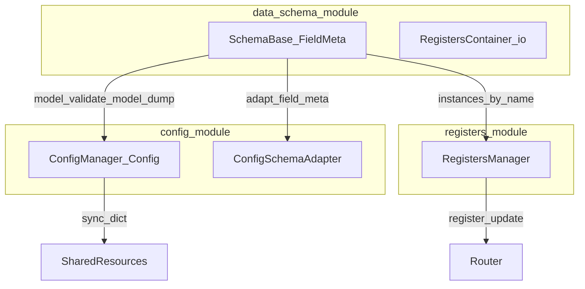

# Конфиги, схемы и регистры

Цепочка ответственности и единый контур данных во фреймворке (см. **ADR-112** в `DECISIONS.md`). Документ дополняет [CONFIG_SCHEMA_DATA_FLOW.md](./CONFIG_SCHEMA_DATA_FLOW.md) и [CONFIG_PATHS.md](./CONFIG_PATHS.md).

**Сквозные примеры:** [§4](#4-сквозной-пример-data_schema--config_module--модуль-statsmanager) — `StatsManagerConfig` от схемы до dict и `ConfigSchemaAdapter`; [§5](#5-второй-пример-log_dir-loggermanagerconfig-и-граница-процесса) — `log_dir`, `from_log_dir` / `managers_from_log_dir`, `managers_for_proc_dict` / `managers_payload_for_proc`, `logger.log_directory`.

---

## 1. Три слоя одним взглядом

| Слой | Модуль | Вопрос, на который отвечает |
|------|--------|------------------------------|
| **Форма данных** | `data_schema_module` | Какие поля, типы, ограничения, метаданные UI/роутинга? Как сериализовать модель в dict/JSON/YAML? |
| **Рантайм-конфиг** | `config_module` | Как хранить и менять **дерево настроек** в процессе (dot-keys, подписки, опционально SharedResources)? Как описать поля схемы для редактора? |
| **Регистры процесса** | `registers_module` | Как держать **именованные экземпляры** регистров, отдавать снимки, валидировать поля, строить карты доставки `register_update`? |

**Не путать:**

- **`RegistersContainer`** (`data_schema_module.container`) — набор классов/экземпляров, **файлы** YAML/JSON, diff, обнаружение пакетов. Нет интеграции с Router/frontend-событиями.
- **`RegistersManager`** (`registers_module`) — те же Pydantic-модели в роли **живого состояния** в процессе: подписки, `set_field_value`, доставка в другие процессы.



---

## 2. Инвентарь публичного API

Ниже — что обычно импортируют **снаружи** модуля. Внутренние подпакеты (`data_schema_module/registry/`, …) — по необходимости, не как «обязательный» контракт.

### 2.1 `data_schema_module`

| Категория | Символы | Назначение |
|-----------|---------|------------|
| База схем | `SchemaBase`, `RegisterBase`, `SchemaMixin` | Pydantic-модели + `FieldMeta`, `update_field`, `build()` |
| Метаданные | `FieldMeta`, `FieldRouting`, `RegisterDispatchMeta` | Подписи, min/max, routing, dispatch процессов |
| Реестр классов | `register_schema`, `SchemaRegistry`, `get_default_registry` | Имя строки → класс схемы |
| Сериализация пакетов регистров | `registers_to_dict`, `registers_from_dict`, `registers_to_json`, …, `registers_to_flat_dict` | Несколько **именованных** моделей ↔ один словарь/файл (см. `serialization/io.py`) |
| Контейнер | `RegistersContainer` | Фабрика по карте `{имя: класс}`, `to_yaml`/`from_yaml` для **набора** регистров |
| Контракты | `interfaces.ISchema`, `ISchemaRegistry`, `ISchemaAdapter`, … | Для адаптеров и тестов |

**Граница:** на выходе в IPC/файлы — в типичном случае **`dict`** (`model_dump()` или агрегат из `registers_*`).

### 2.2 `config_module`

| Категория | Символы | Назначение |
|-----------|---------|------------|
| Рантайм | `Config`, `ConfigManager`, `ConfigSection` | `get`/`set` по dot-ключам, `create_config`, при наличии SRM — `sync_config` / `load_config_from_storage` |
| Контракты | `IConfig`, `IConfigManager` | Публичный API менеджера конфигураций |
| Схема менеджера | `ConfigManagerConfig` | Описание самого ConfigManager как SchemaBase |
| Мост из схемы | `ConfigSchemaAdapter` (`adapters/schema_adapter.py`) | `SchemaBase` → дерево **описаний параметров** (тип, default, constraints) для UI/редакторов |

`ConfigSchemaAdapter` **не** заменяет `SchemaBase`: он строит **представление для редактирования**, а не вторую модель данных.

### 2.3 `registers_module`

| Символ | Назначение |
|--------|------------|
| `RegistersManager` | Словарь `имя → экземпляр регистра`; `get_register`, `set_field_value`, `model_dump_all` / `model_validate_all`, подписки |
| `build_connection_map_from_registers` | `{register_name: process_name}` из `register_dispatch` на классах |
| `build_routing_map`, `get_routing_for_message`, `send_register_message` | Карта `(register, field) → channel` и отправка через роутер |
| `IRegistersManager`, `IRegistersConverter` | Протоколы для подстановки в тестах |

---

## 3. Единый контур данных (напоминание)

1. Вход в тип: **`Model.model_validate(dict)`** (после `json.loads` / `yaml.safe_load` при необходимости).
2. Выход на границе процесса: **`model_dump()`** → dict → JSON/YAML.
3. Лишние `from_yaml` на каждой схеме не добавлять; общий слой парсинга — в приложении или утилите.

---

## 4. Сквозной пример: data_schema → config_module → модуль (StatsManager)

Одна сущность — **`StatsManagerConfig`** ([`statistics_module/configs/stats_config.py`](../modules/statistics_module/configs/stats_config.py)) — проходит этапы ниже. Это иллюстрация **потока данных**, а не единственный способ сборки процесса.

| Шаг | Слой | Что происходит | Вид данных |
|-----|------|----------------|------------|
| 1 | **data_schema_module** | Класс `StatsManagerConfig(SchemaBase)` + `FieldMeta` на полях | Python-модель; `get_all_fields_meta()` для метаданных |
| 2 | **Вход из файла** | `yaml.safe_load` → **`StatsManagerConfig.model_validate(dict)`** | Валидированный экземпляр; ошибки — на границе парсинга |
| 3 | **Граница Dict / IPC** | **`cfg.model_dump()`** | Вложенный **dict** — канон для передачи в `managers["stats"]`, в сообщения, в файлы |
| 4 | **config_module (UI)** | **`ConfigSchemaAdapter().adapt(StatsManagerConfig)`** | Словарь **описаний** полей: `type`, `default`, `constraints`, `description` — для форм, **не** для IPC |
| 5 | **config_module (рантайм)** | Опционально: **`ConfigManager.create_config("app", {...})`**, `cfg.set("managers.stats.aggregation_interval", 3.0)` | Дерево с **dot-ключами**; при необходимости `sync_config` → SharedResources |
| 6 | **Модуль статистики** | `ProcessManagers` отдаёт в **`StatsManager`** секцию `managers["stats"]` (тот же dict по смыслу, что из `model_dump` вложенной схемы) | **dict** → инициализация менеджера в процессе |

**Шаг 4 — фрагмент ответа адаптера (идея):**

```python
from config_module.adapters.schema_adapter import ConfigSchemaAdapter
from statistics_module.configs.stats_config import StatsManagerConfig

params = ConfigSchemaAdapter().adapt(StatsManagerConfig)
# params["aggregation_interval"] ≈ {
#   "type": "float", "default": 5.0,
#   "constraints": {"min": 0.1, "max": 60.0},
#   "description": "Интервал агрегации, сек",
# }
```

**Шаг 3 — тот же payload, что окажется в `proc_dict["config"]["managers"]["stats"]` при сборке из `ManagersConfig`:**

```json
{
  "manager_name": "StatsManager",
  "aggregation_interval": 2.0,
  "flush_interval": 15.0,
  "enable_logging": true,
  "log_level": "DEBUG",
  "default_tags": {},
  "retention_seconds": 1800.0,
  "channels": {}
}
```

**Итог:** `config_module` **не** задаёт отдельный «магический» формат данных: он даёт **дерево настроек** (`Config`) и/или **описание полей** (`ConfigSchemaAdapter`). Менеджер потребляет **dict**, согласованный со схемой.

---

## 5. Второй пример: `log_dir`, `LoggerManagerConfig` и граница процесса

Здесь важно видеть **два уровня пути** и что попадает в IPC.

### 5.1 Поля в `ManagersConfig` (см. [`managers_config.py`](../modules/process_module/configs/managers_config.py))

| Поле | Назначение |
|------|------------|
| **`log_dir`** | Строка-корень для приложения: удобно для **`from_log_dir(log_dir)`** / **`managers_from_log_dir(log_dir)`** и для отображения; в **`managers_payload_for_proc()`** / **`managers_for_proc_dict()` не включается** |
| **`logger.log_directory`** | Поле внутри **`LoggerManagerConfig`**: база для относительных `file_path` каналов и `modules` (см. [`log_paths.py`](../modules/logger_module/core/log_paths.py)) |

После **`ManagersConfig.from_log_dir("/data/app/logs")`** оба обычно согласованы с одним абсолютным каталогом; **`logger`** дополнительно получает правку **`scopes["BUSINESS"].min_level`** под уровень из env.

### 5.2 Цепочка `from_log_dir` / `managers_from_log_dir`

Реализация — **`managers_from_log_dir`** в [`managers_config.py`](../modules/process_module/configs/managers_config.py); **`ManagersConfig.from_log_dir`** делегирует в неё с **`model_cls=cls`** (подклассы прототипа передают свой тип через тот же **`classmethod`**).

1. Нормализация пути (`Path.resolve()`), **`mkdir(parents=True)`**.
2. Сборка **`LoggerManagerConfig`** с `log_directory=<abs>`, `default_level`, правка `scopes`.
3. **`ErrorManagerConfig`** с абсолютными `*_file_path` в том же каталоге.
4. Остальные секции — дефолты.

### 5.3 Выход в IPC: `managers_payload_for_proc` / `managers_for_proc_dict()`

```python
from multiprocess_framework.modules.process_module.configs.managers_config import (
    managers_payload_for_proc,
)

d = managers_payload_for_proc(managers_config)
# эквивалентно:
d = managers_config.managers_for_proc_dict()
```

- Ключа **`log_dir` нет** — только `logger`, `error`, `stats`, `router`, `command`, `console`.
- В **`d["logger"]`** есть **`log_directory`** (строка), **`channels`**, **`scopes`**, **`modules`** — это читает **`LoggerManager`** при старте.

### 5.4 Где применяется путь в рантайме

**`LoggerManager`** при открытии файлов вызывает **`resolve_log_file_path(..., log_directory=self.config.log_directory)`** — относительные имена вроде `system.log` превращаются в файлы под корнем.

### 5.5 И `config_module`?

Корень логов задаётся **схемой процесса** (`ManagersConfig` / `from_log_dir`). При необходимости **то же значение** можно продублировать в **`Config`** под ключом вроде `paths.log_dir` для UI — это **удобство dot-доступа**, а не обязательный слой. Единый канон при рефакторинге может стать только **`logger.log_directory`** (без дубля `log_dir` на `ManagersConfig`); см. план рефакторинга `ManagersConfig`.

---

## 6. Пример: регистр в `RegistersManager` (прототип, `Rect`)

Регистр приложения — класс вроде **`Rect`** ([`multiprocess_prototype_v3/registers/rect.py`](../../multiprocess_prototype_v3/registers/rect.py)): `SchemaBase` + `FieldMeta`, имя в реестре схем `"RectV3"`.

### 6.1 Что «входит»

Снимок из рецепта или с бэкенда — **один словарь** с ключами регистров по имени:

```json
{
  "roi": {
    "x": 10,
    "y": 20,
    "width": 100,
    "height": 200
  }
}
```

### 6.2 Менеджер и загрузка

```python
from multiprocess_framework.modules.data_schema_module import SchemaBase
from multiprocess_framework.modules.registers_module import RegistersManager

# класс Rect импортируется из пакета прототипа
registers = RegistersManager(registers={"roi": Rect()})
registers.model_validate_all(
    {"roi": {"x": 10, "y": 20, "width": 100, "height": 200}}
)
```

Внутри для каждого имени вызывается **`type(instance).model_validate(data[name])`**.

### 6.3 Что «выходит»

- Текущее состояние в одном dict:

```python
snapshot = registers.model_dump_all()
```

Пример:

```json
{
  "roi": {
    "x": 10,
    "y": 20,
    "width": 100,
    "height": 200
  }
}
```

- Изменение поля из UI и доставка (упрощённо):

```python
registers.set_field_value("roi", "width", 128)
# при наличии routing / register_dispatch — вызов send_callback → Router → другой процесс
```

**Где `data_schema_module` без `RegistersManager`:** если нужно **сохранить набор** регистров в файл **без** подписок и роутера — `RegistersContainer` или функции `registers_to_yaml` / `registers_from_yaml` с фабрикой контейнера.

---

## 7. Сводка: «какой модуль для чего»

| Задача | Использовать |
|--------|----------------|
| Объявить тип полей алгоритма / ROI | `SchemaBase` + `FieldMeta` в `data_schema_module` |
| Передать настройки менеджера между процессами | `model_dump` / `model_validate` (dict) |
| Хранить настройки в приложении с dot-path и подписками | `ConfigManager` + `Config` |
| Показать форму редактирования по схеме | `ConfigSchemaAdapter.adapt(SchemaClass)` |
| Живое состояние регистров и маршрутизация изменений | `RegistersManager` |

---

## 8. Прототип приложения

Классы вроде `Rect` объявляются в пакете приложения с `@register_schema` и `FieldMeta`. Код прототипа **импортирует** схему и заполняет данные (`model_validate` из рецепта), не дублируя определение полей во фреймворке.

---

## 9. Зависимости между модулями

- `config_module` может опираться на **метаданные** `SchemaBase` через `ConfigSchemaAdapter`; **`data_schema_module` не зависит** от `config_module`.
- `registers_module` **не** объявляет классы регистров: только хранит экземпляры и обеспечивает маршрутизацию; форма классов — в приложении / `data_schema_module`.
