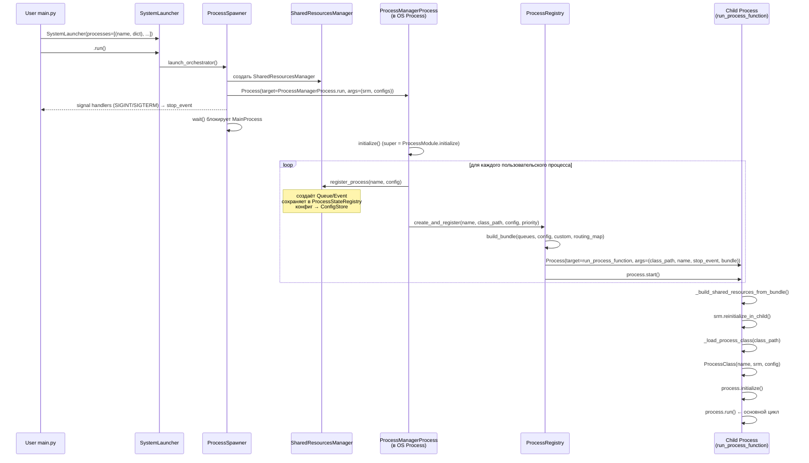
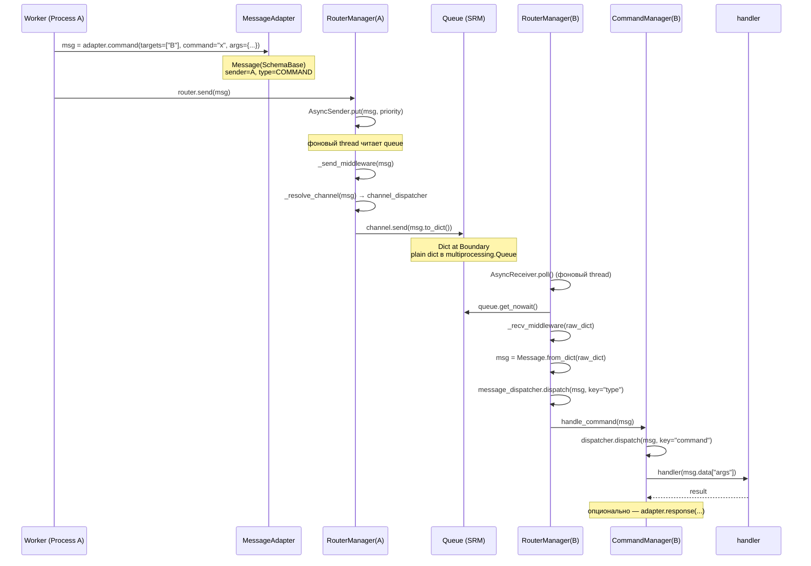
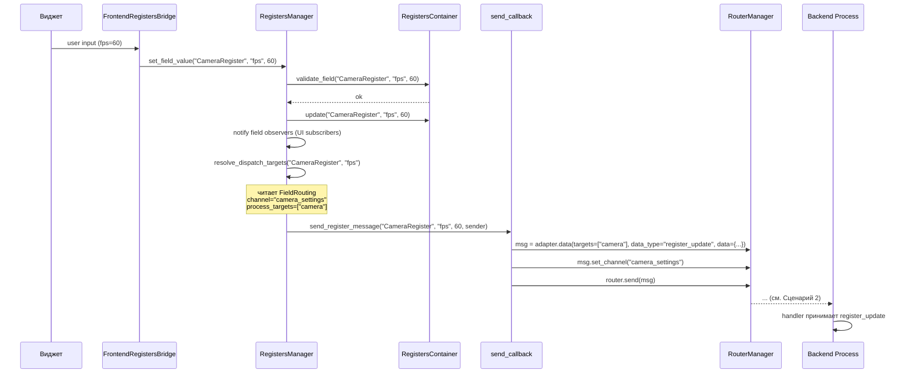
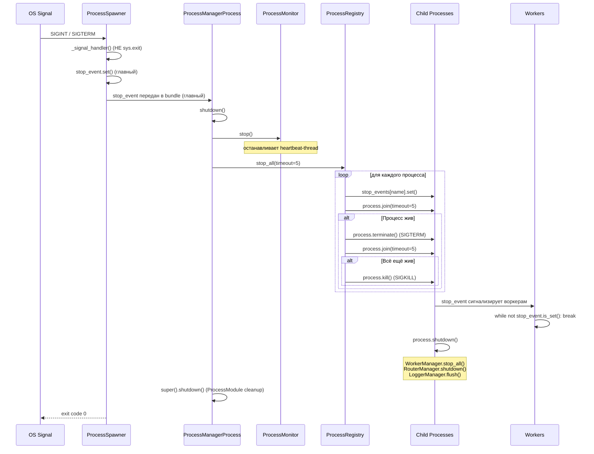
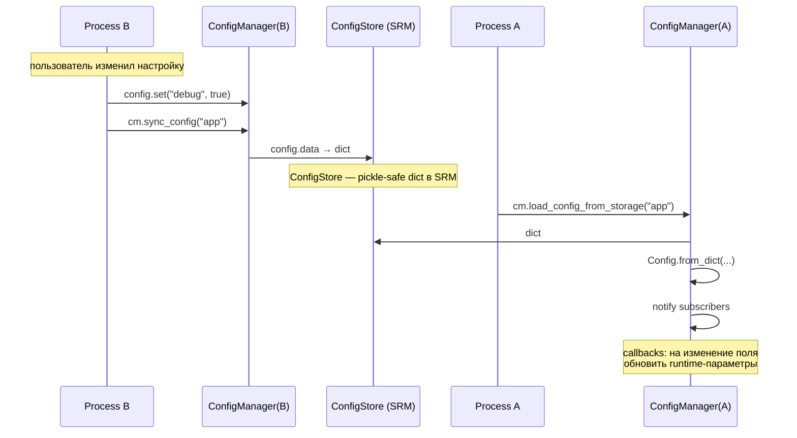
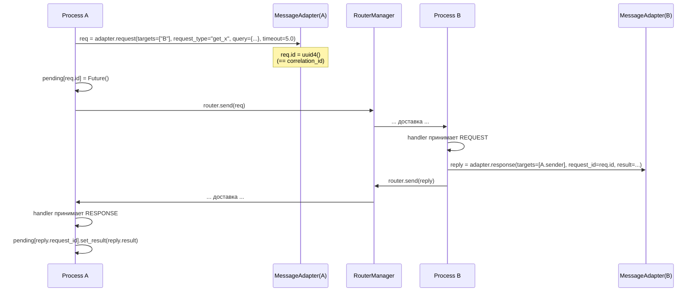
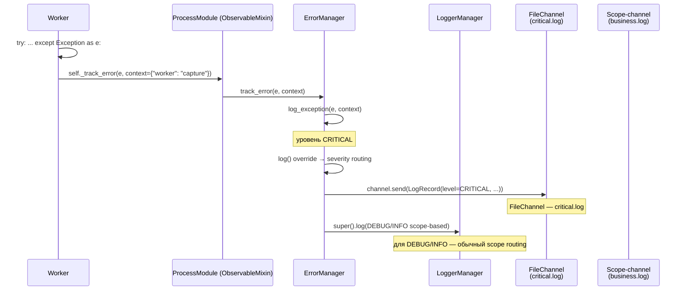
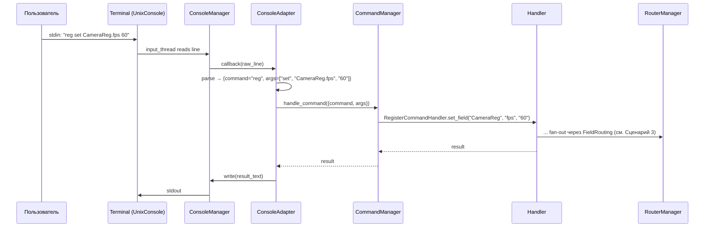

# Interaction Flows — Цепочки взаимодействия

**Назначение:** последовательности вызовов между модулями для ключевых сценариев. Mermaid + псевдокод. Документ отвечает на вопрос «*что происходит, когда…*».

> **Формат:** для каждого сценария — диаграмма + комментарии по шагам. Для полного описания модуля — см. [`MODULES_OVERVIEW.md`](MODULES_OVERVIEW.md) и `modules/<X>/README.md`.

---

## Сценарий 1 — Запуск системы

Пользователь запускает `python my_app.py` с `SystemLauncher`.

**Ключевые моменты:**
1. **SystemLauncher** принимает только `dict` — Dict at Boundary.
2. **ProcessSpawner** — минималист (ADR-PM-002): только SRM, без `ConfigManager/LoggerManager/ErrorManager`. Стандартные подсистемы создаёт сам `ProcessManagerProcess` как `ProcessModule`.
3. **ProcessRegistry** строит **per-process `stop_event`** (ADR-PM-001) — остановка одного не задевает остальных.
4. **bundle** — pickle-safe `dict` с кодом контракта в `bundle_contract.py` (ADR-PM-003).
5. **`run_process_function`** — top-level (pickle-safe), не метод. Восстанавливает SRM в дочернем процессе через `reinitialize_in_child()`.

---

## Сценарий 2 — Отправка сообщения (COMMAND)

Процесс A отправляет команду процессу B.

**Ключевые моменты:**
1. **MessageAdapter** фиксирует `sender` один раз (избавляет от дублирования).
2. **AsyncSender** — отдельный thread с `PriorityQueue`. Отправка сразу возвращается, реальная запись — позже.
3. **Channel resolver:** `RouterManager.channel_dispatcher` (он же `CRM._dispatcher`) возвращает имя канала по сообщению. Handler возвращает имя, а не результат записи (ADR-154).
4. **Dict at Boundary:** в `Queue` всегда `dict`, не `Message`-объект. На стороне B — `Message.from_dict()`.
5. **Двухуровневая диспетчеризация на B:** `message_dispatcher` (по `type`) → `CommandManager.dispatcher` (по `command`).

---

## Сценарий 3 — Изменение поля регистра с FieldRouting

Frontend меняет поле регистра → backend получает уведомление автоматически.

**Ключевые моменты:**
1. **Один источник истины:** `FieldRouting` декларирован в коде регистра один раз; `RegistersManager` использует его автоматически.
2. **Граница frontend / backend:** UI не знает про IPC — `RegistersManager` через `send_callback` делегирует в `RouterManager`.
3. **Two-step dispatch:** сначала observers внутри процесса (sync), потом fan-out по `process_targets`.

---

## Сценарий 4 — Graceful shutdown

Пользователь нажимает Ctrl+C.

**Ключевые моменты:**
1. **Никакого `sys.exit()` в signal handler** (ADR-PM-006). Только `stop_event.set()`. Это позволяет корректно завершить с записью данных.
2. **Per-process events** — остановка по одному.
3. **Двойной таймаут + kill():** при зависшем процессе система гарантированно закрывается за 5–10 сек.
4. **Воркеры обязаны проверять `stop_event` в каждой итерации `while`** (паттерн `while not stop_event.is_set():`). Без этого — terminate.

---

## Сценарий 5 — Cross-process конфигурация

Процесс A читает изменение конфига, обновлённое в процессе B.

**Ключевые моменты:**
1. **Dict at Boundary** для конфига — `ConfigStore` хранит plain dict, не Pydantic.
2. **Sync — pull-модель:** другие процессы должны явно вызвать `load_config_from_storage()`. Можно автоматизировать через `EventManager` (broadcast «config.updated») + подписка в `A`.

---

## Сценарий 6 — Request / Response с correlation_id

Синхронный запрос между процессами.

**Ключевые моменты:**
1. **`request_id`** в RESPONSE равен `id` исходного REQUEST.
2. **Таймаут** реализуется на стороне A (`Future.get(timeout=...)`), не во фреймворке.
3. **Pattern не блокирует:** worker thread A продолжает работать, ждёт async future.

---

## Сценарий 7 — Error → Logger → ErrorManager

Ошибка в worker'е автоматически проходит через цепочку.

**Ключевые моменты:**
1. **`_track_error`** — единый вход через `ObservableMixin`. Никакого `print(traceback)`.
2. **Severity routing:** WARNING/ERROR/CRITICAL → отдельные файлы по `_level_to_channel`. DEBUG/INFO — fallback на scope-based parent.
3. **Traceback** включается автоматически в `log_exception()`.

---

## Сценарий 8 — Console God Mode (interactive)

Пользователь в терминале набирает команду.

**Ключевые моменты:**
1. **God Mode** — это конфигурация (`ConsoleProcessConfig`), не отдельный класс (ADR-CM-002).
2. **Парсинг raw → dict** — в `ConsoleAdapter`, не в `CommandManager`.
3. **Один процесс** для God Mode-консоли запускается через `launcher.add_process(*process(ConsoleProcessConfig()))`.

---

## Полные точки для отладки

| Что отлаживать | Где включить логирование |
|----------------|--------------------------|
| Отправка сообщений | `RouterManager` (BUSINESS scope), `AsyncSender` (DEBUG) |
| Получение сообщений | `AsyncReceiver`, `message_dispatcher` (DEBUG) |
| Регистры | `RegistersManager` (BUSINESS scope) |
| ConfigStore sync | `ConfigManager` (DEBUG) |
| Жизненный цикл процессов | `ProcessRegistry` (SYSTEM scope), `ProcessMonitor` (DEBUG) |
| Воркеры | `WorkerManager` (DEBUG) |
| Команды | `CommandManager` (BUSINESS scope) |
| SQL | `SQLManager` (PERFORMANCE для timing, BUSINESS для запросов) |
