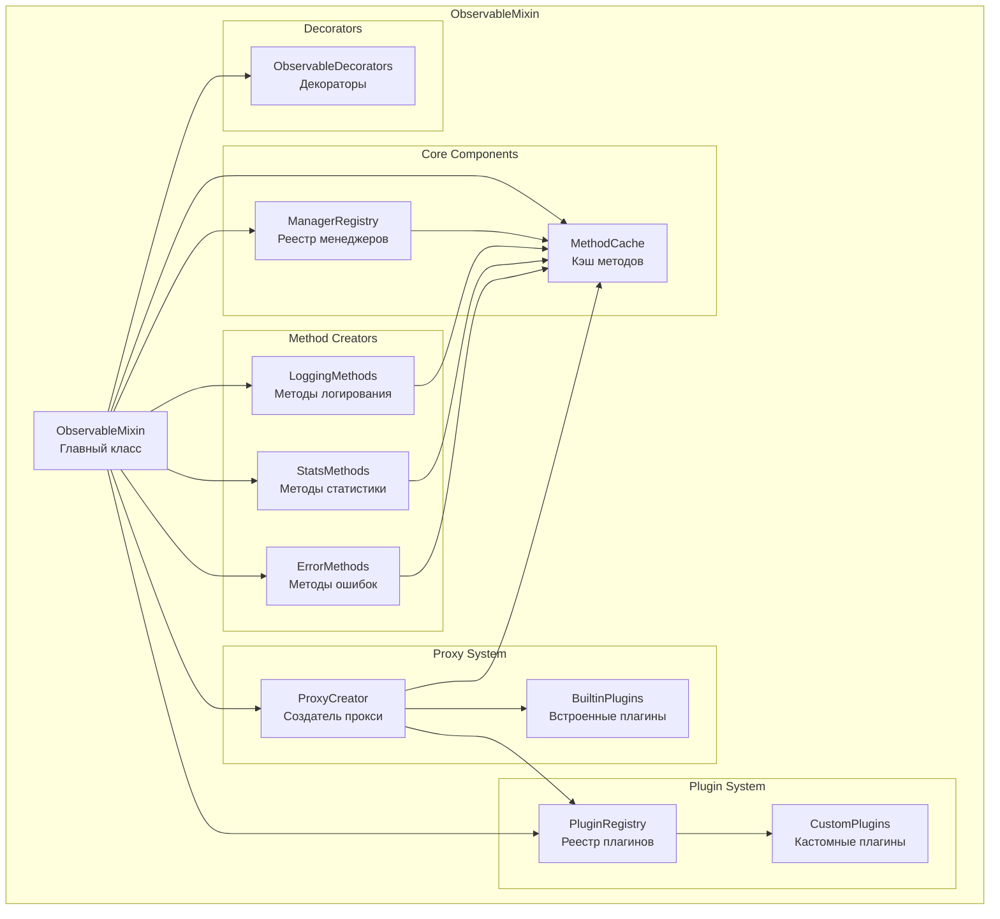
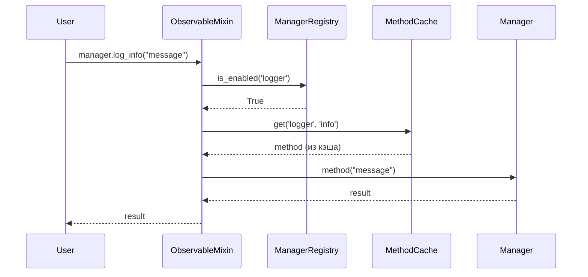
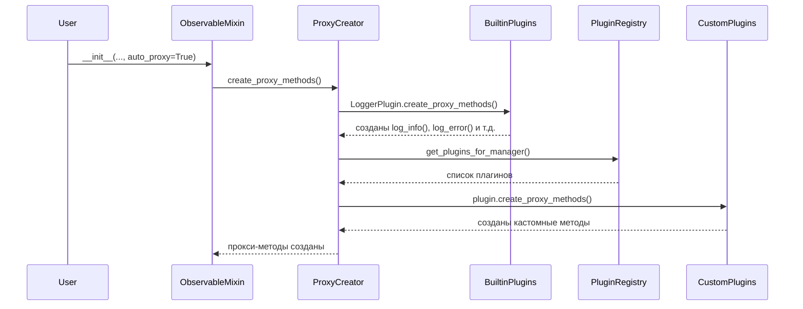
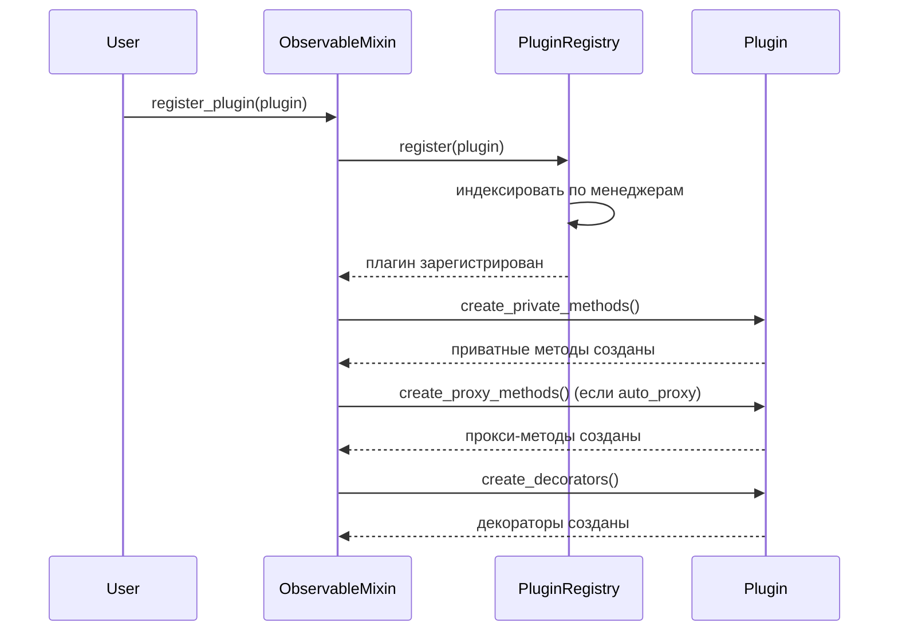
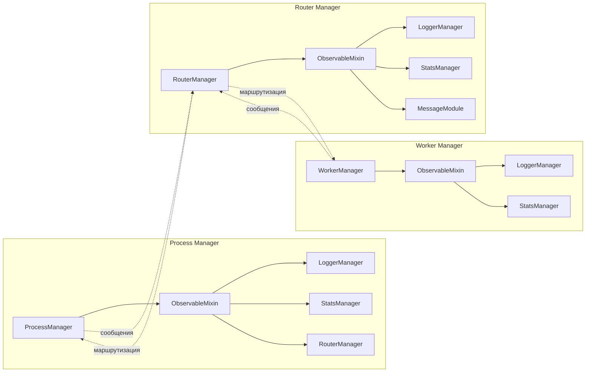
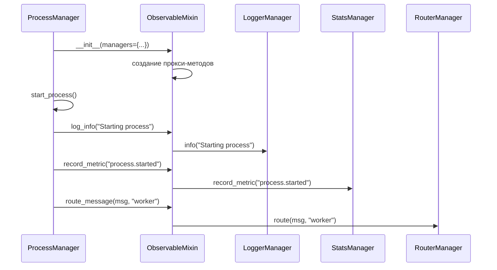

# Диаграммы взаимодействия компонентов ObservableMixin

## Архитектурная диаграмма

## Поток вызова метода

## Поток создания прокси-методов

## Поток регистрации плагина

## Взаимодействие с менеджерами системы

## Пример использования в Process Manager

