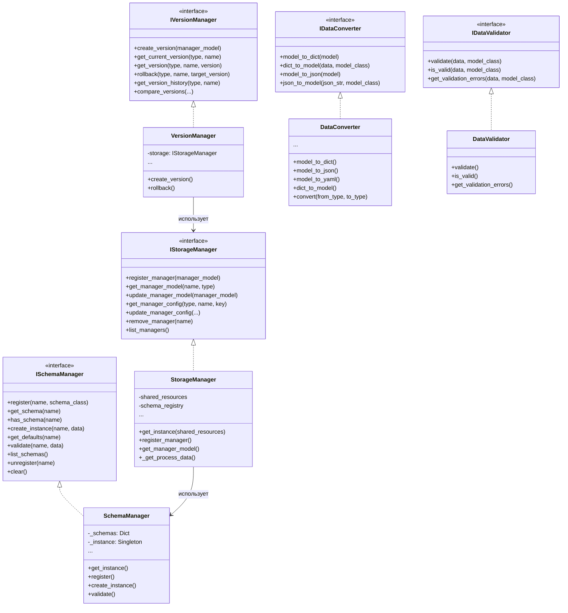
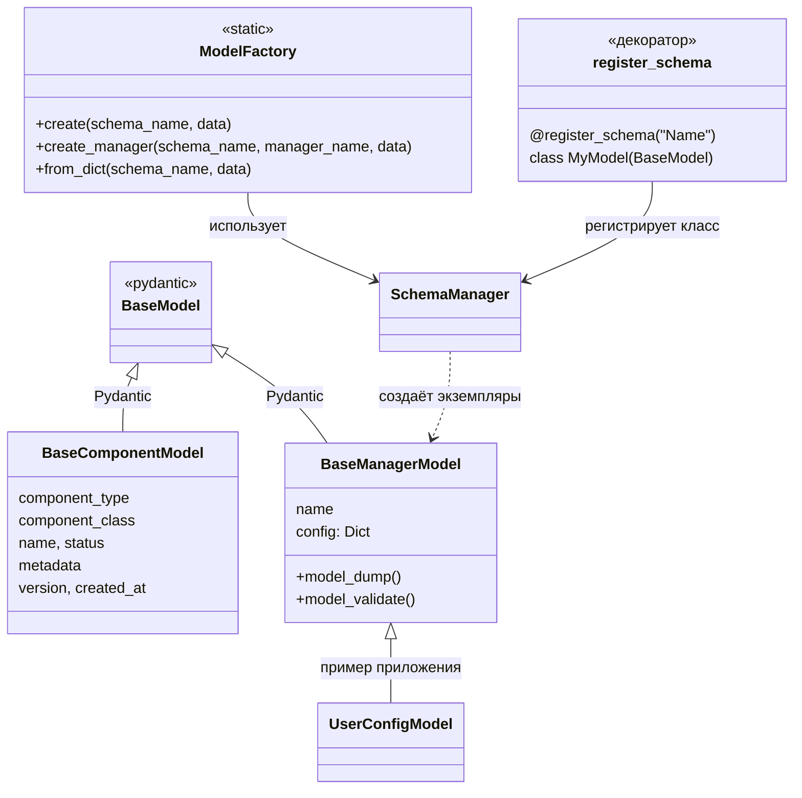
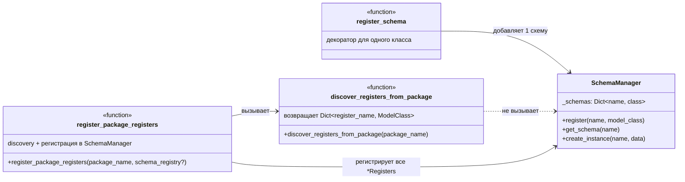
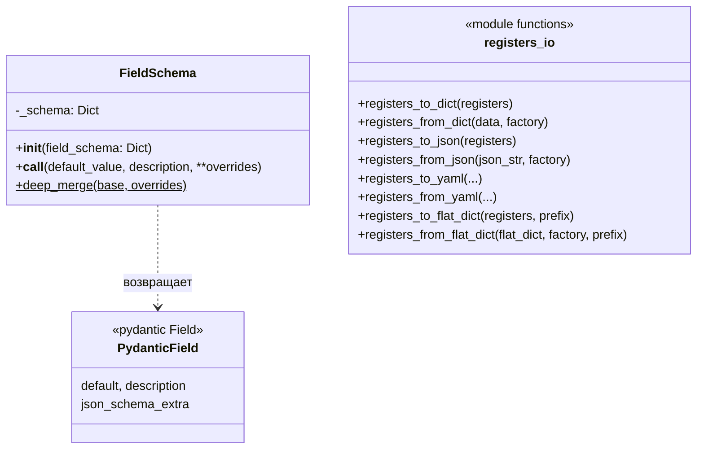
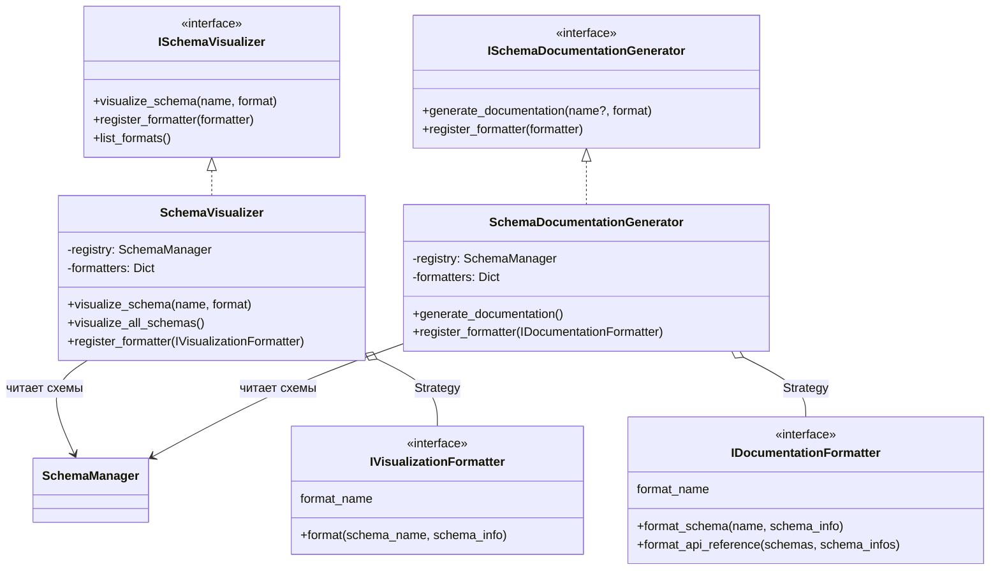
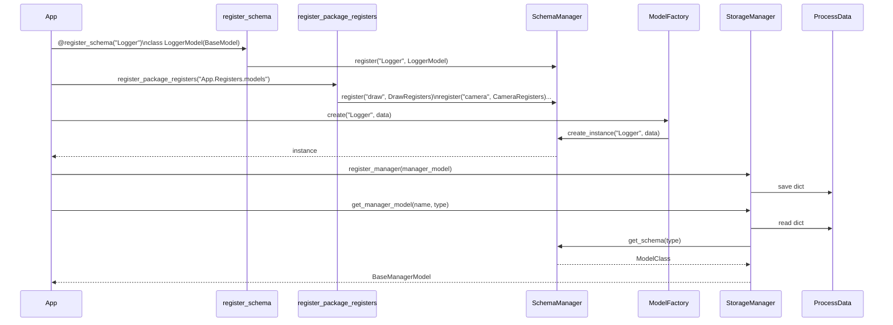

# Диаграммы модуля data_schema_module

Назначение классов, связи и потоки данных. Рендер: любой просмотрщик Markdown с поддержкой Mermaid (GitHub, VS Code, и т.д.).

---

## 1. Обзор пакетов и ролей

```
┌─────────────────────────────────────────────────────────────────────────────┐
│                        data_schema_module                                     │
├─────────────────────────────────────────────────────────────────────────────┤
│  core/          Интерфейсы (ISchemaManager, IStorageManager, …),           │
│                 исключения, метрики                                          │
│  models/        Базовые Pydantic-модели (BaseManagerModel, BaseComponentModel)│
│  registry/      Реестр схем + автообнаружение регистров                      │
│  storage/       Хранение данных в ProcessData                                │
│  versioning/    Версионирование конфигов                                     │
│  factory/       Создание экземпляров по имени схемы                          │
│  api/           Адаптеры и упрощённый API                                   │
│  utils/         Конвертеры, валидаторы, FieldSchema, registers_io           │
│  tools/         Визуализация и генерация документации схем                   │
└─────────────────────────────────────────────────────────────────────────────┘
```

---

## 2. Ядро: интерфейсы и реализации



**Назначение:**
- **SchemaManager** — единственная точка регистрации Pydantic-схем и создания экземпляров с дефолтами/валидацией.
- **StorageManager** — запись/чтение данных менеджеров в ProcessData; опирается на SchemaManager для моделей.
- **VersionManager** — версии и откат конфигов; работает поверх любого IStorageManager.
- **DataConverter** / **DataValidator** — преобразование и проверка одной модели (dict/json/yaml ↔ Pydantic).

---

## 3. Модели и фабрика



**Назначение:**
- **BaseComponentModel** — базовая модель «компонента» (ДНК, тип, имя, метаданные).
- **BaseManagerModel** — базовая модель конфига менеджера (name, config).
- **ModelFactory** — создание экземпляров по имени схемы через SchemaManager.
- **register_schema** — декоратор для регистрации класса в SchemaManager.

---

## 4. Реестр и автообнаружение регистров



**Назначение:**
- **register_schema** — ручная регистрация одной схемы (декоратор).
- **discover_registers_from_package** — сканирование пакета, поиск классов с суффиксом `*Registers`, возврат словаря имя → класс.
- **register_package_registers** — «мост»: discovery + массовая регистрация в SchemaManager (универсально для любого пакета/процесса).

---

## 5. Схема полей (FieldSchema) и ввод/вывод регистров (registers_io)



*Приложение передаёт словарь метаданных в `FieldSchema(dict)`; фреймворк не хранит дефолтную схему.*

**Назначение:**
- **FieldSchema** — приложение передаёт словарь метаданных (схему поля); экземпляр вызывается как `field_from_schema(default_value, description='', **overrides)` и возвращает `Field(..., json_schema_extra=merge(schema, overrides))`. Схема не зашита во фреймворк.
- **registers_io** — универсальные функции для объектов с `model_dump_all()` / `model_validate_all(data)`; фабрика создаёт новый экземпляр для from_*.

---

## 6. Storage, API и версионирование

```mermaid
flowchart LR
    subgraph App
        A[Process / SharedResources]
    end

    subgraph data_schema_module
        SM[StorageManager]
        VA[VersionManager]
        MA[ManagerDataAdapter]
        SR[SchemaManager]
        PD[(ProcessData)]
    end

    A -->|shared_resources| SM
    SM -->|get_instance(shared_resources)| SM
    SM -->|read/write| PD
    SM --> SR
    VA -->|использует IStorageManager| SM
    MA -->|StorageManager.get_instance()| SM
    MA -->|model read/write| SM
```

**Назначение:**
- **StorageManager** — единственная точка доступа к данным менеджеров в ProcessData; при необходимости использует SchemaManager для работы с моделями.
- **VersionManager** — версии и откат поверх StorageManager (опционально).
- **ManagerDataAdapter** — удобный доступ к данным одного менеджера (кэш модели, синхронизация с ProcessData через StorageManager).

---

## 7. Инструменты визуализации и документации



**Назначение:**
- **SchemaVisualizer** — визуализация одной или всех схем (text, json, html, mermaid и др.) через зарегистрированные форматеры (Strategy).
- **SchemaDocumentationGenerator** — генерация документации (markdown, rst, html и др.) через зарегистрированные форматеры.

---

## 8. Общий поток: от регистрации схем до использования



---

## 9. Где что лежит (краткая шпаргалка)

| Нужно | Класс/функция | Пакет |
|-------|----------------|--------|
| Зарегистрировать одну схему | `register_schema` (декоратор) | registry |
| Зарегистрировать все *Registers пакета | `register_package_registers(package_name)` | registry |
| Найти классы *Registers в пакете | `discover_registers_from_package(package_name)` | registry |
| Хранить и получать схемы, создавать экземпляры | `SchemaManager` | registry |
| Создать экземпляр по имени схемы | `ModelFactory.create(name, data)` | factory |
| Поля по схеме-словарю | `FieldSchema(schema_dict)(default_value, description, **overrides)` | utils.field_schema |
| Ввод/вывод набора регистров (dict/json/yaml/flat) | `registers_to_dict`, `registers_from_dict`, … | utils.registers_io |
| Конвертация одной модели (dict/json/yaml) | `DataConverter` | utils.converters |
| Валидация данных по модели | `DataValidator` | utils.validators |
| Хранение данных в ProcessData | `StorageManager` | storage |
| Версии и откат конфигов | `VersionManager` | versioning |
| Удобный доступ к данным менеджера | `ManagerDataAdapter` | api |
| Простое создание конфига без ProcessData | `create_config`, `create_manager_config` | api.simple_api |
| Визуализация схем | `SchemaVisualizer` | tools |
| Генерация документации схем | `SchemaDocumentationGenerator` | tools |

Модуль разделён по слоям (core → registry/storage/versioning → factory/api → utils/tools), без циклических зависимостей между пакетами; приложение задаёт только схемы (словари и пакеты для discovery) и использует единую точку входа — SchemaManager и фабрики/адаптеры поверх него.
