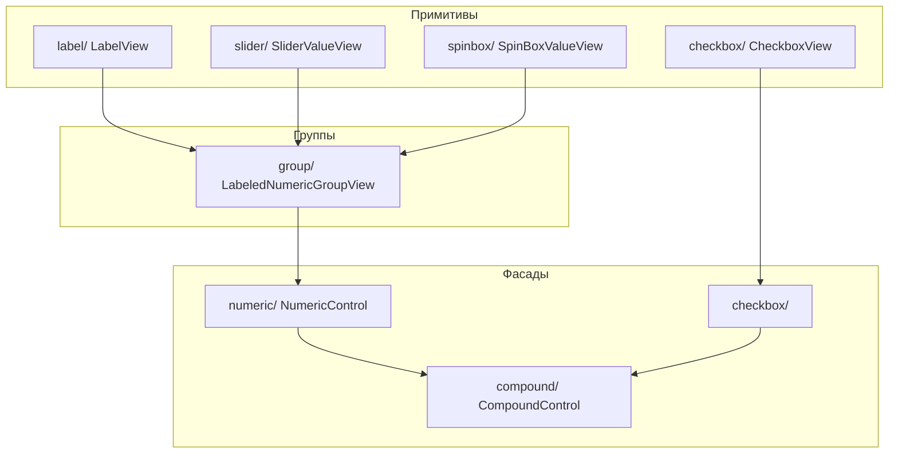

# Контролы (components) — архитектура и документация

Канонический импорт: ``from frontend_module.components import BindingConfig, NumericControl, ...`` или
``from frontend_module.components.checkbox import ...``. Составной UI (вкладки, BaseWidget) — ``frontend_module.widgets``.

## Структура папок

```
components/
├── base/              # База: порты (IFieldBinding, IRegisterPort), traits — см. [base/README.md](base/README.md)
├── common/            # Типографика, размеры, field_sync, legacy_sync, slider_styles
├── primitives/        # Qt-примитивы: control_label, numeric_line_edit, styled_slider, value_bridge
├── label/             # Подпись (QLabel) — отдельный компонент
├── slider/            # Слайдер (QLineEdit + QSlider) — value-контрол
├── spinbox/           # Спинбокс (QDoubleSpinBox), фасад SpinBoxControl
├── checkbox/          # Чекбокс — см. [checkbox/README.md](checkbox/README.md)
│   ├── config.py      # CheckboxViewConfig
│   ├── view.py        # CheckboxView → IControlView[bool]
│   ├── presenter.py   # CheckboxPresenter
│   ├── facade.py      # CheckboxControl
│   └── defaults.py    # checkbox_left, checkbox_right
├── numeric/           # Фасад числовых: Group(Label + Slider/SpinBox)
├── group/             # LabeledNumericGroupView + labeled_numeric_factory (сборка Label+value)
├── compound/          # Составные: BGR, mixed layouts
└── examples/          # Учебные схемы + адаптеры (папка на сценарий)
```

---

## Mermaid: карта зависимостей



---

## Диаграмма: карта компонентов

```
┌─────────────────────────────────────────────────────────────────────────────────┐
│                           controls v2 — компоненты                                │
├─────────────────────────────────────────────────────────────────────────────────┤
│                                                                                  │
│   ПРИМИТИВЫ              ГРУППЫ                    ФАСАДЫ                       │
│   ───────────           ───────                    ───────                       │
│                                                                                  │
│   ┌─────────┐           ┌──────────────┐          ┌─────────────────┐           │
│   │  label/ │──────────▶│    group/    │◀─────────│   numeric/      │           │
│   │LabelView│           │ Label+Slider │          │ NumericControl  │           │
│   └─────────┘           │ Label+SpinBox│          │ (Slider|SpinBox) │           │
│         │               └──────────────┘          └────────┬────────┘           │
│         │                          ▲                       │                     │
│   ┌─────┴─────┐                    │                       │                     │
│   │  slider/  │────────────────────┘                       │                     │
│   │SliderValue│                                             │                     │
│   └───────────┘                                             │                     │
│   ┌───────────┐                                             │                     │
│   │ spinbox/  │─────────────────────────────────────────────┘                     │
│   │SpinBoxValue│                                                                  │
│   └───────────┘                                                                  │
│                                                                                  │
│   ┌─────────────┐                                    ┌─────────────────┐         │
│   │  checkbox/  │  Чекбокс                           │   compound/     │         │
│   │ CheckboxView│───────────────────────────────────▶│ CompoundControl │         │
│   │ CheckboxCtrl│                                    │ ControlFactory  │         │
│   └─────────────┘                                    └─────────────────┘         │
│                                                                                  │
└─────────────────────────────────────────────────────────────────────────────────┘
```

---

## Диаграмма: слой Base

```
┌────────────────────────────────────────────────────────────────┐
│                         base/                                   │
├────────────────────────────────────────────────────────────────┤
│  interfaces.py     │ IControlView[T], INumericView              │
│  config.py         │ BaseControlConfig, BindingConfig,          │
│                    │ LabelOverride, merge_config                │
│  infrastructure/  │ RegisterAdapter, ValueTransformer,         │
│                    │ block_signals                              │
│  traits/          │ SchemaTrait, SyncTrait, DebounceTrait,      │
│                    │ AccessTrait, LegacySyncTrait               │
└────────────────────────────────────────────────────────────────┘
```

---

## Диаграмма: поток создания NumericControl

```
  NumericControl.create(rm, binding, NumericViewConfig)
                    │
                    ▼
         ┌──────────────────────┐
         │ RegisterAdapter(rm)   │
         └──────────┬───────────┘
                    │
                    ▼
         ┌──────────────────────┐     view_type
         │ NumericPresenter      │───────────────┐
         │ (Schema+Sync+Debounce)│               │
         └──────────┬───────────┘               │
                    │                           ▼
                    │              ┌────────────────────────────┐
                    │              │ labeled_numeric_factory.     │
                    │              │ create_labeled_numeric_view  │
                    │              │ (view_type, value_config)   │
                    │              └────────────┬───────────────┘
                    │                           │
                    │              ┌────────────┴────────────┐
                    │              │                        │
                    │         slider?                  spinbox?
                    │              │                        │
                    │    SliderValueView          SpinBoxValueView
                    │              │                        │
                    │              └────────────┬──────────┘
                    │                           │
                    │              ┌────────────▼────────────┐
                    │              │ LabeledNumericGroupView  │
                    │              │ = LabelView + ValueView   │
                    │              └────────────┬────────────┘
                    │                           │
                    └──────── attach_view ◀─────┘
                              │
                              ▼
                    result.widget → layout.addWidget()
```

---

## Диаграмма: поток создания CheckboxControl

```
  CheckboxControl.create(rm, binding, CheckboxViewConfig)
                    │
                    ▼
         ┌──────────────────────┐
         │ RegisterAdapter(rm)   │
         └──────────┬───────────┘
                    │
                    ▼
         ┌──────────────────────┐
         │ CheckboxPresenter     │
         │ (Schema+Sync+Access)   │
         └──────────┬───────────┘
                    │
                    ▼
         ┌──────────────────────┐
         │ CheckboxView          │  ← QLabel + QCheckBox
         │ (position: left/right)│
         └──────────┬───────────┘
                    │
                    └── attach_view
                              │
                              ▼
                    result.widget → layout.addWidget()
```

---

## Таблица компонентов

| Папка | Компонент | Config | View | Facade |
|-------|-----------|--------|------|--------|
| **base/** | — | BaseControlConfig, BindingConfig | IControlView, INumericView | — |
| **label/** | Подпись | LabelConfig | LabelView | — |
| **slider/** | Слайдер | SliderConfig | SliderValueView | — |
| **spinbox/** | Спинбокс | SpinBoxConfig | SpinBoxValueView | SpinBoxControl |
| **checkbox/** | **Чекбокс** | CheckboxViewConfig | CheckboxView | CheckboxControl |
| **numeric/** | Числовой | NumericViewConfig | Group(Label+Value) | NumericControl |
| **group/** | Группа | GroupConfig, LabeledNumericGroupConfig | LabeledNumericGroupView | — |
| **compound/** | Составной | CompoundNumericConfig, CompoundControlConfig | — | CompoundControl, ControlFactory |

---

## Примеры использования

### 1. Числовой слайдер

```python
from frontend_module.components import (
    NumericControl,
    BindingConfig,
    NumericViewConfig,
)

result = NumericControl.create(
    registers_manager,
    BindingConfig(register_name="processor", field_name="min_area"),
    NumericViewConfig(view_type="slider", show_ticks=True),
)
layout.addWidget(result.widget)
```

### 2. Чекбокс

```python
from frontend_module.components import (
    CheckboxControl,
    BindingConfig,
    CheckboxViewConfig,
)

result = CheckboxControl.create(
    registers_manager,
    BindingConfig(register_name="renderer", field_name="show_mask"),
    CheckboxViewConfig(position="left"),  # или "right", "top", "bottom"
)
layout.addWidget(result.widget)
```

### 3. Спинбокс вместо слайдера

```python
result = NumericControl.create(
    rm,
    BindingConfig("processor", "threshold"),
    NumericViewConfig(view_type="spinbox"),
)
layout.addWidget(result.widget)
```

### 4. BGR-слайдеры (составной)

```python
from frontend_module.components import (
    CompoundNumericControl,
    CompoundNumericConfig,
    BindingConfig,
    NumericViewConfig,
)

cfg = CompoundNumericConfig(
    binding=BindingConfig("processor", "color_lower"),
    labels=["B", "G", "R"],
    view_config=NumericViewConfig(min_val=0, max_val=255),
)
result = CompoundNumericControl.create(rm, cfg)
layout.addWidget(result.widget)
```

### 5. Дефолты и merge_config

```python
from frontend_module.components import (
    bgr_slider_default,
    merge_config,
    NumericViewConfig,
)

config = merge_config(bgr_slider_default, NumericViewConfig(label="Канал B"))
result = NumericControl.create(rm, binding, config)
```

### 6. Группа с отдельными конфигами (Slider/SpinBox)

```python
from frontend_module.components import (
    LabeledNumericGroupConfig,
    LabelConfig,
    SliderConfig,
    SpinBoxConfig,
)

# Label слева + Slider
cfg = LabeledNumericGroupConfig(
    label_config=LabelConfig(position="left"),
    value_config=SliderConfig(show_ticks=True),
)
```

---

## Диаграмма: связь типов

```
                    ┌─────────────────┐
                    │ BaseControlConfig│
                    └────────┬────────┘
                             │
        ┌────────────────────┼────────────────────┐
        │                    │                    │
        ▼                    ▼                    ▼
┌───────────────┐   ┌───────────────┐   ┌───────────────┐
│  SliderConfig │   │ SpinBoxConfig  │   │CheckboxViewCfg│
└───────────────┘   └───────────────┘   └───────────────┘
        │                    │                    │
        └────────────────────┼────────────────────┘
                             │
                             ▼
                    ┌─────────────────┐
                    │ NumericViewConfig│  ← view_type + объединённые поля
                    │ (facade)         │
                    └─────────────────┘
```

---

## Рекомендации

- **Добавить новый value-контрол** (например, ComboBox): создать папку `combobox/` с config, view, defaults; добавить в `group/` и `numeric/facade`.
- **Добавить новый тип контрола** (например, ColorPicker): папка `color_picker/` по аналогии с `checkbox/` (config, view, presenter, facade).
- **Кастомная группа**: использовать `GroupConfig(children=[...])` с произвольным списком конфигов.
