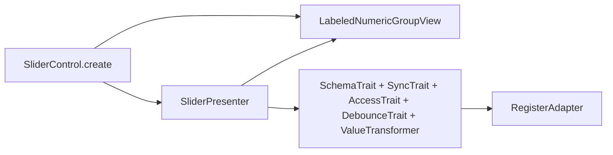
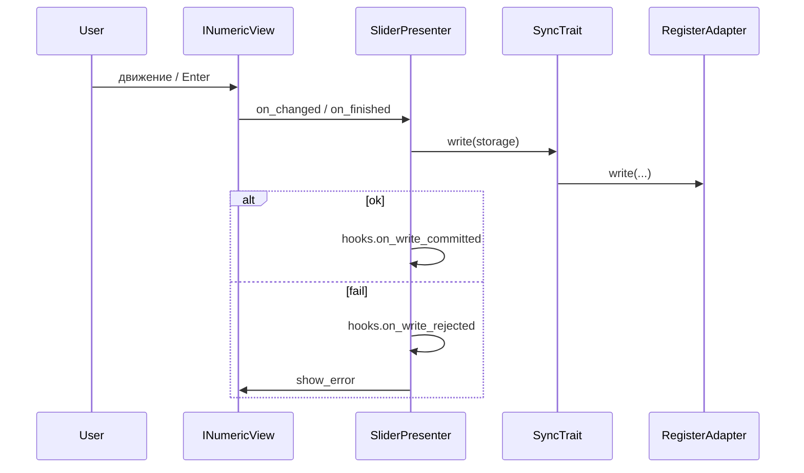

# Slider v2

Слайдер с привязкой к регистру: **View** (`SliderValueView` внутри `LabeledNumericGroupView`) + **Presenter** (`SliderPresenter`) + **Facade** (`SliderControl`).

Те же порты, что в [`base/README.md`](../base/README.md): `IFieldBinding`, `IRegisterPort`, `RegistersManagerLike`. Опционально **`ControlHooks`** в `SliderControl.create(..., hooks=...)`.

## Слои



`SliderPresenter` наследует `NumericPresenter` (одинаковые трейты); тип отделён для API и `control_kind="slider"` в событиях `ControlHooks`.

## Поток значения



Если `not can_modify()` до вызова `write`: `hooks.on_access_denied`, затем откат UI (`_sync_from_model`).

## Пример

```python
from frontend_module.components.base.config import BindingConfig
from frontend_module.components.slider import (
    SliderControl,
    SliderConfig,
)

result = SliderControl.create(
    registers_manager,
    BindingConfig(register_name="processor", field_name="min_area"),
    SliderConfig(label_position="left", show_ticks=True),
)
layout.addWidget(result.widget)
```

## Совместимость

- `NumericControl.create(view_config=NumericViewConfig(view_type="slider", ...))` — общий числовой путь (presenter: `NumericPresenter`, `control_kind="numeric"`).
- `components.examples.slider` — сборка из SchemaBase.

## Тесты

`frontend_module/tests/test_controls_v2_hooks.py` (хуки + smoke), `test_example_with_data_schema.py`.
