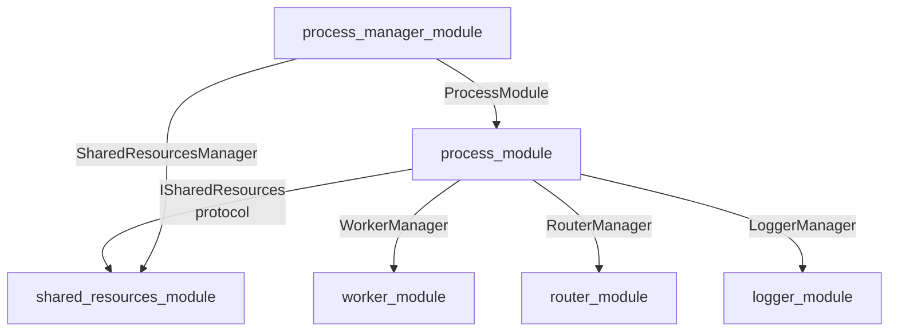

# Process Module — Управление процессами в фреймворке

**Status:** ✅ Production Ready (49/49 tests passing, Refactoring Phase 8/8 Complete)

Модуль `process_module` отвечает за **создание, инициализацию, управление и мониторинг процессов** в многопроцессном фреймворке. Это центральный компонент, который координирует работу конфигурации, коммуникации, менеджеров и воркеров (через `worker_module`).

---

## Быстрый старт

### Импорты

```python
from multiprocess_framework.modules.process_module import (
    ProcessModule,
    ProcessStatus,
    ProcessConfigDict,
)
```

### Создание простого процесса

```python
import time
from multiprocess_framework.modules.process_module import ProcessModule

class MyProcess(ProcessModule):
    def initialize(self) -> bool:
        """Инициализация процесса."""
        self.log_info("Инициализация MyProcess...")
        self.is_initialized = True
        return True
    
    def shutdown(self) -> bool:
        """Завершение работы процесса."""
        self.log_info("Завершение MyProcess...")
        self.is_initialized = False
        return True
    
    def run(self):
        """Основной цикл процесса."""
        counter = 0
        while not self.should_stop():
            counter += 1
            self.log_info(f"Итерация {counter}")
            time.sleep(1)

# Использование
process = MyProcess("my_process")
try:
    process.initialize()
    process.run()
finally:
    process.shutdown()
```

### Процесс с воркерами

```python
from multiprocess_framework.modules.worker_module import (
    ThreadConfig,
    ThreadPriority,
    ExecutionMode,
)

class WorkerProcess(ProcessModule):
    def initialize(self) -> bool:
        """Инициализация процесса с воркерами."""
        self.log_info("Инициализирую воркеры...")
        
        # Получить менеджер воркеров (автоматически создан ProcessModule)
        manager = self.worker_manager
        
        # Создать воркер обработки данных
        def data_worker(stop_event, pause_event):
            while not stop_event.is_set():
                if pause_event.is_set():
                    time.sleep(0.05)
                    continue
                self.log_info("Обработка данных...")
                time.sleep(1)
        
        config = ThreadConfig(
            priority=ThreadPriority.NORMAL,
            execution_mode=ExecutionMode.LOOP,
        )
        manager.create_worker("data_processor", data_worker, config, auto_start=True)
        
        self.is_initialized = True
        return True
    
    def run(self):
        """Основной цикл с мониторингом воркеров."""
        while not self.should_stop():
            status = self.worker_manager.get_all_workers_status()
            self.log_info(f"Статус воркеров: {status}")
            time.sleep(5)
```

---

## Архитектура модуля

```
process_module/
├── __init__.py                  # Публичный API
├── interfaces.py                # IProcessModule, ISharedResources, IProcessCommunication
├── types/
│   ├── __init__.py
│   └── types.py                 # ProcessStatus, ManagerType, QueueType, TypedDict
├── core/
│   ├── __init__.py
│   └── process_module.py        # ProcessModule (главный класс)
├── lifecycle/
│   ├── __init__.py
│   └── process_lifecycle.py     # Жизненный цикл: initialize/shutdown
├── managers/
│   ├── __init__.py
│   └── process_managers.py      # Инициализация менеджеров
├── communication/
│   ├── __init__.py
│   └── process_communication.py # IPC через router_module
├── config/
│   ├── __init__.py
│   └── process_config_handler.py # Парсинг конфигурации
├── state/
│   ├── __init__.py
│   └── process_state.py         # Делегирует в shared_resources_module
├── threads/
│   ├── __init__.py
│   └── system_threads.py        # Управление системными потоками
├── adapters/
│   ├── __init__.py
│   ├── process_adapter.py       # ProcessAdapter(BaseAdapter)
│   └── schema_adapter.py        # SchemaAdapter для конфигов
├── tests/                       # Unit-тесты (49 тестов)
├── README.md                    # Этот файл
├── STATUS.md                    # Карточка здоровья
└── ARCHITECTURE.md              # Детальное описание дизайна
```

---

## Ключевые концепции

### 1. Жизненный цикл процесса

```
initialize()
    ↓
[INITIALIZING] → инициализация менеджеров, воркеров, конфига
    ↓
[READY]
    ↓
run()
    ↓
[RUNNING] ← основной цикл процесса
    ↓
stop() / should_stop() → возврат True
    ↓
[STOPPING] → остановка воркеров
    ↓
shutdown()
    ↓
[STOPPED]
```

### 2. Компоненты ProcessModule

| Компонент | Класс | Назначение |
|-----------|-------|-----------|
| **Менеджер воркеров** | `WorkerManager` | Создание, управление и мониторинг потоков |
| **Маршрутизатор** | `RouterManager` | Межпроцессная коммуникация через каналы |
| **Конфиг-обработчик** | `ProcessConfigHandler` | Парсинг и валидация конфигурации |
| **Коммуникация** | `ProcessCommunication` | Отправка/получение сообщений |
| **Логгер** | `LoggerManager` | Логирование с категоризацией |

### 3. Опциональная конфигурация менеджеров (managers)

Через `proc_dict["managers"]` можно включить дополнительные возможности (все опциональны, обратная совместимость сохранена):

| Ключ | Назначение | Условие |
|------|------------|---------|
| `managers.logger` | Полный dict-конфиг LoggerManager (channels, scopes, modules) | При наличии `channels` |
| `managers.error` | ErrorManager (errors.log, critical.log, warnings.log) | При непустом dict |
| `managers.router.duplicate_messages_to_logger` | Дублирование сообщений в LoggerManager для отладки | При `True` |

Без `managers` в конфиге процессы работают как раньше (только LoggerManager, StatsManager, RouterManager по умолчанию).

### 4. Разрыв циклической зависимости (Рефакторинг)

**Проблема была:** `process_module` ↔ `shared_resources_module` (циклическая зависимость)

**Решение:** Используется `ISharedResources` (Protocol) для Dependency Injection:

```python
class ProcessModule(BaseManager, ObservableMixin):
    def __init__(
        self,
        name: str,
        config: Optional[dict] = None,
        shared_resources: Optional[ISharedResources] = None,
    ):
        self.shared_resources = shared_resources
        # Получаем через protocol, а не прямой импорт
        self.queue_registry = getattr(shared_resources, 'queue_registry', None)
        self.memory_manager = getattr(shared_resources, 'memory_manager', None)
```

Это обеспечивает **однонаправленный** граф зависимостей.

### 5. Dict at Boundary

Все данные, пересекающие границу процессов, передаются как обычные `dict`:

```python
# Конфигурация процесса (границ процесса)
config_dict = {
    "name": "process_1",
    "workers": {
        "worker_1": {
            "class": "my_module.Worker1",
            "thread": {"priority": "NORMAL"},
        }
    }
}

# Внутри процесса: типизированные объекты
process = ProcessModule("process_1", config=config_dict)
```

### 6. IPC через RouterManager

```python
# Отправить сообщение другому процессу
self.send_message(
    target="process_2",
    message={
        "command": "execute",
        "data": {"task": "compute", "value": 42},
    }
)

# Трансляция всем (broadcast)
self.broadcast_message({
    "event": "status_changed",
    "status": "running",
})
```

---

## ProcessModule API

### Жизненный цикл

```python
# Инициализация
success = process.initialize()  # → bool

# Основной цикл
process.run()  # Блокирует до stop()

# Остановка
process.stop()  # Сигнал к остановке

# Завершение
success = process.shutdown()  # → bool

# Проверка
is_stopping = process.should_stop()  # → bool
```

### Коммуникация

```python
# Отправить сообщение
process.send_message("target_process", {"command": "execute"})

# Трансляция
process.broadcast_message({"event": "ready"})

# Получить сообщение
msg = process.receive_message(timeout=1.0)
```

### Конфигурация

```python
# Получить текущую конфигурацию
config = process.get_config()  # → ProcessConfigDict

# Обновить конфигурацию
process.update_config({
    "workers": {"worker_2": {...}}
})
```

### Статистика

```python
# Получить статистику
stats = process.get_stats()  # → ProcessStatsDict
# {
#     "name": "process_1",
#     "running": True,
#     "queues": {...},
#     "workers": {...},
# }

# Получить статус
status = process.get_status()  # → ProcessStatus enum
```

### Воркеры

```python
# Получить менеджер воркеров
manager = process.worker_manager

# Создать воркер
manager.create_worker("worker_1", func, config, auto_start=True)

# Получить статус всех воркеров
all_status = manager.get_all_workers_status()
```

---

## Зависимости

- **Зависит от:**
  - `base_manager` (BaseManager)
  - `worker_module` (WorkerManager)
  - `router_module` (RouterManager)
  - `logger_module` (LoggerManager)
  - `shared_resources_module` (QueueRegistry, MemoryManager)
  - `data_schema_module` (SchemaAdapter)

- **Используется в:**
  - `process_manager_module` (оркестрация процессов)
  - `process_1`, `process_2` (прототип)

---

## Примеры

### Пример 1: Простой процесс с логированием

```python
class SimpleProcess(ProcessModule):
    def initialize(self) -> bool:
        self.counter = 0
        return True
    
    def run(self):
        while not self.should_stop():
            self.counter += 1
            if self.counter % 10 == 0:
                self.log_info(f"Counter: {self.counter}")
            time.sleep(0.1)
    
    def shutdown(self) -> bool:
        self.log_info(f"Final counter: {self.counter}")
        return True

# Запуск
process = SimpleProcess("simple")
process.initialize()
process.run()
process.shutdown()
```

### Пример 2: Процесс с коммуникацией

```python
class Producer(ProcessModule):
    def run(self):
        for i in range(10):
            self.send_message(
                "consumer",
                {"data": i}
            )
            time.sleep(1)

class Consumer(ProcessModule):
    def run(self):
        while not self.should_stop():
            msg = self.receive_message(timeout=2.0)
            if msg:
                data = msg.get("data")
                self.log_info(f"Получено: {data}")
```

### Пример 3: Процесс с воркерами и конфигом

```python
config = {
    "process": {"name": "data_processor"},
    "workers": {
        "fetcher": {
            "class": "myapp.DataFetcher",
            "thread": {
                "priority": "NORMAL",
                "execution_mode": "loop",
            }
        },
        "processor": {
            "class": "myapp.DataProcessor",
            "thread": {
                "priority": "NORMAL",
                "restart_on_failure": True,
            }
        }
    }
}

process = ProcessModule("data_processor", config=config)
process.initialize()
process.run()
process.shutdown()
```

---

## Тестирование

Модуль включает полный набор unit-тестов (49 тестов):

```bash
# Запустить все тесты process_module
pytest Inspector_prototype/multiprocess_framework/modules/process_module/tests/ -v

# Запустить конкретный тест
pytest ...tests/test_process_lifecycle.py::test_initialize -v

# С покрытием
pytest ...tests/ --cov=process_module --cov-report=html
```

**Тестовое покрытие:**
- `test_types.py` (12 тестов) — Enum, TypedDict, сериализация
- `test_process_lifecycle.py` (13 тестов) — initialize/shutdown/run/stop
- `test_process_communication.py` (14 тестов) — send/receive/broadcast
- `test_process_config.py` (10 тестов) — конфигурация, обновление

---

## Стандарты и соглашения

### Потокобезопасность

Все публичные методы потокобезопасны благодаря `RouterManager`, `WorkerManager` и `LoggerManager`:

```python
# Безопасно вызывать из разных потоков
process.send_message(...)
process.log_info(...)
process.worker_manager.create_worker(...)
```

### Абстракции и интерфейсы

Внешние модули должны зависеть только от `interfaces.py`:

```python
from process_module.interfaces import IProcessModule

def manage_process(process: IProcessModule):
    process.initialize()
    process.run()
    process.shutdown()
```

### Обработка ошибок

```python
try:
    process.initialize()
    process.run()
except Exception as e:
    process.log_error(f"Ошибка процесса: {e}")
finally:
    process.shutdown()
```

---

## Структура репозитория



---

## Версия и совместимость

- **Версия**: 2.0.0 (Refactored, Phase 8/8)
- **Python**: 3.8+
- **Зависит от**: `base_manager`, `worker_module`, `router_module`
- **Обратная совместимость**: ✅ Да (старые процессы используют ProcessModule как раньше)

---

## Ссылки

- **ARCHITECTURE.md** — детальное описание дизайна (500+ строк, диаграммы)
- **REFACTORING_ASSESSMENT.md** — честная оценка рефакторинга (до/после, выводы)
- **STATUS.md** — карточка здоровья модуля, итоговые оценки, чеклист
- **interfaces.py** — публичные контракты (IProcessModule, ISharedResources, IProcessCommunication)
- **types/types.py** — типы и перечисления (ProcessStatus, ProcessConfigDict, и т.д.)
- **Plan** — `process_module_refactoring_40da2b2c.plan.md`

