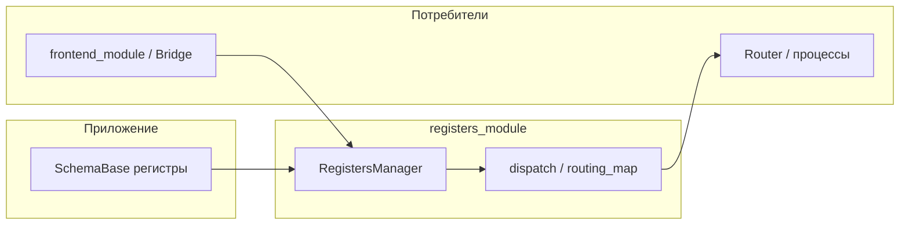

# Модуль registers_module

## Назначение

Runtime-слой для **именованных регистров** приложения (экземпляры `SchemaBase` / Pydantic из `data_schema_module`):

- pub/sub на уровне полей и глобальные наблюдатели;
- `set_field_value` с валидацией и **dispatch** целей `register_update` в бэкенд через `send_callback`;
- построение `connection_map`, **карты маршрутизации** `(register, field) → channel` и отправка сообщений через роутер.

Хранение, метаданные полей, `model_dump_all` / `model_validate_all` делегируются в `RegistersContainer`. Уникальная логика модуля — подписки и доставка. Подробнее: [`DECISIONS.md`](DECISIONS.md), [`interfaces.py`](interfaces.py).

## Архитектура



## Импорты

```python
from registers_module import (
    RegistersManager,
    IRegistersManager,
    build_connection_map_from_registers,
    resolve_dispatch_targets,
    build_routing_map,
    get_routing_for_message,
    send_register_message,
    ROUTING_NOT_FOUND,
    PROCESS_UNREACHABLE,
    MESSAGE_LOST,
)
```

## Quick Start

```python
from typing import Annotated, ClassVar

from data_schema_module import FieldMeta, FieldRouting, RegisterDispatchMeta, SchemaBase
from registers_module import RegistersManager


class CameraRegisters(SchemaBase):
    register_dispatch: ClassVar[RegisterDispatchMeta] = RegisterDispatchMeta(
        process_targets=("camera_process",),
    )
    fps: Annotated[
        int,
        FieldMeta("FPS", min=1, max=120, routing=FieldRouting(channel="control_camera")),
    ] = 25


rm = RegistersManager(
    registers={"camera": CameraRegisters()},
    send_callback=lambda ch, reg, field, val, snap: print(f"→ {ch}: {field}={val}"),
)
rm.set_field_value("camera", "fps", 30)
# при наличии целей dispatch: канал вида control_<process>, snapshot = model_dump регистра
```

## Приоритет dispatch (цели для `send_callback`)

| Уровень | Источник | Поведение |
|--------|-----------|-----------|
| 1 | `FieldMeta.routing.process_targets` (через `get_field_meta` / метаданные) | Список имён процессов; **пустой кортеж** → не слать |
| 2 | Метаданные поля (`routing` из контейнера) | То же для `process_targets` |
| 3 | `register_dispatch.process_targets` на классе регистра | Fan-out на все цели |
| 4 | `connection_map[register_name]` | Один fallback-процесс |
| — | Ничего из вышеперечисленного | `send_callback` не вызывается |

Канал, который получает `send_callback`: имя процесса с префиксом `control_`, **если** оно ещё не начинается с `control_` (двойной префикс не добавляется).

## Pub/Sub API

- `subscribe(register_name, field_name, callback)` — `callback(value)` при изменении поля через `set_field_value` или при `notify_field_changed`.
- `unsubscribe` / `unsubscribe_all` — без исключения, если callback не был подписан.
- `subscribe_all(callback)` — `callback(register_name, field_name, value)` на каждое изменение через `set_field_value` (не на `notify_field_changed`).
- `notify_field_changed` — только подписчики **поля**; глобальные и `send_callback` **не** вызываются.

Исключения в одном observer не отменяют остальные; ошибки `send_callback` логируются, значение поля остаётся установленным.

## Интеграция с frontend

`FrontendRegistersBridge` (`frontend_module.core.registers_bridge`) оборачивает `RegistersManager`, реализует контракт UI и задаёт `send_callback`, который упаковывает `register_update` и вызывает `router.send_message(target, msg)`. Префикс `control_` в канале при необходимости снимается при выборе `target`. Подключение: создать `RegistersManager`, передать в bridge вместе с `connection_map` и опционально с готовым `router`.

## Интеграция с прототипом

Фабрика (например `multiprocess_prototype_v2/registers/factory.py`) собирает словарь экземпляров регистров, строит `connection_map` через `build_connection_map_from_registers` (первый `process_targets` на классе) и передаёт оба аргумента в `RegistersManager(registers=..., connection_map=...)`.

## Сигнатура `send_callback`

```text
callback(channel: str, register_name: str, field_name: str, value: Any, snapshot: Dict[str, Any]) -> None
```

- `channel` — уже с учётом префикса `control_` там, где он нужен.
- `snapshot` — результат `model_dump()` экземпляра регистра после установки поля (для синхронизации состояния на стороне получателя).

## Зависимости

- **Зависит от:** `data_schema_module` (`RegistersContainer`, `SchemaBase`, `FieldMeta`, `FieldRouting`, `RegisterDispatchMeta`).
- **Используется в:** `frontend_module`, прототипах Inspector, построении карт для `router_module`.

## Структура модуля

```
registers_module/
├── __init__.py
├── interfaces.py
├── DECISIONS.md
├── README.md
├── STATUS.md
├── core/
│   ├── manager.py
│   ├── dispatch.py
│   └── routing_map.py
└── tests/
```

## Ссылки

- [`DECISIONS.md`](DECISIONS.md) — ADR-RM-001 … ADR-RM-005
- [`interfaces.py`](interfaces.py) — `IRegistersManager`
- [ROUTING_GLOSSARY.md](../../docs/ROUTING_GLOSSARY.md) — термины каналов и `register_update`

## Примечания

- Регистры без полноценной схемы: поведение валидации определяется `RegistersContainer` / `SchemaMixin`.
- Миграции снимков legacy YAML — на границе приложения, не в этом модуле.
