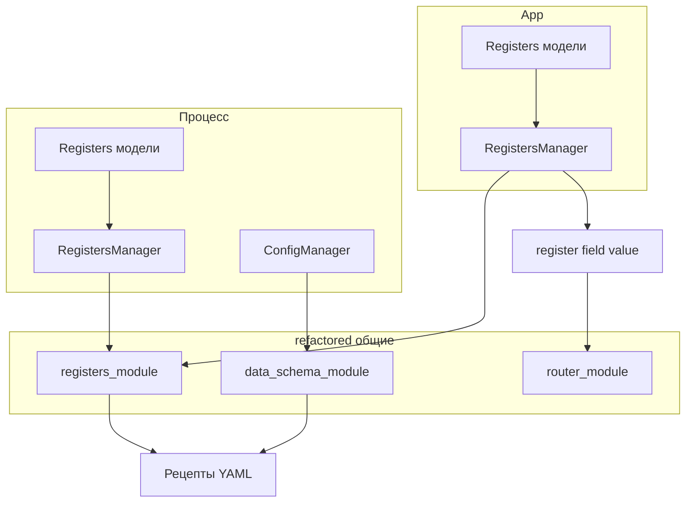

# Архитектура: Регистры, Роутер, Data Schema (refactored)

Единый документ: целевая архитектура, один набор инструментов, без дублирования. Только refactored.

---

## 1. Ориентир только на refactored

- **Используем только:** `Inspector_prototype\multiprocess_framework\refactored`.
- **Не используем:** `multiprocess_framework\modules` (старая ветка).
- Вся реализация: роутер, сообщения, регистры, data_schema — в refactored.

---

## 2. Две сущности: DNA и регистры

### DNA (конфигурация и идентичность)

- **DNA** — «кто компонент и как устроен»: модуль/класс, ресурсы (очереди, события, память), иерархия, параметры создания. По ДНК компонент можно воссоздать.
- **Относится к:** конфигам менеджеров, конфигу процесса. Хранится и валидируется через **data_schema_module** (SchemaRegistry, StorageManager, ProcessDataContainer, VersionManager).
- У каждого процесса — свой **менеджер конфигураций**, но один и тот же инструментарий: data_schema для валидации, конвертации (JSON/YAML/dict), версионирования.

### Регистры (импульсы и состояние)

- **Регистры** — управляющие параметры (dp, яркость, пороги и т.д.), которые **передаются сообщениями** через роутеры: `{ type: "register_update", register, field, value }`. Это «импульсы» по приложению.
- **Не путать с DNA:** регистры — текущее *состояние* управления; DNA — описание компонента. Регистры меняются часто и доставляются в процессы; потом те же данные можно сохранять в **рецепты**, **историю** или логи.
- **Схема регистров** участвует в data_schema: классы регистров можно регистрировать в SchemaRegistry; из них формируется схема для валидации и версионирования рецептов (рецепт = документ по схеме регистров).

**Итого:** DNA = конфиг/идентичность (data_schema). Регистры = поток по сообщениям; снимки регистров → рецепты/история через общие инструменты data_schema (схема, конвертеры, версии).

---

## 3. Целевая архитектура

### 3.1 Слои

```
App (или клиент)                    → модели регистров (App/Registers), UI шлёт { register, field, value }
         │
         ▼
refactored: registers_module        → RegistersManager, RegistersConverter (общие)
         │   router_module          → RouterManager, register_routing (по routing.router + channel)
         │   data_schema_module     → SchemaRegistry, StorageManager, VersionManager, конвертеры (общие)
         ▼
Процессы бэкенда                   → у каждого: свои модели Registers, свой RegistersManager, свой RouterManager
```

### 3.2 Контракт регистра

- Модель (Pydantic): поля с `json_schema_extra`: `min`, `max`, `unit`, **`routing: { "router": "...", "channel": "..." }`**, access_level, i18n. Формат как в `App/Registers/models/draw.py`.
- **Сообщение:** один формат — `{ "type": "register_update", "register": "draw", "field": "dp", "value": 1.4 }`. Без snapshot и без controls_*.

### 3.3 Где что живёт

| Что | Где |
|-----|-----|
| Модели регистров | У каждого процесса свой каталог (App/Registers у app; у бэкенда — свой Registers). |
| RegistersManager, RegistersConverter | refactored **registers_module** (общая логика). |
| RouterManager, register_routing | refactored **router_module**. |
| SchemaRegistry, StorageManager, VersionManager, конвертеры | refactored **data_schema_module**. |
| Конфиг процесса, ДНК, конфиги менеджеров | ProcessData + StorageManager; менеджер конфигураций завязан на data_schema. |
| Рецепты (файлы) | Data/Recipes/value_settings.yaml; формирование/валидация через RegistersManager + data_schema. |

### 3.4 Модуль регистров (refactored)

- **registers_module:** RegistersManager (принимает список моделей/экземпляров), get_register, get_field_metadata (в т.ч. routing), validate_field_value, model_dump_all / model_validate_all; RegistersConverter — to_dict, to_json/yaml, from_json/yaml. Без зависимости от data_schema в базе; при необходимости приложение регистрирует классы регистров в SchemaRegistry для валидации рецептов.

### 3.5 Роутер и register_routing

- Расширение в router_module: по сообщению `register_update` и полям register/field берёт из RegistersManager метаданные поля → routing.router и routing.channel → выбор канала (очередь в нужный процесс). App-роутер один; каналы — в каждый процесс.

### 3.6 Data_schema и регистры

- **Регистры процесса:** состояние в памяти (RegistersManager держит экземпляры). При необходимости персистентность — отдельный ключ в ProcessData.custom (например process_registers) или тонкий слой; не смешивать с BaseManagerModel.
- **Рецепты:** снимок = model_dump_all(RegistersManager); сохраняем в YAML (Data/Recipes/value_settings.yaml). Перед сохранением/после загрузки — валидация по схемам (SchemaRegistry); при желании — VersionManager для истории рецептов. RecipeManager/RecipeService использует RegistersManager + при необходимости SchemaRegistry/VersionManager.
- **Sort_widget** — только UI; логика данных снаружи (RecipeManager: load/save, get_recipe/set_recipe).

### 3.7 Единая картина (схема)



- Данные у каждого процесса свои (модели, экземпляры); инструменты одни (registers_module, data_schema_module, router_module). Регистры идут сообщениями; снимки — в рецепты с валидацией/версиями через data_schema.

---

## 4. Согласование registers_module и data_schema_module

### 4.1 Разделение (рекомендуемый вариант)

- **registers_module:** контракт регистров (имена, поля, метаданные, routing), get_register, get_field_metadata, validate_field_value, model_dump_all/model_validate_all, RegistersConverter (dict/json/yaml). Не пишет в ProcessData, не зависит от data_schema.
- **data_schema_module:** схемы (SchemaRegistry), хранение менеджеров в ProcessData (StorageManager), ДНК (ProcessDataContainer), конвертеры/валидаторы общие, VersionManager. Не знает про «регистр»/«поле»/routing.
- **Связь:** приложение при сохранении/загрузке рецепта может регистрировать классы регистров в SchemaRegistry и вызывать валидацию/версии. RegistersConverter может внутри использовать конвертеры data_schema для единообразия форматов.

### 4.2 Персистентность регистров процесса

- По умолчанию — в памяти процесса. Если нужно сохранять: отдельный ключ в ProcessData.custom (например `process_registers`) или минимальный слой ProcessRegistersStorage; не использовать BaseManagerModel под регистры.

---

## 5. План реализации (кратко)

1. **registers_module** в refactored: RegistersManager обобщённый + RegistersConverter, get_field_metadata с `routing: { router, channel }`.
2. **router_module:** расширение register_routing по register/field → router + channel.
3. Модели: везде `routing: { "router": "...", "channel": "..." }`.
4. App: только refactored, app_router в одном месте, UI шлёт только { register, field, value }.
5. Бэкенд-процессы: свой RegistersManager и RouterManager; обработчик register_update обновляет локальный регистр.
6. Рецепты: RecipeManager использует RegistersManager + при необходимости SchemaRegistry/VersionManager; Sort_widget только UI.

---

## 6. Итог

- **Ориентир:** только refactored; один набор инструментов (registers_module, data_schema_module, router_module).
- **DNA** — конфиг и идентичность компонентов (data_schema). **Регистры** — управляющие импульсы по сообщениям; снимки → рецепты/история с валидацией и версиями через data_schema.
- **Один источник истины по инструментам:** конвертеры, версионирование, валидация, схемы — в refactored; у каждого процесса свои данные (модели регистров, конфиг), но общая логика и форматы.
- Целевой формат сообщения: `{ type, register, field, value }`; без snapshot. Рецепты — в Data/Recipes/value_settings.yaml с проходом через data_schema при необходимости.
