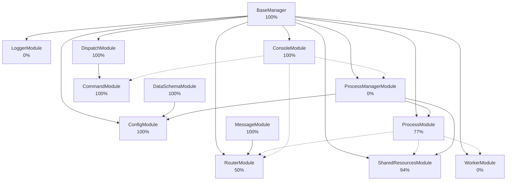

# Иерархия Зависимостей Модулей

## Правильная Иерархия Зависимостей

**Условные обозначения:**
- `-->` - жесткая зависимость (импорт модуля)
- `-.->` - опциональная зависимость (используется через managers, но не обязательна)

## Детальное Описание Зависимостей

### Уровень 0: Базовые Модули (Без Зависимостей)

1. **BaseManager** - базовый класс для всех менеджеров
   - Зависимости: Нет
   - Используется: Всеми модулями

2. **MessageModule** - работа с сообщениями
   - Зависимости: Нет (только стандартные библиотеки)
   - Используется: RouterModule

3. **DataSchemaModule** - схемы данных
   - Зависимости: Нет (только Pydantic)
   - Используется: ConfigModule, SharedResourcesModule

### Уровень 1: Модули Зависящие от BaseManager

4. **ConfigModule** - управление конфигурацией
   - Зависимости: BaseManager
   - Используется: ProcessManagerModule, ProcessModule

5. **LoggerModule** - логирование
   - Зависимости: BaseManager
   - Используется: Всеми модулями (через ObservableMixin)

6. **DispatchModule** - диспетчеризация сообщений
   - Зависимости: BaseManager
   - Используется: CommandModule

7. **CommandModule** - управление командами
   - Зависимости: BaseManager, **DispatchModule** (использует Dispatcher)
   - Используется: ConsoleModule (опционально)

8. **ConsoleModule** - консольный интерфейс
   - Зависимости: BaseManager
   - Опциональные зависимости: CommandManager, RouterManager, ProcessManager (через managers)
   - **НЕ зависит напрямую от ProcessModule**

### Уровень 2: Модули Зависящие от BaseManager и Использующие Другие Модули

9. **ProcessModule** - базовый процесс
   - Зависимости: BaseManager
   - Использует: SharedResourcesModule (ProcessStateRegistry, ProcessData), RouterModule, WorkerModule
   - Используется: ProcessManagerModule

10. **WorkerModule** - управление потоками
    - Зависимости: BaseManager
    - Используется: ProcessModule (WorkerManager управляет потоками внутри процесса)

11. **RouterModule** - маршрутизация сообщений
    - Зависимости: BaseManager, MessageModule
    - Используется: ProcessModule (для межпроцессной коммуникации)

12. **SharedResourcesModule** - общие ресурсы
    - Зависимости: BaseManager
    - Использует: ProcessModule.state (ProcessStateRegistry, ProcessData) - но не жесткая зависимость
    - Используется: ProcessModule, ProcessManagerModule

### Уровень 3: Высокоуровневые Модули

13. **ProcessManagerModule** - управление процессами ОС
    - Зависимости: BaseManager
    - Использует: ProcessModule (создает процессы на основе ProcessModule), ConfigModule, SharedResourcesModule
    - **НЕ наследуется от ProcessModule**, а создает процессы на его основе

## Важные Замечания

1. **CommandModule зависит от DispatchModule**
   - CommandModule использует Dispatcher из DispatchModule для выполнения команд
   - Это жесткая зависимость (импорт)

2. **ConsoleModule НЕ зависит от ProcessModule**
   - ConsoleModule может использовать ProcessManager опционально для создания отдельного процесса консоли
   - Но это не обязательная зависимость

3. **ProcessManagerModule НЕ наследуется от ProcessModule**
   - ProcessManagerModule создает процессы ОС на основе ProcessModule
   - Но сам является менеджером процессов, а не процессом

4. **SharedResourcesModule использует ProcessModule.state**
   - Но это не жесткая зависимость - ProcessStateRegistry и ProcessData могут быть использованы независимо

5. **WorkerModule используется в ProcessModule**
   - WorkerManager управляет потоками внутри ProcessModule
   - Но WorkerModule не зависит от ProcessModule

## Последовательность Тестирования

С учетом правильных зависимостей, порядок тестирования:

1. **BaseManager** (100% ✅)
2. **MessageModule** (100% ✅)
3. **DataSchemaModule** (100% ✅)
4. **DispatchModule** (100% ✅)
5. **ConfigModule** (100% ✅)
6. **CommandModule** (100% ✅) - после DispatchModule
7. **ConsoleModule** (100% ✅)
8. **LoggerModule** (0%) - создать тесты
9. **SharedResourcesModule** (94%) - исправить 2 теста
10. **RouterModule** (50%) - исправить импорты
11. **ProcessModule** (77%) - исправить ObservableMixin
12. **WorkerModule** (0%) - исправить WorkerRegistry.is_enabled
13. **ProcessManagerModule** (0%) - создать тесты

