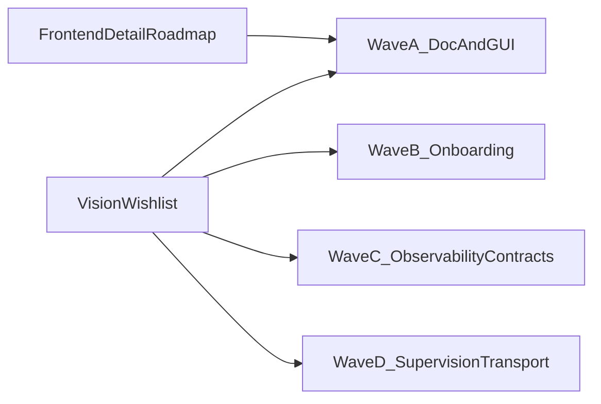

# Глобальный план приближения к «идеалу»

**Статус:** живой roadmap (обновлять по мере закрытия волн). Не ADR.  
**Аудитория:** архитектор, тимлид, ведущий разработчик.  
**Как читать:** сначала контекст и зазоры — [FRAMEWORK_VISION_AND_WISHLIST.md](./FRAMEWORK_VISION_AND_WISHLIST.md); зафиксированные решения — [../DECISIONS.md](../DECISIONS.md). Этот файл задаёт **порядок и склейку тем**; детали GUI — только в [FRONTEND_COMMAND_LAUNCHER_ROADMAP.md](./FRONTEND_COMMAND_LAUNCHER_ROADMAP.md).

**Связанные документы:** [FRAMEWORK_VISION_AND_WISHLIST.md](./FRAMEWORK_VISION_AND_WISHLIST.md), [FRAMEWORK_OVERVIEW.md](./FRAMEWORK_OVERVIEW.md), [ARCHITECTURE_MODULE_CATALOG.md](./ARCHITECTURE_MODULE_CATALOG.md), [ROUTING_GLOSSARY.md](./ROUTING_GLOSSARY.md); прототип: [../../../multiprocess_prototype/docs/ARCHITECTURE.md](../../../multiprocess_prototype/docs/ARCHITECTURE.md).

---

## 1. Критерии «ближе к идеалу» (измеримо)

| # | Критерий | Проверка «сделано» |
|---|-----------|-------------------|
| 1 | Один канонический путь **GUI → outbound COMMAND** | Нет параллельных реализаций sender; соответствие [FRONTEND_COMMAND_LAUNCHER_ROADMAP.md](./FRONTEND_COMMAND_LAUNCHER_ROADMAP.md) и коду прототипа |
| 2 | **Док ↔ код** по GUI и оркестрации | [ARCHITECTURE.md](../../../multiprocess_prototype/docs/ARCHITECTURE.md) описывает фактический путь; расхождения устранены или помечены |
| 3 | **Vertical slice** для обучения | В репозитории есть минимальный пример (не Inspector): ≥2–3 процесса, один сценарий сообщений; отдельная страница «tutorial» в docs или README пакета примера |
| 4 | **Trace одной операции** | По одной команде (или запросу) виден сквозной идентификатор в логах/сообщениях через задействованные процессы |
| 5 | **Контракт на границе** | Согласованная политика версии/обязательных полей для dict-сообщений (док + при необходимости код в message path) |
| 6 | **Падение дочернего процесса** | Поведение SystemLauncher задокументировано; при наличии — hooks или политика restart/stop-all (см. Wave D) |
| 7 | **Тесты без лишнего окружения** | Расширение pytest-сценариев с подменой router/очередей или in-process там, где это реалистично |

---

## 2. Карта тем и работ

Связь с §3–4 [FRAMEWORK_VISION_AND_WISHLIST.md](./FRAMEWORK_VISION_AND_WISHLIST.md).

| Тема | Суть работ | Типичные точки касания |
|------|------------|-------------------------|
| **Ergonomics / onboarding** | Снизить порог входа: учебный vertical slice, короткий tutorial; `multiprocess_prototype` остаётся полноразмерной демонстрацией | Новый пакет-пример или `docs/` + минимальный `main`; ссылка из [FRAMEWORK_OVERVIEW.md](./FRAMEWORK_OVERVIEW.md) Quick Start |
| **Контракты на границе** | Dict at Boundary сохранить; добавить дисциплину версий/полей (опционально `schema_version`, строгий parse на приёме) | [message_module](../modules/message_module/), приём в [process_module](../modules/process_module/) / workers приложения |
| **Наблюдаемость** | `correlation_id` / `trace_id` в COMMAND и в логах; одна страница «кнопка → очередь → handler» | [message_module](../modules/message_module/), [logger_module](../modules/logger_module/), `ObservableMixin` в [base_manager](../modules/base_manager/) |
| **Супервизия и деградация** | События «процесс завершился», опционально restart N раз, затем останов системы; backpressure — по возможности | [process_manager_module](../modules/process_manager_module/) |
| **Транспорт** | Абстракция канала / тестовая реализация без полного мока процесса (долгосрочно) | [router_module](../modules/router_module/), [shared_resources_module](../modules/shared_resources_module/) — только после ADR и прототипа API |
| **Тестирование** | `FakeRouter`, in-process topology, тесты без DISPLAY где возможно | `tests/` фреймворка и прототипа |
| **Публичная поверхность** | Жёсткое правило: между модулями — чужой `interfaces.py` | [Правила репозитория](../../../../.cursor/rules/framework-architecture.mdc), экспорты в `*/interfaces.py` |

---

## 3. Трек «Frontend как продукт» (делегирование)

Детальный пошаговый план (фазы M0–M3, `RoutedCommandSender`, лаунчер, анти-паттерны) **не дублируется здесь**.

Вся детализация: **[FRONTEND_COMMAND_LAUNCHER_ROADMAP.md](./FRONTEND_COMMAND_LAUNCHER_ROADMAP.md)**.

В глобальном плане этот трек — подмножество темы «Frontend как продукт» и входит в **Wave A** (согласованность кода, доков и одного пути отправки команд).

---

## 4. Волны (глобально)

### Wave A — Продукт vs документ (и GUI-команды)

| Поле | Содержание |
|------|------------|
| **Цель** | Закрыть зазор между описанием и кодом; завершить единый путь outbound COMMAND из GUI по frontend roadmap. |
| **Артефакты** | Код прототипа + `frontend_module`; обновление [ARCHITECTURE.md](../../../multiprocess_prototype/docs/ARCHITECTURE.md); ADR по мере необходимости в [DECISIONS.md](../DECISIONS.md). |
| **Зависимости** | Блокирует демонстрацию «идеала» для UI; желательно закрыть до массового расширения виджетов. |
| **Оценка** | M |

### Wave B — Вход и обучение

| Поле | Содержание |
|------|------------|
| **Цель** | Один vertical slice и одна короткая tutorial-страница; новый разработчик проходит путь без чтения всего каталога модулей. |
| **Артефакты** | Мини-приложение или сценарий в `examples/` / отдельный пакет; страница в [docs/](./) + ссылка из [FRAMEWORK_OVERVIEW.md](./FRAMEWORK_OVERVIEW.md). |
| **Зависимости** | Может идти параллельно с Wave A после стабилизации `process()` и `SystemLauncher` API. |
| **Оценка** | M |

### Wave C — Наблюдаемость и контракты

| Поле | Содержание |
|------|------------|
| **Цель** | Сквозной trace; дисциплина версий/полей на границе dict без отказа от Dict at Boundary. |
| **Артефакты** | Изменения в message/logger path; документ «отладка одной команды»; тесты на сериализацию/parse границы. |
| **Зависимости** | Логично после Wave A (меньше переписывания путей GUI). Подэтапы: (C1) trace в логах, (C2) версии сообщений. |
| **Оценка** | M/L |

### Wave D — Устойчивость и транспорт (опционально, тяжёлое)

| Поле | Содержание |
|------|------------|
| **Цель** | Hooks супервизии (падение процесса, политика restart); задел под сменяемый транспорт и тестовую подмену канала. |
| **Артефакты** | Расширение `process_manager_module`; при транспорте — ADR, узкий прототип API router/shared_resources. |
| **Зависимости** | Требует явного ADR; не смешивать с мелкими UI-задачами. |
| **Оценка** | L |

---

## 5. Риски и ограничения

- **Dict at Boundary** не ослаблять без отдельного ADR; усиление контрактов ≠ возврат к pickle сложных объектов через очереди.
- **Домен Inspector** (каталоги команд, схемы регистров приложения) остаётся в `multiprocess_prototype`, не в модулях фреймворка (см. ограничители в [FRONTEND_COMMAND_LAUNCHER_ROADMAP.md](./FRONTEND_COMMAND_LAUNCHER_ROADMAP.md)).
- **Не плодить модули** ради небольшого объёма кода — сначала `frontend_module/application/` или существующие пакеты; новый модуль только с обоснованием в DECISIONS.
- **Синхронизация планов:** при появлении второго пути GUI→COMMAND без ADR — нарушение критерия §1; чеклист в roadmap и в [registers/CHECKLIST.md](../../../multiprocess_prototype/registers/CHECKLIST.md) для регистров.

---

## 6. Навигация по темам (схема)

---

*При закрытии волны — обновлять таблицы §1 и §4 и при необходимости ссылку из [MODULES_STATUS.md](../MODULES_STATUS.md) или STATUS затронутых модулей.*
