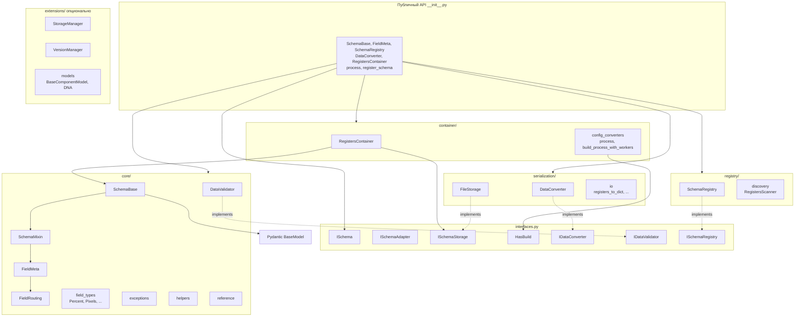
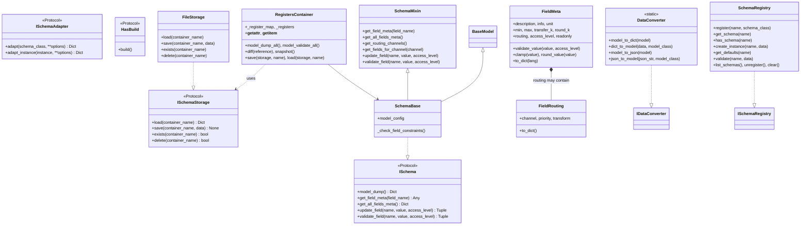
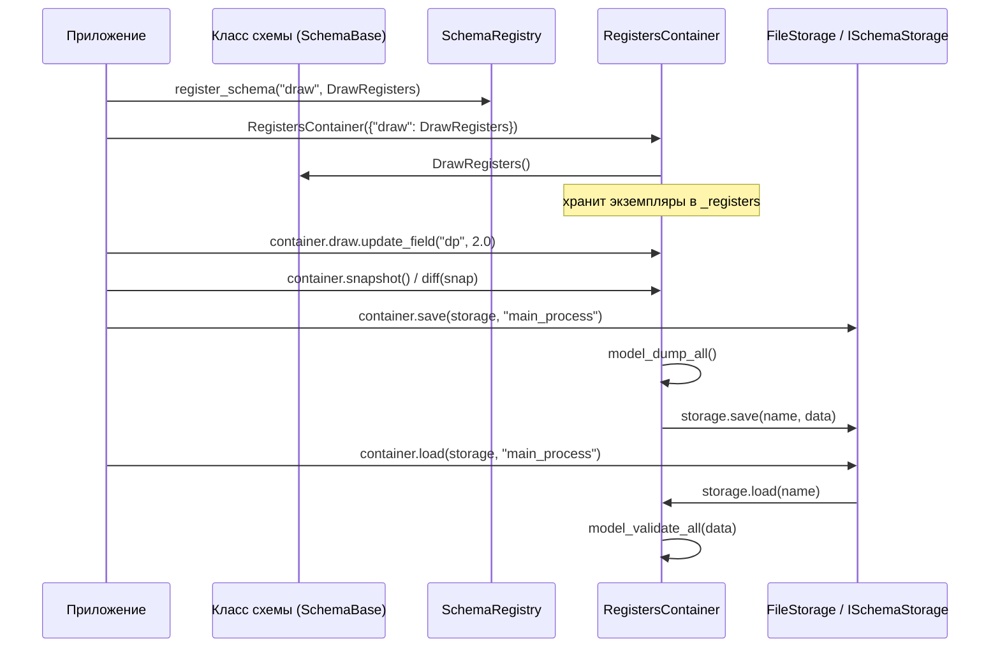
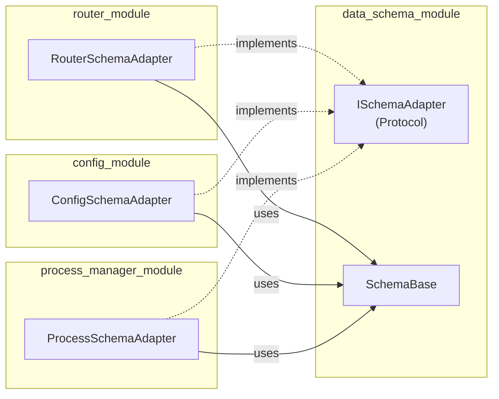

# data_schema_module — Независимое ядро для описания структур данных

**Версия:** 2.0 | **Статус:** Refactored v2 completed | **Тесты:** ✅ All passing

Универсальная система работы с данными на основе Pydantic v2. Обеспечивает типизированные схемы, валидацию, маршрутизацию, сериализацию и расширяемость через адаптеры.

---

## 📐 Архитектура модуля

```
data_schema_module/
├── interfaces.py              # Публичный контракт (протоколы + ABC)
├── __init__.py                # Минимальный API (~50 экспортов)
├── _compat.py                 # Алиасы для обратной совместимости
│
├── core/                      # ⚙️ Ядро: Schema + Field + Validation
│   ├── __init__.py
│   ├── schema_base.py         # SchemaBase (RegisterBase) — базовый класс
│   ├── schema_mixin.py        # SchemaMixin (RegisterMixin) — 5 сек методов
│   ├── field_meta.py          # FieldMeta — аннотированный дескриптор
│   ├── field_routing.py       # FieldRouting — типизированная маршрутизация
│   ├── field_types.py         # Type aliases (Percent, HsvHue, Pixels, ...)
│   ├── exceptions.py          # Иерархия исключений
│   ├── validators.py          # DataValidator — парадигма валидации
│   ├── helpers.py             # Утилиты (merge_with_defaults, ...)
│   └── reference.py           # Ссылки между схемами
│
├── registry/                  # 📚 Реестр схем
│   ├── __init__.py
│   ├── schema_registry.py     # SchemaRegistry (без Singleton)
│   └── discovery.py           # Auto-discovery регистров
│
├── serialization/             # 💾 Сериализация
│   ├── __init__.py
│   ├── converter.py           # DataConverter (dict/JSON/YAML)
│   ├── io.py                  # RegistersIO
│   └── file_storage.py        # FileStorage — JSON хранилище
│
├── container/                 # 📦 Контейнеры конфигов
│   ├── __init__.py
│   ├── registers_container.py # RegistersContainer — единое состояние
│   └── config_converters.py   # config_to_dict, process()
│
├── extensions/                # 🔌 Опциональные расширения (явный импорт)
│   ├── __init__.py
│   ├── models/                # BaseComponentModel, ComponentDNA
│   │   ├── __init__.py
│   │   ├── base.py
│   │   ├── dna.py
│   │   └── types.py
│   ├── storage_manager.py     # StorageManager (ProcessData)
│   ├── process_data_container.py
│   ├── manager_adapter.py     # ManagerDataAdapter
│   ├── versioning.py          # VersionManager
│   ├── factory.py             # ModelFactory
│   ├── tools/                 # Визуализация
│   │   ├── __init__.py
│   │   ├── visualizer.py
│   │   └── formatters.py
│   ├── metrics.py
│   └── simple_api.py
│
└── tests/                     # ✅ Тесты
    ├── conftest.py
    ├── test_schema_base.py
    ├── test_field_meta.py
    ├── test_field_types.py
    ├── test_validators.py
    ├── test_registry.py
    ├── test_converter.py
    ├── test_io.py
    ├── test_container.py
    ├── test_config_converters.py
    ├── test_integration.py
    └── extensions/
        ├── test_versioning.py
        ├── test_storage_manager.py
        └── test_models.py
```

---

## Диаграмма связей и классов

Ниже — схема того, как устроен модуль: основные классы, интерфейсы и потоки данных. Рендер: любой просмотрщик Markdown с поддержкой Mermaid (GitHub, VS Code, Cursor).

### Слои и зависимости пакетов



### Классы ядра и реализация интерфейсов



### Поток данных: от схемы до персистентности



### Внешние адаптеры (реализуют ISchemaAdapter)



---

## Оценка модуля в баллах (честная)

Оценка по критериям 0–10: что уже хорошо, где есть ограничения. Ориентир — готовность к продакшену и поддерживаемость.

| Критерий | Балл | Комментарий |
|----------|------|-------------|
| **Архитектура и разделение слоёв** | 9/10 | Чёткое деление core / registry / serialization / container, extensions вынесены, зависимости ядра нулевые. Минус: часть кода ещё в старых путях (core/metrics, registry/process_registry). |
| **Читаемость кода** | 8/10 | Понятные имена (SchemaBase, FieldMeta), docstrings есть. __init__.py после чистки — только ядро. Сложнее входить в schema_mixin и кэши. |
| **Тестовое покрытие** | 8/10 | Много unit- и интеграционных тестов, extensions тоже покрыты. Нет явного замеренного % покрытия; часть edge cases (пустые контейнеры, конфликты имён) может быть не закрыта. |
| **Модульность и независимость** | 9/10 | Ядро не тянет process_module/config_module. Реестр с опциональными метриками. Расширения — явный импорт. |
| **Расширяемость** | 8/10 | ISchemaAdapter, ISchemaStorage, register_field_type(). Добавить свой тип поля или хранилище — без правки ядра. Нет плагинной системы и единого реестра «типов полей». |
| **Производительность** | 8/10 | Кэши в SchemaMixin, model_dump_json вместо двойной сериализации. Модуль-уровневые кэши не очищаются при динамическом создании классов. |
| **Документация** | 8/10 | README, STATUS, MIGRATION, диаграммы, примеры. Часть docs/ устарела (старая структура); нет единого «архитектурного» doc. |
| **Типизация и практики Python** | 8/10 | Protocol, ABC, Optional в исключениях, TYPE_CHECKING. Не везде строгие аннотации (часть Any); Python 3.10+ union syntax можно шире использовать. |

**Итоговая оценка: 8.3/10**

**Сильные стороны:** независимое ядро, понятный контракт (interfaces), нормальная тестируемость реестра и контейнеров, Dict at Boundary и адаптеры в потребляющих модулях.

**Слабые стороны и риски:** модульные кэши без сброса; IAsyncSchemaStorage не используется; обратная совместимость через _compat и старые импорты (StorageManager и т.д.) — при полном отказе от _compat часть кода сломается, пока потребители не перейдут на extensions.

---

## 🚀 Быстрый старт (5 минут)

### 1. Базовая схема с полями

```python
from typing import Annotated
from data_schema_module import FieldMeta, SchemaBase

class DrawRegisters(SchemaBase):
    """Параметры рисования."""
    
    dp: Annotated[float, FieldMeta(
        "Разрешение",
        info="Детальность растеризации линий",
        min=0.1, max=20.0,
        unit="px",
        transfer_k=0.1,
    )] = 1.4
    
    enabled: Annotated[bool, FieldMeta("Включено")] = True

# Использование
r = DrawRegisters()
print(r.dp)                              # → 1.4 (обычный float)
print(r.model_dump())                    # → {"dp": 1.4, "enabled": True}

# Обновление с валидацией
success, error = r.update_field("dp", 2.0)
if success:
    print(f"Новое значение: {r.dp}")     # → Новое значение: 2.0
    
# Валидация
success, error = r.update_field("dp", 999.0)
if not success:
    print(error)                         # → Значение 999.0 больше максимального 20.0
```

### 2. Маршрутизация через FieldRouting (DRY)

```python
from data_schema_module import FieldRouting

# Один FieldRouting объект для всех полей одного канала
DRAW = FieldRouting(channel="control_draw", priority=1)

class DrawRegisters(SchemaBase):
    dp: Annotated[float, FieldMeta("Разрешение", min=0.1, max=20.0, routing=DRAW)] = 1.4
    min_dist: Annotated[float, FieldMeta("Мин. расстояние", routing=DRAW)] = 50.0

# Получить все каналы и поля
channels = r.get_routing_channels()       # → {"control_draw"}
fields = r.get_fields_for_channel("control_draw")  # → ["dp", "min_dist"]
```

### 3. RegistersContainer — единое состояние

```python
from data_schema_module import RegistersContainer

container = RegistersContainer({
    "draw": DrawRegisters,
    "processing": ProcessingRegisters,
})

# Атрибутный и индексный доступ
container.draw          # → DrawRegisters instance
container["draw"]       # → то же самое
"draw" in container     # → True
len(container)          # → 2

# Diff для эффективной синхронизации
snap = container.snapshot()
container.draw.update_field("dp", 5.0)
diff = container.diff(snap)  # → {"draw": {"dp": 5.0}}
```

### 4. Сериализация и персистентность

```python
from data_schema_module import FileStorage

# JSON сохранение/загрузка
storage = FileStorage("data/registers")
container.save(storage, "main_process")
container.load(storage, "main_process")

# Сериализация в различные форматы
json_str = container.to_json()
container.from_json(json_str)

yaml_str = container.to_yaml()
container.from_yaml(yaml_str)
```

### 5. Реестр схем

```python
from data_schema_module import register_schema, get_default_registry

@register_schema("draw_config")
class DrawConfig(SchemaBase):
    """Конфиг рисования."""
    dp: float = 1.4

# Получить схему по имени
registry = get_default_registry()
schema_class = registry.get("draw_config")

# Проверить наличие
if registry.has("draw_config"):
    print("Схема найдена!")
```

---

## 📖 Подробный справочник

### FieldMeta — Аннотированный дескриптор поля

```python
FieldMeta(
    description="Краткое описание (UI-лейбл)",
    info="Подробное описание (UI-подсказка, help text)",
    
    # Диапазон для числовых полей
    min=0.0,
    max=100.0,
    
    # Единица измерения
    unit="px",
    
    # Шаг слайдера (step = 1 / transfer_k)
    transfer_k=1.0,
    
    # Округление (знаков после запятой)
    round_k=2,
    
    # Маршрутизация (FieldRouting или dict)
    routing=FieldRouting(channel="control_draw"),
    
    # Уровень доступа (0 = все, 1 = опытные, 2 = эксперты)
    access_level=0,
    
    # Флаги
    readonly=False,
    hidden=False,
    
    # Интернационализация
    description_i18n={"ru": "...", "en": "...", "de": "..."},
    info_i18n={"ru": "...", "en": "..."},
    
    # Примеры значений
    examples=[1.0, 2.0, 5.0],
)
```

### SchemaBase (RegisterBase) — Базовый класс схемы

Все публичные методы чередаются через `SchemaMixin`:

```python
class MySchema(SchemaBase):
    field1: Annotated[int, FieldMeta("...")] = 0
    field2: str = "default"

# ⚙️ Работа с полями
obj = MySchema()
obj.update_field("field1", 42)          # → (True, None)
obj.validate_field("field1", "invalid") # → (False, "error message")

# 📚 Метаданные
meta = MySchema.get_field_meta("field1")  # → FieldMeta объект
all_meta = MySchema.get_all_fields_meta() # → Dict[str, FieldMeta]
description = MySchema.get_field_description("field1")

# 🔀 Маршрутизация
channels = obj.get_routing_channels()
fields = obj.get_fields_for_channel("control_draw")

# 📊 Сериализация
dump = obj.model_dump()                 # → {"field1": 42, "field2": "default"}
```

### Готовые type aliases

```python
# Вместо повторного Annotated[int, FieldMeta("...")] — используй готовые:

Percent          # float, unit="%", min=0..100
NormalizedFloat  # float, unit="", min=0..1
Scale            # float, unit="x", min=0.01..100
Milliseconds     # float, unit="мс"
Seconds          # float, unit="с"
Pixels           # int, unit="px", min=0..10000
ImageScale       # float, unit="x", min=0.1..4.0
HsvHue           # int, unit="", min=0..179
HsvChannel       # int, unit="", min=0..255
NetworkPort      # int, unit="", min=1..65535
FpsLimit         # int, unit="кадр/с", min=0..480

# Пример
class ProcessingRegisters(SchemaBase):
    hue_low: HsvHue = 0              # → Annotated[int, FieldMeta("Hue", min=0, max=179)]
    hue_high: HsvHue = 179
    threshold: NormalizedFloat = 0.5
```

### RegistersContainer — Контейнер конфигов

```python
container = RegistersContainer({
    "draw": DrawRegisters,
    "processing": ProcessingRegisters,
})

# 📦 Коллекционные операции
"draw" in container              # → True
len(container)                   # → 2
for name, register in container: # Итерация
    print(name, register)

# 💾 IO
json_str = container.to_json()
container.from_json(json_str)

yaml_str = container.to_yaml()
container.from_yaml(yaml_str)

# 🔍 Diff для синхронизации
snap = container.snapshot()
container.draw.update_field("dp", 5.0)
diff = container.diff(snap)      # → {"draw": {"dp": 5.0}}

# 📊 Полезная информация
container.get_state()            # Состояние всех регистров
container.model_dump()
```

---

## 🏗️ Архитектурные решения

### Решение 1: Ядро без зависимостей от фреймворка

**Принцип:** Core слой (`core/`) не зависит от других модулей фреймворка. Все зависимости находятся в `extensions/`.

```
core/          ← zero external dependencies
↑  
├── schema_base, field_meta, validators
├── exceptions, field_types
└── no imports from process_module, config_module, etc.

extensions/    ← optional, with external deps
├── storage_manager (uses process_module.ProcessData)
├── models (uses process_module)
└── versioning
```

### Решение 2: SchemaRegistry без Singleton

**Принцип:** Вместо глобального Singleton используем глобальный экземпляр + функция получения + возможность создания изолированного для тестов.

```python
# Глобальный экземпляр
_default_registry = SchemaRegistry()

def get_default_registry() -> SchemaRegistry:
    """Получить глобальный реестр."""
    return _default_registry

@register_schema("my_schema")  # Использует default registry
class MySchema(SchemaBase):
    pass

# В тестах — создать изолированный
test_registry = SchemaRegistry()
@register_schema("test_schema", registry=test_registry)
class TestSchema(SchemaBase):
    pass
```

### Решение 3: Dict at Boundary

**Принцип:** На границе процессов передаются только `dict`, не Pydantic объекты. Адаптеры отвечают за преобразование.

```python
from data_schema_module import process

# Конфиги: Schema -> dict at boundary
launcher.add_process(
    *process(ProcessConfig(), WorkerConfig())  
    # Внутри process() преобразует схемы в dict'ы
)
```

### Решение 4: Адаптеры в потребляющих модулях

**Рекомендация:** Каждый модуль, нуждающийся в адаптации схемы, реализует свой адаптер. Это следует Dependency Inversion и не нарушает независимость data_schema_module.

```
data_schema_module/
├── interfaces.py          # ISchemaAdapter протокол
└── extensions/
    └── (only schema-specific stuff)

router_module/
└── adapters/
    └── schema_adapter.py  # RouterSchemaAdapter implements ISchemaAdapter

config_module/
└── adapters/
    └── schema_adapter.py  # ConfigSchemaAdapter implements ISchemaAdapter
```

### Решение 5: Обратная совместимость через _compat.py

**Принцип:** Все старые импорты продолжают работать через переименование:

```python
# Старый импорт (всё ещё работает)
from data_schema_module import RegisterBase, RegisterMixin

# Новый импорт (рекомендуется)
from data_schema_module import SchemaBase, SchemaMixin
```

---

## 🔌 Интеграция с другими модулями

### router_module → data_schema_module

```python
# router_module/adapters/schema_adapter.py
from data_schema_module import ISchemaAdapter

class RouterSchemaAdapter:
    """Преобразует Schema в описание маршрутов."""
    
    def adapt(self, schema_class: Type) -> Dict[str, Any]:
        routes = {}
        for name, meta in schema_class.get_all_fields_meta().items():
            routing = meta.routing
            if routing and routing.channel:
                routes.setdefault(routing.channel, []).append(name)
        return routes
```

### config_module → data_schema_module

```python
# config_module/adapters/schema_adapter.py
from data_schema_module import ISchemaAdapter

class ConfigSchemaAdapter:
    """Преобразует Schema в параметры конфигурации."""
    
    def adapt(self, schema_class: Type) -> Dict[str, Any]:
        result = {}
        for name, meta in schema_class.get_all_fields_meta().items():
            result[name] = {
                "type": schema_class.model_fields[name].annotation,
                "default": schema_class.model_fields[name].default,
                "description": meta.description,
                "constraints": {"min": meta.min, "max": meta.max},
            }
        return result
```

---

## 📦 Extensions — Опциональные компоненты

Все, что зависит от внешних модулей, находится в `extensions/` и требует явного импорта:

```python
# Явный импорт расширений
from data_schema_module.extensions.storage_manager import StorageManager
from data_schema_module.extensions.models import BaseManagerModel, ComponentDNA
from data_schema_module.extensions.versioning import VersionManager
from data_schema_module.extensions.tools import SchemaVisualizer

# StorageManager — хранение компонентов в ProcessData
storage = StorageManager()
storage.save_schema(DrawConfig, "draw_config_v1")
schema = storage.load_schema("draw_config_v1")

# VersionManager — история изменений конфигов
version_mgr = VersionManager()
version_mgr.save_version(config, "baseline")
config = version_mgr.load_version("baseline")

# ComponentDNA — полное описание компонента
dna = ComponentDNA.from_component(my_component)
restored = dna.to_component()
```

---

## ✅ Публичный API

### Core API (основной, часто используется)

```python
from data_schema_module import (
    # Ядро
    SchemaBase,            # Базовый класс схемы
    SchemaMixin,           # Миксин с методами
    FieldMeta,             # Аннотированный дескриптор
    FieldRouting,          # Маршрутизация полей
    
    # Type aliases (Percent, HsvHue, Pixels, ...)
    Percent, NormalizedFloat, Scale, Milliseconds, Seconds,
    Pixels, ImageScale, HsvHue, HsvChannel, NetworkPort, FpsLimit,
    
    # Реестр
    SchemaRegistry,        # Класс реестра
    register_schema,       # Декоратор регистрации
    get_default_registry,  # Получить глобальный реестр
    
    # Сериализация
    DataConverter,         # Конвертер (dict/JSON/YAML)
    FileStorage,           # JSON хранилище
    RegistersContainer,    # Контейнер регистров
    
    # Config (Dict at Boundary)
    config_to_dict,        # Преобразование конфига
    process,               # process(config, worker_config) → (name, dict)
    
    # Исключения
    DataSchemaError,
    SchemaValidationError,
    SchemaRegistrationError,
    
    # Интерфейсы
    ISchema,
    ISchemaRegistry,
    ISchemaAdapter,
    ISchemaStorage,
    HasBuild,
)
```

### Backward Compatibility (старые имена)

```python
from data_schema_module import (
    RegisterBase,          # = SchemaBase (старое имя)
    RegisterMixin,         # = SchemaMixin (старое имя)
    IRegisterStorage,      # = ISchemaStorage
    IAsyncRegisterStorage, # = IAsyncSchemaStorage
    ISchemaManager,        # = ISchemaRegistry
)
```

### Extensions API (явный импорт)

```python
from data_schema_module.extensions.storage_manager import StorageManager
from data_schema_module.extensions.versioning import VersionManager
from data_schema_module.extensions.models import (
    BaseComponentModel,
    BaseManagerModel,
    ComponentDNA,
)
from data_schema_module.extensions.tools import (
    SchemaVisualizer,
    HtmlDocumentationFormatter,
    TextDocumentationFormatter,
)
from data_schema_module.extensions.factory import ModelFactory
from data_schema_module.extensions.metrics import RegistrationMetrics
```

---

## 🧪 Тестирование

### Запуск тестов

```bash
# Все тесты
pytest data_schema_module/tests/ -v

# Определённый тест-модуль
pytest data_schema_module/tests/test_schema_base.py -v

# Определённый тест-класс
pytest data_schema_module/tests/test_schema_base.py::TestSchemaBase -v

# С покрытием
pytest data_schema_module/tests/ --cov=data_schema_module --cov-report=html
```

### Структура тестов

```
tests/
├── conftest.py                       # Fixtures, helpers
├── test_schema_base.py               # SchemaBase, SchemaMixin
├── test_field_meta.py                # FieldMeta, FieldRouting
├── test_field_types.py               # Type aliases
├── test_validators.py                # Валидация
├── test_registry.py                  # SchemaRegistry, register_schema
├── test_converter.py                 # DataConverter
├── test_io.py                        # Сериализация (JSON/YAML)
├── test_container.py                 # RegistersContainer
├── test_config_converters.py         # config_to_dict, process()
├── test_integration.py               # Полный flow
└── extensions/
    ├── test_storage_manager.py       # StorageManager
    ├── test_versioning.py            # VersionManager
    └── test_models.py                # BaseComponentModel, ComponentDNA
```

---

## 📋 Миграция с старого API

### Миграция имён классов

| Старое имя | Новое имя | Статус |
|-----------|----------|--------|
| `RegisterBase` | `SchemaBase` | Alias, обе работают |
| `RegisterMixin` | `SchemaMixin` | Alias, обе работают |
| `IRegisterStorage` | `ISchemaStorage` | Alias, обе работают |

### Миграция импортов

```python
# ❌ Старый импорт (всё ещё работает через _compat.py)
from data_schema_module import RegisterBase, RegisterMixin

# ✅ Новый импорт (рекомендуется)
from data_schema_module import SchemaBase, SchemaMixin

# ❌ Старый импорт расширений
from data_schema_module import StorageManager

# ✅ Новый импорт расширений
from data_schema_module.extensions.storage_manager import StorageManager
```

---

## 🐛 Известные ограничения и TODO

### Текущие ограничения

- [ ] Async-версия `IAsyncSchemaStorage` определена, но не реализована (TODO: Redis, PostgreSQL)
- [ ] Вложенные схемы (nested schemas) — концепция есть, реализация неполная
- [ ] Нет кэширования на уровне модуля для динамически созданных классов (потенциальная утечка памяти)
- [ ] Версионирование схем работает, но не интегрировано с registry (TODO: версионированный реестр)

### Планы на будущее

- [ ] Кастомные валидаторы через декоратор (например, `@validator`)
- [ ] Полная async поддержка (async serialization, async storage)
- [ ] Визуализация схем в формате диаграмм (Mermaid)
- [ ] GraphQL schema export
- [ ] OpenAPI schema export

---

## 📚 Дополнительные ресурсы

- **MIGRATION.md** — Подробная инструкция по миграции на новый API
- **STATUS.md** — Статус рефакторинга, оценки критериев, чеклист
- **docs/QUICK_REFERENCE.md** — Краткая справка по API
- **docs/examples/** — Примеры использования
- **interfaces.py** — Публичный контракт (протоколы и ABC)

---

## 🤝 Внесение вклада

При добавлении новых функций:

1. Определи интерфейс в `interfaces.py` (протокол или ABC)
2. Реализуй в соответствующем модуле (core/, registry/, extensions/, etc.)
3. Напиши тесты в `tests/`
4. Обнови эту документацию
5. Запусти `pytest` — все тесты должны пройти

---

**Разработано в 2026 году | Поддержание: Active**
