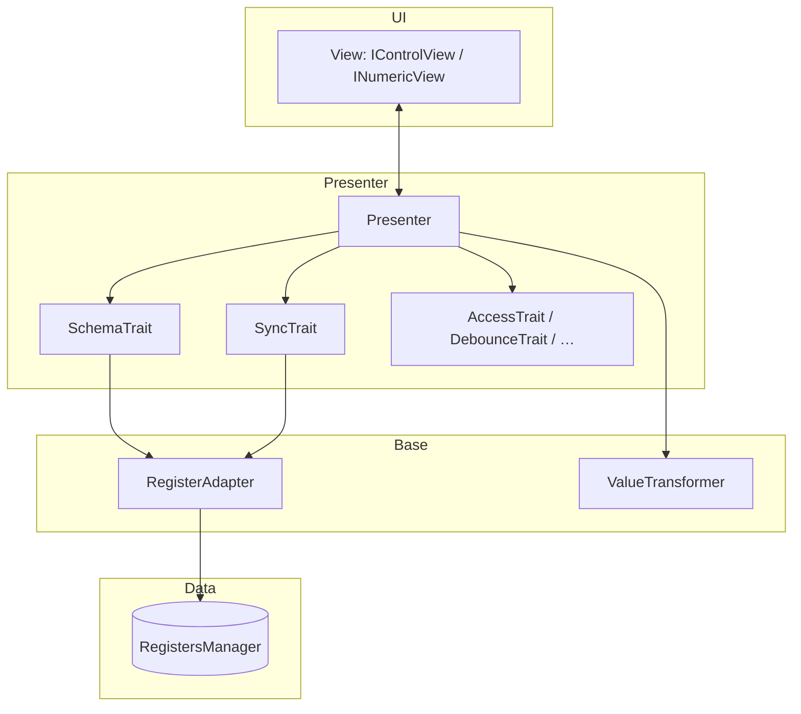
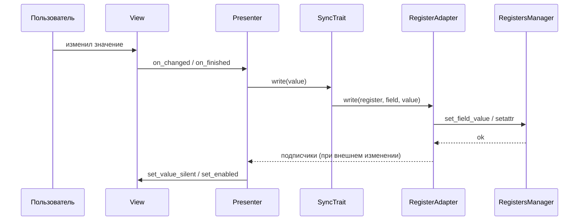
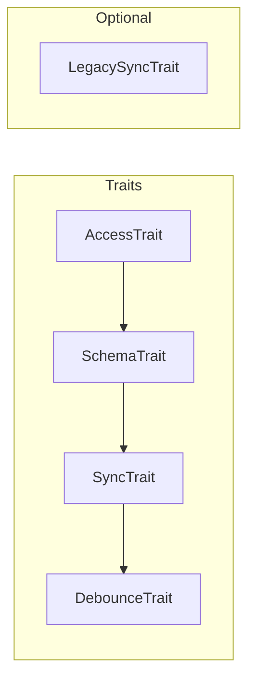

# Controls v2 — базовый слой (`base`)

Универсальные **контракты**, **конфиг**, **мост к регистрам** и **traits** для presenter-ов. Цель — одна тонкая база без дублирования; новые компоненты подключают те же порты, а не копируют логику.

## Принципы (лаконичная архитектура)

1. **Один мост к данным** — `RegisterAdapter` на `RegistersManagerLike`; чтение/запись/подписка в одном месте.
2. **Traits = кирпичи поведения** — маленькие классы без наследования «бог-виджета»; presenter только склеивает их.
3. **View по протоколу** — `IControlView` / `INumericView`; конкретные Qt-классы не протекают в бизнес-логику.
4. **Расширение без раздувания base** — новый контрол = свой пакет (`slider/`, `checkbox/`, …) + те же `IFieldBinding` / `IRegisterPort`.
5. **Legacy отдельно** — `LegacySyncTrait` опционален, не обязателен для новых экранов.
6. **Наблюдаемость через хуки** — `ControlHooks` (`on_write_rejected`, `on_write_committed`) передаётся в фасады; фреймворк не тянет `logger_module` / `error_module`. Приложение связывает колбэки с менеджерами или с `pyqtSignal`.

---

## Слои и порты



### Таблица портов (`interfaces.py`)

| Протокол | Роль | Типичная реализация |
|----------|------|---------------------|
| `IFieldBinding` | `register_name`, `field_name`, `access_level` (+ опционально `index`) | `BindingConfig` |
| `IRegisterPort` | `read` / `write` / `subscribe` / `resolve_meta` | `RegisterAdapter` |
| `RegistersManagerLike` | `get_register`, `get_field_metadata` | ваш `RegistersManager` |
| `IControlView[T]` / `INumericView` | только UI | `CheckboxView`, `SliderValueView`, … |

Структурная типизация: любой объект с теми же полями/методами подходит; не обязаны наследовать классы из `base`.

---

## Поток: пользователь → регистр



---

## Композиция presenter (пример числового поля)



---

## Состав файлов

| Область | Назначение |
|--------|------------|
| `interfaces.py` | View-протоколы + `IFieldBinding`, `IRegisterPort`, `RegistersManagerLike` |
| `control_hooks.py` | `ControlHooks`, события записи/прав, `emit_*` |
| `config.py` | `BaseControlConfig`, `BindingConfig`, `LabelOverride`, `merge_config` |
| `infrastructure/` | `RegisterAdapter`, `ValueTransformer`, `block_signals` |
| `traits/` | `SyncTrait`, `SchemaTrait` (публичный `refresh()` для перечитывания `ResolvedMeta`), `AccessTrait` (`set_required_level` после смены меты), `DebounceTrait`, `LegacySyncTrait` |

---

## Примеры

### Хуки записи и прав (`ControlHooks`)

Передайте в `CheckboxControl.create` / `NumericControl.create` / `SliderControl.create` / `SpinBoxControl.create` и составные фасады. Объект **сохраняется в presenter**; колбэки вызываются из presenter при:

- успешной записи — `on_write_committed`;
- отказе регистра/адаптера — `on_write_rejected` (и по-прежнему `show_error` у view);
- попытке изменить значение при `not can_modify()` — `on_access_denied` (`ControlAccessDeniedEvent`).

```python
from frontend_module.components.control_v2.base import ControlHooks, ControlWriteRejectedEvent

def on_rejected(ev: ControlWriteRejectedEvent) -> None:
    # error_manager.emit(...); logger.warning(...)
    ...

hooks = ControlHooks(on_write_rejected=on_rejected)
```

Для Qt: обёртка с `QObject` и `pyqtSignal(object)` внутри колбэка — `emit(ev)`.

### Привязка к полю регистра

```python
from frontend_module.components.control_v2.base.config import BindingConfig
from frontend_module.components.control_v2.base import RegisterAdapter
from frontend_module.components.control_v2.base.traits import SyncTrait, SchemaTrait

binding = BindingConfig(
    register_name="processor",
    field_name="min_area",
    access_level=1,
)
adapter = RegisterAdapter(registers_manager)
sync = SyncTrait(binding, adapter)
schema = SchemaTrait(binding, adapter)

label = schema.label
value = sync.read()
ok, err = sync.write(42)
```

### Элемент массива (`index`)

```python
binding = BindingConfig(
    register_name="draw",
    field_name="color_lower",
    index=0,
)
```

### Числовой UI ↔ хранилище (`transfer_k`, `round_k`)

```python
from frontend_module.schemas.register_binding import RegisterFieldMeta, ResolvedMeta
from frontend_module.components.control_v2.base import ValueTransformer

meta = ResolvedMeta.merge(
    RegisterFieldMeta(min=0, max=1000, transfer_k=0.01, round_k=0),
    {"label": "Порог"},
    "threshold",
)
xf = ValueTransformer(meta)
storage = xf.to_storage(50.0)
ui = xf.to_ui(storage)
```

### Слияние конфигов dataclass

```python
from frontend_module.components.control_v2.base.config import BaseControlConfig, merge_config

defaults = BaseControlConfig(label="A", enabled=True, access_level=0)
over = BaseControlConfig(label="Переименовано", enabled=None, access_level=2)
merged = merge_config(defaults, over)
```

### Блокировка сигналов Qt

```python
from frontend_module.components.control_v2.base import block_signals

with block_signals(slider, spinbox):
    slider.setValue(10)
    spinbox.setValue(10)
```

### Debounce записи (слайдер)

```python
from frontend_module.components.control_v2.base.traits import DebounceTrait

debounce = DebounceTrait(ms=150)

def persist():
    sync.write(current_ui_value)

debounce.schedule(persist)
debounce.flush()
```

---

## Зависимости

- `frontend_module.schemas.register_binding` — `RegisterFieldMeta`, `ResolvedMeta`
- `LegacySyncTrait` — опционально `slider/legacy_sync`, `common/field_sync` (v1)

## Тесты

`frontend_module/tests/test_controls_v2_base.py`

## См. также

Обзор дерева v2 и карта компонентов: `../README.md`.
