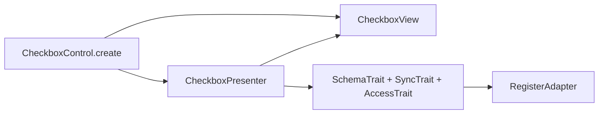
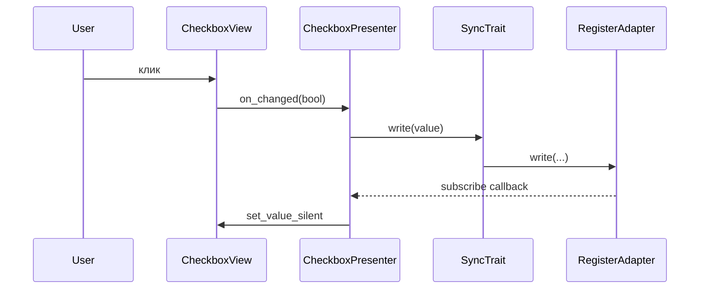

# Checkbox v2

Чекбокс с привязкой к регистру: **View** (`CheckboxView`) + **Presenter** (`CheckboxPresenter`) + **Facade** (`CheckboxControl`).

Те же порты, что и в [`base/README.md`](../base/README.md): `IFieldBinding`, `IRegisterPort`, `RegistersManagerLike`. Опционально **`ControlHooks`** в `CheckboxControl.create(..., hooks=...)` — отклонённая/успешная запись в регистр.

## Слои



## Поток значения



## Отличия от числового контроля

- Нет **DebounceTrait** и **ValueTransformer** — булево пишется сразу по `on_changed`.
- **on_finished** у view — намеренный no-op (см. `IControlView`).
- **LegacySync** не подключён; при необходимости мост к v1 добавляют в presenter по образцу `NumericPresenter`.

## Пример

```python
from frontend_module.components.control_v2.base.config import BindingConfig
from frontend_module.components.control_v2.checkbox import (
    CheckboxControl,
    CheckboxViewConfig,
)

result = CheckboxControl.create(
    registers_manager,
    BindingConfig(register_name="renderer", field_name="show_mask"),
    CheckboxViewConfig(position="left"),
)
layout.addWidget(result.widget)
```

## Тесты

`frontend_module/tests/test_checkbox_v2.py`, `test_controls_v2_hooks.py` (колбэки записи).
