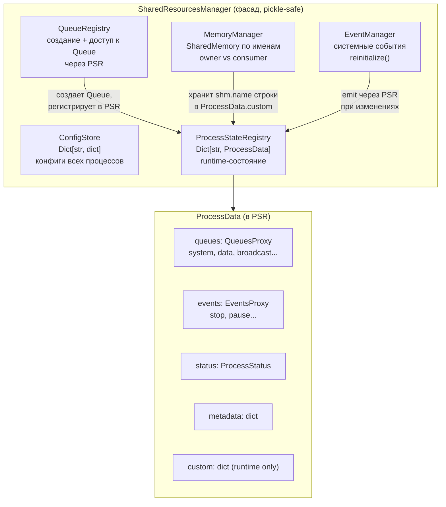
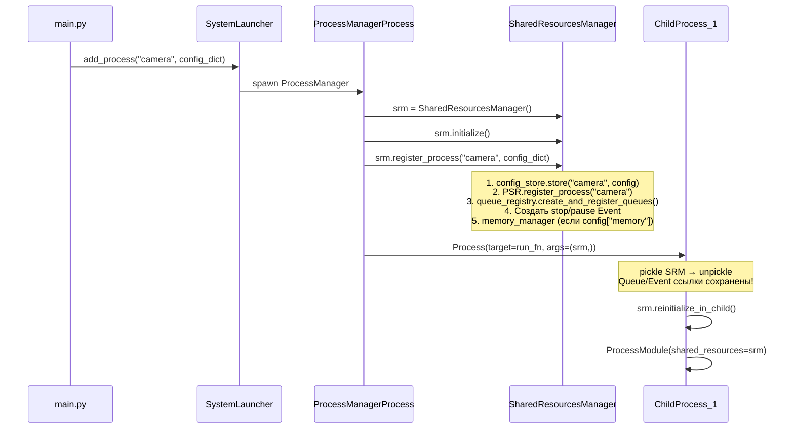
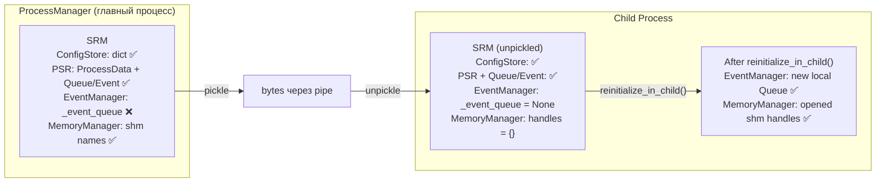

# shared_resources_module — Архитектура

## Компонентная диаграмма



## Поток данных: регистрация процессов



## Pickle/Unpickle диаграмма



## Разделение ответственностей

| Компонент | Ответственность | Pickle-safe? | reinitialize? |
|-----------|----------------|-------------|---------------|
| **ConfigStore** | Конфиги всех процессов | ✅ (dict) | Нет |
| **ProcessStateRegistry** | Runtime: статус, Queue/Event | ✅ (нативно) | Нет |
| **QueueRegistry** | Создание Queue, доступ через PSR | ✅ | Нет |
| **EventManager** | Системные события, подписки | ⚠️ | **Да** |
| **MemoryManager** | SharedMemory: owner/consumer | ✅ (имена) | **Да** |

## Многопроцессорная безопасность

1. **Нет разделяемого мутабельного состояния** — каждый процесс имеет свою копию SRM
2. **Queue** — единственный канал общения (OS pipes, thread/process safe)
3. **Event** — синхронизация через shared semaphore (process safe)
4. **SharedMemory** — каждый процесс открывает свой handle по имени
5. **Нет Lock/Manager** — не нужны, нет shared mutable state

## Файловая структура

```
shared_resources_module/
├── __init__.py                      # Чистый экспорт
├── interfaces.py                    # Реэкспорт из core/interfaces.py
├── types/
│   ├── __init__.py
│   └── types.py                     # ProcessStatus, ResourceType, EventType, TypedDict
├── core/
│   ├── interfaces.py                # ISharedResourcesManager, IConfigStore, ...
│   └── shared_resources_manager.py  # SRM (фасад)
├── state/
│   ├── process_data.py              # ProcessData (runtime: status + queues + events)
│   └── process_state_registry.py    # PSR: Dict[str, ProcessData]
├── config/
│   └── config_store.py              # ConfigStore: Dict[str, dict]
├── events/
│   ├── core/manager.py              # EventManager: emit, subscribe, reinitialize()
│   ├── interfaces.py
│   └── README.md
├── queues/
│   ├── core/manager.py              # QueueRegistry: create + access через PSR
│   ├── interfaces.py
│   └── README.md
├── memory/
│   ├── core/manager.py              # MemoryManager: shm.name, owner/consumer
│   ├── format/buffer.py              # pack/unpack изображений
│   ├── platform/shm.py               # create_shm_block, close_shm
│   ├── validation/access.py         # validate_memory_access
│   └── docs/FORMATS.md
├── adapters/
│   └── data_schema_adapter.py       # Мост к data_schema_module.StorageManager
├── registry/
│   └── data_schema_adapter.py       # Обратная совместимость → adapters/
├── mixins/
│   └── stats_mixin.py               # ManagerStatsMixin
├── tests/                           # 50+ тестов
└── docs/
    └── ARCHITECTURE.md              # Этот файл
```

## Связь с data_schema_module

**shared_resources_module** и **data_schema_module** — разные ответственности:

| shared_resources_module | data_schema_module |
|-------------------------|-------------------|
| Runtime: ProcessData, Queue, Event, SharedMemory | Схемы: RegisterBase, валидация, merge_with_defaults |
| ConfigStore — хранит dict (без валидации) | SchemaRegistry — валидирует по схемам |
| TypedDict для Dict at Boundary | Pydantic модели, field_meta |
| DataSchemaAdapter — тонкий мост | StorageManager, ProcessDataContainer — используют ProcessData.custom |

**Нет дублирования логики:**
- ConfigStore хранит только dict — валидация конфигов (если нужна) — в config_module через data_schema_module
- ProcessData — runtime-контейнер; ProcessDataContainer (data_schema) расширяет его через custom["component_dnas"]
- DataSchemaAdapter делегирует в data_schema_module.StorageManager — не содержит схемной логики
