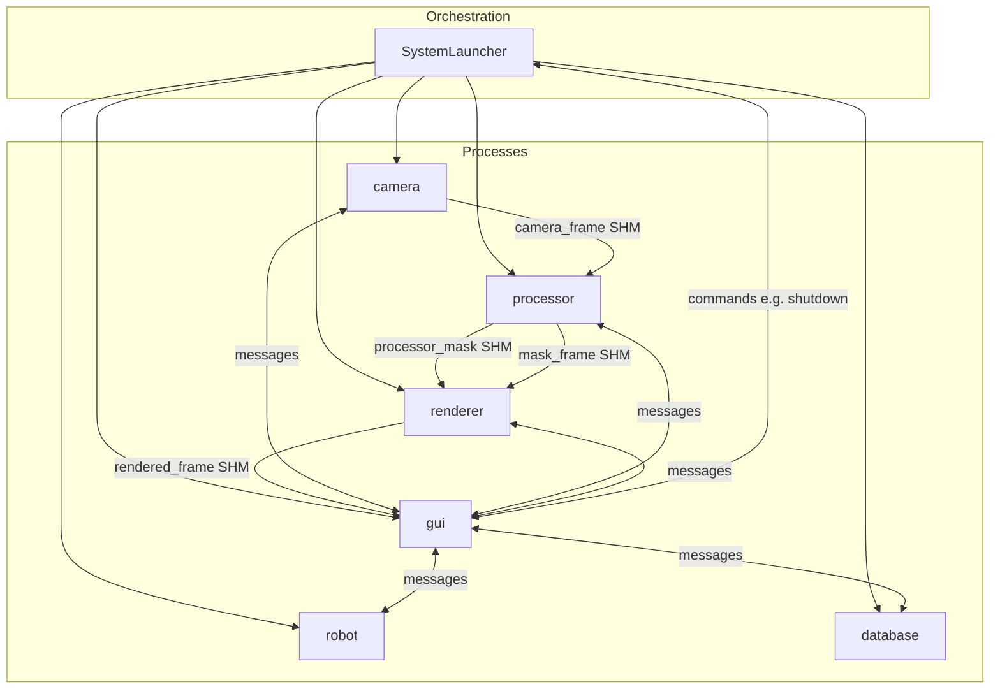
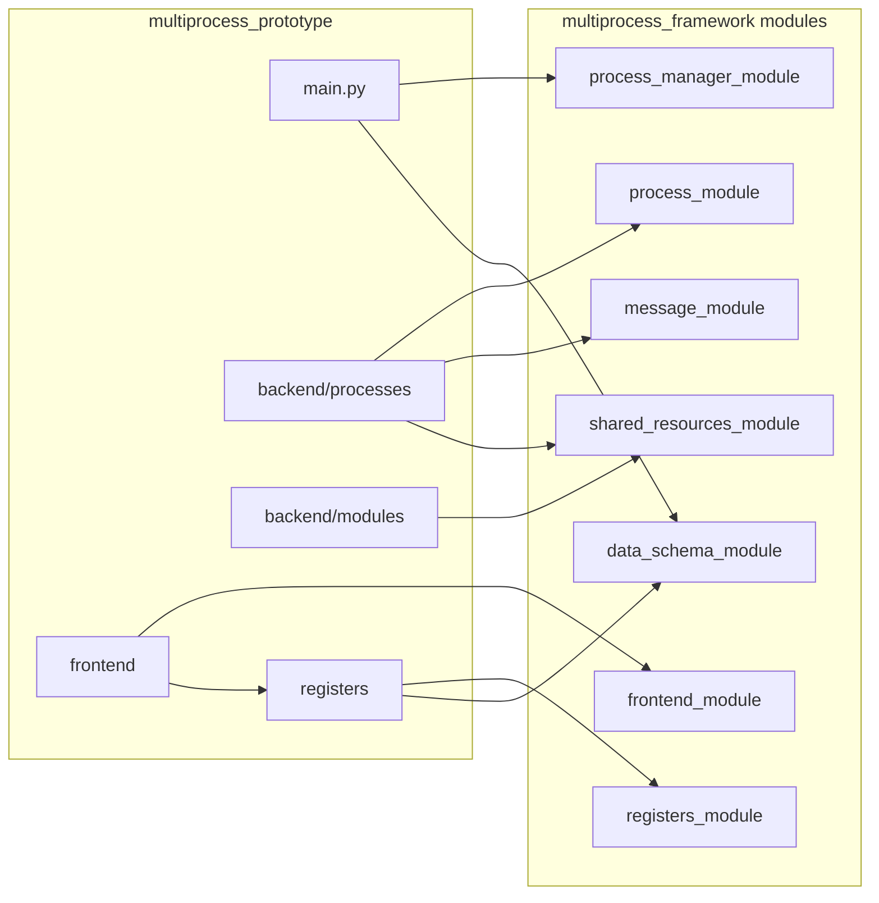
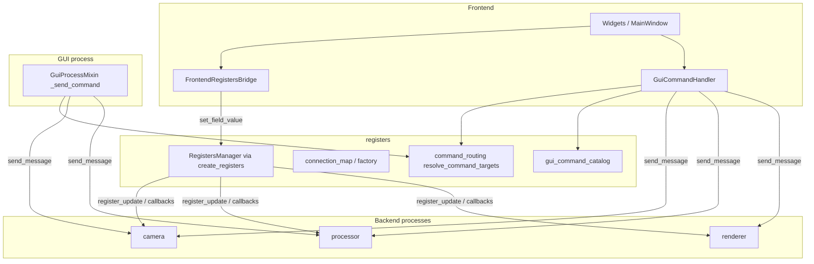

# Архитектура multiprocess_prototype

Тестовое приложение поверх **Multiprocess Framework** (`Inspector_prototype/multiprocess_framework/modules/`). Граница процессов: только **dict** (Dict at Boundary); схемы Pydantic живут внутри модулей и в `registers/schemas/`.

**Связанные документы:** [README.md](../README.md) (запуск), [STATUS.md](../STATUS.md) (ограничения), [registers/README.md](../registers/README.md) (схемы регистров), [RECIPES_SYSTEM.md](RECIPES_SYSTEM.md) (двойные рецепты: регистры + app), **[FRONTEND_MAP.md](FRONTEND_MAP.md)** (цепочка UI, мост регистров, команды, контекст вкладок). Каталог модулей фреймворка: [ARCHITECTURE_MODULE_CATALOG.md](../../multiprocess_framework/docs/ARCHITECTURE_MODULE_CATALOG.md).  
Дорожная карта GUI-команд и лаунчера: [FRONTEND_COMMAND_LAUNCHER_ROADMAP.md](../../multiprocess_framework/docs/FRONTEND_COMMAND_LAUNCHER_ROADMAP.md). Журнал решений (фреймворк + прототип): [DECISIONS.md](../../multiprocess_framework/DECISIONS.md).

**Запуск GUI:** `GuiProcess.run()` создаёт `FrontendLauncher`, который заполняет **`FrontendLaunchHooks`** и вызывает **`run_process_attached_frontend`** из `frontend_module` — одна каноническая последовательность: конфиг UI, регистры, опциональный boot регистров, `FrontendManager.initialize`, регистрация окон, цикл Qt. Исходящие команды кнопок/миксина идут через один **`RoutedCommandSender`** на процессе (`GuiProcess._routed_command_sender`, ADR-058); маршрутизация и каталог args остаются в `registers/command_routing.py` и `gui_command_catalog.py`.

---

## Процессы, SharedMemory и сообщения

Шесть процессов поднимает `SystemLauncher` из `main.py`. Кадры и маски идут через **SharedMemory**; управление и события — через **очереди сообщений** (`MessageAdapter` / фреймворк).

Имена буферов (как в коде прототипа): `camera_frame`, `processor_mask`, `rendered_frame`, `mask_frame`.

---

## Фреймворк и код приложения

- **`process_manager_module`:** `SystemLauncher`, жизненный цикл процессов.
- **`process_module`:** базовый `ProcessModule`, воркеры.
- **`data_schema_module`:** `process()`, `SchemaBase`, регистрация схем.
- **`registers_module`:** типы менеджера регистров; конкретные поля — в приложении (`registers/schemas/`).
- **`frontend_module`:** `FrontendManager`, `WindowManager`, мост к регистрам.
- **`shared_resources_module`:** SHM и связанные ресурсы.

---

## Карта: от `main.py` до пикселя

Ниже — порядок, в котором стоит читать код при онбординге (не все шаги выполняются в одном потоке, но **зависимости** такие).

1. **`main.py`** — `SystemLauncher`, `add_process(*process(Config))`, `get_camera_type()` из `persistence`.
2. **Конфиги процессов** — `backend/configs/` и `backend/processes/*/config*.py`; Pydantic внутри, наружу — `dict` через `process()` / `model_dump()`.
3. **Жизненный цикл процесса** — `process_module.ProcessModule` + воркеры `worker_module`; обмен — `message_module`, буферы — `shared_resources_module`.
4. **Camera → Processor → Renderer** — `backend/processes/*` и `backend/modules/*` (фабрика камеры, детекция, отрисовка); SHM с именами из диаграммы выше.
5. **GUI** — `GuiProcess.run()` → **`FrontendLauncher`** (`frontend/launcher.py`): `build_frontend_config`, `create_registers()`, `RecipeManager`, регистрация `MainWindow` / `LoadingWindow` через `frontend_module`.
6. **Регистры приложения** — `registers/factory.py`, схемы в `registers/schemas/`; мост UI ↔ регистры — `FrontendRegistersBridge` (фреймворк) + колбэки вкладок.
7. **Команды к процессам** — `GuiCommandHandler` + `registers/command_routing.py` + `gui_command_catalog.py`; на стороне процесса — `GuiProcessMixin._send_command` и маршрутизация фреймворка.
8. **Рецепты** — один файл YAML, два пространства имён: `register_recipes` / `app_recipes` ([RECIPES_SYSTEM.md](RECIPES_SYSTEM.md)); UI: вкладка «Рецепты» (`RegisterRecipePanel`) и «Настройки» (`AppRecipePanel`), общая база `RecipeSlotTablePanel`.

**Граница «фреймворк / приложение»:** в репозитории модульный код фреймворка лежит в `multiprocess_framework/modules/`; всё под `multiprocess_prototype/` — демо-приложение (схемы регистров, вкладки, бэкенд-пайплайн, YAML рецептов).

---

## Персистентность (данные вне репозитория)

Пакет **`persistence/`** задаёт корень данных: `INSPECTOR_DATA_DIR` или **`~/.inspector_prototype`**. Там же создаётся **`user_prefs.json`** (сейчас `camera_type`). Новые файлы состояния (кэши, экспорты, расширенные настройки) логично класть под тот же корень отдельными модулями в `persistence/`.

При первом обращении выполняется однократная миграция из устаревшего **`multiprocess_prototype/.inspector_prefs.json`** (если новый файл ещё не существует).

---

## GUI: процесс, миксин, конфиги

- **Класс процесса:** `GuiProcess` в `backend/processes/gui/gui_process.py`. `run()` делегирует в `FrontendLauncher` (`frontend/launcher.py`). Обработчики `gui_*` / `_handle_*` — в **`backend/gui_process_mixin.py`** (избегание цикла импорта с пакетом `frontend` при сборке `GuiConfig`).
- **Процессный конфиг (`proc_dict`):** **`GuiConfig`** в `backend/processes/gui/gui_config.py`, регистрация `@register_schema("GuiConfig")`. Импорт для `main.py` и тестов: **`multiprocess_prototype.backend.configs.GuiConfig`**.
- **Композиция UI (окна, вкладки):** **`FrontendConfig`** в `frontend/configs/frontend_config.py` — не отдельный процесс; мержится в лаунчере из `app_cfg` (`GuiConfig.model_dump()`).
- **Телеметрия UI (опционально):** `GuiConfig.ui_diagnostics` или env **`INSPECTOR_UI_DIAGNOSTICS`**. Реализация: **`frontend/diagnostics.py`** — одна подписка на `WidgetSignalBus` вкладок и сигнал шапки; логирование через `logging`, при `buffer_max` — буфер для отладки (ADR-083).

---

## Регистры и GUI-команды

- **Схемы:** `registers/schemas/` (`camera_tab`, `processing_tab`, …), наследуют `SchemaBase`.
- **Boot-значения процессов:** `*_process_boot_values()` в `schemas/*/boot.py` — единый источник дефолтов для `CameraConfig`, `ProcessorConfig`, `RendererConfig` и т.д., согласованный с полями регистров.
- **`command_routing.py`:** цели команды по `command_id` (метаданные схем + `EXPLICIT_COMMAND_TARGETS`).
- **`gui_command_catalog.py`:** единый каталог payload для GUI-команд.
- **Бэкенды камеры:** `backend/modules/camera/backends.py` (подключение через `backend_factory` в том же пакете).

---

## Менеджеры и доступ (прикладной слой)

Пакет **`managers/`** — не часть фреймворка; живёт только в прототипе.

| Модуль | Назначение |
|--------|------------|
| `recipe_manager.py` | YAML: слоты `register_recipes` / `app_recipes`, загрузка/сохранение снимков, миграция со старого формата |
| `access_context.py` | `AccessContext` — уровень доступа, обход readonly, скрытые поля; прокидывается в UI рецептов |
| `app_recipe_aggregate.py` | Сборка снимка app-рецепта из `SchemaBase` (вкладки настроек без тяжёлых импортов в тестах) |

Импорт для кода приложения: `from multiprocess_prototype.managers import RecipeManager, AccessContext`.

---

## Каталог кода (кратко)

| Путь | Назначение |
|------|------------|
| `main.py` | `SystemLauncher`, `add_process(*process(Config))` |
| `camera_policy.py` | Константы и типы режима камеры (единая политика для схем, GUI, persistence) |
| `backend/configs/` | Базовые и процессные конфиги, реэкспорт из `modules` где нужно |
| `backend/processes/` | `camera/`, `processor/`, `render/`, `gui/`, `database/`, `robot_simulator/` |
| `backend/modules/` | Доменная логика без обязательного `ProcessModule`: camera (factory, backends), `processor_frame`, `renderer` |
| `backend/gui_process_mixin.py` | Миксин GUI-процесса |
| `backend/database/` | SQLite / схемы детекций |
| `frontend/` | `FrontendLauncher`, окна, виджеты, `FrontendConfig`, `GuiCommandHandler` |
| `managers/` | `RecipeManager`, `AccessContext`, агрегат app-рецепта |
| `registers/` | `factory`, `create_registers`, routing, каталог команд |
| `persistence/` | `get_data_root()`, `user_prefs.json`, API `get_camera_type` / `set_camera_type` |
| `utils/` | Генератор кадров, webcam, утилиты SHM |

Полное дерево и команды запуска — в [README.md](../README.md).

---

## Оценка зрелости и рекомендации

Оценки ниже — **субъективный ориентир** для команды (демо-код и учебный фреймворк, не сертифицированный продукт).

### Прототип (`multiprocess_prototype`)

| Критерий | Балл | Комментарий |
|----------|------|-------------|
| Архитектура и границы | 8/10 | Фреймворк отделён; регистры и схемы — в приложении; Dict at Boundary соблюдается в типичных путях |
| Документация и навигируемость | 8/10 | Один «якорный» документ (этот файл) + предметные (`RECIPES_SYSTEM`, `registers/README`) |
| Поддерживаемость | 7.5/10 | Boot-файлы, routing, mixin; дублирования сняты рефакторингом вкладок/рецептов |
| Тестируемость | 7/10 | Хороший слой unit-тестов; GUI/e2e зависят от DISPLAY и Qt |
| Операционка | 7/10 | Логи в `.gitignore`; `sys.path` в `main.py` для прямого запуска — компромисс удобства |

**Итог по прототипу: ~7.5–8 / 10** как демонстрационного приложения к фреймворку.

### Фреймворк (`multiprocess_framework/modules`)

| Критерий | Балл | Комментарий |
|----------|------|-------------|
| Модульность и контракты | 8/10 | 16 модулей, `interfaces.py`, STATUS, явные слои (foundation → orchestration) |
| Согласованность | 7.5/10 | ADR в `DECISIONS.md`; периодические миграции (frontend components/widgets) требуют дисциплины |
| Зрелость IPC/процессов | 8/10 | Launcher, сообщения, SHM — связка осмысленная для прототипа машинного зрения |
| Документация фреймворка | 7/10 | Каталог модулей и дорожные карты есть; объём большой — важно держать индекс актуальным |

**Итог по фреймворку: ~7.5–8 / 10** как внутренней платформы; до «продакшн-платформы» не хватает жёстких SLO, наблюдаемости и политики версионирования публичного API.

### Что получилось удачно

- **Регистры в приложении** — фреймворк не зашивает поля алгоритма; прототип показывает полный цикл `SchemaBase` → GUI → процессы.
- **Разделение `GuiConfig` / `FrontendConfig`** — процессный dict отделён от композиции вкладок и окон.
- **Один маршрут команд** — `command_routing` + каталог + mixin снижают хаос «магических строк».
- **Двойные рецепты** (регистры vs UI) — один файл, два домена, переиспользуемая панель таблицы.
- **Boot-значения** рядом со схемами регистров — меньше рассинхрона с конфигами процессов.

### Где слабые места / технический долг

- **`sys.path` в `main.py`** — удобно для разработчика, но не идеал для установки пакетом; для масштаба лучше единая точка входа (`pip install -e` / `pyproject` с путями).
- **Сложность фронтенд-слоя** — много слоёв (launcher, bridge, MVP-виджеты, components); новым людям нужна именно эта «карта».
- **GUI-тесты** — зависимость от дисплея; рост покрытия без headless-стратегии будет болезненным.
- **Внешние опции** (Hikvision) — осознанное ограничение, но усложняет CI и онбординг.

### Советы при дальнейшем масштабировании

1. Держать **один канонический** архитектурный документ прототипа (этот файл); выполненные задачи фиксировать в **`DECISIONS.md`**, а не отдельными планами в `docs/`.
2. При новых полях регистров — сразу **boot + register_sync + тест контракта** ([registers/CHECKLIST.md](../registers/CHECKLIST.md)).
3. Вынести в правила репозитория: после значимых изменений — `python scripts/validate.py` и pytest по затронутым пакетам.
4. Для продукта в перспективе: явный **versioning** сообщений/схем конфигов и минимальный **health-check** процессов из лаунчера.

