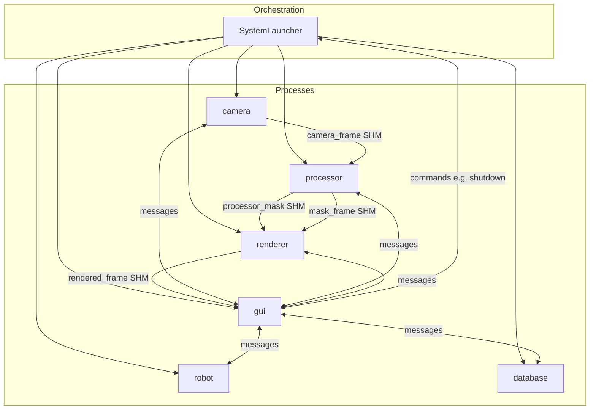
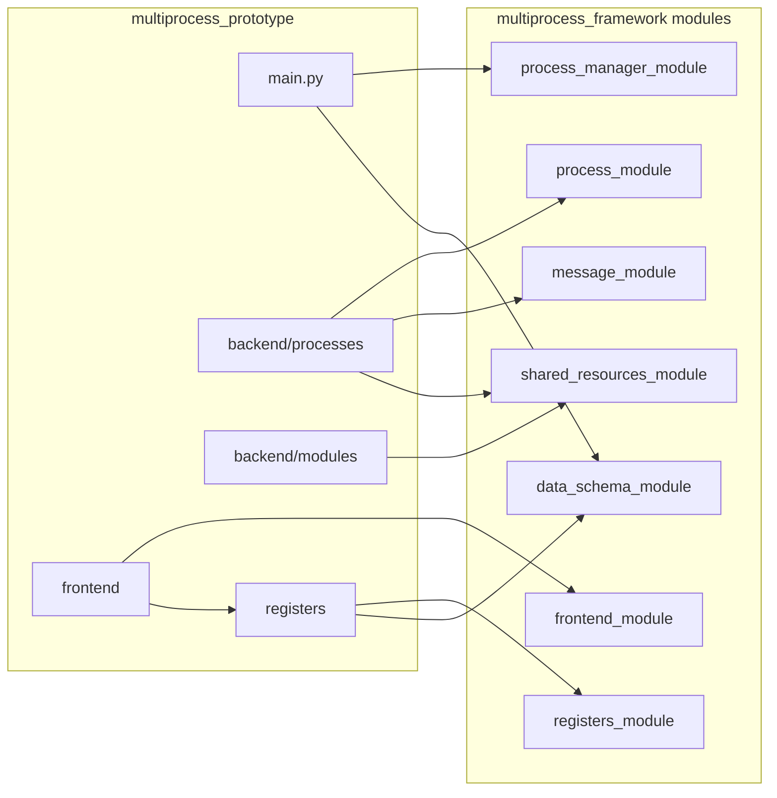
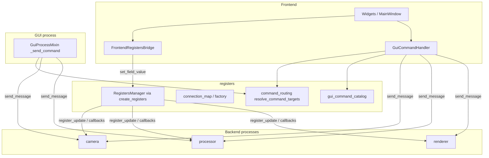

# Архитектура multiprocess_prototype

Тестовое приложение поверх **Multiprocess Framework** (`Inspector_prototype/multiprocess_framework/refactored/modules/`). Граница процессов: только **dict** (Dict at Boundary); схемы Pydantic живут внутри модулей и в `registers/schemas/`.

**Связанные документы:** [README.md](../README.md) (запуск), [STATUS.md](../STATUS.md) (ограничения), [registers/README.md](../registers/README.md) (схемы регистров). Каталог модулей и связей (фреймворк + прототип): [ARCHITECTURE_MODULE_CATALOG.md](../../multiprocess_framework/refactored/docs/ARCHITECTURE_MODULE_CATALOG.md).  
Дорожная карта GUI-команд и лаунчера (фазы M0–M3, ограничители сложности): [FRONTEND_COMMAND_LAUNCHER_ROADMAP.md](../../multiprocess_framework/refactored/docs/FRONTEND_COMMAND_LAUNCHER_ROADMAP.md).

---

## Процессы, SharedMemory и сообщения

Шесть процессов поднимает `SystemLauncher` из `main.py`. Кадры и маски идут через **SharedMemory**; управление и события — через **очереди сообщений** (`MessageAdapter` / фреймворк).

Имена буферов (как в коде прототипа): `camera_frame`, `processor_mask`, `rendered_frame`, `mask_frame`.

---

## Фреймворк и код приложения

- **`process_manager_module`:** `SystemLauncher`, жизненный цикл процессов.
- **`process_module`:** базовый `ProcessModule`, воркеры.
- **`data_schema_module`:** `process()`, `SchemaBase`, регистрация схем.
- **`registers_module`:** типы менеджера регистров; конкретные поля — в приложении (`registers/schemas/`).
- **`frontend_module`:** `FrontendManager`, `WindowManager`, мост к регистрам.
- **`shared_resources_module`:** SHM и связанные ресурсы.

---

## Персистентность (данные вне репозитория)

Пакет **`persistence/`** задаёт корень данных: `INSPECTOR_DATA_DIR` или **`~/.inspector_prototype`**. Там же создаётся **`user_prefs.json`** (сейчас `camera_type`). Новые файлы состояния (кэши, экспорты, расширенные настройки) логично класть под тот же корень отдельными модулями в `persistence/`.

При первом обращении выполняется однократная миграция из устаревшего **`multiprocess_prototype/.inspector_prefs.json`** (если новый файл ещё не существует).

---

## GUI: процесс, миксин, конфиги

- **Класс процесса:** `GuiProcess` в `backend/processes/gui/gui_process.py`. `run()` делегирует в `FrontendLauncher` (`frontend/launcher.py`). Обработчики `gui_*` / `_handle_*` — в **`backend/gui_process_mixin.py`** (избегание цикла импорта с пакетом `frontend` при сборке `GuiConfig`).
- **Процессный конфиг (`proc_dict`):** **`GuiConfig`** в `backend/processes/gui/gui_config.py`, регистрация `@register_schema("GuiConfig")`. Импорт для `main.py` и тестов: **`multiprocess_prototype.backend.configs.GuiConfig`**.
- **Композиция UI (окна, вкладки):** **`FrontendConfig`** в `frontend/configs/frontend_config.py` — не отдельный процесс; мержится в лаунчере из `app_cfg` (`GuiConfig.model_dump()`).

---

## Регистры и GUI-команды

- **Схемы:** `registers/schemas/` (`camera_tab`, `processing_tab`, …), наследуют `SchemaBase`.
- **Boot-значения процессов:** `*_process_boot_values()` в `schemas/*/boot.py` — единый источник дефолтов для `CameraConfig`, `ProcessorConfig`, `RendererConfig` и т.д., согласованный с полями регистров.
- **`command_routing.py`:** цели команды по `command_id` (метаданные схем + `EXPLICIT_COMMAND_TARGETS`).
- **`gui_command_catalog.py`:** единый каталог payload для GUI-команд.
- **Бэкенды камеры:** `backend/modules/camera/backends.py` (подключение через `backend_factory` в том же пакете).

---

## Каталог кода (кратко)

| Путь | Назначение |
|------|------------|
| `main.py` | `SystemLauncher`, `add_process(*process(Config))` |
| `backend/configs/` | Базовые и процессные конфиги, реэкспорт из `modules` где нужно |
| `backend/processes/` | `camera/`, `processor/`, `render/`, `gui/`, `database/`, `robot_simulator/` |
| `backend/modules/` | Доменная логика без обязательного `ProcessModule`: camera (factory, backends), `processor_frame`, `renderer` |
| `backend/gui_process_mixin.py` | Миксин GUI-процесса |
| `backend/database/` | SQLite / схемы детекций |
| `frontend/` | `FrontendLauncher`, окна, виджеты, `FrontendConfig` |
| `registers/` | `factory`, `create_registers`, routing, каталог команд |
| `persistence/` | `get_data_root()`, `user_prefs.json`, API `get_camera_type` / `set_camera_type` |
| `utils/` | Генератор кадров, webcam, утилиты SHM |

Полное дерево и команды запуска — в [README.md](../README.md).

---

## Оценка зрелости (тимлид)

Оценка относится к **прототипу как демо фреймворка**, не к продукту в эксплуатации.

| Критерий | Балл | Комментарий |
|----------|------|-------------|
| Архитектура и границы | 8 | Чёткое разделение фреймворк / приложение; Dict at Boundary; регистры в приложении |
| Согласованность документации и кода | 8 | После выравнивания docs — одна каноничная страница (этот файл) |
| Поддерживаемость | 8 | Boot, routing, mixin; единый `GuiConfig` + отдельный `FrontendConfig` для UI |
| Тестируемость | 7 | Много unit-тестов; GUI и полный e2e завязаны на DISPLAY |
| Операционная гигиена | 6 | Логи не должны коммититься в репозиторий (см. `.gitignore`) |

**Итог: ориентир 7.5–8 / 10** для учебного/демонстрационного прототипа.

### Советы по улучшению

1. Сохранять **одну** актуальную архитектурную страницу; устаревшие разборы — только в `docs/archived/` с пометкой даты.
2. Не коммитить рантайм-логи; для CI прикладывать логи как артефакты job.
3. Расширять контрактные тесты `schema ↔ register_sync` при новых полях (см. [registers/CHECKLIST.md](../registers/CHECKLIST.md)).

---

## Архив

Исторический разбор от 2026-03-19 (не руководство к действию): [archived/ARCHITECTURE_ANALYSIS_2026-03-19.md](archived/ARCHITECTURE_ANALYSIS_2026-03-19.md).
