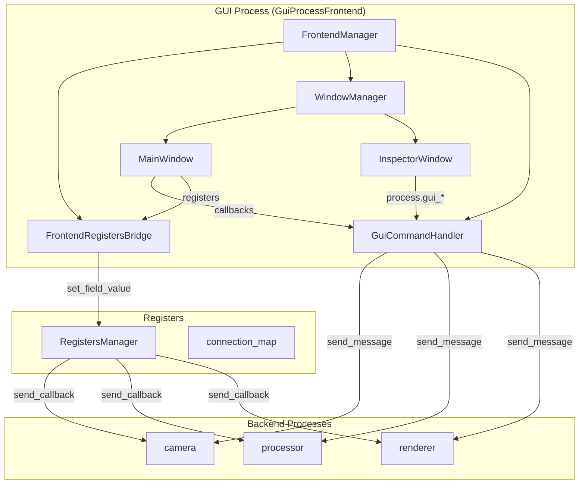
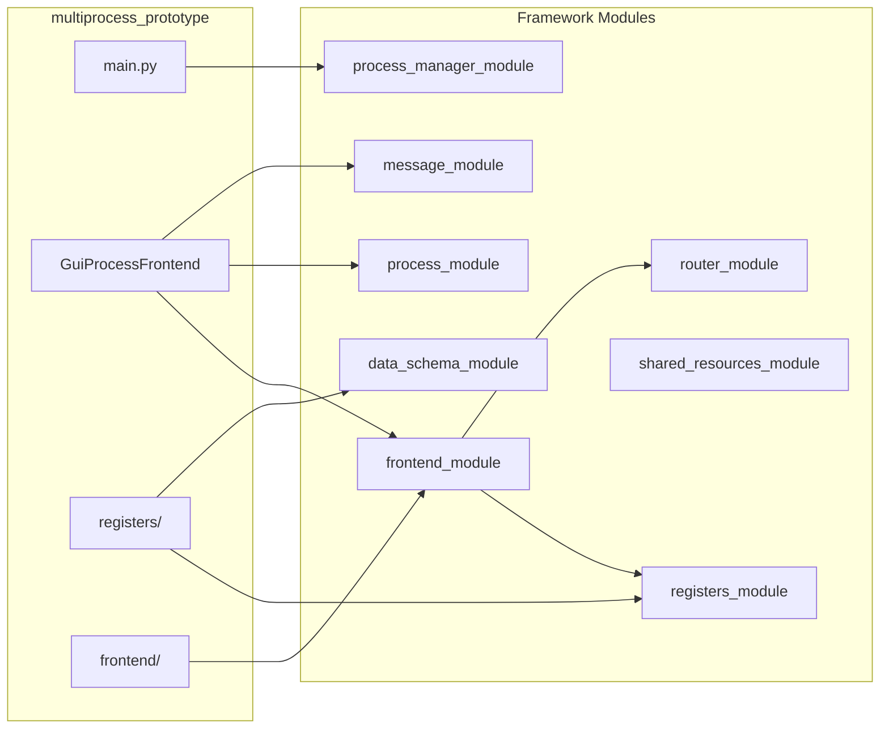

# Анализ multiprocess_prototype и frontend_module

**Дата:** 2026-03-19  
**Автор:** Анализ как от тимлида  
**Статус:** Сырой прототип, в процессе рефакторинга

---

## 1. Схема взаимодействия модулей

### 1.0 Mermaid: Поток данных GUI → Backend





### 1.1 Общая архитектура фреймворка (16 модулей; схемы регистров — в приложении)

```
┌─────────────────────────────────────────────────────────────────────────────────┐
│                         ORCHESTRATION LAYER                                       │
│  process_manager_module (SystemLauncher, ProcessManagerProcess, ProcessRegistry)   │
└─────────────────────────────────────────────────────────────────────────────────┘
                                        │
                    ┌───────────────────┼───────────────────┐
                    ▼                   ▼                   ▼
┌───────────────────────┐  ┌───────────────────────┐  ┌───────────────────────┐
│   PROCESS LAYER       │  │   PROCESS LAYER       │  │   FRONTEND LAYER      │
│   process_module      │  │   worker_module        │  │   frontend_module     │
│   (ProcessModule)     │  │   (WorkerManager)      │  │   (FrontendManager)   │
└───────────────────────┘  └───────────────────────┘  └───────────────────────┘
         │                            │                            │
         ▼                            ▼                            ▼
┌─────────────────────────────────────────────────────────────────────────────────┐
│                         COMMUNICATION LAYER                                        │
│  router_module │ command_module │ dispatch_module │ channel_routing_module        │
│  message_module                                                                   │
└─────────────────────────────────────────────────────────────────────────────────┘
                                        │
                                        ▼
┌─────────────────────────────────────────────────────────────────────────────────┐
│                         INFRASTRUCTURE LAYER                                       │
│  logger_module │ error_module │ config_module │ shared_resources_module           │
│  registers_module │ console_module │ statistics_module │ sql_module             │
└─────────────────────────────────────────────────────────────────────────────────┘
                                        │
                                        ▼
┌─────────────────────────────────────────────────────────────────────────────────┐
│                         FOUNDATION LAYER                                           │
│  base_manager │ data_schema_module                                                 │
└─────────────────────────────────────────────────────────────────────────────────┘

┌─────────────────────────────────────────────────────────────────────────────────┐
│                         SHARED (cross-cutting)                                     │
│  registers/schemas (прототип: DrawRegisters, ProcessorRegisters, RendererRegisters)│
└─────────────────────────────────────────────────────────────────────────────────┘
```

### 1.2 Поток данных в multiprocess_prototype

```
┌──────────────────────────────────────────────────────────────────────────────────────┐
│                              main.py (SystemLauncher)                                 │
│  add_process(Camera, Processor, Renderer, Robot, Database, GuiConfigFrontend)          │
└──────────────────────────────────────────────────────────────────────────────────────┘
         │
         ▼
┌──────────────────────────────────────────────────────────────────────────────────────┐
│  GUI PROCESS (GuiProcessFrontend)                                                     │
│  ┌────────────────────────────────────────────────────────────────────────────────┐  │
│  │ run() → FrontendLauncher.run()                                                  │  │
│  │   ├── build_config() → build_frontend_config()                                  │  │
│  │   ├── build_registers() → create_registers() [registers.factory]                 │  │
│  │   ├── build_command_handler() → GuiCommandHandler(process)                      │  │
│  │   └── FrontendManager(config, registers, router=process, connection_map)        │  │
│  └────────────────────────────────────────────────────────────────────────────────┘  │
└──────────────────────────────────────────────────────────────────────────────────────┘
         │
         ▼
┌──────────────────────────────────────────────────────────────────────────────────────┐
│  FrontendManager (frontend_module)                                                    │
│  ├── FrontendRegistersBridge(RegistersManager, router, connection_map)                │
│  │     └── set_field_value → send_callback → router.send_message(target, msg)        │
│  ├── WindowManager(WindowRegistry)                                                   │
│  │     └── register("main", create_main_window), ("inspector", ...), ("loading", ...)│
│  └── ThreadManager                                                                   │
└──────────────────────────────────────────────────────────────────────────────────────┘
         │
         ▼
┌──────────────────────────────────────────────────────────────────────────────────────┐
│  ОКНА (фабрики в FrontendLauncher.register_windows)                                  │
│  ├── MainWindow: Header + ImagePanel + TabWidget (Recipes, Settings, Processing,     │
│  │               Camera) — использует frontend_module компоненты                     │
│  ├── InspectorWindow: legacy-окно (видео + панель управления) — process.gui_*         │
│  └── LoadingWindow: splash при старте                                                │
└──────────────────────────────────────────────────────────────────────────────────────┘
         │
         ▼
┌──────────────────────────────────────────────────────────────────────────────────────┐
│  ДВА ВЕКТОРА СВЯЗИ С BACKEND:                                                         │
│                                                                                       │
│  1) REGISTERS: set_field_value → FrontendRegistersBridge → send_callback             │
│     → router.send_message(target, {data_type: "register_update", ...})                │
│     connection_map: {draw→renderer, processor→processor, renderer→renderer}          │
│                                                                                       │
│  2) COMMANDS: GuiCommandHandler.execute(cmd_id) → process.send_message(target, msg)  │
│     GUI_COMMAND_CATALOG: start_capture, set_fps, set_color_range, ...                 │
│     Виджеты получают callbacks: on_start, on_set_fps, on_set_color_range, ...        │
└──────────────────────────────────────────────────────────────────────────────────────┘
         │
         ▼
┌──────────────────────────────────────────────────────────────────────────────────────┐
│  BACKEND ПРОЦЕССЫ (camera, processor, renderer, robot, database)                       │
│  receive() → CommandManager.handle_command() → обработка                               │
│  SharedMemory: camera_frame, processor_mask, rendered_frame, mask_frame                │
└──────────────────────────────────────────────────────────────────────────────────────┘
```

### 1.3 Registers vs Commands — два пути к backend

| Аспект | Registers | Commands |
|--------|-----------|----------|
| **Назначение** | Поля с валидацией и метаданными (min, max, unit, routing) | Действия без состояния (кнопки, события) |
| **Примеры** | color_lower, min_area, show_original | start_capture, set_fps, set_color_range |
| **Механизм** | `set_field_value` → FrontendRegistersBridge → `register_update` | `GuiCommandHandler.execute(cmd_id)` → `command` |
| **Когда использовать** | Слайдеры, поля ввода, привязанные к RegistersManager | Кнопки Start/Stop, переключения, одноразовые действия |
| **Формат сообщения** | `data_type: "register_update"` | `data_type: "command"` |

Оба пути используют `process.send_message(target, msg)` → ProcessCommunication → RouterManager.

### 1.4 Связь с бэкендом (ProcessModule → RouterManager)

```
GuiProcessFrontend.send_message(target, msg)
  → ProcessModule.send_message (наследуется)
  → ProcessCommunication.send_to_process
  → RouterManager.queue_registry.send_to_queue(target, queue_type, message)
  или RouterManager.send(message)
```

MessageAdapter (process._msg) формирует command-сообщения: `command() → to_dict()`.
Registers: FrontendRegistersBridge.send_callback → `register_update`.
Commands: GuiCommandHandler._send → `command` (через MessageAdapter).

### 1.5 Карта модулей в multiprocess_prototype

```
multiprocess_prototype/
├── main.py                    # Точка входа, SystemLauncher
├── prefs.py                   # get_camera_type, set_camera_type
│
├── backend/                   # Конфиги и процессы backend
│   ├── configs/               # CameraConfig, ProcessorConfig, RendererConfig,
│   │                          # RobotConfig, DatabaseConfig, GuiConfig
│   ├── processes/             # camera, processor, renderer, robot, database, gui
│   └── database/              # utils, export_detections
│
├── frontend/                  # GUI-процесс и UI
│   ├── process.py             # GuiProcessFrontend
│   ├── launcher.py            # FrontendLauncher (конструктор)
│   ├── configs/               # GuiConfigFrontend, build_frontend_config
│   ├── commands/              # GuiCommandHandler, GUI_COMMAND_CATALOG
│   ├── windows/               # MainWindow, InspectorWindow
│   └── widgets/               # CameraTabWidget, ProcessingTabWidget, etc.
│
├── registers/                 # Регистры и connection_map
│   ├── factory.py             # create_registers()
│   ├── connection_map.py     # DEFAULT_CONNECTION_MAP
│   └── schemas/               # DrawRegisters (re-export), ProcessorRegisters, RendererRegisters
│
└── utils/                    # shm_utils, frame_generator, backends
```

---

## 2. Оценка архитектуры (0–10)

| Критерий | Оценка | Комментарий |
|----------|--------|-------------|
| **Модульность** | 7 | Чёткое разделение backend/frontend/registers. Но дублирование: gui_* в process и GuiCommandHandler. |
| **Использование фреймворка** | 8 | FrontendManager, RegistersManager, connection_map, MessageAdapter — по контракту. |
| **Отсутствие дублирования** | 5 | 1) gui_* методы в GuiProcessFrontend и GuiProcess; 2) InspectorWindow vs MainWindow; 3) дубли фабрик регистров; 4) create_frontend_registers vs create_registers. |
| **Связность** | 6 | FrontendLauncher знает слишком много: фабрики окон, callbacks, конфиг. GuiProcessFrontend — 270+ строк с gui_* и _handle_*. |
| **Расширяемость** | 7 | Добавление окон/виджетов через регистрацию. Но добавление команды = правка в 3 местах (catalog, handler, process). |
| **Тестируемость** | 5 | GuiProcessFrontend жёстко связан с process. Нет unit-тестов frontend. |
| **Документация** | 6 | STATUS.md, GUI_PROCESS_COMPARISON, README. Нет явной архитектурной диаграммы до этого анализа. |
| **Соответствие ADR** | 8 | Dict at Boundary, connection_map, registers/schemas — соблюдаются. |

**Итоговая оценка: 6.5 / 10**

---

## 3. Выявленные проблемы

### 3.1 Критические

1. **Сломанный импорт в GuiProcess**
   - `gui_process.py` импортирует `multiprocess_prototype.frontend.registers.create_frontend_registers`
   - Модуля `frontend.registers` нет: регистры в `multiprocess_prototype.registers`
   - **Решение:** заменить на `from multiprocess_prototype.registers import create_registers` и использовать `create_registers()`

2. **Дублирование InspectorWindow**
   - `gui/main_window.py` и `frontend/windows/inspector_window.py` — похоже на один и тот же файл (или разные пути к одному)
   - GuiProcess использует `multiprocess_prototype.gui.main_window`, GuiProcessFrontend — `frontend.windows.inspector_window`
   - **Решение:** оставить один источник: `frontend.windows.inspector_window`, удалить `gui/` или сделать `gui` алиасом

### 3.2 Дублирование

3. **Два пути к backend: Registers vs Commands**
   - Registers: `set_field_value` → `register_update` (для полей, привязанных к регистрам)
   - Commands: `GuiCommandHandler.execute()` → `command` (для кнопок, слайдеров и т.п.)
   - Оба используют `process.send_message`. Это допустимо, но нужно чётко разделить: когда использовать регистры, когда — команды.

4. **gui_* методы в process**
   - GuiProcessFrontend и GuiProcess содержат идентичные ~25 методов `gui_*` и `_handle_*`
   - **Решение:** вынести в `GuiProcessMixin` (как в GUI_PROCESS_COMPARISON.md)

5. **Схемы регистров**
   - Канон для прототипа — `multiprocess_prototype/registers/schemas` (`DrawRegisters`, `ProcessorRegisters`, `RendererRegisters`); пакета `shared_registers` во фреймворке нет (ADR-050).

### 3.3 Архитектурные

6. **FrontendLauncher слишком «толстый»**
   - Знает о MainWindow, InspectorWindow, LoadingWindow, callbacks, GuiCommandHandler
   - **Решение:** вынести регистрацию окон в конфиг или отдельный builder. `register_windows` — 80+ строк.

7. **Process как router**
   - `FrontendManager(router=process)` — process передаётся как router. Process имеет `send_message`, но это не RouterManager.
   - Работает, но семантически неочевидно. Лучше явный интерфейс `IRouterLike` с `send_message(target, msg)`.

8. **sys.path.insert в main.py**
   - Правила фреймворка запрещают `sys.path.insert` в production. В main.py — 2 строки.
   - **Решение:** использовать `PYTHONPATH` в run.sh или установку пакета.

---

## 4. План рефакторинга и улучшений

### Фаза 1: Критические исправления (1–2 дня)

| # | Задача | Файлы |
|---|--------|-------|
| 1 | Исправить импорт `create_frontend_registers` → `create_registers` | `gui_process.py` |
| 2 | Унифицировать InspectorWindow: один источник, удалить `gui/` или сделать алиас | `gui/`, `frontend/windows/` |
| 3 | Обновить импорты в тестах (`multiprocess_prototype.gui.main_window` → `frontend.windows.inspector_window`) | `test_gui_checkboxes.py` |

### Фаза 2: Устранение дублирования (2–3 дня)

| # | Задача | Подход |
|---|--------|--------|
| 4 | Вынести `gui_*` и `_handle_*` в `GuiProcessMixin` | Новый `frontend/mixins/gui_process_mixin.py`, наследование в GuiProcess и GuiProcessFrontend |
| 5 | Согласовать использование Registers vs Commands | Документировать: регистры — для полей с привязкой к RegistersManager; команды — для действий (кнопки, события). |

### Фаза 3: Упрощение архитектуры (3–5 дней)

| # | Задача | Подход |
|---|--------|--------|
| 6 | Вынести регистрацию окон из FrontendLauncher в конфиг | `window_registry` в конфиге: `{name: {factory: "path.to.module:create_fn", ...}}` |
| 7 | ~~Перенос в shared_registers~~ | Выполнено иначе: все схемы в `registers/schemas` (фреймворк без доменных регистров) |
| 8 | Убрать sys.path.insert из main.py | `run.sh` с `PYTHONPATH`, или `pip install -e .` |

### Фаза 4: Улучшение frontend_module (по мере доработки)

| # | Задача | Подход |
|---|--------|--------|
| 9 | Упростить подключение виджетов к backend | Единый контракт: виджет получает `command_handler` или `registers_manager`; callback-и через конфиг, а не через хардкод в launcher |
| 10 | Добавить unit-тесты frontend | `test_frontend_manager.py`, `test_registers_bridge.py`, моки для process и router |
| 11 | Документировать ADR для frontend | ADR-040: GuiProcessMixin, ADR-041: конфиг-драйвен window registry |

---

## 5. Рекомендации по best practices

- **Один источник истины для схем:** `multiprocess_prototype/registers/schemas` для backend+frontend прототипа; фреймворк поставляет только `SchemaBase` / `RegistersManager`.
- **Command vs Register:** Register — для полей с валидацией и метаданными; Command — для действий без состояния (кнопка «Start»).
- **Конфиг-драйвен UI:** Окна и виджеты — по конфигу. FrontendLauncher не должен знать о MainWindow, InspectorWindow по имени класса.
- **Фреймворк как конструктор:** Не добавлять новые модули; расширять существующие (frontend_module, registers_module) через интерфейсы и адаптеры.

---

## 6. Итоговая схема (целевая)

```
main.py
  └── SystemLauncher
        └── GuiConfigFrontend → GuiProcessFrontend (GuiProcessMixin)
              └── FrontendLauncher
                    ├── build_config()
                    ├── build_registers() → create_registers()
                    ├── build_command_handler()
                    └── FrontendManager
                          ├── FrontendRegistersBridge ← connection_map
                          ├── WindowManager ← окна из конфига
                          └── GuiCommandHandler (callbacks для виджетов)

Два пути к backend:
  • Registers: set_field_value → register_update
  • Commands: GuiCommandHandler.execute() → command
```

---

*Документ создан в рамках анализа тестового модуля multiprocess_prototype.*
