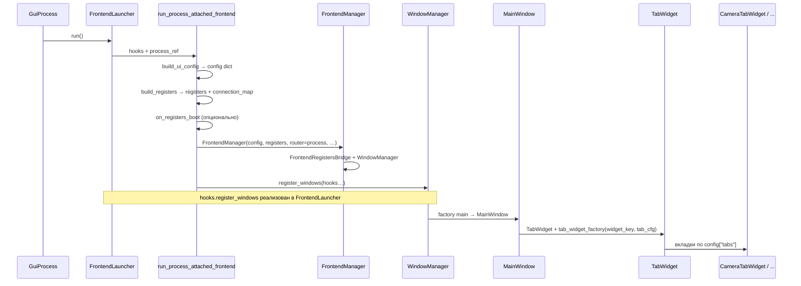
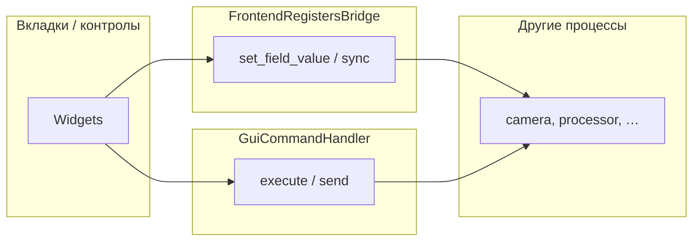

# Карта фронтенда (Inspector Prototype)

Цель — **снизить воспринимаемую сложность** без слияния слоёв: видно, кто кого создаёт и где границы между фреймворком и приложением.

**Связанные файлы:** [`frontend/launcher.py`](../frontend/launcher.py), [`frontend/app_context.py`](../frontend/app_context.py), [`frontend/windows/main_window/`](../frontend/windows/main_window/), [`frontend/commands/gui_command_handler.py`](../frontend/commands/gui_command_handler.py).  
Фреймворк: `run_process_attached_frontend`, `FrontendManager`, `FrontendRegistersBridge` в `frontend_module`.

---

## Поток запуска (от процесса до вкладки)



**Кратко:**

1. **`GuiProcess.run()`** → **`FrontendLauncher.run()`** → **`run_process_attached_frontend`** (фреймворк).
2. Конфиг UI: **`build_frontend_config(app_cfg)`** — dict для `FrontendManager` и окон.
3. Регистры: **`create_registers()`**; в `FrontendManager` оборачиваются в **`FrontendRegistersBridge`** (мост к `set_field_value` / сообщениям процессам).
4. **`register_windows`** (в прототипе — метод лаунчера): создаёт **`GuiCommandHandler`**, **`RecipeManager`**, **`FrontendAppContext`**, фабрику вкладок, регистрирует **`MainWindow`** / **`LoadingWindow`** в `WindowManager`.
5. **`MainWindow`** строит **`HeaderWidget`**, **`ImagePanelWidget`**, **`TabWidget`**; каждая вкладка — виджет приложения (`CameraTabWidget`, …), получающий `registers_manager`, колбэки, `recipe_manager` из контекста.

---

## Слои и ответственность

| Слой | Где живёт | Роль |
|------|-----------|------|
| Запуск процесса | `GuiProcess`, фреймворк | Процесс, очереди, `_routed_command_sender` |
| Лаунчер приложения | `FrontendLauncher` | Собрать dict конфига, регистры, окна; заполнить `FrontendLaunchHooks` |
| Каркас UI (фреймворк) | `FrontendManager`, `WindowManager` | QApplication, мост регистров, показ окон |
| Окно приложения | `MainWindow` | Компоновка шапка + картинки + вкладки |
| Вкладки | `frontend/widgets/...` | MVP / `BaseWidget`, контролы из `frontend_module.components` |
| Команды к бэкенду | `GuiCommandHandler` + `command_routing` | Каталог `gui_command_catalog`, отправка в процессы |
| Регистры (схемы) | `registers/schemas` | Поля, boot, маршрутизация полей |

Слои **не свёрнуты в один класс**: меняется способ **передачи зависимостей** (см. `FrontendAppContext`).

---

## `FrontendAppContext`

Один объект с полями, которые раньше перечислялись отдельными аргументами у **`create_tab_widget_factory`**:

- `config`, `registers_manager`, `camera_callbacks_map`, `camera_type`, `recipe_manager`, опционально `command_handler`, `extras`.

Фабрика вкладок читает только контекст; новые зависимости можно добавить в dataclass без разрастания сигнатур вызовов.

---

## `GuiCommandHandler` во вкладках: один экземпляр, без дублирования

### Где создаётся

**Единственное место создания** в нормальном запуске — **`FrontendLauncher.register_windows`**: один раз

`cmd = GuiCommandHandler(process_ref)`.

Дальше этот же объект:

- участвует в **`build_camera_tab_callbacks(cmd, …)`** — в словарь попадают функции, которые **замыкают** тот же `cmd` (см. `build_sim_webcam_callbacks`, `build_hikvision_callbacks`);
- попадает в **`FrontendAppContext.command_handler`** — чтобы вкладка могла взять **ту же ссылку**, не создавая второй `GuiCommandHandler`.

То есть **дублирования класса или процесса нет**: либо колбэки, либо прямой `command_handler` — это два фасада над **одним** отправителем команд.

### Зачем два способа (колбэки vs handler)

| Подход | Плюсы | Когда уместно |
|--------|--------|----------------|
| **`callbacks_map`** | Стабильный контракт виджета (имена ключей, сигнатуры); камера не знает про каталог команд | Текущая вкладка камеры: разные наборы колбэков для simulator/webcam/hikvision |
| **`command_handler` в контексте** | Один вызов `execute(command_id, **kwargs)`; проще добавлять новые команды без раздувания карты колбэков | Новая вкладка / общий код, которому нужен **произвольный** `command_id` из каталога |
| **Оба** | Колбэки для старых виджетов + `execute` для нового блока | Постепенная миграция |

### Что считать ошибкой

- Создавать **`GuiCommandHandler(...)` внутри `CameraTabWidget` / презентера** — второй экземпляр, другой путь к `process`, риск рассинхрона и лишних зависимостей виджета от `GuiProcess`.
- Тянуть **`process_ref` во вкладку** «чтобы собрать хендлер локально» — то же самое, только длиннее.

Правильно: вкладка получает **`command_handler` из `FrontendAppContext`** (или только **`callbacks_map`**, уже собранный лаунчером из того же `cmd`).

### Как подключить во вкладку (идея кода)

В **`create_tab_widget_factory`** для нужного `widget_key`:

```python
return MyTabWidget(
    registers_manager=registers_manager,
    command_handler=ctx.command_handler,  # тот же cmd, что в build_camera_tab_callbacks
    ...
)
```

В тестах без лаунчера: **`GuiCommandHandler(mock_process)`** один раз, передать в виджет или в собранный `FrontendAppContext` — снова **один** хендлер на сценарий.

### Связь с регистрами

**`GuiCommandHandler`** — про **команды** (дискретные действия, каталог).  
**`set_field_value` / мост** — про **поля регистров**. Вкладка может пользоваться обоими; оба пути идут в процессы по разным механизмам, их не смешивать в одном методе «на всякий случай».

---

## Данные и команды (упрощённо)



- **Регистры** — снимок полей алгоритма; изменения через мост → процессы по `connection_map` / routing.
- **Команды** — дискретные действия (старт захвата, enum устройств, …) через `RoutedCommandSender`.

---

## Стратегия тестов (без полного GUI, где возможно)

| Что проверять | Как |
|---------------|-----|
| Маршрутизация команд | Мок `process._routed_command_sender`, `GuiCommandHandler` (уже есть тесты на routed sender) |
| Конфиг → dict | `FrontendConfig.build_dict`, `GuiConfig` + `FrontendAppContext` без Qt |
| Фабрика вкладок | Минимальный Qt (`QT_QPA_PLATFORM=offscreen` / Windows), узкий сценарий |
| Презентеры | Мок `view` / колбэков, без `MainWindow` |
| Полный пайплайн | `test_full_integration` / ручной запуск |

Правило: **не поднимать `MainWindow`**, если достаточно **середины** (хендлер, презентер, чистый dict).

---

## Диагностика UI (опционально)

При `ui_diagnostics.enabled` или `INSPECTOR_UI_DIAGNOSTICS` лаунчер вызывает **`attach_ui_diagnostics`** после создания `MainWindow` — подписка на **`WidgetSignalBus`** и шапку. Подробнее: [`ARCHITECTURE.md`](ARCHITECTURE.md), [`frontend/diagnostics.py`](../frontend/diagnostics.py), ADR-083 в `DECISIONS.md`.

---

## Итог (что реально помогает без потери функционала)

1. **Одна страница-карта** (этот документ + ссылка из `ARCHITECTURE.md`) — снижает воспринимаемую сложность сильнее, чем слияние классов.
2. **Явный контекст** — `FrontendAppContext`: те же слои, меньше длинных списков аргументов; новые поля — в dataclass / `extras`.
3. **Тесты «с середины»** — `GuiCommandHandler` + мок процесса, `build_dict`, узкие Qt-тесты с offscreen; полный `MainWindow` — только где необходимо.
4. **Не смешивать** launcher, мост регистров и MVP в один тип — границы остаются, оптимизируется **документация, границы объектов и стратегия тестов**.
