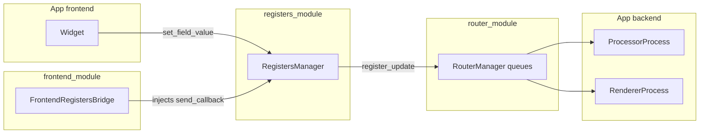
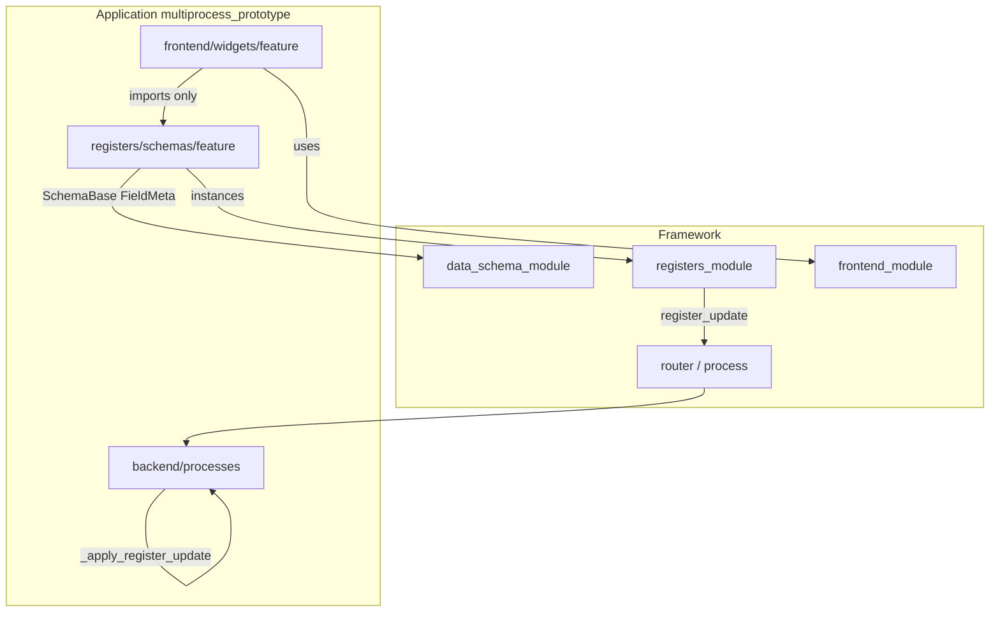
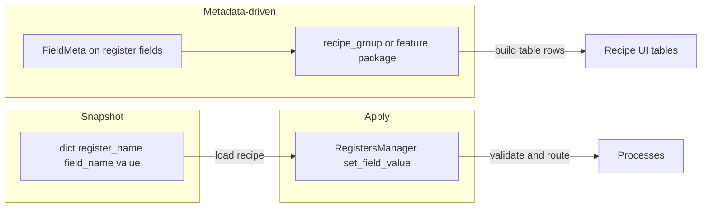

# План: регистры, виджеты, рецепты (обновление)

Документ заменяет/дополняет черновик плана по layout регистров с учётом: **«как лучше»**, **минимума слоёв** и **масштабирования** без дублирования.

**Статус рецептов:** функциональность **не реализуем сейчас**; ниже зафиксирован **задел** (принципы и будущая модель), чтобы позже встроиться без ломки архитектуры.

---

## 1) Решение «как лучше» (зафиксировано)

| Тема | Выбор |
|------|--------|
| Группировка processor + renderer | Подпакет приложения **`registers/schemas/processing_tab/`** с **`__init__.py` как единственной точкой импорта** синхронных схем (`ProcessorRegisters`, `RendererRegisters`, константы маршрутизации). |
| UI-строки (`ProcessingTabUiConfig`) | **Рядом с виджетом** (`frontend/widgets/tabs_setting/processing_tab/schemas.py`). Не участвуют в `register_update` и не должны попадать в снимок рецепта как источник истины значений. |
| Слой `registers` → `frontend` | **Запрет** обратного импорта: `registers` не импортирует `frontend`. |
| Миграция | По желанию: тонкие **compat-реэкспорты** из старых путей на один переходный период. |

---

## 2) Принципы: мало слоёв, гибкость, конструктор

**Один источник истины для настраиваемого значения** — поле класса регистра (`SchemaBase` + `Annotated[..., FieldMeta]`). От него же живут: валидация, маршрут в процесс, будущий снимок рецепта.

**Не плодить параллельные модели** одного и того же параметра (отдельный DTO для рецепта *вместо* регистра — только если это действительно другой контракт; по умолчанию рецепт = **срез состояния регистров**).

**Разделение по смыслу, не по количеству папок:**

| Узел | Ответственность |
|------|-----------------|
| **data_schema_module** (фреймворк) | `SchemaBase`, `FieldMeta`, `FieldRouting`, диспетчеризация метаданных — **без** знания про рецепты и вкладки. |
| **registers_module** (фреймворк) | Экземпляры регистров, `set_field_value`, подписки, отправка `register_update`, сбор `connection_map` из метаданных. |
| **frontend_module** (фреймворк) | Контролы, мост к роутеру, **не** доменные схемы приложения. |
| **registers/schemas/…** (приложение) | Классы регистров и **только** то, что синхронизируется с процессами / участвует в «настройке линии». |
| **frontend/widgets/…** (приложение) | Виджет, **локальные** UI-строки и layout-конфиг, сборка экрана из общих контролов. |
| **Рецепты (отложено)** | Позже: снимки и таблицы поверх тех же регистров и `FieldMeta` (§3.2). Сейчас — дисциплина данных (§3.1). |

**Минимизация дублирования с бэкендом:** имена регистров/полей в виджете и ветках `_apply_register_update` согласовать через **контрактный тест** (рефлексия по схеме ↔ ветки в процессах) и при необходимости маленький модуль констант в `registers/schemas/processing_tab/`.

---

## 3) Задел под рецепты (без кода и UI рецептов сейчас)

### 3.1 Что соблюдать уже в фазах A–B (это и есть «возможность к реализации»)

- **Значения настраиваемых параметров** — только в классах регистров (`SchemaBase`); не заводить параллельный «рецепт-DTO» с теми же полями.
- **`FieldMeta`** заполнять осмысленно (`description`, `min`/`max`, `unit`, `info`, при необходимости `hidden`) — позже по этому же слою можно строить строки таблиц без нового источника подписей.
- **Группировка «по фиче»** через пакет `registers/schemas/<feature>/` — естественная гранулярность для «сортов»/секций без обязательных тегов на каждом поле.
- **Применение снимка** (когда появится) — через существующий **`RegistersManager.set_field_value`** по парам `(register_name, field_name)`; маршрутизация уже есть.

Дополнительные поля в `FieldMeta` (`recipe_group`, `tags`) — **не вводить**, пока не начнёте рецепты; при необходимости добавятся точечно.

### 3.2 Будущая модель (справочно, после отложенной фазы C)

**Снимок рецепта (логическая модель):**

- Набор пар `(register_name, field_name) → value`, сериализуемый в JSON/dict.
- Источник значений при «применить рецепт» — снова **`RegistersManager.set_field_value`** (уже даёт маршрутизацию и валидацию).

**Группы для таблиц / «сорта параметров»:**

- **Вариант A (предпочтительно на старте):** группа = **пакет/фича** (`processing_tab`, `camera`, …) + перечень регистров в этой фиче. Таблица строится обходом полей классов с фильтром `not hidden` и опционально по списку «входит в рецепт».
- **Вариант B (когда понадобится тонкая разбивка):** расширить **`FieldMeta`** опциональным полем вроде `recipe_group: str | None` (или `tags: tuple[str, ...]`). Фреймворк остаётся нейтральным; приложение задаёт теги на полях. Таблицы группируются по тегу без второй модели параметра.

**UI-строки (`ProcessingTabUiConfig`) и рецепты:**

- В снимок **не включать** подписи как данные настройки; при отображении таблицы подпись брать из **`FieldMeta.description`** (и при необходимости i18n). Строки виджета остаются для конкретного экрана, не для доменного экспорта рецепта.

**Где жить коду рецептов (позже):**

- Начать в **`multiprocess_prototype`** (сервис/модуль рядом с `registers/`), опираясь на публичные API `RegistersManager` и метаданные `SchemaBase`.
- Вынос во фреймворк — только если появятся **два независимых приложения** с одинаковой семантикой рецептов; иначе YAGNI.

---

## 4) Диаграммы

### 4.1 Поток изменения параметра (сейчас)

### 4.2 Ответственность: данные vs UI vs транспорт

Ограничение: **`SCH` не импортирует `WID`**.

### 4.3 Рецепты (целевое состояние, **не в работе**)

---

## 5) Скорректированный план внедрения (фазы)

### Фаза A — структура регистров и виджета (**сделано**)

1. Создать `registers/schemas/processing_tab/` (`processor.py`, `renderer.py`, `__init__.py`).
2. Обновить [`factory.py`](../registers/factory.py), [`schemas/__init__.py`](../registers/schemas/__init__.py), импорты в тестах/доках.
3. Перенести `ProcessingTabUiConfig` в `frontend/widgets/tabs_setting/processing_tab/`; обновить `widget.py`, реэкспорты в [`widgets/__init__.py`](../frontend/widgets/__init__.py).
4. Контрактный тест схема ↔ `_apply_register_update`; починить рассинхрон вроде `DrawRegisters` / `settings_tab` при необходимости.
5. `python scripts/validate.py`, pytest; `DECISIONS.md`, `registers/README.md`, `CHECKLIST.md`.

### Фаза B — конвенция под масштаб (параллельно с новыми фичами)

- Для каждой новой области с синхронными параметрами: `registers/schemas/<feature>/` + опционально виджет в `frontend/widgets/<feature>/`.
- Не создавать пустые `*Registers` «на вырост» без полей с `FieldRouting` / `register_dispatch`.

### Фаза C — рецепты (**отложена**)

Не входит в текущий объём. Когда вернётесь к теме:

- Спецификация формата снимка (пары register/field + value + версия/идентификатор набора схем).
- Сервис обхода полей по метаданным; при нехватке группировки — опционально расширить `FieldMeta` (см. §3.2 вариант B).
- UI рецептов: таблицы из `FieldMeta` для колонок; значения — через `set_field_value`.

До старта фазы C достаточно соблюдать §3.1.

---

## 6) Риски и как их прижать

| Риск | Митигация |
|------|-----------|
| Две правды для одного параметра | Одно поле в классе регистра; рецепт только ссылается на него. |
| Запутанные импорты | Один barrel на фичу в `registers/schemas/<feature>/__init__.py`; UI — локально у виджета. |
| Регистры «разъехались» с бэкендом | Контрактный pytest + по возможности константы имён в одном месте. |
| Рецепт тянет UI-строки | В снимке только значения; подписи из `FieldMeta` при отображении. |

---

## 7) Связь с предыдущими оценками

Идея **подпакета `processing_tab`** и **UI у виджета** остаётся. **Рецепты** вынесены в отложенную фазу C; **задел** — §3.1 и дисциплина «одно поле регистра = одна правда», без новых модулей и полей в `FieldMeta` до старта рецептов.
