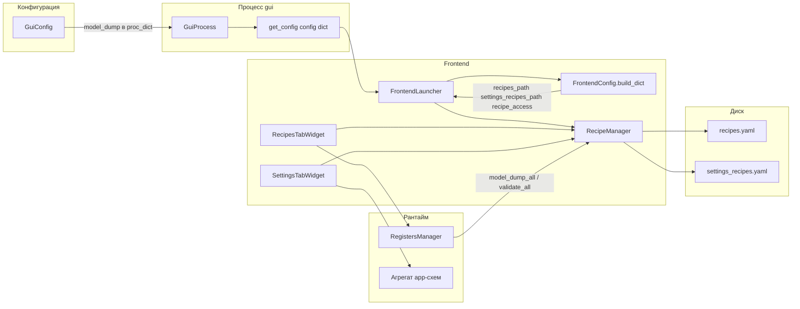

# Система рецептов (multiprocess_prototype)

Документ описывает **текущее** поведение: два независимых вида рецептов, **два YAML-файла** (регистры и app-пресеты), связь с фреймворком и с процессом GUI.  
Архитектурные решения зафиксированы в [DECISIONS.md — ADR-080 … ADR-082](../../multiprocess_framework/DECISIONS.md) (снимки, два вида рецептов, разделение вкладок).

**Вложенные данные (ROI, постобработка, матрёшка):** [DATA_MODEL_NESTED.md](DATA_MODEL_NESTED.md).

**Схемы, регистры, UI и порядок инициализации GUI:** [SCHEMA_REGISTERS_UI_INIT.md](SCHEMA_REGISTERS_UI_INIT.md).

---

## 1. Цель

- **Рецепты параметров (регистры)** — снимки состояния **`RegistersManager`**: алгоритм, камера, обработка и т.д.  
- **Рецепты приложения (UI)** — снимки набора схем **`SchemaBase`** приложения (подписи вкладок, `ProcessingTabUiConfig` и т.д.), **не** хранятся в регистрах процесса. **Конфиг приложения** (`FrontendConfig` и вложенные схемы вкладок) **участвует в UI** напрямую (тексты, раскладка); отличие от регистров — не процессное состояние алгоритма.

Оба варианта используют **слоты** (номера или строки вроде `default_value`), загрузку/сохранение из YAML и таблицы: **регистры** — на вкладке «Рецепты», **app-схемы** — на вкладке «Настройки» (блок пресетов UI).

---

## 2. Поток данных (от конфига до файла)



1. **`GuiConfig`** ([`backend/processes/gui/gui_config.py`](../backend/processes/gui/gui_config.py)) задаёт **`recipes_path`**, опционально **`settings_recipes_path`** (пресеты UI; по умолчанию — `settings_recipes.yaml` в той же папке, что и `recipes_path`), и **`recipe_access`** (словарь для `AccessContext`: `level`, `bypass_readonly`, `show_hidden`).  
2. При **`process(GuiConfig())`** в `proc_dict["config"]` попадает **полный** `model_dump()` конфига, включая эти поля ([`backend/configs/base_config.py`](../backend/configs/base_config.py)).  
3. **`GuiProcess.run()`** создаёт **`FrontendLauncher`** с `app_config = get_config("config")` ([`gui_process.py`](../backend/processes/gui/gui_process.py)).  
4. **`FrontendLauncher.register_windows`** ([`frontend/launcher.py`](../frontend/launcher.py)) создаёт **`RecipeManager`**, при необходимости заполняет слот **`"0"`** (заводской пресет) для регистров и для app-снимка.  
5. **`build_frontend_config(app_cfg)`** ([`frontend/configs/frontend_config.py`](../frontend/configs/frontend_config.py)) мержит в итоговый dict для UI ключи **`recipes_path`**, **`settings_recipes_path`** и **`recipe_access`**.  
6. **`create_tab_widget_factory(FrontendAppContext)`** ([`tab_factory.py`](../frontend/windows/main_window/tab_factory.py)) передаёт из контекста **`recipe_manager`**, **`recipe_access`** (из `ctx.config`) и **`registers_manager`** в **`RecipesTabWidget`** и **`SettingsTabWidget`**.

---

## 3. Файлы YAML

По умолчанию: **`multiprocess_prototype/data/recipes.yaml`** и **`multiprocess_prototype/data/settings_recipes.yaml`** (если пути не заданы в конфиге). **Всегда два файла:** в первом — только снимки регистров; во втором — только **`app_recipes`** и **`current_app_recipe`**. Если файла нет, после первого **`ensure_*`** в лаунчере и **`save()`** создаётся структура с дефолтным слотом **`"0"`**. Старый **объединённый** `recipes.yaml`, где в одном файле были и **`register_recipes`**, и **`app_recipes`**, при следующем **`save()`** разносится на два файла. См. **ADR-098** в [`DECISIONS.md`](../../multiprocess_framework/DECISIONS.md).

**Нумерация слотов:** **`"0"`** — заводской пресет (кнопка «По умолчанию»); **`"1"`**, **`"2"`**, … — сохранённые сорта. Старый ключ слота **`default_value`** в YAML по-прежнему допустим; UI в первую очередь использует **`"0"`**.

**`recipes.yaml`:**

```yaml
version: 1
current_register_recipe: 0
register_recipes:
  "0": { ... }
```

**`settings_recipes.yaml`:**

```yaml
version: 1
current_app_recipe: 0
app_recipes:
  "0":
    RecipesTabConfig: { ... }
    ProcessingTabUiConfig: { ... }
```

**Обратная совместимость:** старые файлы с полями **`current_recipe`** и **`recipes`** при загрузке маппятся в **`current_register_recipe`** и **`register_recipes`**.

Реализация: [`managers/recipe_manager.py`](../managers/recipe_manager.py), хранилища — [`managers/recipe_yaml_stores.py`](../managers/recipe_yaml_stores.py).

---

## 4. Модули прототипа

| Компонент | Роль |
|-----------|------|
| **`RecipeManager`** | Фасад: два YAML (`RegisterRecipesYamlStore` + `AppRecipesYamlStore`), слоты `register_recipes` / `app_recipes`. |
| **`app_recipe_aggregate`** ( [`managers/app_recipe_aggregate.py`](../managers/app_recipe_aggregate.py) ) | Сборка/снимок агрегата `RecipesTabConfig` + `ProcessingTabUiConfig`; ленивые импорты схем, чтобы не тянуть `widgets/__init__` при тестах менеджера. |
| **`AccessContext`** ([`managers/access_context.py`](../managers/access_context.py)) | Уровень доступа и флаги `bypass_readonly` / `show_hidden` для таблиц. |
| **`RegisterRecipePanelWidget`** / **`AppRecipePanelWidget`** (`BaseWidget` + MVP) | Реализация в [`recipes_widget/`](../frontend/widgets/recipes_widget/), [`settings_recipe_widget/`](../frontend/widgets/settings_recipe_widget/); имена **`RegisterRecipePanel`** / **`AppRecipePanel`** — алиасы в [`recipe_slot_table_panel.py`](../frontend/widgets/tabs_setting/recipes_tab/recipe_slot_table_panel.py). |
| **`RecipesTabWidget`** | Только **`RegisterRecipePanel`** (параметры алгоритма); `RecipeManager` + `AccessContext`. |
| **`SettingsTabWidget`** | Слайдеры/чекбоксы по конфигу + **`AppRecipePanel`** (пресеты UI-схем); тот же `RecipeManager` и `recipe_access`, словарь **`recipes_tab`** для подписей и дефолтов агрегата. |
| **`build_recipe_rows`** ( [`recipe_rows.py`](../frontend/widgets/recipes_widget/recipe_rows.py) ) | Строки таблицы регистров из `RegistersManager` + `FieldMeta` / `AccessContext`. |
| **`build_app_recipe_rows`** ( [`app_recipe_rows.py`](../frontend/widgets/settings_recipe_widget/app_recipe_rows.py) ) | Строки таблицы по агрегату `SchemaBase`. |

---

## 5. Фреймворк (Inspector_prototype)

| Модуль | Участие |
|--------|---------|
| **`data_schema_module`** | Схемы регистров и UI (`SchemaBase`, `FieldMeta`, `can_modify`, `readonly`, `hidden`); сериализация [`serialization/io.py`](../../multiprocess_framework/modules/data_schema_module/serialization/io.py) (`registers_to_dict`, `registers_to_yaml`, плоский формат для legacy/экспорта). |
| **`registers_module`** | Контракт **`IRegistersManager`**: `model_dump_all` / `model_validate_all`, `set_field_value`, метаданные полей. |
| **`frontend_module`** | **`IRegistersManagerGui`**, `StructuredTableWidget`, `RegisterBindingContext`, базовые контракты вкладок. |

Граница процессов: **dict** (Dict at Boundary); Pydantic-модели только внутри процесса/модуля.

---

## 6. Доступ к редактированию

- **`FieldMeta`**: `access_level`, `readonly`, `hidden` — см. `FieldMeta.can_modify` в `data_schema_module`.  
- **`recipe_access`** из конфига превращается в **`AccessContext`** и влияет на **`_value_editable`** в строках таблиц и на запись в app-схемы (`update_field` или `model_copy` при `bypass_readonly`).

Пример в `GuiConfig` (через `process(GuiConfig(...))`):

```python
GuiConfig(
    recipes_path=r"C:\path\to\recipes.yaml",
    recipe_access={"level": 99, "bypass_readonly": True, "show_hidden": True},
)
```

---

## 7. Связь с регистрами и алгоритмом

- Смена регистров через **`RegistersManager.set_field_value`** и маршрутизацию **`register_update`** (как в остальном UI).  
- Загрузка слота рецепта регистров вызывает **`model_validate_all`** на мосте к регистрам — те же модели, что в [`registers/schemas/`](../registers/schemas).

Снимки app-рецептов **не** отправляются в worker-процессы автоматически; применение к живым подписям других вкладок при смене слота может расширяться отдельной задачей.

---

## 8. Тесты

- [`tests/test_recipe_manager.py`](../tests/test_recipe_manager.py) — round-trip регистрового снимка.  
- [`tests/test_recipe_manager_unified.py`](../tests/test_recipe_manager_unified.py) — legacy и новый формат YAML.  
- [`tests/test_configs_build.py`](../tests/test_configs_build.py) — `GuiConfig` / `FrontendConfig` и поля рецептов.

---

## 9. См. также

- [README.md](README.md) — индекс документации прототипа.  
- [../registers/README.md](../registers/README.md) — схемы регистров.  
- [DECISIONS.md — ADR-080 … ADR-082](../../multiprocess_framework/DECISIONS.md) — журнал решений.  
- [FRONTEND_MAP.md](FRONTEND_MAP.md) — цепочка лаунчера и фабрики вкладок.
