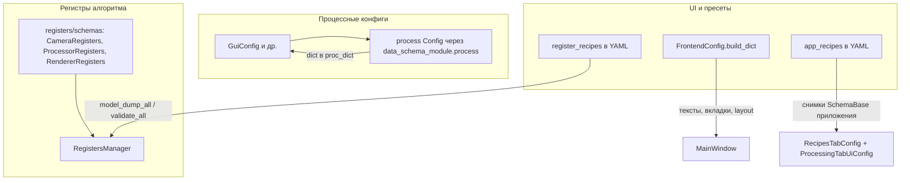
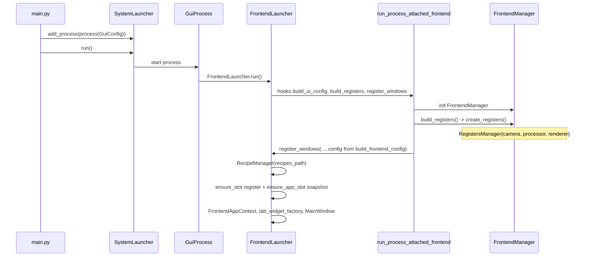
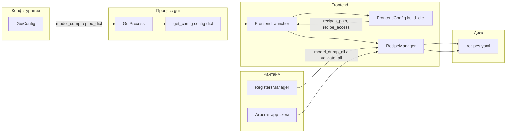

# Схемы, регистры, UI и инициализация

Документ связывает **`data_schema_module`**, пакет **[`registers/`](../registers/)**, конфигурацию UI (**`FrontendConfig`**) и **YAML-рецепты** (`RecipeManager`): что за чем следует при старте GUI и какие данные откуда берутся.

**См. также:** [RECIPES_SYSTEM.md](RECIPES_SYSTEM.md) (два вида рецептов и поток к файлу), [DATA_MODEL_NESTED.md](DATA_MODEL_NESTED.md) (вложенные поля процессора, ROI), [ARCHITECTURE.md](ARCHITECTURE.md). Архитектурные решения: [DECISIONS.md](../../multiprocess_framework/DECISIONS.md) (ADR-080 … ADR-082 — снимки и рецепты).

**Акцент:** ниже подробнее разобраны **обычные регистры** (схемы в `registers/`, слоты `register_recipes`, панель [`recipes_widget`](../frontend/widgets/recipes_widget/)). Конфигурация UI и `app_recipes` описаны для контекста; отдельная доработка **UI-параметров** и `settings_recipe_widget` — на потом.

---

## 1. Три слоя данных

| Слой | Где в коде | Роль |
|------|------------|------|
| **Процессные конфиги** | [`main.py`](../main.py) → `process(GuiConfig(...))` и др.; [`backend/configs/`](../backend/configs/) | Параметры процесса (окно, `recipes_path`, `camera_type` …). Dict at Boundary. |
| **Регистры** | [`registers/factory.py`](../registers/factory.py) `create_registers()` → `RegistersManager` | Живое состояние параметров алгоритма для GUI и маршрутизации `register_update` к worker-процессам. Структура полей — схемы в [`registers/schemas/`](../registers/schemas/). |
| **UI-конфиг** | [`frontend/configs/frontend_config.py`](../frontend/configs/frontend_config.py), вкладки в `frontend/widgets/**/schemas.py` | Раскладка, заголовки, состав вкладок (`TabsConfig`), локальные UI-схемы. Не то же самое, что снимок регистров. |
| **Рецепты** | [`managers/recipe_manager.py`](../managers/recipe_manager.py) | Два независимых контура в одном YAML: **`register_recipes`** (снимки регистров) и **`app_recipes`** (пресеты набора app-схем). |

`SchemaBase` и `FieldMeta` из **`data_schema_module`** используются и для схем регистров, и для UI-схем приложения; **граница ответственности** задаётся пакетом и тем, подключён ли экземпляр к `RegistersManager` или только к виджетам/рецептам app.

### Две панели — две группы рецептов

Принцип один: слот YAML, загрузка/сохранение снимка, таблица полей по метаданным схемы. Отличается **что** за снимок и **какой** ключ в файле.

| Пакет виджета | Управляемая группа | Слоты в YAML | Ключевые методы `RecipeManager` |
|---------------|-------------------|--------------|--------------------------------|
| [`recipes_widget/`](../frontend/widgets/recipes_widget/) | **`RegistersManager`** (все регистры: camera, processor, …) | `register_recipes` | `load_recipe_to_registers`, `save_registers_to_recipe` |
| [`settings_recipe_widget/`](../frontend/widgets/settings_recipe_widget/) | Агрегат **UI-пресетов** (`RecipesTabConfig`, `ProcessingTabUiConfig`, …) | `app_recipes` | `load_app_recipe_snapshot`, `save_app_recipe_snapshot` |

Вкладки подключают панели через `tabs_setting`: **Рецепты** — только register-панель; **Настройки** — app-панель (и прочие контролы). Подробнее см. README в каждом пакете.

---

## 2. Инициализация GUI (последовательность)

Ключевые файлы:

- [`backend/processes/gui/gui_process.py`](../backend/processes/gui/gui_process.py) — `get_config("config")` → `FrontendLauncher(process_ref, app_config)`.
- [`frontend/launcher.py`](../frontend/launcher.py) — `FrontendLaunchHooks`: `build_ui_config` → `build_frontend_config`, `build_registers` → [`create_registers()`](../registers/factory.py), `on_registers_boot` выставляет `camera_type` в регистр `camera`, `register_windows` создаёт `RecipeManager` и контекст вкладок.
- [`frontend_module`](../../multiprocess_framework/modules/frontend_module/) — `run_process_attached_frontend` задаёт канонический порядок: конфиг UI, регистры, boot, окна.

---

## 3. Поток конфига и рецептов (обзор)

Упрощённая схема совпадает по смыслу с разделом «Поток данных» в [RECIPES_SYSTEM.md](RECIPES_SYSTEM.md):

---

## 4. Структура YAML и соответствие схемам

| Ключ в файле | Содержимое | Источник структуры |
|--------------|------------|-------------------|
| `register_recipes` | Снимок `RegistersManager` (`model_dump_all`) | Классы в [`registers/schemas/`](../registers/schemas/) |
| `app_recipes` | `имя_класса_SchemaBase → dict полей` | Агрегат в [`managers/app_recipe_aggregate.py`](../managers/app_recipe_aggregate.py) (сейчас `RecipesTabConfig`, `ProcessingTabUiConfig`) |

Функции **`merge_aggregate_with_defaults`** / **`ensure_app_slot_from_snapshot`** / **`ensure_slot_from_registers`** закрывают сценарий «слота нет или данные неполные — подставить дефолты из схем».

---

## 5. Целевое состояние (vision)

Ниже — сжатая формулировка целевой архитектуры и сопоставление с кодом.

### Идея

- В **`registers/`** задаются схемы регистров: типизация, метаданные полей, связь фронта с бэкендом через `RegistersManager` и `register_update`.
- Менеджер регистров **группирует** именованные схемы; менеджер рецептов хранит **снимки**, согласованные с этими схемами (и отдельно — пресеты UI-схем).
- Приложение **строит таблицы и часть UI** опираясь на метаданные схем; **значения** для слотов рецептов подгружаются из YAML; при отсутствии данных — **дефолты из схем** (уже реализовано для app-агрегата и инициализации слотов регистров).

### Две «базы»: рецепты значений и параметры UI

Задуманное разделение можно описать так:

| Намерение | Содержимое | В прототипе (где лежит) |
|-----------|------------|-------------------------|
| **База рецептов значений** | Параметры алгоритма и оборудования, общие с бэкендом; структура задаётся схемами в **`registers/`** | Слоты **`register_recipes`** в YAML; живое состояние — **`RegistersManager`** |
| **База параметров UI** | Пресеты оформления и настроек экранов, не смешиваемые с регистрами процесса | Слоты **`app_recipes`** (ограниченный агрегат app-схем) **плюс** статический слой **`FrontendConfig` / `GuiConfig`** (вкладки, тексты, размеры окна) |

На диске: один `recipes.yaml` с двумя разделами **или** пара `recipes.yaml` + `settings_recipes.yaml` (тогда `app_recipes` только во втором файле, **ADR-098**). Логически это два контура; слот **`"0"`** — заводской, **`"1"`**… — сорта.

### Состояние «уже есть / частично / вне текущего scope»

| Направление | Статус |
|-------------|--------|
| Схемы регистров как контракт алгоритма + маршрутизация | **Есть** |
| Группировка регистров в `RegistersManager` + снимки в `register_recipes` | **Есть** (не один монолитный класс, а словарь имён → модели) |
| YAML с двумя контурами (`register_recipes` / `app_recipes`) | **Есть** (ADR-080+) |
| Пресеты UI для ограниченного набора `SchemaBase` | **Есть** (`app_recipe_aggregate`) |
| Полный layout и тексты приложения только из YAML рецептов | **Нет** — задаются `FrontendConfig` / `GuiConfig` |
| Автогенерация всего UI только из `FieldMeta` | **Нет** — гибрид: таблицы рецептов из метаданных, layout — код |
| Синхронизация app-рецептов с worker-процессами | **Не реализовано** по умолчанию (см. [RECIPES_SYSTEM.md](RECIPES_SYSTEM.md)) |

### Практические ориентиры

1. Сохранять осознанное разделение **`register_recipes` / `app_recipes`** либо вводить новый версионированный формат с миграцией (для регистров уже есть [`snapshot_migrate.py`](../registers/snapshot_migrate.py)).
2. Расширяя app-агрегат, регистрировать каждую новую схему через `register_schema` и включать её в `app_recipe_aggregate`, иначе слоты и таблицы не увидят данные.
3. Для «UI целиком из схем» потребуется отдельный слой генерации виджетов; текущий код ближе к модели **«схема = данные и строки таблиц, layout = код»**.
4. Пути: **`recipes_path`** и **`settings_recipes_path`** в `GuiConfig` / `FrontendConfig.build_dict`; запись на диск — [`recipe_yaml_stores.py`](../managers/recipe_yaml_stores.py) + [`recipe_manager.py`](../managers/recipe_manager.py).

Оценка направления (субъективно): **8/10** — совпадает с выбранной двухконтурной моделью рецептов; полный балл упирается в явное проектирование границ между регистрами, `FrontendConfig` и `app_recipes`.

---

## 6. Быстрый указатель файлов

| Тема | Файл |
|------|------|
| Фабрика регистров | [`../registers/factory.py`](../registers/factory.py) |
| Панель слотов **регистров** (`register_recipes`) | [`../frontend/widgets/recipes_widget/`](../frontend/widgets/recipes_widget/) |
| Панель слотов **UI-пресетов** (`app_recipes`) | [`../frontend/widgets/settings_recipe_widget/`](../frontend/widgets/settings_recipe_widget/) |
| Корневой UI-конфиг | [`../frontend/configs/frontend_config.py`](../frontend/configs/frontend_config.py) |
| Хуки лаунчера | [`../frontend/launcher.py`](../frontend/launcher.py) |
| Рецепты YAML (фасад) | [`../managers/recipe_manager.py`](../managers/recipe_manager.py) |
| YAML-хранилища (два файла) | [`../managers/recipe_yaml_stores.py`](../managers/recipe_yaml_stores.py) |
| Агрегат app-рецепта | [`../managers/app_recipe_aggregate.py`](../managers/app_recipe_aggregate.py) |
