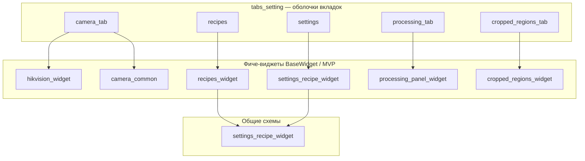
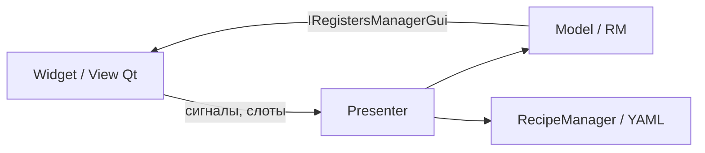

# Виджеты прототипа (frontend)

Именование пакетов согласовано с вкладками **`recipes`** / **`settings`**: оболочки — `tabs_setting/recipes_tab/`, `tabs_setting/recipes_settings_tab/`; фиче-панели — `recipes_widget/` (регистры), `settings_recipe_widget/` (app/UI и **`settings_recipe_widget/schemas.py`**: `RecipesTabConfig`, `default_tab_item`).  
В **`FrontendConfig`** и в дампе конфига ключи секций по-прежнему **`recipes_tab`** и **`settings_tab`** (не переименовывались).

## Карта пакетов

## Таблица: файл / класс / роль

| Пакет | Главный виджет | Ключевые файлы |
|--------|----------------|----------------|
| `tabs_setting/` | `*TabWidget` в каждой подпапке | `tab_item_config`, `tabs_config`, оболочки |
| `camera_common/` | `SimWebcamWidget` | `widget`, `binder`, `fps_section`, `presenter`, `model` |
| `hikvision_widget/` | `HikvisionWidget` | `widget`, `presenter`, `model`, `line_params` |
| `recipes_widget/` | `RegisterRecipePanelWidget` | `panel_widget`, `recipe_rows` |
| `settings_recipe_widget/` | `AppRecipePanelWidget` | `schemas.py` (`RecipesTabConfig`), `panel_widget`, `app_recipe_rows` |
| `processing_panel_widget/` | `ProcessingPanelWidget` | привязка к `PROCESSOR_REGISTER` / `RENDERER_REGISTER` |
| `cropped_regions_widget/` | `CroppedRegionsPanelWidget` | `controls`, `tree_adapter`, `params` → `crop_regions` |

## Соглашения

- Комментарии и docstring в коде виджетов — **английский**; тексты для оператора — из **Pydantic-схем** (`*UiConfig`, `RecipesTabConfig`), не захардкоженные строки в логике.
- Краткие **README** в фиче-пакетах: см. `cropped_regions_widget/README.md`, `recipes_widget/README.md`, и т.д.

## Слои: виджет / Presenter / managers

- **Виджет** — визуал и сигналы; конфиг через `coerce_schema_config` и схемы вкладки.
- **Presenter** (`presenter.py` рядом с фичей) — сценарии без разметки; вызывает мост регистров и [`RecipeManagerProtocol`](../../managers/recipe_manager_protocol.py).
- **[`managers/`](../../managers/README.md)** — домен (YAML, доступ к полям), не оркестрация отдельных кнопок.
- Переиспользуемые чистые хелперы для нескольких панелей — [`../coordinators/README.md`](../coordinators/README.md).

Подробная карта и поток запуска: [`docs/FRONTEND_MAP.md`](../../docs/FRONTEND_MAP.md).

## Документация фреймворка

- **Tab shell vs фиче-виджет:** [frontend_module/widgets/tabs/TAB_STRUCTURE.md](../../../multiprocess_framework/modules/frontend_module/widgets/tabs/TAB_STRUCTURE.md)
- **Шаблоны MVP:** [MVP_TEMPLATE.md](../../../multiprocess_framework/modules/frontend_module/widgets/tabs/MVP_TEMPLATE.md), [base_widget/README.md](../../../multiprocess_framework/modules/frontend_module/widgets/base_widget/README.md)

## Эталонные пакеты

| Пакет | Назначение |
|-------|------------|
| `hikvision_widget/` | Фиче-виджет на `BaseWidget`: model, presenter, `_connect_signals` |
| `camera_common/` | SimWebcam — тот же каркас |
| `tabs_setting/` | `TabItemConfig`, `TabsConfig` и оболочки (`camera_tab/`, `recipes/`, `settings/`, …) |
| `recipes_widget/` | Панель рецепта регистров (слот, дерево полей) — вкладка **recipes** |
| `settings_recipe_widget/` | Панель app-рецепта (`schemas`, дерево UI-схем) — вкладка **settings** |
| `processing_panel_widget/` | Панель обработки (processor/renderer) |
| `cropped_regions_widget/` | Панель ROI / crop_regions |

Оболочки лежат внутри `tabs_setting/` и по возможности встраивают фиче-виджеты `BaseWidget`.

Дополнительно с диаграммами: [`tabs_setting/README.md`](tabs_setting/README.md), [`camera_common/README.md`](camera_common/README.md), [`settings_recipe_widget/README.md`](settings_recipe_widget/README.md).
