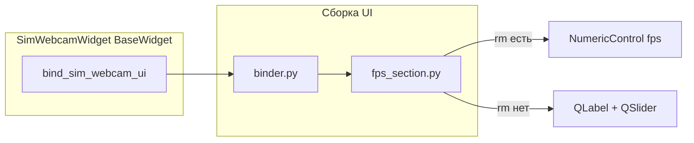
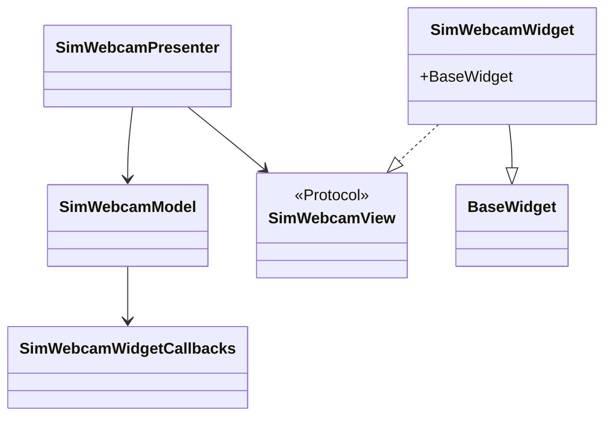

# camera_common — Simulator / Webcam

Общий виджет **`SimWebcamWidget`** для страниц «симулятор» и «веб-камера» на вкладке камеры: Start/Stop и FPS (привязка к регистру или fallback-слайдер).

## Компоненты

## Классы

## Файлы

| Файл | Классы / назначение |
|------|---------------------|
| `widget.py` | `SimWebcamWidget` — страница Start/Stop + FPS |
| `binder.py` | `bind_sim_webcam_ui()` — собирает layout и сигналы |
| `fps_section.py` | `add_fps_section_to_layout`, `FpsFallbackWidgets` |
| `presenter.py` | `SimWebcamPresenter` — `on_fps_changed` |
| `model.py` | `SimWebcamModel` — `camera_type_id`, `rm`, колбэки |
| `view.py` | `SimWebcamView` — `set_fps_label_text` |
| `callbacks.py` | `SimWebcamWidgetCallbacks`, `build_sim_webcam_callbacks` |
| `schemas.py` | `SimWebcamUiConfig` — подписи и диапазон FPS |

## Встраивание

Используется **`tabs_setting.camera_tab.CameraTabWidget`**: два экземпляра с `camera_type_id="simulator"` и `"webcam"`, общий или раздельный `callbacks_map["simulator"]` / `["webcam"]`.
