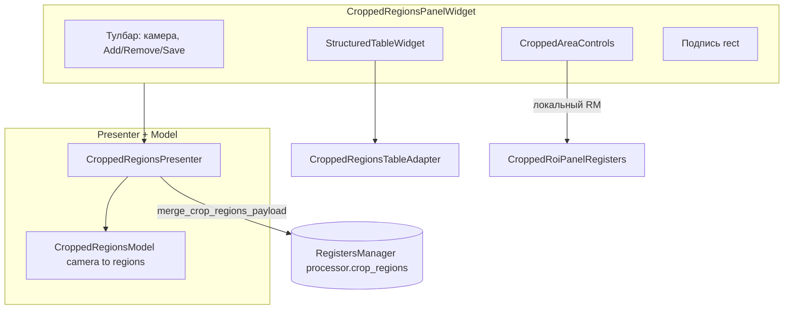
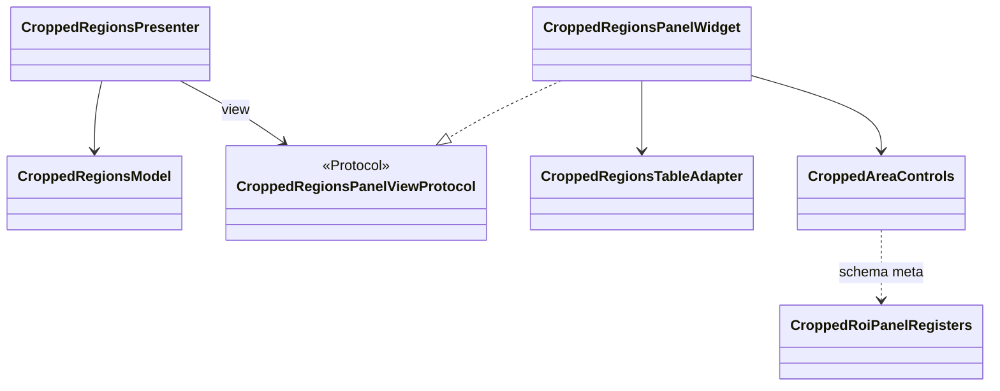

# cropped_regions_widget

Feature widget: ROI per camera (`ComboBox`), `StructuredTableWidget` (read-only), local `CroppedAreaControls` (x, y, width, height), persistence to `ProcessorRegisters.crop_regions` as **nested** `camera → region → [x, y, width, height]` (legacy flat dict is migrated on load).

## Архитектура компонентов

## Классы (связи)

## Files

| Файл | Классы / содержимое |
|------|---------------------|
| `panel_widget.py` | `CroppedRegionsPanelWidget` (`BaseWidget` + MVP) |
| `presenter.py` / `model.py` / `view.py` | сценарии, `regions`, протокол вью |
| `params.py` | `normalize_crop_regions_payload`, `merge_crop_regions_payload`, `regions_to_table_rows`, coords helpers |
| `table_adapter.py` | `CroppedRegionsTableAdapter` — чтение/запись строк |
| `controls.py` | `CroppedAreaControls` — локальный `RegistersManager` + контролы |
| `roi_panel_registers.py` | `CroppedRoiPanelRegisters` — FieldMeta для слайдеров |
| `schemas.py` | `CroppedRegionsTabUiConfig`, `default_tab_item()` |

## Embedding

Used by `tabs_setting.cropped_regions_tab.CroppedRegionsTabWidget`. Optional **`controls_factory`** on `CroppedRegionsPanelWidget` (same kwargs as `CroppedAreaControls`) for tests or alternate control strips.

## Extension

- Add columns: `CroppedRegionsTabUiConfig` + `panel_widget._create_structured_table`
- Backend field: nested dict from `merge_crop_regions_payload` (see ADR-091)
