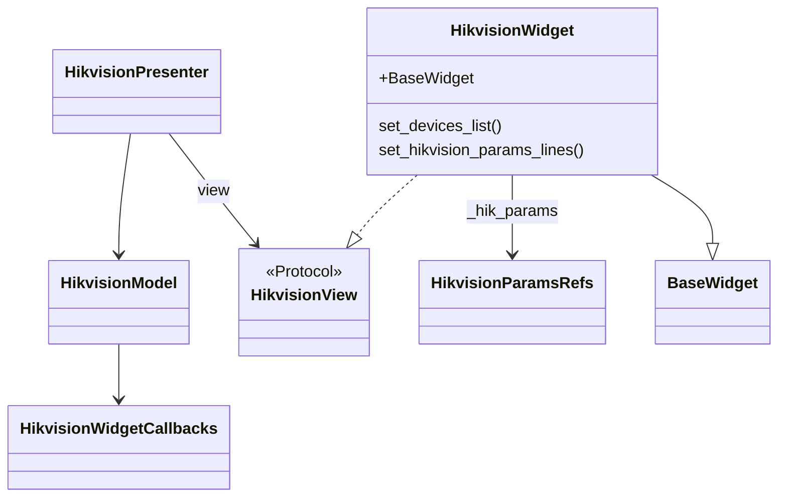
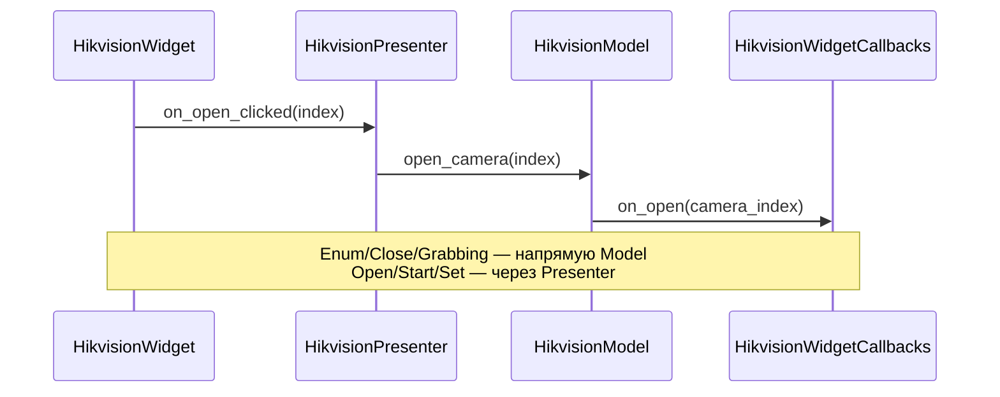

# HikvisionWidget — виджет управления камерой Hikvision

MVP-виджет на базе BaseWidget (frontend_module.components.base_widget): Model + View + Presenter, пассивный View.

## Диаграмма классов



## Поток: клик → колбэк / регистр



## Структура каталога

```
hikvision_widget/
├── __init__.py      # Публичный API
├── widget.py        # HikvisionWidget (View, наследует BaseWidget)
├── presenter.py     # HikvisionPresenter
├── model.py         # HikvisionModel (регистры, колбэки)
├── view.py          # HikvisionView (Protocol)
├── schemas.py       # HikvisionUiConfig (pydantic)
├── callbacks.py     # HikvisionWidgetCallbacks, build_hikvision_callbacks
├── line_params.py   # parse_triple_from_line_edits, apply_params_to_line_edits
└── README.md
```

## Таблица файлов

| Файл | Ответственность |
|------|-----------------|
| `widget.py` | Qt-дерево: устройства, Grabbing, параметры; слоты → Presenter |
| `presenter.py` | Open/Start/Set, `update_camera_devices/parameters` |
| `model.py` | Колбэки команд; чтение/запись `CAMERA_REGISTER`; `get_params_for_set` |
| `view.py` | Protocol методов `set_*` для пассивного View |
| `schemas.py` | Подписи, `HikvisionSpinboxRow`, валидатор длин списков |
| `callbacks.py` | Сборка из `GuiCommandHandler` |
| `line_params.py` | Fallback QLineEdit ↔ тройка fps/exposure/gain |

## Использование

```python
from multiprocess_prototype.frontend.widgets.hikvision_widget import (
    HikvisionWidget,
    HikvisionWidgetCallbacks,
    build_hikvision_callbacks,
)

callbacks = build_hikvision_callbacks(cmd, webcam_enum_max_index=10)
widget = HikvisionWidget(
    registers_manager=rm,
    callbacks=callbacks,
    ui=config_dict_or_HikvisionUiConfig,
    parent=None,
)

# Внешние обновления (от IPC / команд)
widget.update_camera_devices([{"index": 0, "display_name": "Cam 0"}])
widget.update_camera_parameters({"frame_rate": 25.0, "exposure_time": 10000.0, "gain": 0.0})
```

## События (логгер / метрики)

`BaseWidget.signal_bus.event_emitted(str, object)` — подписка без изменения колбэков приложения.  
При необходимости из подкласса вызывайте `emit_widget_event("hikvision.foo", {"key": "value"})`.

## Архитектура

- **Model**: операции с регистром, делегирование команд в колбэки; `get_params_for_set(fallback)` выбирает источник тройки для Set.
- **View**: отображение, пользовательский ввод. Пассивный — Presenter только вызывает `set_*`, не опрашивает View.
- **Presenter**: связывает Model и View. Получает данные от View через слоты (при клике View передаёт индекс/параметры).

## Конфигурация

`HikvisionUiConfig` — pydantic-схема с подписями кнопок, маппингом API ↔ регистр, настройками spinbox.

## Тестирование

Моки: `IRegistersManagerGui`, `HikvisionWidgetCallbacks`. Presenter тестируется с mock View (Protocol).
