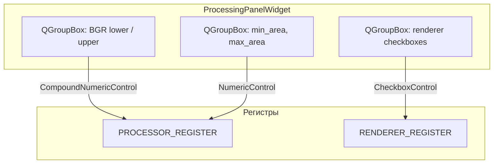
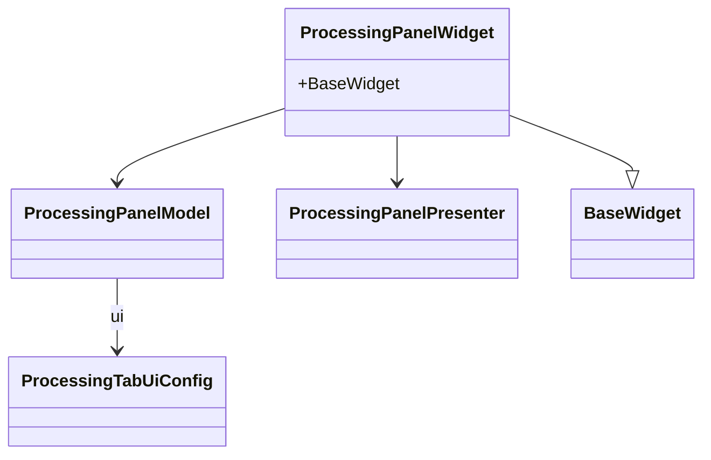

# processing_panel_widget

Feature widget: processor + renderer **register** fields (sliders / checkboxes) bound via `RegistersManager`.

## Устройство UI (блоки)

## Классы

| Файл | Классы / содержимое |
|------|---------------------|
| `panel_widget.py` | `ProcessingPanelWidget` — разметка и `*Control.create` |
| `presenter.py` | `ProcessingPanelPresenter` — заготовка под команды |
| `model.py` | `ProcessingPanelModel` — `registers_manager`, `ui` |
| `schemas.py` | `ProcessingTabUiConfig`, `default_tab_item()` |

## Dependencies

- **`registers.schemas.processing_tab`** — `ProcessorRegisters`, `RendererRegisters`
- Embedded by **`tabs_setting.processing_tab.ProcessingTabWidget`** (thin shell + placeholder when no RM)
