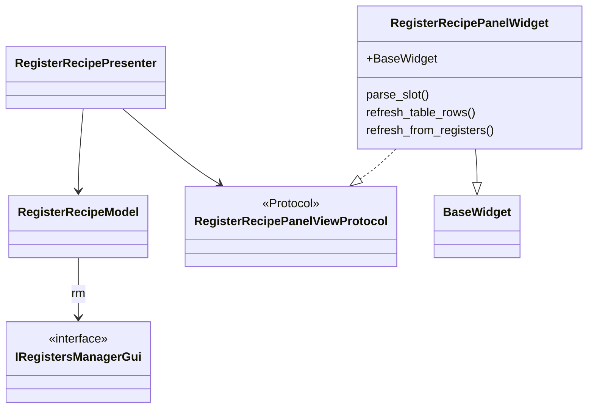
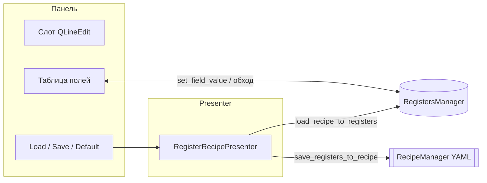

# recipes_widget

Пакет вкладки **recipes** (регистры / алгоритм). **Register recipe** panel: slot index, load/save/default, `StructuredTableWidget` of algorithm fields from `RegistersManager` + `FieldMeta` / `AccessContext`.

## Классы и MVP

## Поток: рецепт регистров

## Files

| Файл | Классы / содержимое |
|------|---------------------|
| `panel_widget.py` | `RegisterRecipePanelWidget` |
| `presenter.py` | `RegisterRecipePresenter` |
| `model.py` | `RegisterRecipeModel` — `rm`, `recipe_manager`, колбэки |
| `view.py` | `RegisterRecipePanelViewProtocol` |
| `recipe_rows.py` | `build_recipe_rows`, `format_value_for_cell`, `coerce_string_to_value` |

## Dependencies

- **`RecipeManagerProtocol`** (`managers/recipe_manager_protocol.py`) for YAML recipe I/O (optional; `None` disables load/save)
- **`RecipesTabConfig`** from `settings_recipe_widget.schemas`

## Embedding

`tabs_setting.recipes_tab.RecipesTabWidget` composes this panel inside a scroll area.

## Роль таблицы vs панели фич

- **Таблица** (`build_recipe_rows` / `StructuredTableWidget`) даёт **единый обзор** всех полей регистров и позволяет править скаляры и (как JSON) вложенные dict — удобно для контроля снимка и экспорта мысленной модели.
- **Основное редактирование** вложенных структур (ROI, постобработка): вкладки **«Регионы обрезки»**, **«Постобработка»** и т.д., которые пишут в регистры через `set_field_value`; после правок — **Load** слота рецепта или **Save** в слот.
- Поток: загрузить рецепт → при необходимости подправить значения в панелях → сохранить слот. См. [docs/DATA_MODEL_NESTED.md](../../../docs/DATA_MODEL_NESTED.md).
