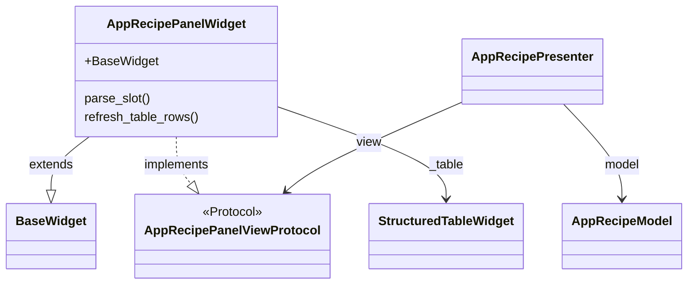
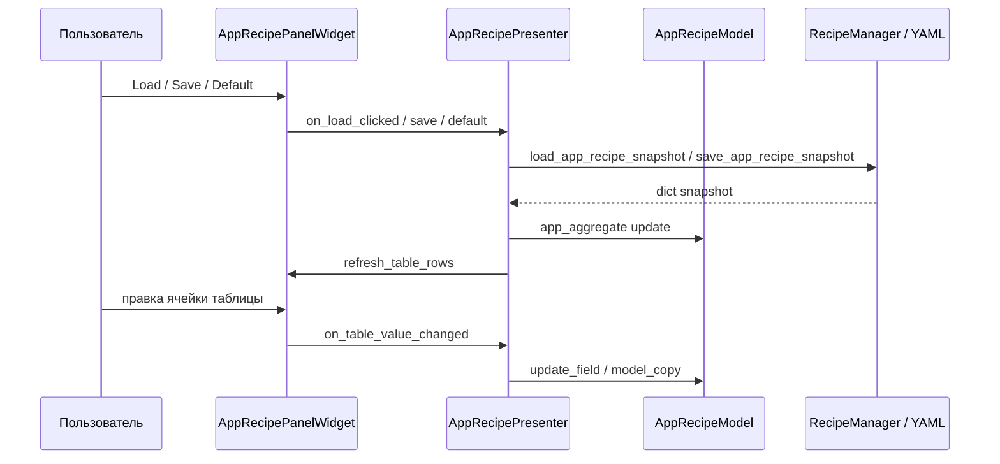

# settings_recipe_widget

Пакет вкладки **settings** (app/UI-рецепт). **App recipe** panel: UI presets (`RecipesTabConfig` + `ProcessingTabUiConfig` aggregate), table of `SchemaBase` fields, load/save per slot via `RecipeManager` app snapshots.

## Классы и MVP

## Поток данных

## Files

| Файл | Классы / содержимое |
|------|---------------------|
| `panel_widget.py` | `AppRecipePanelWidget` — UI: слот, кнопки, `StructuredTableWidget` |
| `presenter.py` | `AppRecipePresenter` — слоты, таблица, агрегат |
| `model.py` | `AppRecipeModel` — `app_aggregate`, `recipe_manager`, `access_ctx` |
| `view.py` | `AppRecipePanelViewProtocol` — контракт для презентера |
| `app_recipe_rows.py` | `build_app_recipe_rows`, `_field_editable` — строки таблицы |

## Dependencies

- **`RecipeManagerProtocol`** — `load_app_recipe_snapshot` / `save_app_recipe_snapshot` / current app slot
- **`app_recipe_aggregate`** for default/merge semantics

## Embedding

`tabs_setting.recipes_settings_tab.SettingsTabWidget` embeds this panel next to draw controls.
