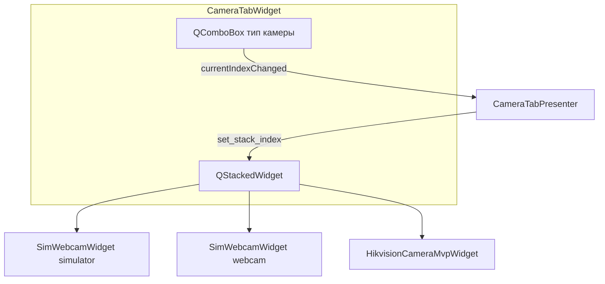
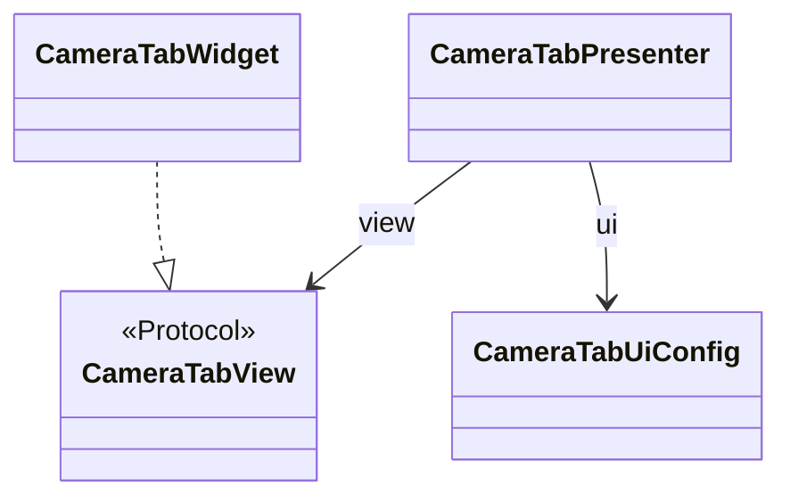

# camera_tab — Вкладка управления камерой

Контейнер с переключателем типа камеры (Simulator / Webcam / Hikvision) и тремя самодостаточными виджетами.

Пакет: `widgets/tabs_setting/camera_tab/` (подключается из `tab_factory` / конфига вкладок).

## Стек UI



## MVP этой вкладки



## Файлы пакета

| Файл | Роль |
|------|------|
| `widget.py` | `CameraTabWidget` — ComboBox + стек из 3 страниц |
| `view.py` | `CameraTabView` — `set_stack_index`, `set_combo_index` |
| `presenter.py` | `CameraTabPresenter` — тип в регистре, диск, IPC, стек |
| `schemas.py` | `CameraTabUiConfig` — id/лейблы типов, вложенный `HikvisionCameraMvpUiConfig` |
| `register_ops.py` | `set_camera_type_field`, `persist_camera_type` |
| `__init__.py` | `build_camera_tab_callbacks(cmd)` → `callbacks_map` |

## Связь с соседними пакетами

```
camera_tab/           — контейнер: ComboBox + QStackedWidget
├── widget.py         — CameraTabWidget (вью: Qt + реализация CameraTabView)
├── view.py           — CameraTabView (Protocol для презентера)
├── presenter.py      — CameraTabPresenter: тип камеры, колбэк, стек
├── schemas.py        — CameraTabUiConfig (список типов)
├── register_ops.py   — set_camera_type_field, persist_camera_type
└── build_camera_tab_callbacks(cmd) → callbacks_map (в __init__.py)

camera_common/        — SimWebcamWidget + FPS + схема (Simulator/Webcam)
hikvision_camera_mvp/ — Hikvision на вкладке (`GuiCommandHandler`); legacy: `hikvision_widget/`
```

## callbacks_map и command_handler

`tab_factory` передаёт во вкладку **`command_handler`** (тот же `GuiCommandHandler`, что и в лаунчере) — им пользуется **`HikvisionCameraMvpWidget`**.

Launcher вызывает `build_camera_tab_callbacks(cmd)` и передаёт в tab_factory:

```python
{
    "simulator": SimWebcamWidgetCallbacks(...),  # тот же объект, что и webcam
    "webcam": ...,
    "on_camera_type_changed": cmd.send_camera_type_changed,
}
```

## MVP (эта вкладка)

- **View** — `view.py` (Protocol), методы реализует `CameraTabWidget`.
- **Presenter** — `presenter.py`, без Qt; колбэки и регистры — здесь.
- Дочерние `camera_common` и `hikvision_camera_mvp` — свои MVP внутри пакетов (legacy `hikvision_widget` без изменений в репозитории).
