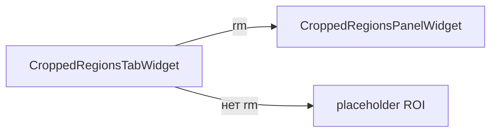

# cropped_regions_tab — вкладка «Регионы обрезки»

Тонкая оболочка: **`CroppedRegionsTabWidget`** встраивает **`CroppedRegionsPanelWidget`** или placeholder.

## Схема

## Файлы

| Файл | Содержимое |
|------|------------|
| `widget.py` | `CroppedRegionsTabWidget` |
| `schemas.py` | реэкспорт `CroppedRegionsTabUiConfig` из `cropped_regions_widget` |

См. [`../../cropped_regions_widget/README.md`](../../cropped_regions_widget/README.md).
