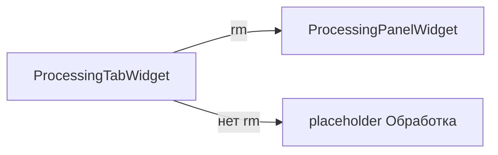

# processing_tab — вкладка «Обработка»

Тонкая оболочка: **`ProcessingTabWidget`** встраивает **`ProcessingPanelWidget`** или placeholder.

## Схема

## Файлы

| Файл | Содержимое |
|------|------------|
| `widget.py` | `ProcessingTabWidget` |
| `schemas.py` | реэкспорт `ProcessingTabUiConfig` из `processing_panel_widget` |

См. [`../../processing_panel_widget/README.md`](../../processing_panel_widget/README.md).
