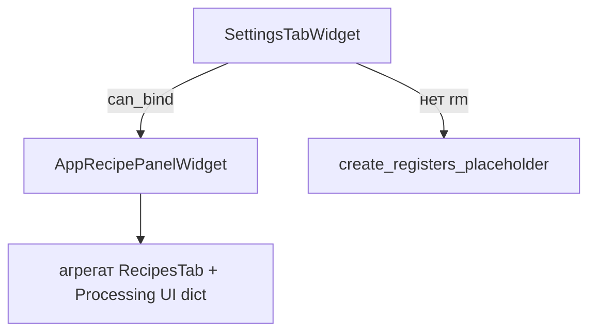

# settings — вкладка «Настройки»

Тонкая оболочка: **`SettingsTabWidget`** встраивает **`AppRecipePanelWidget`** из **`settings_recipe_widget`** (редактирование app-рецепта в таблице) или placeholder.

## Схема

## Файлы

| Файл | Содержимое |
|------|------------|
| `widget.py` | `SettingsTabWidget` |
| `schemas.py` | `SettingsTabConfig`, `ControlBinding` (наследие конфигов; UI панели их не рисует) |

См. [`../../settings_recipe_widget/README.md`](../../settings_recipe_widget/README.md).
