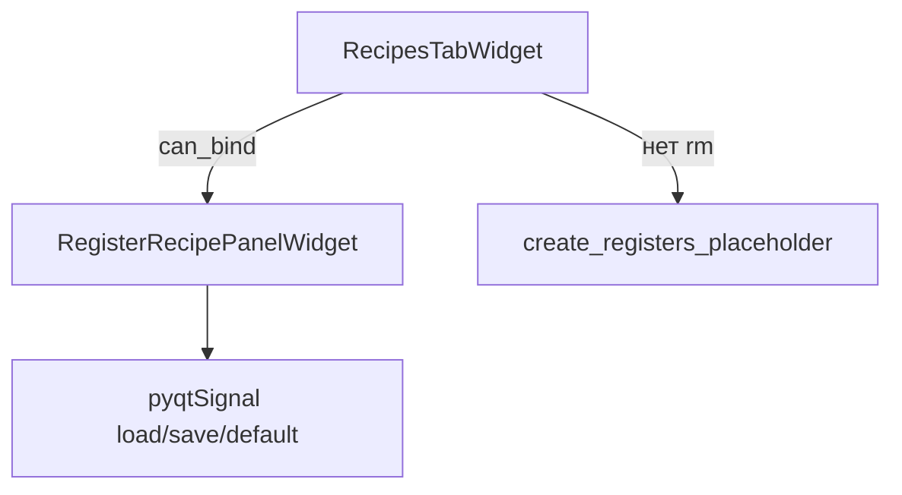

# recipes_tab — вкладка «Рецепты»

Тонкая оболочка: **`RecipesTabWidget`** (`BaseTab`) встраивает **`RegisterRecipePanelWidget`** или показывает placeholder, если нет привязки к регистрам.

## Схема

## Файлы

| Файл | Содержимое |
|------|------------|
| `widget.py` | `RecipesTabWidget` |
| `schemas.py` | реэкспорт `RecipesTabConfig` из `settings_recipe_widget.schemas` |
| `recipe_slot_table_panel.py` | алиасы `AppRecipePanel` / `RegisterRecipePanel` для совместимости |

См. основную документацию: [`../../register_recipe_widget/README.md`](../../register_recipe_widget/README.md).
