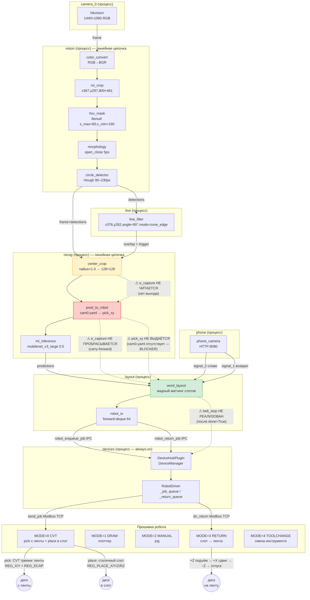
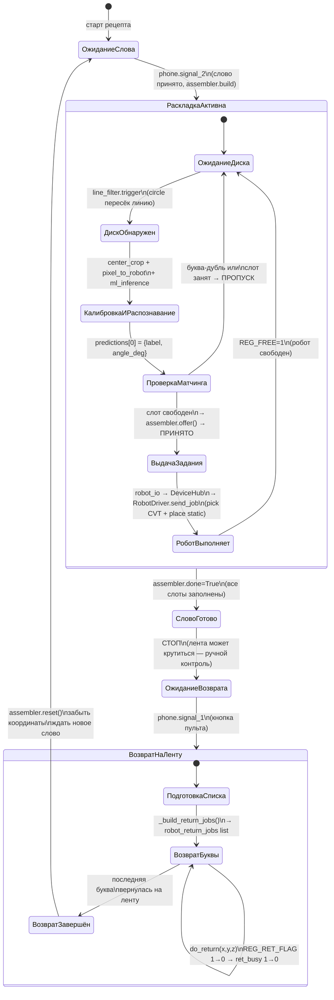

# Аудит тракта укладки слова роботом — 2026-06-16

**Рецепт:** `multiprocess_prototype/recipes/hikvision_letter_robot.yaml`
**Контекст:** выставка, дедлайн ~2 ч от момента написания.

---

## 1. Резюме: что работает, что блокирует

### Работает

| Компонент | Статус |
|-----------|--------|
| Транспорт `send_job` / `do_return` | ✅ 38/38 CVT-регистров сверены |
| Handshake `job_flag` 1→0 (приём прошивкой) | ✅ тесты проходят |
| Угол доворота сквозь тракт (`place_rz_deg` → `REG_PLACE_RZ`) | ✅ geometry.correction_angle → driver |
| Жадный матчинг дублей в `assembler.offer()` | ✅ `test_duplicate_letters` pass |
| Команда RETURN: `do_return` / `_execute_return` / MODE=3 | ✅ sim e2e pass |
| Авто-коннект устройств из рецепта (`desired_connected=True`) | ✅ devices-секция yaml |
| Диспетчеризация `robot_enqueue_job` / `robot_return_job` | ✅ `_OPS` таблица driver |
| `word_layout` читает `e_capture` из item (`encoder_source`) | ✅ код готов, ждёт данных |
| Симулятор TCP (`Services/robot_comm/server/sim_robot.py`) | ✅ слушает 127.0.0.1:5021 |

### Единственные блокеры

| № | Проблема | Где упадёт | Приоритет |
|---|----------|------------|-----------|
| **B-1** | `config/calibration/cam0.yaml` не существует → `pixel_to_robot` не выдаёт `pick_xy` → `word_layout(require_pick=True)` пропускает все диски | `recog.pixel_to_robot.plugin.py:87–102` | **КРИТИЧНО** |
| **B-2** | `e_capture` не попадает в item (`center_crop` не читает энкодер) → `robot_driver` читает энкодер позже (~100 мс) → CVT-трекинг неточен | `pixel_to_robot/plugin.py` (нет выхода `e_capture`) | HIGH (есть fallback) |
| **B-3** | После `assembler.done=True` лента продолжает крутиться (VFD не останавливается автоматически) | `word_layout` не шлёт сигнал `belt_stop` | HIGH |

> **B-1 — единственный жёсткий блокер**: без `pick_xy` раскладка не идёт вовсе.
> **B-2** — есть fallback: `robot_driver.enqueue_job()` читает энкодер сам если `e_capture=None`; CVT работает с погрешностью.
> **B-3** — оператор останавливает ленту вручную; автоостановки нет.

---

## 2. Полный тракт: диаграмма



---

## 3. Машина состояний цикла укладки слова



---

## 4. Таблица wire-соединений тракта

| Источник | Целевой порт | Данные | Существует |
|----------|-------------|--------|-----------|
| `camera_0.hikvision.frame` | `vision.color_convert.frame` | BGR-кадр 1440×1080 | ✅ |
| `vision.circle_detector.frame` | `recog.center_crop.frame` | кадр + detections в item | ✅ |
| `vision.circle_detector.detections` | `line.line_filter.detections` | список кругов {cx,cy,r} | ✅ |
| `vision.circle_detector.frame` | `draw.circle_draw.frame` | для рендера | ✅ |
| `vision.circle_detector.detections` | `draw.circle_draw.detections` | для рендера | ✅ |
| `vision.circle_detector.mask` | `maskview.mask_to_frame.mask` | маска белого | ✅ |
| `line.line_filter.overlay` | `recog.center_crop.trigger_in` | триггер «пересёк линию» | ✅ |
| `line.line_filter.overlay` | `draw.overlay_draw.overlay` | линия на рендере | ✅ |
| `recog.ml_inference.predictions` | `layout.word_layout.predictions` | `[{label, angle_deg, angle_valid, confidence}]` | ✅ |
| `phone.phone_camera.signal_2` | `layout.word_layout.word` | `{word: "СЛОВО"}` | ✅ |
| `phone.phone_camera.signal_1` | `layout.word_layout.return_trigger` | сигнал возврата | ✅ |
| `recog.center_crop.e_capture` | `recog.pixel_to_robot.e_capture` | DW энкодер на момент триггера | ⚠ нет (center_crop не читает энкодер) |
| `recog.pixel_to_robot.pick_xy` | `layout.word_layout.pick_xy` | `{x_mm, y_mm}` | ⚠ нет (cam0.yaml отсутствует — **BLOCKER**) |
| `recog.pixel_to_robot.e_capture` | `layout.word_layout.e_capture` | carry-forward DW энкодера | ⚠ нет (нет источника выше) |

---

## 5. Соответствие Python-слоя регистрам прошивки (5 режимов)

### MODE=0 CVT — pick с ленты + place в слот

| Регистр Lua | Адрес | Python-поле (registers.py) | Источник данных |
|------------|-------|---------------------------|-----------------|
| `REG_FLAG` | `0x1100` | `job_flag` | `client.send_job()` — последним |
| `REG_X` | `0x1101` | `job_x` (×10, signed) | `word_layout.pick_x_mm` → `robot_io` |
| `REG_Y` | `0x1102` | `job_y` (×10, signed) | `word_layout.pick_y_mm` → `robot_io` |
| `REG_Z` | `0x1103` | `job_z` (×10, signed) | глубина захвата (из конфига) |
| `REG_ECAP` | `0x1104` | `job_ecap` (DW, signed) | `word_layout.e_capture` → `robot_io`; fallback: `robot_driver.read_encoder()` |
| `REG_PLACE_X` | `0x1140` | `place_x` (×10, signed) | `assembler.slot.x_mm` |
| `REG_PLACE_Y` | `0x1141` | `place_y` (×10, signed) | `assembler.slot.y_mm` |
| `REG_PLACE_Z` | `0x1142` | `place_z` (×10, signed) | `word_layout.place_z_mm` (регистр) |
| `REG_PLACE_RZ` | `0x1143` | `place_rz` (×10, signed) | `geometry.correction_angle(detected_deg, ...)` |
| `REG_PLACE_FLAG` | `0x1144` | `place_flag` | `1` если место укладки задано |
| `REG_FREE` | `0x1110` | `free` | читается в `robot_driver.is_free()` |
| `REG_ENC` | `0x1112` | `encoder` (DW) | `client.read_encoder()` (Mirror-задача) |
| `REG_TLM_BASE` | `0x1130` (+11) | `telemetry` (RegBlock) | `client.read_telemetry()` |

### MODE=1 DRAW — плоттер

| Регистр Lua | Адрес | Python-поле | Примечание |
|------------|-------|-------------|------------|
| `REG_DRAW_FLAG` | `0x1400` | `draw_flag` | маркер последним |
| `REG_DRAW_TYPE` | `0x1401` | `draw_type` | 0=polyline, 1=circle |
| `REG_DRAW_COUNT` | `0x1402` | `draw_count` | число точек |
| `REG_DRAW_BUSY` | `0x1403` | `draw_busy` | handshake busy 1→0 |
| `REG_DRAW_PROG` | `0x1404` | `draw_prog` | прогресс |
| `REG_DRAW_ABORT` | `0x1405` | `draw_abort` | прерывание |
| `REG_PTS_BASE` | `0x1420` | буфер точек | чанки по 30 рег (10 точек) |

### MODE=2 MANUAL — ручной jog по Modbus

| Регистр Lua | Адрес | Python-поле | Примечание |
|------------|-------|-------------|------------|
| `REG_MAN_FLAG` | `0x1340` | `man_flag` | 1 = команда готова |
| `REG_MAN_DX` | `0x1341` | `man_dx` (×10) | смещение X (или абс.) |
| `REG_MAN_DY` | `0x1342` | `man_dy` (×10) | смещение Y |
| `REG_MAN_SPD` | `0x1343` | `man_spd` | скорость % |
| `REG_MAN_BUSY` | `0x1344` | `man_busy` | handshake |
| `REG_MAN_ABORT` | `0x1345` | `man_abort` | прерывание |
| `REG_MAN_ABS` | `0x1346` | `man_abs` | 1 = абсолютные координаты |

> Симулятор MODE=2 не эмулирует. Для выставочного рецепта не нужен.

### MODE=3 RETURN — возврат буквы на ленту

| Регистр Lua | Адрес | Python-поле | Источник данных |
|------------|-------|-------------|-----------------|
| `REG_RET_FLAG` | `0x1350` | `ret_flag` | `client.do_return()` — последним |
| `REG_RET_X` | `0x1351` | `ret_x` (×10, signed) | `word_layout._build_return_jobs().x_mm` |
| `REG_RET_Y` | `0x1352` | `ret_y` (×10, signed) | `word_layout._build_return_jobs().y_mm` |
| `REG_RET_Z` | `0x1353` | `ret_z` (×10, signed) | `word_layout._build_return_jobs().z_mm` |
| `REG_RET_BUSY` | `0x1354` | `ret_busy` | ждёт 1→0 в `_wait_return_done()` |

Смещения траектории (+Z подъём, +X сдвиг, −Z опускание, отпуск) — **константы Lua** (`RET_LIFT`, `RET_PUSH`), в Python не задаются.

### MODE=4 TOOLCHANGE — смена инструмента

| Регистр Lua | Адрес | Python-поле | Статус |
|------------|-------|-------------|--------|
| `REG_TOOL_FLAG` | `0x1360` | — | ❌ нет в registers.py |
| `REG_TOOL_TARGET` | `0x1361` | — | ❌ нет в registers.py |
| `REG_TOOL_BUSY` | `0x1362` | — | ❌ нет в registers.py |
| `REG_TOOL_CUR` | `0x1363` | — | ❌ нет в registers.py |

> Только `MODE_TOOLCHANGE = 4` константа в `registers.py:28`. Клиентских методов, симуляторного обработчика и `_OPS`-записи нет. Для выставочного рецепта не требуется (рецепт использует только CVT + RETURN).

---

## 6. Путь энкодера: текущее vs. желаемое

```
ЖЕЛАЕМОЕ (точный CVT-трекинг):
  line_filter.trigger
       │
       ▼
  center_crop  ──[e_capture = read_encoder()]──▶  item["e_capture"]
       │                                                 │
       ▼                                                 ▼
  pixel_to_robot  ────────────────────────────▶  item["e_capture"]  (carry-forward)
       │                                                 │
       ▼                                                 ▼
  word_layout  ──reads item[encoder_source="e_capture"]──▶  pose["e_capture"]
       │
       ▼
  robot_io → RobotDriver.send_job(e_capture=...)
  └─ REG_ECAP точно совпадает с моментом пересечения линии

ТЕКУЩЕЕ (fallback):
  word_layout выдаёт pose без e_capture (item.get() → None)
       │
       ▼
  robot_driver.enqueue_job()  →  read_encoder() СЕЙЧАС
  └─ задержка ~100 мс → диск уехал на несколько сантиметров → мисс
```

Исходная точка: `Plugins/processing/word_layout/plugin.py:199–201` — код готов принять `e_capture` из item. Пусто только потому, что `center_crop` не выдаёт этот ключ.

---

*Аудит создан на основе анализа кода ветки `feat/pult-control-panel`, 2026-06-16. Gap-план и задачи на исправление — отдельный документ.*
