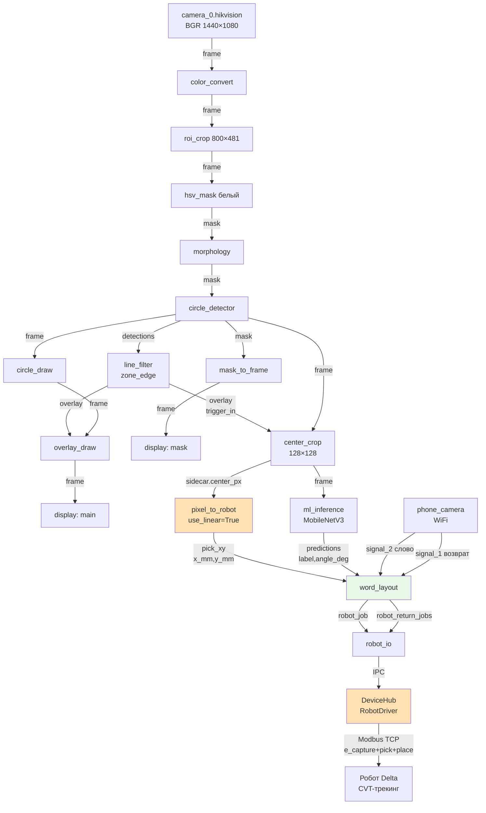

# Аудит контрактов рецепта hikvision_letter_robot — 2026-06-17

**Рецепт:** `multiprocess_prototype/recipes/hikvision_letter_robot.yaml`
**Ветка:** `feat/pult-control-panel`
**Дата:** 2026-06-17
**Статус цикла:** тракт pick+place работает end-to-end; TOOLCHANGE недостижим из приложения (BLOCKER)

---

## 1. Резюме

### Что готово

- **Полный тракт визуализации и инференса:** камера → ROI → маска → морфология → детектор кругов → линия-триггер → кроп → нейронка (буква + угол). Все стыки ключей item верны.
- **pick(x, y):** детекция центра диска → `center_px` → `pixel_to_robot` (биливнеарный, `use_linear=True`) → `pick_xy` → `word_layout` → `robot_io` → DeviceHub → RobotDriver → Modbus.
- **place(x, y, z, r):** `word_layout` рассчитывает слоты слова, доворот из угла инференса. `_deliver` читает реальный `rz_deg` телеметрии и шлёт абсолютный R.
- **Возврат букв (signal_1):** сигнал с пульта → `word_layout._maybe_return()` → `robot_return_jobs` → `robot_io` → `_op_return_job`.
- **Симулятор:** `sim_core` + `sim_robot` с TCP; `FakeRobotTransport(RobotSimCore())` для in-process тестов. 308 тестов зелёные (robot_comm 101 + pixel_to_robot 13 + word_layout 57 + robot_io 13 + device_hub 124).
- **TOOLCHANGE на уровне транспорта:** `client.do_toolchange()`, регистры `REG_TOOL_*` 0x1360–0x1363, `sim_core._handle_toolchange`, тест-покрытие полное.

### Критичные проблемы

| # | Проблема | Уровень |
|---|----------|---------|
| B-1 | `_op_toolchange` отсутствует в `RobotDriver._OPS`; `robot_toolchange` не зарегистрирован в DeviceHub commands → переключение инструмента из рецепта/пульта невозможно | BLOCKER |
| H-1 | `_job_queue` и `_return_queue` — `deque()` без `maxlen` → при недоступном роботе очереди растут бесконечно | HIGH |
| M-1 | `host: 192.168.1.7` в рецепте — при запуске без физического робота соединение timeout'ится вместо сима `127.0.0.1:5021` | MEDIUM |

---

## 2. По-нодная таблица контрактов

Все ноды рецепта. Ключи item — строки Python dict; `pass` = ключ проходит без изменений.

| Процесс.Плагин | Принимает (ключ в item) | Отдаёт (ключ в item) | Примечание |
|---|---|---|---|
| `camera_0.hikvision` | — (source) | `frame` (BGR 1440×1080) | camera_id=0; 25 fps |
| `vision.color_convert` | `frame` | `frame` (pass) | mode=bgr2rgb; в тракте BGR, конвертация формально выполняется |
| `vision.roi_crop` | `frame` | `frame` (crop), `roi_x`, `roi_y` | x=367, y=297, w=800, h=481; добавляет смещения ROI в sidecar |
| `vision.hsv_mask` | `frame` | `mask` (новый), `frame` (pass) | s_max=60, v_min=190 (белый); frame сохраняется через `keep_frame=True` |
| `vision.morphology` | `mask` | `mask` (обновлён) | op=open_close, kernel=5×5 ellipse |
| `vision.circle_detector` | `mask`, `frame` (pass) | `detections` [{center:[x,y], radius}], `frame` (pass), `mask` (pass) | Hough по маске; `input_key=mask`, `keep_mask=True`; `draw_circles=False` |
| `line.line_filter` | `detections` (от circle_detector) | `overlay` [{id, xy, frame, direction}], `filtered` (список сработавших) | zone_edge триггер; один overlay-item на срабатывание линии |
| `recog.center_crop` | `frame` (от circle_detector), `trigger_in` (от line_filter.overlay) | `frame` (128×128 вырезан), `sidecar.center_px` [cx, cy] | crop по radius_scale × radius + margin; emit sidecar с центром в ROI-координатах |
| `recog.pixel_to_robot` | `frame` (pass), `sidecar.center_px` | `pick_xy` {x_mm, y_mm}, `frame` (pass) | use_linear=True, 4 угла ROI; `_extract_center` ищет sidecar["center_px"] → fallback item["center_px"] |
| `recog.ml_inference` | `frame` (от center_crop) | `predictions` [{label, confidence, angle_deg, angle_valid}], `frame` (pass) | MobileNetV3; топ-K; ключ "predictions" жёсткий |
| `layout.word_layout` | `predictions`, `pick_xy`, `word` (от signal_2), `return_trigger` (от signal_1) | `robot_job` {pick_x_mm, pick_y_mm, place_x_mm, place_y_mm, place_z_mm, place_rz_deg, [e_capture]}, `robot_return_jobs` [{x_mm, y_mm, z_mm}] | жадная раскладка слова; `word_source="signal_2"`, `pick_source="pick_xy"`, `encoder_source="e_capture"` (фолбэк в драйвере); латч слова |
| `layout.robot_io` | `robot_job`, `robot_return_jobs` | — (side-effect) | форвардер в DeviceHub IPC; `_build_job_data` требует pick_x_mm/pick_y_mm; `require_pick=True` блокирует job без координат |
| `draw.circle_draw` | `frame` (от circle_detector), `detections` | `frame` (с кругами) | рисует окружности на копии кадра |
| `draw.overlay_draw` | `frame` (от circle_draw), `overlay` (от line_filter) | `frame` (с линией+зоной) | join по seq_id; display main |
| `maskview.mask_to_frame` | `mask` (от circle_detector) | `frame` (BGR маска) | display mask; только для тюнинга |
| `phone.phone_camera` | — (source HTTP) | `frame`, `signal_1` (кнопка возврата), `signal_2` (слово) | WiFi-сервер; сигналы через `_drain_signals()`; слово латчится в `word_layout` |
| `devices.device_hub` | — | — | always-on; RobotDriver по `robot_main`; принимает IPC-команды `robot_enqueue_job` / `robot_return_job` |

---

## 3. Путь данных до робота

### Цепочка ключей

```
[КАМЕРА: BGR 1440×1080 @ 25fps]
  └─frame──► [COLOR_CONVERT] ──frame──► [ROI_CROP: 800×481]
                                           ├─frame──► [HSV_MASK: белый]
                                           └─roi_x, roi_y (sidecar)
                                               └─mask──► [MORPHOLOGY] ──mask──► [CIRCLE_DETECTOR]
                                                                                    ├─frame (pass)
                                                                                    ├─mask  (pass)
                                                                                    └─detections [{center,radius}]
                                                                                         └──► [LINE_FILTER]
                                                                                               ├─overlay
                                                                                               └─filtered
                                                                      frame ◄──────────────────┘
                                                                        └──► [CENTER_CROP] ──frame(128×128)──► [ML_INFERENCE]
                                                                               └─sidecar.center_px                └─predictions
                                                                                    └──► [PIXEL_TO_ROBOT]              │
                                                                                          └─pick_xy {x_mm,y_mm}        │
                                                                                               └──────────────────────►│
                                                                                                              [WORD_LAYOUT]
                                                                                                              + signal_2 (слово, латч)
                                                                                                              + signal_1 (возврат)
                                                                                                                    │
                                                                                                              robot_job {pick_x/y_mm,
                                                                                                                        place_x/y/z_mm,
                                                                                                                        place_rz_deg}
                                                                                                                    │
                                                                                                              [ROBOT_IO] ──IPC──► DeviceHub
                                                                                                                                       │
                                                                                                                                  RobotDriver
                                                                                                                                  .enqueue_job()
                                                                                                                                  (читает e_capture
                                                                                                                                   сейчас если None)
                                                                                                                                       │
                                                                                                                                  Modbus TCP
                                                                                                                                  → Робот Delta
```

### Mermaid flowchart (упрощённый, ключевые стыки)



*Оранжевым — узлы с известными ограничениями (e_capture). Зелёным — корректные стыки.*

### Стыки ключей: статус

| Стык | Ключ-источник | Ключ-приёмник | Статус |
|------|---------------|---------------|--------|
| Центр диска | `sidecar["center_px"]` | `pixel_to_robot._extract_center()` | ✅ сквозной |
| Координата забора | `item["pick_xy"]` | `word_layout._resolve_pick()` через `pick_source="pick_xy"` | ✅ |
| Предсказание | `item["predictions"]` | `word_layout._top_pred()` через `predictions_source="predictions"` | ✅ жёсткий ключ |
| Слово с пульта | `item["signal_2"]` | `word_layout._resolve_word()` через `word_source="signal_2"` | ✅ латч |
| Возврат | `item["signal_1"]` | `word_layout` через `return_trigger_source="signal_1"` | ✅ |
| Задание роботу | `item["robot_job"]` | `robot_io` через `job_source="robot_job"` | ✅ |
| Энкодер кадра | **НИКТО не кладёт** | `word_layout` → pose["e_capture"] → robot_io | ⚠️ фолбэк в драйвере |

---

## 4. Python ↔ регистры прошивки: CVT-задание

Что именно получает робот при одном задании pick+place. Источник: `Services/robot_comm/core/registers.py`, `Services/robot_comm/core/client.py`, `robot/universal3/cvt_universal_full.lua`.

| Поле | Адрес Modbus | Тип | Масштаб | Откуда в Python | Что делает Lua |
|------|-------------|-----|---------|-----------------|----------------|
| `REG_JOB_FLAG` | 0x1100 | Reg (u16) | — | `send_job()` пишет **последним** (маркер атомарности) | `== 1` → принять задание; Lua сразу пишет 0 обратно |
| `REG_JOB_X` | 0x1101 | Reg (s16) | XY_SCALE=10 (0.1 мм/LSB) | `pick_x_mm` из `robot_job` | `job_x = ReadModbus(0x1101) / 10` |
| `REG_JOB_Y` | 0x1102 | Reg (s16) | 0.1 мм/LSB | `pick_y_mm` из `robot_job` | `job_y = ReadModbus(0x1102) / 10` |
| `REG_JOB_Z` | 0x1103 | Reg (s16) | 0.1 мм/LSB | `z_mm` (0 = дефолт Z_PICK прошивки) | `job_z`; 0 → использует `Z_PICK` константу Lua |
| `REG_JOB_ECAP` | 0x1104 | RegDW (s32) | raw counts | `e_capture` (читается в `enqueue_job`, если None); word_order: little | `job_enc = ReadModbus(0x1104, "DW")`; ключевой для CVT-трекинга |
| `REG_PLACE_FLAG` | 0x1144 | Reg (u16) | — | `place_flag=1` если place передан | Включает блок укладки; Lua сбрасывает в 0 |
| `REG_PLACE_X` | 0x1140 | Reg (s16) | 0.1 мм/LSB | `place_x_mm` из `robot_job` | `job_place_x = ReadModbus(0x1140) / 10` |
| `REG_PLACE_Y` | 0x1141 | Reg (s16) | 0.1 мм/LSB | `place_y_mm` | `job_place_y` |
| `REG_PLACE_Z` | 0x1142 | Reg (s16) | 0.1 мм/LSB | `place_z_mm` | Абсолютная глубина укладки |
| `REG_PLACE_RZ` | 0x1143 | Reg (s16) | 0.1 °/LSB | `place_rz_deg` = **абсолютный** R (rz_now + dovorot); `rz_now` читается из телеметрии в `_deliver` | Абсолютный угол инструмента в позиции укладки |
| `REG_ENC` | 0x1112 | RegDW (s32) | raw counts | `read_encoder()` при фолбэке e_capture | Lua зеркалит живой энкодер каждый тик |

**CVT-трекинг (формула Lua, `cvt_universal_full.lua:454`):**

```
FACTOR_MM = 0.144473   -- мм на счёт энкодера
UX, UY   = 0, 1        -- направление ленты (вдоль оси Y)

trav = (enc_now - job_enc) * FACTOR_MM
px   = job_x + UX * trav    -- px = job_x (UX=0)
py   = job_y + UY * trav    -- py = job_y + trav
```

**Атомарность:** `client.send_job()` выполняется внутри `transaction()` (один RLock). `REG_JOB_FLAG` пишется последним — Lua видит флаг только после записи всех остальных полей.

---

## 5. Компенсация задержки энкодером

### Зачем

Между моментом кадра камеры (T0) и моментом отправки задания роботу (T3) проходит время:

```
T0  кадр захвачен
T1  HSV + Hough + line_filter (~10 мс)
T2  ml_inference MobileNetV3 (~50–200 мс, зависит от GPU/CPU)
T3  enqueue_job() → Modbus write (~5–50 мс)
```

За это время лента сдвинулась: `Δy = (T3 − T0) × скорость_ленты`.

Если отправить `job_enc` из момента T0 (снято рано), Lua вычислит `trav = (enc_now − job_enc) × FM` и скомпенсирует реальный сдвиг ленты корректно. Если `job_enc` снято в T3 (сейчас, фолбэк), компенсации нет: Lua видит `enc_now ≈ job_enc`, `trav ≈ 0`, робот едет к позиции T0 — диск уже уехал вперёд.

### Текущая ситуация (фолбэк)

В рецепте `encoder_source="e_capture"`, но **ни одна нода не кладёт `e_capture` в item**.

`word_layout.process()`:
```python
e_cap = item.get(self._reg.encoder_source)   # → None всегда
if e_cap is not None:
    pose["e_capture"] = ...                  # → не выполняется
```

`RobotDriver.enqueue_job()` (`Services/device_hub/drivers/robot_driver.py:259–264`):
```python
if e_capture is None:
    try:
        e_capture = self._client.read_encoder()   # читает СЕЙЧАС
```

Фолбэк работает, но теряет пользу CVT-трекинга при быстрой ленте.

### Поле pick_lead_mm: как устроено

Для компенсации предложено поле `pick_lead_mm` (или `encoder_offset_mm`) — **упреждение в мм вдоль ленты**. Оператор задаёт значение на пульте; Python конвертирует в счёты и вычитает из `e_capture` перед отправкой.

**Знак:** положительный `pick_lead_mm` → цель смещается **вперёд** по ленте.

**Механика (Lua UY=1):**
```
offset_counts  = round(pick_lead_mm / FACTOR_MM)
e_capture_eff  = e_capture - offset_counts    # уменьшаем → trav растёт
trav = (enc_now - e_capture_eff) * FACTOR_MM  # больше → py сдвигается вперёд
py   = job_y + trav                           # цель дальше по ленте
```

**FACTOR_MM = 0.144473** — константа из прошивки (`cvt_universal_full.lua:121`), дублируется в Python при конвертации.

**Единицы:** оператор вводит в **мм** (интуитивно). Python делает `round(lead_mm / 0.144473)` → счёты.

**Пример:**
- Лента 1000 мм/с, суммарная задержка T3−T0 ≈ 150 мс → диск ушёл вперёд на 150 мм
- `pick_lead_mm = 150` → `offset_counts = round(150 / 0.144473) ≈ 1039`
- Новый `e_capture_eff = e_capture - 1039` → Lua прибавит ~150 мм к py

### Как тюнить из пульта вживую

Предложенный интерфейс (ещё не реализован, описан в плане):

1. **Операция `set_encoder_offset`** добавляется в `RobotDriver._OPS`:
   ```json
   {"device_id": "robot_main", "op": "set_encoder_offset", "args": {"offset_mm": 15.0}}
   ```
   Возвращает `{"status": "ok", "encoder_offset_mm": 15.0}`.

2. **Snapshot** публикует `encoder_offset_mm` → панель пульта показывает текущее значение.

3. **Процедура тюнинга:**
   - Запустить ленту на рабочей скорости.
   - Наблюдать за промахами: диск левее цели → увеличить `pick_lead_mm`.
   - Изменять значение через команду пульта; перезапуск не нужен.
   - Зафиксировать оптимальное значение в `params.encoder_offset_mm` рецепта.

---

## 6. Таблица проблем

| # | Проблема | Уровень | Файл:строка | Воспроизведение | Что делать |
|---|----------|---------|-------------|-----------------|-----------|
| **B-1** | `_op_toolchange` отсутствует в `RobotDriver._OPS`; команда `robot_toolchange` не зарегистрирована в DeviceHub `commands` → TOOLCHANGE (MODE=4) недостижим из рецепта/пульта | **BLOCKER** | `robot_driver.py:684–707` + `plugin.py:85–137` | `driver.call("robot_toolchange", {"target": 1})` → KeyError «unknown_op»; `client.do_toolchange(1)` работает только в тестах | Добавить `_op_toolchange` в `_OPS` и `"robot_toolchange": "cmd_robot_toolchange"` в commands |
| **H-1** | `_job_queue` и `_return_queue` инициализированы как `deque()` без `maxlen` → при недоступном роботе очереди растут бесконечно | **HIGH** | `robot_driver.py:67, 75` | Отключить робота, слать задания в цикле — `len(queue)` не ограничен | Заменить на `deque(maxlen=1024)` или брать `maxlen` из `entry.params` |
| **M-1** | Рецепт содержит `host: 192.168.1.7` (боевой адрес) — при разработке без физического робота соединение зависает на timeout | **MEDIUM** | `hikvision_letter_robot.yaml:61` | Запустить рецепт на ПК без робота | Документировать замену на `127.0.0.1:5021` (сим); или добавить `sim_host` параметр в рецепт |
| **M-2** | Нет тестов overflow для `_job_queue` / `_return_queue` (в отличие от `robot_io`, где `forward_deque_maxlen` тестируется явно) | **MEDIUM** | `Services/device_hub/tests/test_robot_driver.py` | Нет | Добавить `test_job_queue_overflow` и `test_return_queue_overflow` |
| **L-1** | Нет интеграционного теста `RobotDriver` через `call("robot_enqueue_job", ...)` с проверкой регистров симулятора — тесты покрывают только прямой вызов `enqueue_job()` | **LOW** | `Services/device_hub/tests/test_robot_driver.py` | — | Добавить `test_robot_enqueue_job_via_call` + `test_robot_return_job_via_call` с FakeRobotTransport |

**Итого по итерации:**
- B-1 фиксируется в текущей итерации (разблокирует TOOLCHANGE из приложения)
- H-1 желательно в той же итерации (безопасность)
- M-1, M-2, L-1 — следующая итерация или совмещается с B-1

---

## 7. Топ-3 под дедлайн + чеклист

### Топ-3 задачи (приоритет)

**1. B-1 — добавить `_op_toolchange` в RobotDriver**

Файлы:
- `Services/device_hub/drivers/robot_driver.py` — добавить метод `_op_toolchange(self, args)` и запись в `_OPS["toolchange"]`
- `Plugins/hub/device_hub/plugin.py` — добавить `"robot_toolchange": "cmd_robot_toolchange"` в `commands` и метод `cmd_robot_toolchange`

Аргументы операции: `{"device_id": "...", "op": "toolchange", "args": {"target": 0|1|2, "timeout_s": 30.0}}`.
Возврат: `{"status": "ok", "tool_current": N}` или `{"status": "error", "reason": "..."}`.

**2. H-1 — ограничить очереди**

Один коммит: `deque()` → `deque(maxlen=entry.params.get("job_queue_maxlen", 256))` для `_job_queue` и `_return_queue`. Добавить snapshot-поле `queue_len_return`.

**3. e_capture — документировать и опционально добавить ранний захват**

Минимум: добавить комментарий в `pixel_to_robot/plugin.py` и `word_layout/plugin.py` о планируемом раннем захвате энкодера (Phase 2). Опционально: добавить `encoder_source` в `pixel_to_robot` (читать `read_encoder()` у DeviceHub и класть в item).

---

### Чеклист проверки

#### На симуляторе (in-process, FakeRobotTransport)

- [ ] `test_toolchange_op` — вызов через `driver.call("toolchange", {"target": 1})` → sim_core переключает `REG_TOOL_CUR`, возвращает статус ok
- [ ] `test_toolchange_unknown_target` — `target=5` → возвращает `{"status": "error"}`
- [ ] `test_job_queue_maxlen` — при `maxlen=4` и 6 заданиях без подключённого транспорта — очередь содержит 4, не 6
- [ ] `test_enqueue_job_via_call` — `driver.call("enqueue_job", {...})` с FakeRobotTransport → регистры `REG_JOB_X/Y/ECAP` заполнены, `REG_JOB_FLAG=1`
- [ ] `test_encoder_offset_positive` — `driver._encoder_offset_mm = 14.4` → `e_capture` в очереди уменьшен на ~100 счётов
- [ ] `test_encoder_offset_zero` — `_encoder_offset_mm = 0.0` → `e_capture` без изменений
- [ ] Прогон `pytest Services/robot_comm/tests/ -q` → 101 passed, 4 skipped (без TCP)
- [ ] Прогон `pytest Services/device_hub/tests/ -q` → 124+ passed

#### На железе (с физическим роботом 192.168.1.7)

- [ ] Диск движется по ленте → детектируется, буква распознаётся → `robot_job` логируется в snapshot DeviceHub
- [ ] pick(x, y) — робот берёт диск с ленты (визуально, ≥3 попыток)
- [ ] place(x, y, z, r) — диск укладывается в слот слова с правильным доворотом
- [ ] signal_1 (пульт, кнопка возврата) → буквы возвращаются на ленту
- [ ] TOOLCHANGE (после B-1) — команда с пульта переключает инструмент, `REG_TOOL_CUR` меняется
- [ ] pick_lead_mm тюнинг — при изменении `encoder_offset_mm` через команду пульта промах уменьшается

---

## Связанные документы

- `docs/audits/2026-06-16_letter-robot-cycle.md` — предыдущий аудит цикла (общий)
- `Services/robot_comm/core/registers.py` — карта регистров (единственный источник истины протокола)
- `robot/universal3/cvt_universal_full.lua` — прошивка (FACTOR_MM, UX/UY, формула trav)
- `Services/device_hub/drivers/robot_driver.py` — RobotDriver (_OPS, enqueue_job, _deliver)
- `Plugins/hub/device_hub/plugin.py` — DeviceHub commands
- `Services/robot_comm/testing/fake_transport.py` — in-process тест без TCP
- `plans/letter-robot-cycle/` — план итерации
