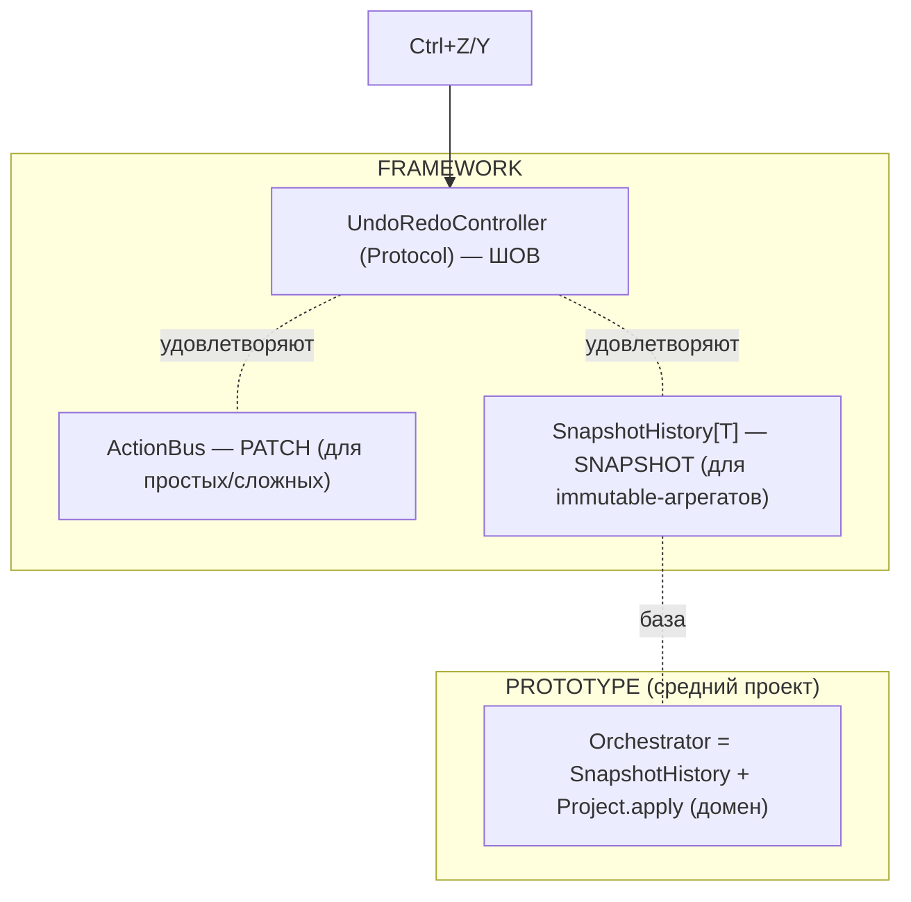
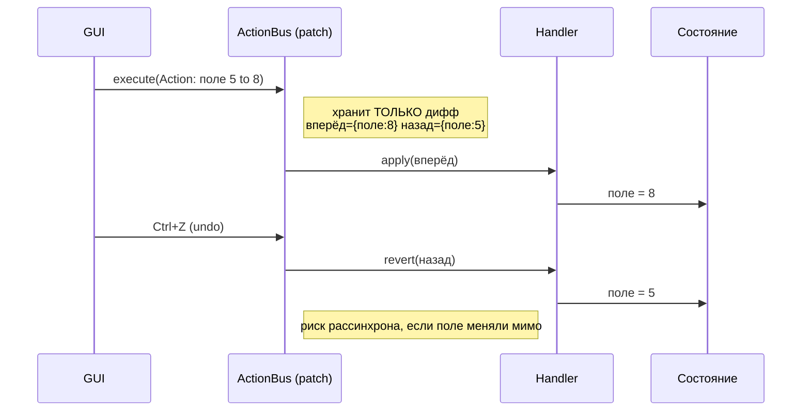
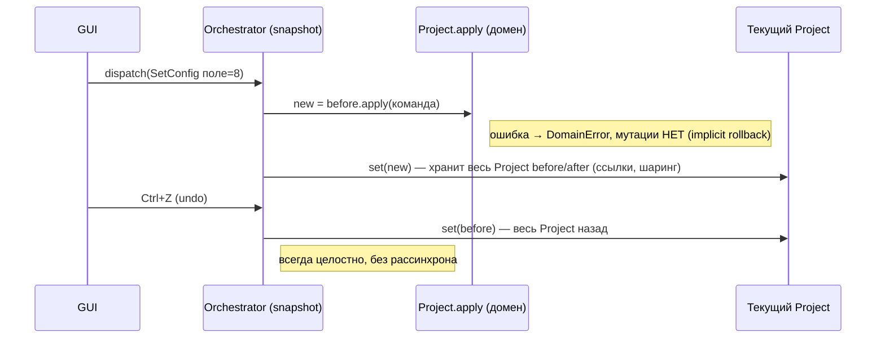
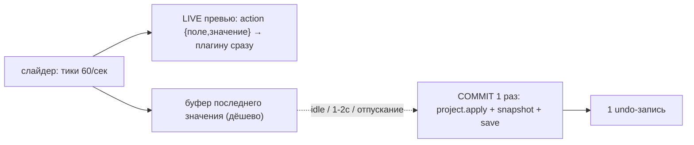

# Command / Undo система: правило, сравнение, решение — 2026-06-18

> **Статус:** РЕШЕНО (правило принято владельцем). Прошло адверсариальное Opus-ревью (APPROVE-WITH-CHANGES, 8 MUST-FIX внесены).
> Связано: [`../../plans/_archive/master-rework-roadmap.md`](../../plans/_archive/master-rework-roadmap.md), memory `feedback_framework_first`, `feedback_constructor_modularity`.
> Заменяет (supersede) ADR-COMM-002 («ActionBus удаляется») — см. §4.

## §1. Правило проекта (как решать каждый раз)

**Северная звезда:** фреймворк делаем мощным и универсальным (по лучшим паттернам, один раз правильно); прототип — расходный (всегда перепишем). **В сомнении: «что сделает ФРЕЙМВОРК универсальнее?», а не «что меньше кода в прототипе».**

1. Механизм для ≥2 проектов → **framework**; app-домен → **prototype**. Сомнение → framework-концерн.
2. Во framework — **контракт, а не «один истинный класс»** (program to interface, несколько реализаций).
3. **Дубль** — только если одна реализация одного контракта одного tier'а без отличий. Разные tier/задачи → НЕ дубль, держим оба, называем границу.
4. «Не используется ≠ не нужно» — про framework-блоки за контрактом; про мёртвую проводку прототипа — наоборот (убираем).
5. Прототип — **тонкий потребитель** контрактов; доменное оставляем тонким слоем.

## §2. Архитектура undo: ОДИН контракт + ДВЕ реализации

Краеугольный факт (verified `multiprocess_framework/.../tabs/tab_layout_protocol.py:29-47`): контракт `UndoRedoController` уже существует, ему по дизайну удовлетворяют **и** `ActionBus`, **и** `CommandDispatcherOrchestrator`.

## §3. ActionBus (patch) vs Orchestrator (snapshot) — принцип

**В одну фразу:** patch хранит **изменение** (дифф), snapshot хранит **всё состояние** (снимок).

| | ActionBus (patch) | Orchestrator (snapshot) |
|---|---|---|
| Хранит | дифф (мелко) | весь Project (ссылки, шаринг) |
| undo | revert патча через handler | swap всего состояния назад |
| Безопасность | ниже (риск рассинхрона) | **выше** (ошибка → нет мутации) |
| Удобство новой команды | handler + ручной revert | команда + ветка apply (type-safe) |
| **Лучше для** | простых (лёгкий старт) и сложных (память) | **средних** с immutable-агрегатом |
| Где живёт | framework | prototype (snapshot-ядро → вынести во framework) |

**Tier-карта:** простой → patch · средний (прототип) → snapshot · сложный → patch. Кто «лучше» зависит от tier'а — поэтому держим обе за контрактом. Для прототипа (средний, immutable `Project`) snapshot объективно лучше.

## §4. Решение

- **Оставить обе реализации за контрактом** (правило §1.2/§1.3). **ActionBus = держать как patch-реализацию фреймворка** (вариант A). Вариант «убрать из фреймворка» **отклонён-с-ценой**: ломает framework `FormContext` (`form_context.py:51,90`), публичный экспорт (`__init__.py:134`), `Services/sql/action_log/*`.
- **Прототип** перестаёт инстанцировать ActionBus (убрать `_legacy_action_bus` `app.py:470` + мёртвую `frontend/actions/`-проводку + `FormContext=None`-путь + dead middleware). `re-scan` «2 живых потребителя» — на деле **0** (оба за no-op-guard).
- **Вынести `ProjectHistory` → `SnapshotHistory[T]`** во framework (generic snapshot-реализация контракта; Orchestrator-домен остаётся в прототипе).
- **Влить в snapshot essentials:** `undo_to(id)`, `record()` (с корректным `before`-снимком до внешней мутации), **RBAC-hook на уровне контракта** (закрывает реальную field-edit дыру; undo/redo гейт не проходят). **Отбросить** persist-log + `ActionLogRecovery` (YAGNI, несовместимо со снапшотами, лезет в приватный `bus._handlers`).

## §5. Capability: transactional / debounced commit (идея владельца 2026-06-18)

**Наблюдение:** undo-история **уже** схлопывает серию тиков слайдера в 1 запись через coalescing (`history.py:73-82`). Но per-tick остаётся реальный churn: на КАЖДЫЙ тик (`pipeline/presenter.py:233-262`) — `project.apply()` + `topology_repo.save()` + **`from_topology_dict(topology.load().to_dict())`** (полный `to_dict` + deepcopy всей топологии, стр. 262).

**Идея:** во время высокочастотной правки (слайдер) — лёгкий **action-буфер** (поле+значение) для live-превью; тяжёлый **snapshot-commit** (apply+save+история) — по простою/отпусканию (раз в 1-2с), а не 60 раз/сек.

**Куда ложится:** это **политика коммита** на контракте `UndoRedoController` (не третий механизм). Здесь patch/action = live-буфер («action для других задач» — ровно эта роль), snapshot = durable-commit. **Framework capability-to-build** (универсально; средний выигрывает мало, **сложный — сильно** → согласуется с tier-логикой). **Строить НЕ сейчас — сначала замерить.**

**Быстрый perf-фикс (волна упрощения, без новой системы):** убрать per-tick `to_dict()+deepcopy` в `presenter.py:262` — синхронизировать view-model из domain **по отпусканию слайдера** (`editingFinished`/idle), а не на каждый тик.

## §6. Реализация (essentials) + проверка

1. Снять мёртвую ActionBus-проводку из прототипа.
2. Вынести `SnapshotHistory[T]` во framework; Orchestrator на неё.
3. RBAC-hook на уровне контракта (закрыть дыру); undo/redo гейт не проходят.
4. `undo_to(id)` + `record()` (корректный `before`).
5. (опц.) audit-callback → sink готовый `AuditWriter`.
6. Новый ADR (supersede ADR-COMM-002); обновить устаревший `actions_module/STATUS.md`.

**Проверка:** pytest (undo_to/record/RBAC-deny, SnapshotHistory generic-контракт); qt-mcp smoke (Ctrl+Z/Y; field-edit под/без прав); sentrux `check_rules` (0 обратных импортов) + `session_end` дельта.

## §7. Открытые пункты для владельца
1. Вынос `SnapshotHistory[T]` во framework сейчас или отложить?
2. audit-callback — сейчас или позже?
3. Этот блок — отдельной задачей или в волнах W4/W8 мастер-роадмапа?
4. Debounced-commit capability — замерить churn на прототипе перед проектированием?
