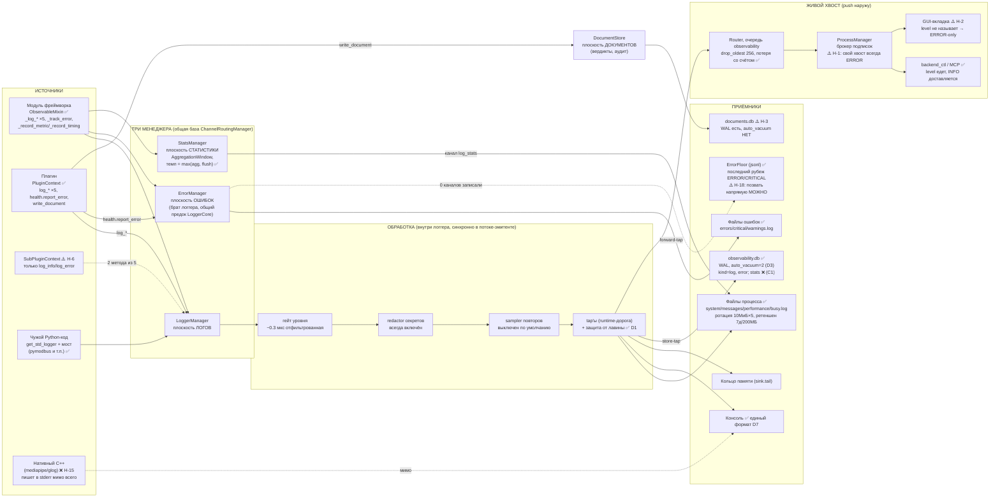
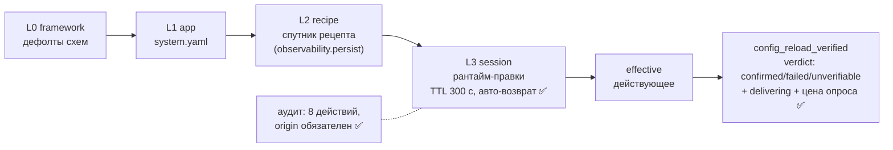
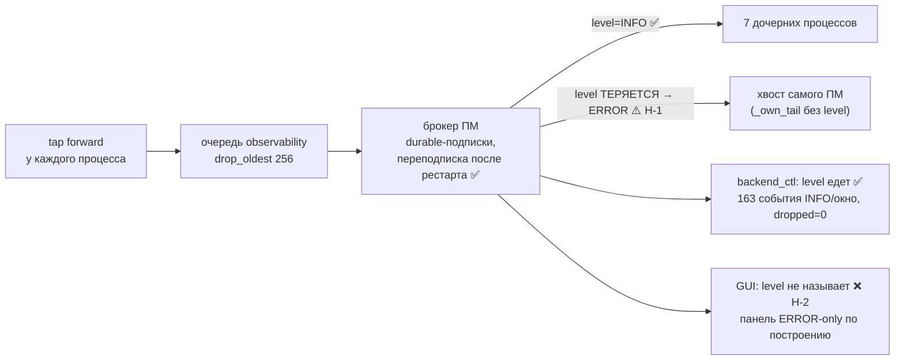

# Карта реального состояния наблюдаемости — 2026-08-10

Снимок «как есть» по итогам приёмки F1 ([отчёт](2026-08-10_observability-acceptance-review.md)): каждый факт здесь проверен live-прогоном или исполнением, включая дефекты.
Механизмы подробно — в канонических справочниках `multiprocess_framework/docs/observability/` (CONNECTORS, NEW_MODULE_RECIPE, CONTROL_PANEL, SINKS_MAP). Эта карта — про **реальность**: что работает, что страдает, каким путём что едет.

Легенда: ✅ работает (доказано) · ⚠️ работает с оговоркой · ❌ не работает / нет · Н-N — номер находки в отчёте приёмки.

---

## 1. Вся система одной схемой

Ключевое, что надо держать в голове:
- **Запись синхронна**: пишет тот поток, который позвал `log_*` (буфер снят в Ф7.4 по замеру). Отфильтрованная запись стоит ~0.3 мкс, полная ~20 мкс.
- **Стор и хвост кормятся tap'ами логгера**, а не отдельным конвейером. Поэтому у стора и у подписчика одна форма записи.
- **Статистика — единственная плоскость без стора и без хвоста** (осознанно отложено в план телеметрии, решение Р-2в). Её выход — снапшоты в `performance.log`.

---

## 2. Три разъёма: какой путь для чего

| Хочу | Зову | Куда попадает | Статус |
|---|---|---|---|
| Диагностическая строка («что происходит») | `ctx.log_info / _log_info` и остальная пятёрка | плоскость логов: файлы + консоль + стор + хвост | ✅ live: запись плагина доехала под его именем |
| **Инцидент** («случилось плохое, посчитай и покажи») | `ctx.health.report_error(exc)` | плоскость ошибок (errors/critical/warnings.log) + дросселированная строка в лог + счётчик health | ✅ live: пара записей в plane=errors. ⚠️ Н-14: инцидентная запись едет с `module="unknown"`, пустой context |
| `ctx.log_error(str)` | это **НЕ** инцидент — просто строка уровня ERROR | плоскость логов (не файлы ошибок!) | ✅ так задумано (ADR-PM-030), но помни разницу |
| Метрика / тайминг | `_record_metric / _record_timing` (только у модулей; у плагинов разъёма **нет**) | AggregationWindow → снапшот раз в темп → `performance.log` | ⚠️ у плагинов ❌ (C1 → план телеметрии); в стор/хвост не едет |
| Документ (вердикт изделия, аудит) | `ctx.write_document(kind, …)` | documents.db, ретеншен по роду | ✅ счётчики `declared/without_sink/dropped` видны; ⚠️ метода нет в протоколе/фейке (Н-9) |
| Чужая Python-библиотека | мост `get_std_logger` / перехват логгера | плоскость логов, единый формат | ✅ pymodbus в формате; ⚠️ страж не видит loguru (Н-10), 2 живых loguru-точки в прототипе |

---

## 3. Пульт: слои конфига и как проверять, что ручка подействовала

| Проверено live | Результат |
|---|---|
| Флип темпа stats 10→30→(5/5) | 9 → 3 → 12 снапшотов за окно, `verdict=confirmed`, readback из **живого окна** ✅ |
| Мусор `log_level=БОЛТОВНЯ`, `aggregation_interval="МУСОР"` | отказ с адресом ключа и списком допустимых, сессия чиста ✅ |
| TTL 300 с | обе сессии откатились сами, session_keys пусты ✅ |
| Невалидный **тип** аргумента команды (`resolve: true`) | ⚠️ Н-5: «Dispatch failed: TypeError» вместо адресного отказа — оракул судит имена ключей, не типы |
| Содержимое `telemetry` в L3 | ❌ Н-4: пятая дверь мимо валидатора — мусор в publish/throttle принимается молча |
| Конфиг stats у самого ПМ | ⚠️ Н-7: ПМ живёт на дефолтах схемы, не на system.yaml (секции managers в его bundle нет) → шумовое предупреждение о поле на каждом boot |

---

## 4. Живой хвост: кто что реально получает

Итог по потребителям: **backend_ctl/MCP — полноценный** (это путь будущей телеметрии); **GUI-вкладка наблюдаемости фактически пуста на здоровом стенде** — тот самый симптом Б-1, оставшийся у главного человеческого потребителя; **записи самого оркестратора** ниже ERROR не увидит никто из подписчиков (в стор при этом попадают ✅).

---

## 5. Останов: порядок и что доезжает

Проверено live на 8/8 процессов: `command → router → error → stats → итоговая INFO → логгер последним`; в файле каждой смерти есть «shut down successfully» и «observability planes stopped: error, stats» ✅.

Оговорки: 5-секундный terminate супервизора жив (известный долг, QUEUE.md L-2); у ПМ после гашения логгера 2 записи ушли в голос «канал не резолвится» — потеря со счётом (Н-12); смена уровня через reload теряет ~1 запись в окно пересборки каналов, тоже со счётом (Н-11).

---

## 6. Потери: пять классов, все со счётчиками и голосом ✅

`unresolved_channel_records · channel_write_errors · channel_refused_records · records_without_channels · tap_reentrant_suppressed` — публикуются в `introspect.observability → counters`, первый отказ каждого класса даёт WARNING с адресом, дальше «считаем молча» со счётом. Плюс `channel_written_records` (доставка) и `observed_at` (свежесть снимка). Проверено: потеря на reload и на teardown была видна и голосом, и счётчиком.

---

## 7. Что страдает — сводка (приоритет сверху вниз)

| # | Дефект | Эффект | Правка |
|---|---|---|---|
| Н-1 | `_own_tail` брокера не передаёт level | записи ПМ ниже ERROR не видит ни один подписчик | одна строка |
| Н-2 | GUI не называет level при подписке | панель наблюдаемости пуста на здоровом стенде | ручка у `tail_activator` |
| Н-4 | telemetry-содержимое L3 без валидации значений | мусор принимается молча — класс Б-8 на соседней плоскости | та же воронка, что B2 |
| Н-3 | documents.db без auto_vacuum | «ретеншен режет строки, не байты» (41 МБ после чистки) | копия миграции D3 |
| Н-8 | полный `backend_ctl/tests` красный 11/633 ×2 (соло — зелёные) | ночной график будет ложно-красным | локализовать флейк |
| Н-5 | контракт судит имена, не типы | TypeError в диспатче вместо отказа | ось типов в оракул |
| Н-6 | SubPluginContext: 2 метода из 5 | латентный AttributeError — точная копия Б-2 | достампить пятёрку |
| Н-7 | stats-конфиг ПМ из дефолтов схемы | шум на boot; расхождение прячется совпадением max() | доставить секцию managers ПМ |
| Н-20 | пустые снапшоты count=0 каждые 10 с ×8 процессов | главный источник фонового объёма (~2.75 МиБ/ч) | не эмитить пустые |
| Н-16 | `INSPECTOR_*` env в Services/auth, Services/sql | бренд в переиспользуемом слое; INSPECTOR_LOG_DIR глобален по машине | канонич. пары |
| Н-22 | корневой `logs/` репо: 438 МБ, растёт от тестовых прогонов | никто не метёт и не называет | env у тестов + чистка владельцем |

Документация: опорная (123/129 утверждений совпали с кодом), опасны точечно — «ErrorFloor позвать нельзя» (можно), «запасной всегда вверх» (CRITICAL идёт вниз), `COMMUNICATION_MAP_raw.json` (описывает снесённый BatchBuffer живым), шов `source_name` в NEW_MODULE_RECIPE (записи поедут под именем менеджера, а не объявленным).

---

## 8. Куда смотреть, когда…

| Симптом | Первый шаг |
|---|---|
| «мой модуль не пишет» | `introspect.observability → counters` своего процесса: `manager_call_failures`, `unresolved_channel_records`, `records_without_channels`; затем `effective.logger.sources` — под каким именем реально едут записи (шов `source_name`!) |
| «хвост пуст» | проверь **level подписки** (дефолт ERROR!) — Н-1/Н-2; `events_page(plane=logs)` + `dropped` |
| «ручка не действует» | только `config_reload_verified` — `verdict` + `delivering`; голый `success` значит меньше |
| «темп статистики не тот» | пол: действует `max(aggregation_interval, flush_interval)`; ниже пола — только опуская `flush_interval` |
| «куда делись ошибки плагина» | `log_error` — это лог; в errors.log ведёт только `health.report_error` |
| «диск пухнет» | стор и файлы стенда под ретеншеном ✅; смотреть documents.db (Н-3), корневой `logs/` (Н-22), performance.log (снапшоты — главный источник) |
